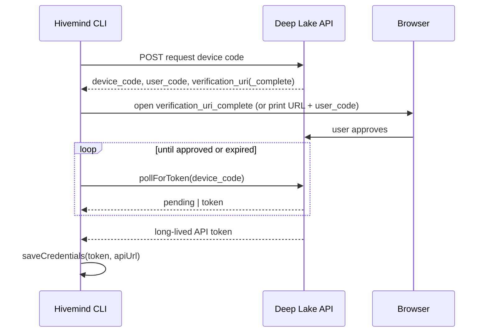

# Example: Auth Architecture Doc (Abbreviated)

This shows how to write an auth architecture doc - the most common domain-level doc pattern. Source: `library/knowledge/private/auth/device-flow-architecture.md`.

Key patterns demonstrated:
- Sequence diagram as a first-class section
- The polling-key design explained on its own
- Specific claims cited (the install-id-derived poll key, the default apiUrl)
- ADR cross-referenced to explain WHY

---

```markdown
# Device Flow Architecture

> Category: Auth | Version: 1.0 | Date: June 2026 | Status: Active

How the Hivemind CLI authenticates against the Deep Lake API using the browser device flow, and how the resulting token persists.

**Related:**
- [`credential-lifecycle.md`](credential-lifecycle.md)
- [`org-workspace-binding.md`](org-workspace-binding.md)
- [`../architecture/ADR-00N-device-flow.md`](../architecture/ADR-00N-device-flow.md)

---

## Why the device flow

The CLI runs on a developer machine with no embedded secret, so it cannot do a confidential OAuth exchange. The device flow lets the user approve in a browser while the CLI polls for the token. There is no email/password path - approval always happens against the Deep Lake API in the browser.

---

## Login flow



---

## Polling key

The poll is keyed on a machine-stable install ID (`src/commands/install-id.ts`), not the per-attempt `device_code`. A retried or re-opened login therefore never breaks the in-flight flow - the key is stable across attempts on the same machine.

---

## Credential persistence

`saveCredentials` writes the token plus the `apiUrl` (default `https://api.deeplake.ai`). Every later command reads it through `loadCredentials`; org and workspace selection are bound into the same credentials and persist until the user switches. `deleteCredentials` (via `hivemind logout`) clears it.
```

---

## What makes this a good auth doc

1. **Opens with the provider/flow choice** - specifically why the device flow, not how auth works in general
2. **"Why the device flow" block** - explains the decision in plain English without requiring the reader to open the ADR
3. **Sequence diagram** covers the full flow from CLI invocation to saved token - not just the handshake
4. **Polling key** is called out separately because it is the non-obvious detail that prevents a class of bugs
5. **Specific defaults cited** - the `https://api.deeplake.ai` apiUrl and the install-id-derived key, not vague "it authenticates"
6. **Credential persistence** explained so the reader knows where the token lives and how to clear it
