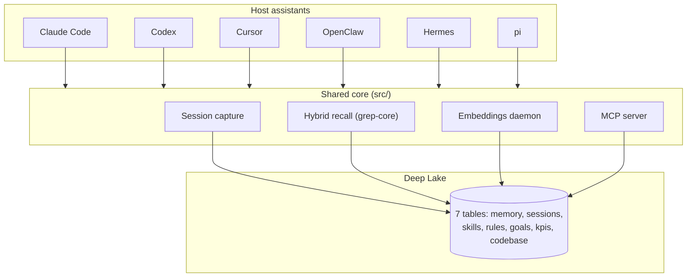

# Example: System Overview (Abbreviated)

This is an abbreviated example of a `library/knowledge/private/architecture/system-overview.md`. It shows the exact format, section structure, and Mermaid diagram style. The full version lives at `library/knowledge/private/architecture/system-overview.md`.

---

```markdown
# System Overview

> Category: Architecture | Version: 1.0 | Date: June 2026 | Status: Active

How Hivemind is laid out as a monorepo, the major subsystems, and how a shared core fans out into six per-agent integrations backed by a single Deep Lake substrate.

**Related:**
- [`session-lifecycle.md`](session-lifecycle.md)
- [`desktop-harness-overview.md`](desktop-harness-overview.md)
- [`../ai/hybrid-recall-pipeline.md`](../ai/hybrid-recall-pipeline.md)
- [`../data/deeplake-tables-schema.md`](../data/deeplake-tables-schema.md)

---

## Architecture diagram



---

## Component summary

### Host assistants

Six coding assistants (Claude Code, Codex, Cursor, OpenClaw, Hermes, pi), each with its own distribution model and native lifecycle events. Each gets a thin shim under `src/hooks/` that maps its events onto the shared capture and recall calls. [...]

### Shared core (`src/`)

Everything durable and agent-agnostic: the Deep Lake API client, auth, config, SQL utils, the embeddings daemon, and the MCP server. The Claude Code hooks are the reference implementation; the other harnesses re-express the same handlers. [...]

### Deep Lake substrate

A single Deep Lake dataset holding all seven tables, defined once in `src/deeplake-schema.ts`. Both `CREATE TABLE` and lazy schema healing iterate the same column lists. [...]

---

## Key design decisions

| Decision | Choice | ADR |
|---|---|---|
| Integration model | Write memory logic once, wrap per agent | [system-overview](system-overview.md) |
| Storage substrate | Single Deep Lake dataset, 7 tables | [data/deeplake-tables-schema](../data/deeplake-tables-schema.md) |
| Recall | Hybrid lexical + semantic UNION ALL | [ai/hybrid-recall-pipeline](../ai/hybrid-recall-pipeline.md) |
```

---

## What makes this a good system overview

1. **Architecture diagram is the first thing** - not buried below prose
2. **Diagram uses subgraphs** to show logical groupings (Host assistants, Shared core, Deep Lake)
3. **No explicit colors** in the Mermaid diagram (breaks dark mode)
4. **Component summary table** cross-references each component to its detailed doc
5. **Key design decisions table** links every major choice to its ADR
6. **Related section** links to the companion docs readers typically need next
7. **Concise prose** - the component summaries are 1-3 sentences each, not paragraphs
