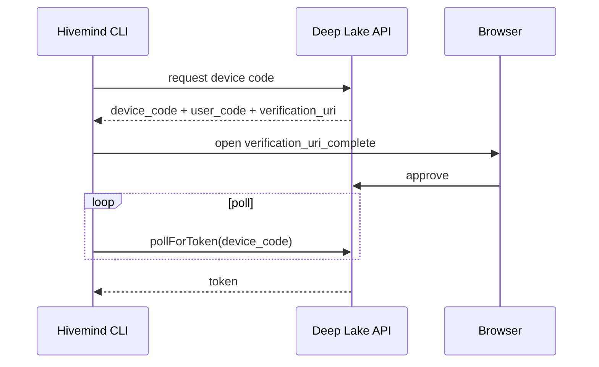

# Document Format Specification

Every knowledge doc must follow this exact format. Consistency across all docs makes the knowledge base feel like a single authored artifact, not a pile of individually-styled pages.

---

## Annotated Template

```markdown
# Device Flow Architecture                                 <- Title Case, no "doc" or "overview" suffix

> Category: Auth | Version: 1.0 | Date: June 2026 | Status: Active

                                                           <- One sentence only. Who reads this + what it covers.
How the Hivemind CLI authenticates against the Deep Lake API using the browser device flow, and how credentials persist.

**Related:**                                               <- 3-8 links. Sibling docs first, then ADRs.
- [`credential-lifecycle.md`](credential-lifecycle.md)
- [`org-workspace-binding.md`](org-workspace-binding.md)
- [`../architecture/ADR-00N-device-flow.md`](../architecture/ADR-00N-device-flow.md)

---

## Why the device flow                                     <- H2 for major sections, H3 for subsections

[Narrative prose. Open with WHY, then WHAT, then HOW.]
[First paragraph: the most important thing to know.]
[No passive voice. No "it should be noted that".]

---

## Login flow (CLI -> browser -> Deep Lake API)            <- Sequence diagrams get their own section



---

## Polling key                                             <- Use H2 for each major concept

```
Poll key is derived from a machine-stable install ID
(see src/commands/install-id.ts), not the per-attempt
device_code, so a retry never breaks the flow.
```

---

## Credential persistence

**On success:**
- Exchange the device grant for a long-lived API token
- saveCredentials writes the token and the apiUrl (default https://api.deeplake.ai)

**On every later command:**
- loadCredentials reads the token; org/workspace binding persists with it

[End with a summary statement linking to peer docs.]
```

---

## Header Rules

| Field | Value |
|---|---|
| `Category` | Domain folder name, Title Case (e.g., `Auth`, `AI`, `Data`, `Security`) |
| `Version` | Start at `1.0`; bump patch for additions (`1.1`), minor for restructures (`2.0`) |
| `Date` | Month + year of last meaningful edit (`May 2026`) |
| `Status` | `Active` for live docs; `Draft` for in-progress; `Archived` for superseded |

---

## Related Section Rules

- Link to 3-8 items
- **Order:** sibling docs in the same domain first, then cross-domain docs, then ADRs last
- Use relative paths: `[title](relative-path.md)`
- ADR links: `[ADR-NNN title](../architecture/ADR-NNN-slug.md)`
- PRD links: `[prd-NNN](../../../requirements/backlog/prd-NNN-slug/prd-NNN-slug-index.md)` (use sparingly - knowledge docs reference ADRs, not PRDs)

---

## Section Structure

### H2 for major concepts
One H2 per major concept or component. Each H2 should be independently readable.

### H3 for subsections within a concept
Use H3 when an H2 section has multiple distinct sub-topics. Avoid H4+ - if you need H4, split into a separate doc.

### Progressive disclosure
- H2 section 1: "Why this exists" - the motivation
- H2 sections 2-N: technical details, schemas, flows, code samples
- Last section (optional): "Alternatives considered" or "Known limitations"

---

## Code Block Standards

**SQL DDL:** Include all columns with types, constraints, and indexes. No `...` truncation - this is the canonical reference. For Deep Lake tables, mirror the `{ name, sql }` column lists from `src/deeplake-schema.ts`.

```sql
CREATE TABLE memory (
  id                TEXT NOT NULL DEFAULT '',
  path              TEXT NOT NULL DEFAULT '',
  filename          TEXT NOT NULL DEFAULT '',
  summary           TEXT NOT NULL DEFAULT '',
  summary_embedding FLOAT4[],
  author            TEXT NOT NULL DEFAULT '',
  creation_date     TEXT NOT NULL DEFAULT '',
  last_update_date  TEXT NOT NULL DEFAULT ''
);
```

**TypeScript:** Real code with types. Show actual function signatures, not pseudocode.

```typescript
export interface ColumnDef {
  /** Bare column identifier, e.g. `contributors`. */
  name: string;
  /** Column SQL minus the name, e.g. `TEXT NOT NULL DEFAULT '[]'`. */
  sql: string;
}
```

**Mermaid diagrams:**
- `flowchart TD` for process flows
- `sequenceDiagram` for temporal flows (request/response)
- `stateDiagram-v2` for state machines
- NO explicit colors (breaks dark mode)
- NO `click` events (disabled for security)
- Node IDs: `camelCase` only (no spaces)
- Quote labels with special chars: `A["Process (main)"]`

**Shell commands:** Show actual commands users would run.

```bash
npm run build          # tsc + esbuild, emits per-harness bundles
hivemind login         # device-flow login
hivemind whoami        # show current user / org / workspace
```

---

## Prose Style

**Do:**
- Open each section with the most important sentence (inverted pyramid)
- Use direct, active voice
- Name specific things: "`searchDeeplakeTables`'s `UNION ALL` query" not "the recall code"
- Cite specific table/column names, file paths, function names
- Explain trade-offs when they matter ("Why X instead of Y: ...")

**Don't:**
- Use passive voice: "it is ensured that..." → "the middleware ensures..."
- Use filler phrases: "It should be noted that", "In this case", "As mentioned"
- Repeat the title in the first sentence
- Write bullet soup when prose works better
- Use hedging: "may", "might", "could be" → be direct

---

## Doc Length Guidelines

| Doc type | Target length |
|---|---|
| `overview.md` (top-level) | 100-200 lines |
| Architecture narrative | 150-300 lines |
| Schema doc (full DDL) | 200-500 lines |
| Domain narrative | 100-300 lines |
| Standards doc | 100-20