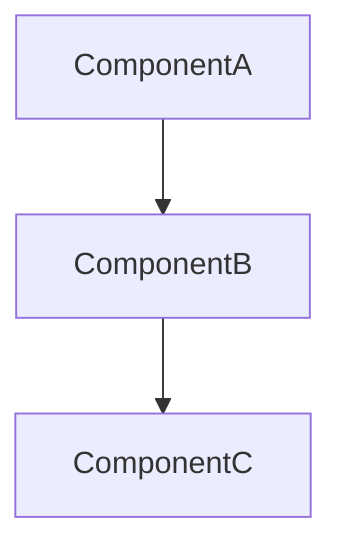
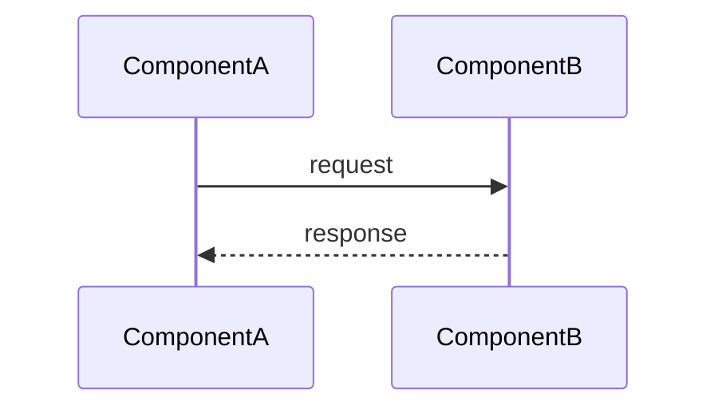

# {Document Title}

> Category: {Domain} | Version: 1.0 | Date: {Month YYYY} | Status: Active

{One sentence: who should read this + what it covers.}

**Related:**
- [`{sibling-doc}.md`]({sibling-doc}.md)
- [`{other-sibling}.md`]({other-sibling}.md)
- [`../architecture/ADR-{NNN}-{slug}.md`](../architecture/ADR-{NNN}-{slug}.md)

---

## {Primary concept or "why this exists"}

{Open with the most important thing to know. Why does this component/system exist? What problem does it solve? 1-3 paragraphs.}

---

## {Core mechanism or architecture}

{How it works. Include a diagram if the doc benefits from one.}



---

## {Technical details: schema, config, code}

{The ground-truth technical content: SQL DDL, TypeScript interfaces, configuration, command-line examples.}

```sql
-- Example Deep Lake table (mirror the column lists in src/deeplake-schema.ts)
CREATE TABLE {table_name} (
  id          TEXT NOT NULL DEFAULT '',
  {col_name}  TEXT NOT NULL DEFAULT '',
  created_at  TEXT NOT NULL DEFAULT ''
);
```

---

## {Operational detail or sequence}

{For request flows, state machines, or operational procedures. Use sequence diagrams for temporal flows.}



---

## {Alternatives / trade-offs / known limitations} (optional)

{Include this section when there are meaningful trade-offs or known constraints that the reader needs to be aware of.}

---

## Related

{Repeat the Related section links here if the doc is long and readers benefit from having them at the bottom too. Otherwise, delete this section.}
