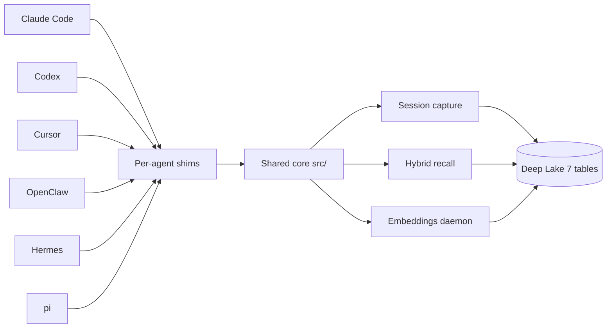

# Shared Core and the Six Harnesses

> Category: Architecture | Version: 1.0 | Date: June 2026 | Status: Active

How Hivemind writes its memory logic once in `src/` and wraps it per agent across six coding assistants, all backed by a single Deep Lake substrate. Read this first if you are debugging a capture or recall path, or onboarding onto the core.

**Related:**
- [`session-lifecycle.md`](session-lifecycle.md)
- `src/deeplake-schema.ts` (the 7-table schema)
- `src/shell/grep-core.ts` (hybrid recall)

---

## Why this shape

Hivemind has to live inside six different coding assistants that share almost nothing at the integration layer: Claude Code wants a marketplace plugin, Codex and Cursor want a `hooks.json`, OpenClaw wants a native extension, Hermes wants shell hooks plus an MCP server, and pi wants a TypeScript extension. The architecture answers that fragmentation with one rule: write the memory logic once in `src/`, then wrap it per agent with a thin shim that maps the assistant's native lifecycle events onto the same capture and recall calls.

Adding a new assistant means writing a new shim, not a new memory engine. Fixing a capture bug means editing the shared core, and every agent inherits the fix on its next build.

## Architecture

## The shared core (`src/`)

Everything durable and agent-agnostic lives in `src/`: the Deep Lake API client, auth, config, SQL utilities, the embeddings daemon, and the MCP server. The Claude Code hooks under `src/hooks/` are the reference implementation; the per-agent subdirectories (`src/hooks/codex/`, `cursor/`, `hermes/`, `pi/`) re-express the same handlers against each assistant's event names and payload shapes, reusing the core for the actual work.

The build step (`npm run build`) runs `tsc` plus `esbuild` and emits per-agent bundles into each harness's output folder.

## Capture path

On a session event, the active shim normalizes the assistant's payload and hands it to the shared capture code, which writes a row to the appropriate Deep Lake table. Raw per-turn events go to the `sessions` table; wiki-style summaries written by the SessionStart workers go to the `memory` table.

## Recall path (hybrid)

Recall is a hybrid lexical-plus-semantic pipeline implemented in `src/shell/grep-core.ts`. `searchDeeplakeTables` runs one `UNION ALL` query across the `memory` table (the `summary` column) and the `sessions` table (the `message` JSONB column), returning `{ path, content }` rows. `normalizeSessionContent` turns a single-line session JSON blob into multi-line `Speaker: text` so the line-wise regex refinement surfaces only matching turns, not the whole blob. `refineGrepMatches` then applies the usual grep flags line by line.

## The Deep Lake substrate

All seven tables (`memory`, `sessions`, `skills`, `rules`, `goals`, `kpis`, `codebase`) are defined once in `src/deeplake-schema.ts` as `{ name, sql }` column lists. Both `CREATE TABLE` and lazy schema healing iterate the same list, so adding a column is a single edit. Healing does one `information_schema.columns` SELECT per table, diffs against the definition, and `ALTER TABLE ADD COLUMN` only the genuinely missing columns - never blanket, never `IF NOT EXISTS`.

## Failure modes

| Layer | Common failure | Manifestation | Mitigation |
|---|---|---|---|
| Shim | Unmapped event payload | Capture silently skipped | Add the event mapping in the per-agent shim |
| Capture | Deep Lake INSERT rejected | Row missing on next recall | Re-verify column set via schema healing |
| Recall | Pattern matches nothing | Empty grep result | Confirm the path filter and that the rows exist |
| Embeddings | Daemon not running | No `summary_embedding` written | Restart the embed daemon; embeddings backfill on next run |

## Related code

- `src/deeplake-schema.ts` - the single source of truth for the 7 tables.
- `src/shell/grep-core.ts` - hybrid recall across memory + sessions.
- `src/embeddings/` - nomic embed-daemon, protocol, and SQL helpers.

## Changelog

- v1.0 (2026-06) - Initial version.
