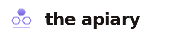
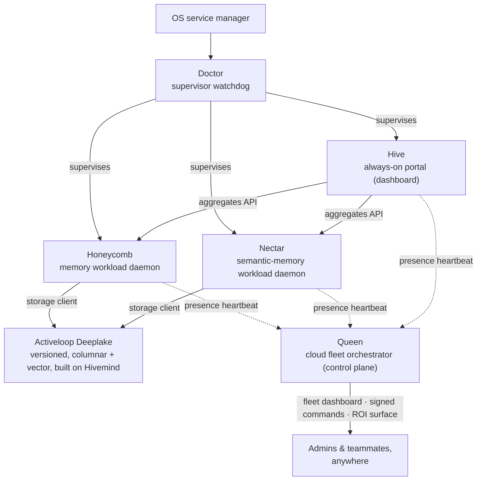

<!-- ───────────────────────────────  HERO  ─────────────────────────────── -->

<p align="center">
  <picture>
    <source media="(prefers-color-scheme: dark)" srcset="branding/apiary/logos/apiary-wordmark.svg">
    
  </picture>
</p>

<h3 align="center">One memory. A whole hive around it.</h3>

<p align="center">
  <strong>The Apiary gives your AI coding agents one shared, lasting memory on hardware you control.</strong><br>
  A stack of small, sharp programs, each one killing a single stubborn problem. Learn something once, and every agent recalls it everywhere.
</p>

<p align="center">
  <a href="https://theapiary.sh"></a>
  <a href="https://deeplake.ai"></a>
  <a href="https://github.com/activeloopai/hivemind"></a>
  <a href="LICENSE.md"></a>
  <a href="https://theapiary.sh"></a>
</p>

<p align="center"><sub>A <a href="https://github.com/legioncodeinc"><strong>Legion Code</strong></a> &times; <a href="https://activeloop.ai"><strong>Activeloop</strong></a> collaboration.</sub></p>

---

## Install

One command. It installs the local daemons, wires up your coding assistants, and opens a dashboard in your browser. No database to run, no config ritual.

```bash
# macOS / Linux
curl -fsSL https://get.theapiary.sh | sh
```

```powershell
# Windows (PowerShell)
irm https://get.theapiary.sh/install.ps1 | iex
```

Prefer to read the script first? Open [get.theapiary.sh](https://get.theapiary.sh) in a browser and check it, checksums and all, before you run it. When it finishes it hands you the **Hive** dashboard at `http://127.0.0.1:3853`. Click **First time setup**, approve the sign-in, and you are done.

---

## Why this exists

AI coding assistants are brilliant in the moment and amnesiac the next. Close the window and the context is gone. Open a different tool tomorrow and it has never heard of your project. So you re-explain your conventions, re-discover the fix that already worked, and pay for the same tokens every single morning.

The Apiary ends that. A small daemon runs quietly on your machine, notices what happens as you work, distills it into clean notes, and hands the right ones back to any assistant that asks, across sessions, tools, machines, and teammates. It lives on **[Deeplake](https://deeplake.ai)**, Activeloop's database built for AI: it stores your memory as exact text and as meaning at once, searches both, keeps full version history, and can run in your own cloud. Your memory is isolated per team and project, your secrets are never shown to an agent, and the whole thing gets sharper as it grows instead of rotting into a cache.

Learn something once. Recall it everywhere. On infrastructure you own.

---

## The hive

Five products. Each one answers a single stubborn question.

| Product | The problem it kills | Package · port | Stage |
|---|---|---|---|
| **[honeycomb](honeycomb/README.md)** · the memory | Your agent forgets everything when the window closes. Honeycomb gives every assistant one shared memory that survives sessions, travels across tools, and compounds over time. | `@legioncodeinc/honeycomb` · `:3850` | **Production** `v0.4` |
| **[nectar](nectar/README.md)** · the understanding layer | Ask where logins live and your agent opens the wrong file. Nectar describes every file by what it does, so agents find code by meaning, not by name. | `@legioncodeinc/nectar` · `:3854` | **Production** `v0.2` |
| **[doctor](doctor/README.md)** · the watchdog | A daemon dies at 2am and nothing notices. Doctor catches the crash, heals it on a repair ladder, and has your memory back before your next prompt. | `@legioncodeinc/doctor` · `:3852` | **Production** `v0.3` |
| **[hive](hive/README.md)** · the portal | Which local port was the dashboard again? None of your problem. Hive serves the whole stack from one address and stays up even when a workload is down. | `@legioncodeinc/hive` · `:3853` | **Production** `v0.5` |
| **[queen](queen/README.md)** · the fleet orchestrator | Once the stack spreads across machines, who can see the fleet? Queen is the cloud control plane for presence, identity, and ROI, and it never touches your memory. | not yet published | **Design** |

Supported coding assistants today: **Claude Code, Cursor, and Codex**, with **Hermes, pi, and OpenClaw** in progress. A memory written from one is recalled by the others.

---

## How the pieces fit together

Honeycomb is the product. Nectar extends what it can understand. Hive shows it to you. Doctor keeps it all alive. Queen commands the fleet of machines running the stack. On each device they form a **four-role topology**: two workload daemons (Honeycomb, Nectar) do the memory work, one always-on portal (Hive) presents it, and one supervisor (Doctor) watches the set. Queen sits above every device as the cloud control plane. All of it rests on the same foundation: Activeloop's **[Deeplake](https://deeplake.ai)** and the open-source **[Hivemind](https://github.com/activeloopai/hivemind)** agent-memory project.



- **Honeycomb** captures what happens on every agent turn, distills it into a three-tier memory (key, summary, raw), and serves it back to any harness that asks. It tidies itself over time, so recall gets sharper, not noisier.
- **Nectar** gives every file a stable, daemon-minted identity and a plain-language description of what it does, served through the same hybrid recall Honeycomb uses. That is how an agent finds the login logic in a file named `session-refresh.ts`.
- **Hive** boots with the device under Doctor's supervision and binds its socket before any workload is confirmed healthy, so the dashboard is up the moment you power on. It renders by aggregating each daemon's API and holds no storage client of its own, so one bad panel never takes down the page.
- **Doctor** runs beside the daemons under OS supervision. It probes each one's health, heals common failures on the spot, escalates loudly when it cannot, and has no code that can read or delete your credentials. Full stop.
- **Queen** (design stage) is the control plane above every machine. Daemons report presence upward; admins get a read-only fleet dashboard, a guarded mint/sign identity authority, a signed command channel, and a hosted ROI surface. It coordinates identity and encrypted blobs it cannot decrypt, and never reads your memory content. Observation ships before control.

---

## What this repository is

`the-apiary` is the **umbrella repository** for the ecosystem. It holds no product code of its own. It aggregates the five products as **git submodules**, so the whole system stays reproducible from one checkout while each product keeps its own repository, release cadence, and license.

```text
the-apiary/
├── honeycomb/              submodule · the memory system (daemon, CLI, MCP, SDK, harnesses)
├── nectar/                 submodule · semantic file-memory layer
├── doctor/                 submodule · the self-healing supervisor watchdog
├── hive/                   submodule · the always-on portal daemon
├── queen/                  submodule · cloud fleet orchestrator (design and spec)
├── branding/              brand marks and logos for the family and each product
├── product-documentation/ per-product guides, technical manuals, and one-pagers
├── library/              shared knowledge base, PRDs, and design corpus
├── site/                  the theapiary.sh marketing site source
├── .cursor/              the Bee Army: the local AI development team that builds the Apiary
├── LICENSE.md             AGPL-3.0-or-later
└── README.md              you are here
```

### Clone it

Because the products live in submodules, clone with `--recurse-submodules`:

```bash
# fresh clone, submodules and all
git clone --recurse-submodules git@github.com:legioncodeinc/the-apiary.git
cd the-apiary

# already cloned flat? pull the submodules in:
git submodule update --init --recursive

# update everything later:
git pull --recurse-submodules && git submodule update --remote --merge
```

Then pick your entry point. **Try it:** run the one-command install above. **Build from source:** each submodule is self-contained (`cd honeycomb && npm install && npm run build`); see its README for the quality gate. **Read the design:** Queen is written README-first, with its specification under [`queen/library/`](queen/).

---

## The Bee Army (`.cursor/`)

The Apiary is built by a local AI development team that ships with this repo, so any contributor using Cursor inherits the same specialists and guardrails. It is a small factory: narrow **worker-bee** subagents (`db`, `security`, `react`, `deeplake-dataset`, and dozens more) each armed with a deep-domain **stinger** skill, routed by [`the-beekeeper`](.cursor/commands/the-beekeeper.md) and driven to done by [`the-smoker`](.cursor/commands/the-smoker.md). Workspace rules hold the house style (plan protocol, no em dashes, clean boundaries), and a [model comparison matrix](.cursor/model-comparison-matrix.md) picks the best-fit model per task. It is the same discipline that keeps the products honest.

---

## License

Every project in the hive shares one license: the **GNU Affero General Public License v3.0 or later** ([AGPL-3.0-or-later](LICENSE.md)). Use any of them commercially or privately, free of charge. Keep the copyright and license notices intact, and if you run a modified version as a network service, you owe its source to its users. Always defer to the `LICENSE` file inside each submodule for that project's exact terms.

---

## Credits

The Apiary exists because two halves fit together. **[Activeloop](https://activeloop.ai)** brings **[Deeplake](https://deeplake.ai)** and **[Hivemind](https://github.com/activeloopai/hivemind)**, the durable, queryable foundation the memories live on. **[Legion Code](https://github.com/legioncodeinc)** brings the multi-tier memory, session priming, skill propagation, the self-tidying loop, the knowledge and codebase graphs, and the daemon architecture that turns Deeplake into a shared brain your coding agents read and write on every turn.

---

<p align="center">
  <sub><strong>Built by <a href="https://github.com/legioncodeinc">Legion Code</a></strong> · <strong>Built on <a href="https://deeplake.ai">Activeloop Deeplake</a></strong> · <strong>Powered by <a href="https://github.com/activeloopai/hivemind">Hivemind</a></strong></sub><br>
  <sub><a href="https://theapiary.sh">theapiary.sh</a></sub>
</p>
