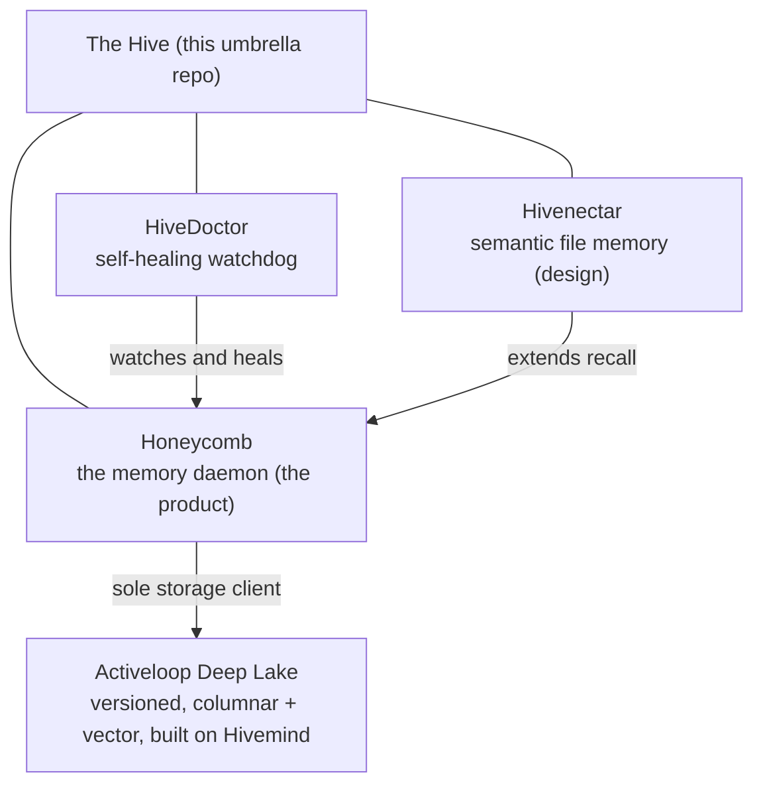

<!-- ───────────────────────────────  HERO  ─────────────────────────────── -->

<p align="center">
  <picture>
    <source media="(prefers-color-scheme: dark)" srcset="https://raw.githubusercontent.com/legioncodeinc/honeycomb/main/assets/logos/honeycomb-memory-cluster-wordmark-on-dark.svg">
    
  </picture>
</p>

<p align="center">
  <strong>The Hive is the home of Honeycomb: shared, persistent memory for AI coding agents, and the ecosystem built around it.</strong><br>
  One umbrella repository that stitches together every part of the system so it can be cloned, tracked, and reasoned about from a single place.
</p>

<p align="center">
  <a href="https://github.com/legioncodeinc"></a>
  <a href="https://deeplake.ai"></a>
  
  <a href="https://theapiary.sh"></a>
</p>

<p align="center"><sub>A <a href="https://github.com/legioncodeinc"><strong>Legion Code</strong></a> &times; <a href="https://activeloop.ai"><strong>Activeloop</strong></a> collaboration, built on <a href="https://github.com/activeloopai/hivemind">Hivemind</a> &amp; <a href="https://deeplake.ai">Deep Lake</a>.</sub></p>

---

## What this repository is

`the-hive` is the **umbrella (meta) repository** for Legion Code's Hive ecosystem. It does not hold product code of its own. Instead it aggregates several independently versioned, independently released projects as **git submodules**, so the whole system stays reasoned-about and reproducible from one checkout while each part keeps its own repository, release cadence, and license.

The name is the theme. A hive is a shared brain made of many small workers: memories are stored in the **honeycomb**, a **doctor** keeps the colony healthy, **nectar** is the raw material each worker refines, and a whole **bee army** does the building. Every project below is one cell of that hive.

---

## What is in here

Three product submodules, plus the local AI development tooling that builds them.

| Project | What it is | Repository | Package | Stage |
|---|---|---|---|---|
| **[honeycomb](honeycomb/README.md)** | The flagship product. A cross-harness AI coding **memory system**: a long-lived local daemon plus thin clients (per-harness hooks, a unified CLI, an MCP server, a TypeScript SDK) that give six coding assistants one shared, persistent memory. | [legioncodeinc/honeycomb](https://github.com/legioncodeinc/honeycomb) | [`@legioncodeinc/honeycomb`](https://www.npmjs.com/package/@legioncodeinc/honeycomb) `v0.1.x` | Pre-release |
| **[hivedoctor](hivedoctor/README.md)** | The **self-healing watchdog** for the Honeycomb daemon. Deliberately tiny (zero runtime dependencies, Node built-ins only), OS-supervised, watches daemon health and runs an escalating repair ladder. Now its own repository. | [legioncodeinc/hivedoctor](https://github.com/legioncodeinc/hivedoctor) | [`@legioncodeinc/hivedoctor`](https://www.npmjs.com/package/@legioncodeinc/hivedoctor) `v0.1.x` | Pre-release |
| **[hivenectar](hivenectar/README.md)** | A **semantic memory layer over a source tree**: gives every file a stable, daemon-minted identity (a "nectar") and an LLM-minted description, served through the same hybrid recall Honeycomb already uses. | [legioncodeinc/hivenectar](https://github.com/legioncodeinc/hivenectar) | not yet published | Design and specification |
| **[.cursor](.cursor/)** | The **Bee Army**: the local AI development team (specialist subagents, skills, orchestration commands, rules, and a model-routing matrix) that Legion Code uses to build the Hive. Tracked directly in this repo, not a submodule. | this repo | not applicable | Active tooling |

> **New here?** Honeycomb installs in one command and drops you on a dashboard. See the [Honeycomb README](honeycomb/README.md#-install-one-command). Everything else lives at **[theapiary.sh](https://theapiary.sh)**.

---

## How the pieces fit together

Honeycomb is the product. HiveDoctor keeps it running. Hivenectar extends what it can remember. All three sit on the same foundation: Activeloop's [Deep Lake](https://deeplake.ai) (the versioned, columnar-plus-vector database for AI) and [Hivemind](https://github.com/activeloopai/hivemind) (Activeloop's open-source agent-memory project).



- **Honeycomb** captures what happens on every agent turn, distills it into a three-tier memory (key, summary, raw), and serves it back to any harness that asks, across sessions, tools, devices, and teammates.
- **HiveDoctor** runs beside the daemon under OS supervision. It probes health, heals common failures on the spot, and escalates loudly when it cannot, so a wedged daemon never becomes a silent, lost morning.
- **Hivenectar** (design stage) adds a semantic layer so an agent can ask "where is the login logic" and get files that are not named `login-*`, complementing the structural codebase graph Honeycomb already builds.

---

## The Bee Army (`.cursor/`)

The `.cursor/` directory is the local AI development team that builds the Hive, the "Legion AI Tools Factory." It is committed to this repository so any contributor using Cursor inherits the same specialists, guardrails, and orchestration.

- **86 worker-bee subagents** (`.cursor/agents/`): narrow specialists (for example `db-worker-bee`, `security-worker-bee`, `react-worker-bee`, `deeplake-dataset-worker-bee`) that are routed a task and return focused work.
- **112 stinger skills** (`.cursor/skills/`): the deep domain knowledge each bee wields, plus the factory pipeline that forges new bees (`command-center` to `scripture-historian` to `stinger-forge` to `bee-creator` to `hive-registrar`, driven by `the-queen`).
- **Orchestration commands** (`.cursor/commands/`): [`the-beekeeper`](.cursor/commands/the-beekeeper.md) routes a task through the right bees, and [`the-smoker`](.cursor/commands/the-smoker.md) drives a set of PRDs to completion.
- **Workspace rules** (`.cursor/rules/`): the always-on guardrails, including the plan construction protocol, the no-em-dashes house style, and the boundary rule that keeps agents from stepping on each other's work.
- **[Model comparison matrix](.cursor/model-comparison-matrix.md)**: the scored rubric and routing heuristic used to pick the best-fit model for each task.

---

## Getting started

Because the products live in submodules, clone with `--recurse-submodules`:

```bash
# fresh clone, with all submodules populated
git clone --recurse-submodules git@github.com:legioncodeinc/the-hive.git
cd the-hive

# already cloned without submodules? initialize them:
git submodule update --init --recursive

# pull the latest for the umbrella and every submodule:
git pull --recurse-submodules
git submodule update --remote --merge
```

Then pick your entry point:

- **Try the product**: follow the one-command install in the [Honeycomb README](honeycomb/README.md#-install-one-command).
- **Build from source**: each submodule is self-contained. `cd honeycomb && npm install && npm run build`, and see its README for the quality gate. HiveDoctor and Hivenectar each carry their own build and docs.
- **Read the design**: Hivenectar is written README-first; its specification lives under [`hivenectar/library/knowledge/private/`](hivenectar/library/knowledge/private/).

---

## Repository layout

```text
the-hive/
├── honeycomb/        submodule · the memory system (daemon, CLI, MCP, SDK, harnesses)
├── hivedoctor/       submodule · the self-healing watchdog
├── hivenectar/       submodule · semantic file-memory layer (design and spec)
├── .cursor/          the Bee Army: agents, skills, commands, rules, model matrix
├── .gitmodules       submodule wiring (repository URLs and paths)
├── LICENSE.md        AGPL-3.0-or-later (umbrella)
└── README.md         you are here
```

Each submodule has its own `library/` documentation tree (PRDs, IRDs, and knowledge docs), its own `AGENTS.md` with per-repo agent guidance, and its own build and test gates. This umbrella intentionally stays thin.

---

## Licensing

Every project in the hive shares one license: the **GNU Affero General Public License v3.0 or later** ([AGPL-3.0-or-later](LICENSE.md)). Honeycomb, HiveDoctor, and Hivenectar all carry it. Use any of them commercially or privately, free of charge; keep the copyright and license notices intact, and if you run a modified version as a network service you owe its source to its users.

Always defer to the `LICENSE` file inside each submodule for that project's exact terms and copyright holder.

---

## Credits

The Hive exists because two halves fit together. **[Activeloop](https://activeloop.ai)** brings **[Deep Lake](https://deeplake.ai)** and **[Hivemind](https://github.com/activeloopai/hivemind)**, the durable, queryable foundation the memories live on. **[Legion Code Inc](https://github.com/legioncodeinc)** brings the multi-tier memory system, session priming, skill propagation, the pollinating loop, the knowledge and codebase graphs, and the daemon architecture that turns Deep Lake into a shared brain your coding agents read and write on every turn.

---

<p align="center">
  <sub><strong>Built by <a href="https://github.com/legioncodeinc">Legion Code Inc</a></strong> · <strong>Powered by <a href="https://deeplake.ai">Activeloop Deep Lake</a></strong> · <strong>Built on <a href="https://github.com/activeloopai/hivemind">Hivemind</a></strong></sub><br>
  <sub><a href="https://theapiary.sh">theapiary.sh</a></sub>
</p>
