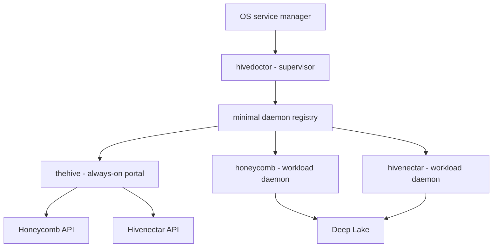

# The hive and hive doctor
_Exported on 7/1/2026 at 05:39:10 EDT from Cursor (3.9.16)_

---

**User**

I want you to look through @hivenectar/library/ and tell me what you know about "the hive" and "hive doctor" 

---

**Cursor**

I'll explore the `hivenectar/library/` directory to learn about "the hive" and "hive doctor".

Let me read the key architecture and PRD documents that cover these topics.

Now let me read the PRD-004 documents (hivedoctor registry and thehive) and the PRD-001 topology index.

Let me read the remaining hivedoctor/thehive sub-PRDs and the topology index.

I've read the ADRs and PRDs in `hivenectar/library/`. Here's what the corpus says about **thehive** ("the hive") and **hivedoctor** ("hive doctor").

## First, the framing

Per `hivenectar/AGENTS.md`, this repo is a **design and specification repository**, not an implementation. So everything below is specified in ADRs (`Active`/`Accepted`) and backlog PRDs, but the actual code lands in **sibling repos** (`hivedoctor` has its own repo; `thehive` lands in the `honeycomb` repo). Neither is implemented inside `hivenectar/` itself.

Both are roles in a bigger decision: the **three-daemon topology** (recorded in `ADR-0003`, contract in `PRD-001`). It actually names **four roles** across three daemon types:

## hivedoctor (the "hive doctor")

**What it is:** the minimal, rarely-updated **supervisor**. Its job is supervision only: health probes, restart policy, incident state, and OS service-unit integration. It deliberately stays "state-light" and only changes when the set of supervised daemons changes.

**What it explicitly does NOT own:** the product UI / dashboard. Putting the portal inside hivedoctor was considered and **rejected** (ADR-0003, ADR-0004) because it would couple fast-moving dashboard velocity to the most stability-sensitive component.

**Today (current state, per the PRDs):** hivedoctor is a one-directional `/health`-probe watchdog that supervises exactly **one** daemon (honeycomb at `:3850`). Its config holds a single daemon's `healthUrl` / `startupGraceMs` / `restartGiveUpThreshold` / `restartCooldownMs` / PID path, and its composition root builds exactly one supervisor.

**Planned change (PRD-004a / 004b):** generalize that single daemon into a **named registry of N daemons** read from a static JSON file at `~/.honeycomb/hivedoctor.daemons.json`, spawning **one independent supervisor instance per entry**. Key properties:
- **Isolated per-daemon state.** Each entry gets its own `state-<name>.json` shard and `incidents-<name>.ndjson` stream, so a hivenectar restart never pollutes honeycomb's incident record.
- **No runtime registration API.** Registration is a file edit by an installer, read on boot. A new entry takes effect at hivedoctor's next boot; it is not hot-reloaded.
- **Per-entry watchdog-war guards.** Cooldown and "lock-held-and-healthy" checks read each entry's own `pidPath`.
- **Reporting surfaces (004b)** get generalized too: the loopback status page (bound to `127.0.0.1:3852`) and the CLI (`status` / `diagnose` / `logs --daemon <name>`) report all N daemons, not just one.

## thehive (the "hive")

**What it is:** a **new, always-on portal daemon** and "the single source of always-on UI truth." It boots immediately on OS start (supervised by hivedoctor, sibling to the workloads), serves the **unified dashboard**, and is updateable independently of hivedoctor. It binds **port 3853**, writes `~/.honeycomb/thehive.pid` + `.lock`, and lands as a new `thehive/` package in the honeycomb repo.

`ADR-0004` records the four **binding decisions** that define what it is:

1. **Always-on + boot-order contract.** It is a top-level supervised daemon, not a child of any workload, and not gated on any workload's `/health`. The shell renders the moment its socket binds. A daemon that hasn't answered `/health` yet renders as "starting," not as a broken page. (Making it a child of honeycomb was rejected: the dashboard would die when honeycomb dies, which is the exact failure mode thehive exists to survive.)
2. **API aggregation, not direct Deep Lake access.** thehive holds **no** Deep Lake client, no tenancy scope, no query surface. It fetches from each registered daemon's `/api/*` and aggregates, **fail-soft per daemon** (if honeycomb's API is down, honeycomb panels show "unreachable" while hivenectar panels still render). This keeps it a thin portal, not a second data plane. (Direct Deep Lake access was rejected.)
3. **Dashboard ownership + reuse (not fork).** It owns every dashboard route and **reuses honeycomb's existing dashboard code** (`src/dashboard/web/` registry, pages, the `wire` data-fetch abstraction) rather than forking it. thehive supplies its own `wire` implementation that routes each request to the owning daemon's API, but the component layer is shared. The Source Graph page (PRD-015) lands here and fetches from hivenectar's `/api/source-graph/*`.
4. **Update-cadence boundary.** thehive ships on its own release train. A dashboard change does not require an hivedoctor / honeycomb / hivenectar release, and hivedoctor's rare updates don't force a thehive redeploy. This is the "velocity" half of the stability/velocity split.

## How they relate to each other

The two are deliberately split to preserve a **stability/velocity boundary**:
- **hivedoctor = stability.** Rare updates, minimal, supervises everything.
- **thehive = velocity.** Fast-moving dashboard, ships independently, but is itself just another entry in hivedoctor's registry (so hivedoctor supervises and restarts it like any other daemon).

The workload daemons (**honeycomb** and **hivenectar**) do the actual work, own their own `/health` + `/api/*`, read/write Deep Lake, and surface their data through thehive's portal.

## Status / caveats worth flagging

- These are **specs**: `ADR-0003` is `Active`, `ADR-0004` is `Accepted`, and the PRD-004 sub-features are all `Draft` in `Backlog`.
- A few things are marked **"DEFAULT — confirm before implementation"** (the PID/lock paths, the exact registry file location/schema). Ports 3853/thehive and 3854/hivenectar are marked `CONFIRMED`.
- ADR-0004 references a **`prd-004d`** (thehive service unit + registration) and a **`thehive-portal-daemon.md`** design reference, but neither file exists in the current tree (only 004a, 004b, 004c are present). Since the boundary rule here is to not touch other agents' in-progress work, I'm just flagging the dangling references rather than assuming anything about them. Want me to dig into the `EXECUTION_LEDGER.md` / the corpus-conformance QA report to see whether those are known gaps?

---

**User**

OK, I want you to use /hivenectar-stinger and /library-worker-bee to begin the documentation process in @library/ for @c:\Users\mario\GitHub\the-hive\ repository. Remember, @c:\Users\mario\GitHub\the-hive\ "the hive" is the alaways on, portal daemon. 

Write the PRDs in @library/ ensuring that you are noting what can be directly copied or copied with modification from @honeycomb/ given that we will be retiring its dashboard function and moving that to @c:\Users\mario\GitHub\the-hive\ 

---

**Cursor**

I'll start by orienting myself. Let me read the hivenectar-stinger's core map and explore the actual repository structure, since the paths in your request need disambiguation (there's a `hivenectar/library/` in the workspace, and the skill references a separate `hivenectar` repo).

The README clarifies the picture significantly. `the-hive` is an **umbrella repo** with `honeycomb/`, `hivedoctor/`, and `hivenectar/` as submodules. You want to stand up a `library/` at the umbrella root to document **thehive** (the always-on portal daemon), pulling the dashboard out of honeycomb.

Let me verify the actual on-disk structure before I plan: whether a root `library/` exists, whether the submodules are populated, and what honeycomb's dashboard code looks like.

Let me confirm the submodule population state and see what's actually on disk in `honeycomb/`, `hivedoctor/`, and the umbrella root.

A root `library/` already exists (created moments ago at 04:17). Per the work-boundaries rule I need to inspect it carefully before touching anything, in case another agent or you created it. Let me look at its contents, and the honeycomb dashboard code we'd be sourcing from.

Now I have the full picture. Key findings:

- **`the-hive/library/`** is a freshly scaffolded schema-v2 tree (just READMEs + `documentation-framework.md`) waiting to be populated. It's an empty scaffold, so it's safe to author into.
- **`honeycomb/src/dashboard/`** is populated and is exactly the code being retired/migrated: a route `registry.tsx`, `wire.ts` data layer, `pages/*`, and the shell (`app.tsx`, `router.tsx`, `sidebar.tsx`, etc.).
- The submodules are all checked out on disk.

Let me anchor the copy-mapping by reading the load-bearing honeycomb dashboard files and locating the daemon server, so the delegated brief is accurate.

I now have solid grounding. Here's what I've confirmed:

- **`the-hive/library/`** is a fresh schema-v2 scaffold (only READMEs + `documentation-framework.md`), empty of content and clearly the intended target.
- **honeycomb's dashboard** is a React SPA in `honeycomb/src/dashboard/web/` (a `registry.tsx` route table, a large `wire.ts` data client, `pages/*`, and the shell), plus an older renderer-agnostic `ViewBlock` layer at `src/dashboard/*`. This is exactly the surface being retired and moved to thehive.
- The thehive design contract already exists in the hivenectar corpus (ADR-0003, ADR-0004, PRD-004c, and the port/path contract in PRD-001b: port **3853**, `~/.honeycomb/thehive.pid`).

One thing worth flagging: hivenectar's `ADR-0004` currently says thehive lands as a package **inside the honeycomb repo**. Your instruction places thehive in **this umbrella repo (`the-hive`)** with its own `library/`. I'll proceed with your framing and have the PRDs record that this refines/supersedes ADR-0004's location decision.

Let me set up the work and delegate the authoring to `library-worker-bee` with a fully-grounded brief.

---

**User**

FYI @hivenectar/library/requirements/backlog/prd-004-hivedoctor-registry-and-thehive/prd-004d-thehive-service-unit-and-registration.md @hivenectar/library/requirements/backlog/prd-004-hivedoctor-registry-and-thehive/prd-004c-thehive-portal-daemon.md 

These can be almost verbatim copied right? 

---

**Cursor**

Short answer: **the bodies are ~90% reusable, but a blind paste would ship three things that are now wrong.** I read both (004c I had already; 004d I just pulled in). Here's the honest breakdown.

## What copies near-verbatim (the load-bearing content)

- **All the acceptance criteria** carry over as-is: `c-AC-1..7` (always-on, dashboard reuse, API aggregation, independent updateability) and `d-AC-1..8` (service unit, independent install/remove, registry registration).
- **The implementation notes** on the Hono bootstrap, `/health`, PID/lock, **port 3853**, the API-aggregation `wire` routing + fail-soft, the service-unit pattern modeled on `hivedoctor/src/service/index.ts`, and the atomic idempotent registry read-modify-write.
- **The four binding decisions** from ADR-0004 (always-on + boot order, API-aggregation-not-Deep-Lake, dashboard ownership, independent cadence).

## What must change (why it's not a straight copy)

1. **The `> Codebase:` header inverts.** Both files declare themselves *"an out-of-band sub-PRD; it lands in the honeycomb repo, not hivenectar."* In `the-hive` repo, thehive is **the product**, not an out-of-band package inside honeycomb. Every "out-of-band / lands in honeycomb / not hivenectar" framing has to flip to first-class.
2. **Numbering + cross-links break.** They are `004c`/`004d`, sub-features of hivenectar's combined *"hivedoctor registry + thehive"* module. Their `Related` links point at `prd-004a`, `prd-004-index`, `ADR-0004`, `thehive-portal-daemon.md`, `PRD-015` inside the hivenectar corpus. In `the-hive/library` those become fresh numbers (naturally `prd-001-*`) with re-pointed links, and the hivedoctor-registry sub-PRDs (`004a`/`004b`) stay hivedoctor's concern, referenced as a dependency.
3. **Code citations gain a submodule prefix.** `src/dashboard/web/registry.tsx`, `src/daemon/runtime/server.ts` become `honeycomb/src/...`; `hivedoctor/src/service/index.ts` stays but is now an in-tree submodule path.

## The one real contradiction with your new directive

This is the part that is *not* just reframing. 004c's Non-Goal says:

> "thehive does NOT replace honeycomb's own dashboard server. honeycomb may still serve its dashboard directly when up ... whether honeycomb's in-process dashboard is later removed ... is a follow-up decision, out of scope here."

and its implementation note says thehive **"imports honeycomb's dashboard module rather than forking it."**

You just told me the opposite: **honeycomb's dashboard is being retired and moved to thehive.** So the "honeycomb keeps its dashboard" hedge flips to "honeycomb stops serving it," and the "reuse-by-import" mechanism can't stand either, because honeycomb and thehive are separate submodule repos. Thehive can't import honeycomb's internal `src/dashboard/web/` module at runtime once that surface is retired. That turns ADR-0004's *reuse-not-fork* into **migrate-and-own**: the dashboard code (`registry.tsx`, `wire.ts`, `pages/*`, the shell) gets **copied into thehive**, thehive owns it, and honeycomb deletes its dashboard-serving surface. That is exactly the copy-mapping you asked me to author, and it's the piece these two PRDs don't yet contain.

So before I hand the brief to `library-worker-bee`, two decisions are genuinely yours:

**thehive PRD authoring: two decisions**

> **How should the dashboard code physically move from honeycomb to thehive? This determines the whole copy-mapping.**
> - Copy-and-own (Recommended): thehive copies honeycomb/src/dashboard/web/* into its own repo verbatim-or-modified and owns it; honeycomb deletes its dashboard-serving surface. Clean for separate submodules + full retirement. ✔
> - Shared library: extract the dashboard into a shared package both import; honeycomb stops mounting it but the code stays shared. More plumbing, keeps one source of truth.
> - Not sure, lay out the tradeoffs in an ADR and let me pick

> **How should the thehive PRDs be numbered/structured in the new the-hive/library?**
> - Fresh PRD-001 module (Recommended): prd-001-thehive-portal-daemon/ with sub-features (portal daemon, dashboard migration + copy-map, API aggregation, service unit + registration). Renumbered, links re-pointed, retirement Non-Goal flipped. ✔
> - Keep the 004c/004d numbering to mirror the hivenectar corpus 1:1

Locked in: **copy-and-own** migration, **fresh PRD-001 module**. Let me set up the work and hand a fully-grounded brief to `library-worker-bee` (which wields `library-stinger`).

The subagent delivered the module. Let me update the todo and review the authored files for accuracy and convention conformance, especially the core copy-map.

The index and copy-map are high quality. But I caught a discrepancy I need to verify: the subagent claims `web/graph-layout.ts` does not exist and excluded it (counting 35 files), yet my earlier directory listing showed it. If it exists, the copy-map is missing a row. Let me verify directly.

Confirmed: `web/graph-layout.ts` **does exist** (10 KB, referenced by `graph.tsx` and `panels.tsx`). The subagent's search tools couldn't traverse it (its noted blind spot), so it wrongly excluded the file. The copy-map is missing a row and its counts are off by one. Let me read the other three sub-PRDs to check for similar issues, then correct the copy-map directly.

All four sub-PRDs are well-grounded and conform to the conventions (headers, present tense, no em dashes, clean Mermaid). The one real defect is the `graph-layout.ts` omission in the copy-map. Before I fix it, let me spot-check a few of the most specific code citations (the subagent had a search blind spot, so I want to confirm the Read-verified line numbers are real, not hallucinated).

Citations verify cleanly (`wire.ts:1858-1861`, `:1867`, `:27`; `server.ts:72/108/226/319`; `app.tsx:25/95/135` all real). Grounding quality is excellent. The sole defect is the `graph-layout.ts` false-negative in the copy-map, which threw off one row and the counts. Let me correct `prd-001b` directly.

Now let me do a final conformance sweep across the whole module: scan for any em/en dashes (house rule) and confirm the corrected counts are internally consistent.

All consistent now, and the em/en dash scan is clean. Let me close out the todos.

Direct answer to your question: **yes, near-verbatim on the body, but not a blind paste.** I confirmed 004c and 004d are the right source, then had `library-worker-bee` adapt them (plus the surrounding design) into a first-class the-hive module rather than pasting them, because the framing inverts and the retirement decision contradicts two stale statements in the corpus.

## What now exists

`library/requirements/backlog/prd-001-thehive-portal-daemon/`

- `prd-001-thehive-portal-daemon-index.md` (records Decision A + B first-class, topology diagram, module ACs)
- `prd-001a-thehive-process-and-bootstrap.md` (Hono daemon, `/health`, PID/lock, port 3853)
- `prd-001b-dashboard-migration-and-copy-map.md` (**the copy-map you asked for**)
- `prd-001c-api-aggregation-wire.md` (the federated `wire`)
- `prd-001d-service-unit-and-registration.md` (service unit + hivedoctor registry entry)
- `qa/.gitkeep` (QA authorship left to `quality-worker-bee`)

## The copy-map (all 36 `honeycomb/src/dashboard/**` files, verified on disk)

| Disposition | Count | What |
|---|---|---|
| Copy verbatim to thehive | 24 | 12 `web/` shell/infra + 12 `web/pages/` (all origin-agnostic; hydrate through the injected `wire`) |
| Copy with modification | 4 | `wire.ts` (single-origin to federated), `app.tsx`, `main.tsx`, `setup-gate.tsx` |
| Copy with modification (partial) | 1 | `contracts.ts` (only the web-consumed ROI types `wire.ts:27` imports) |
| Rewrite / net-new | 1 | the daemon-side host that serves the bundle (thehive's own Hono server) |
| Leave in honeycomb | 7 | the ViewBlock/TUI layer (`dashboard.ts`, `views.ts`, `html.ts`, `launch.ts`, `logs.ts`, `index.ts`, `CONVENTIONS.md`) that still powers the `honeycomb dashboard` CLI + Cursor webview |
| Delete from honeycomb (retire) | 28 web files + the `/` mount | the whole `web/` subtree + `server.ts:108` dashboard mount |

The load-bearing modification is the one you'd expect: honeycomb's `wire` uses a single same-origin (`wire.ts:1858-1861`); thehive's copy routes each endpoint to the **owning** daemon via hivedoctor's registry, fail-soft per daemon. honeycomb keeps `/api/*` + `/health` as the retained data plane thehive aggregates.

## Two things worth your attention

1. **I corrected one subagent error.** It reported `web/graph-layout.ts` as non-existent (its search tools can't traverse gitignored `daemon/`-masked paths, and it over-trusted a false negative). The file exists (a pure layout helper used by `graph.tsx` + `panels.tsx`), so I added its row and fixed the counts (35 to 36 files; 23 to 24 verbatim; 27 to 28 retired). Every other citation I spot-checked (`wire.ts`, `server.ts`, `app.tsx` line numbers) is accurate.

2. **Retirement stance flipped correctly.** 004c's "honeycomb may still serve its dashboard" and "thehive imports honeycomb's dashboard module" are both superseded in the index. There's also a **cutover sequencing** note: honeycomb should not drop its `/` mount until thehive is serving, so operators are never dashboard-less.

## Recommended next steps (your call)

- **Author the the-hive ADR** recording Decision A (retirement) + Decision B (copy-and-own) and how they refine corpus ADR-0003/0004. That belongs to `knowledge-worker-bee`, not the PRD lane. I can kick that off.
- **Open questions to confirm** before implementation: the exact endpoint-to-owner routing table (001c), hivenectar's `/api/source-graph/*` shape, and the `~/.honeycomb/thehive.pid`/`.lock` paths (flagged "DEFAULT, confirm").
- **Heads-up:** the-hive's `library/knowledge/private/standards/documentation-framework.md` is still v1-flavored (its tables point at `library/knowledge-base/`, `requirements/features/`). The PRDs conform to v2 regardless, but that standards doc likely wants a refresh.

Want me to spin up `knowledge-worker-bee` for the ADR next?

---

**User**

Author the the-hive ADR-0001 in @library/knowledge/private using /knowledge-worker-bee and refine @hivenectar/library/knowledge/private/architecture/ADR-0003-three-daemon-topology-and-thehive-portal.md @hivenectar/library/knowledge/private/architecture/ADR-0004-thehive-portal-daemon-role-and-boundaries.md as needed. 

---

**Cursor**

The plan is clear: author the-hive's ADR-0001 recording the two decisions, and surgically refine the corpus ADR-0003/0004 to cross-reference it. Let me set up the work and hand a grounded brief to `knowledge-worker-bee`.

The subagent reported completion with clean grounding. Let me verify the actual output: read the new ADR-0001, confirm the surgical edits to ADR-0003/0004 are correctly placed and attributed, and validate the cross-repo link arithmetic on disk.

ADR-0001 is thorough and well-grounded. Now let me verify the surgical edits to the two corpus ADRs and validate all the cross-repo links resolve on disk plus a dash scan.

Edits are surgical, correctly placed, and attributed (ADR-0003 bumped to v1.1; ADR-0004 got the header note plus three blockquote annotations at the exact right anchors). Let me do a final validation: confirm the cross-repo links resolve on disk and scan the new/edited prose for stray dashes.

All validations pass: forward and reverse cross-repo links resolve on disk, and the dash scan is clean. Let me close out the todos.

Done. `knowledge-worker-bee` authored the ADR and I reviewed and validated the whole set.

## What was created

**New: `library/knowledge/private/architecture/ADR-0001-retire-honeycomb-dashboard-and-copy-and-own-into-thehive.md`**

Nygard structure under the-hive's universal header (`Version: 1.0 | Status: Accepted`). It records:
- **Decision A** (retire honeycomb's `/` dashboard mount; keep `/api/*` + `/health` as the data plane thehive aggregates) and **Decision B** (copy-and-own, no runtime import), grounded in the PRD-001b copy-map counts (36 files; 28 `web/` migrate + retire, 24 verbatim + 4 modified; 8 top-level ViewBlock/TUI files stay).
- A **"Relationship to the corpus ADRs"** section that draws the line precisely: it does **not** change ADR-0003's topology, and it **refines** ADR-0004's decision #3, explaining why copy-and-own is neither "reuse over fork by import" nor the rejected "fork" (one-time ownership transfer plus source retirement, so nothing stays live to diverge from).
- Three rejected alternatives (import-across-repos, shared package, rewrite), consequences including the cutover-sequencing safeguard, and a clean Mermaid diagram.

## What was refined (surgical, attributed, original text intact)

- **ADR-0003:** version `1.0` to `1.1`, plus one `Refined by:` entry in Related pointing at the-hive ADR-0001 (topology unchanged).
- **ADR-0004:** a header `Refined by:` line, plus three attributed blockquote annotations placed exactly at the "Reuse over fork" driver, decision #3, and the rejected "Fork" alternative. `Superseded by: none` was left as-is (this is a refinement, not a supersession).

## Validation I ran

- **Cross-repo links resolve on disk:** ADR-0001's forward links (to PRD-001 and the two corpus ADRs) and the reverse links added into the hivenectar ADRs (5 levels up into the umbrella `library/`) all resolve.
- **Dash scan clean:** no em/en dashes in the new file or the added lines; pre-existing corpus dashes were left untouched.
- **Scope held:** only ADR-0001, ADR-0003, and ADR-0004 were touched; the PRD-001 files and everything else were left alone.

## Two things to be aware of

1. **Cross-repo link caveat (inherent, not a bug):** the `Refined by` links inside the hivenectar ADRs point up into the-hive's `library/`. They resolve inside this umbrella checkout but will dangle if `hivenectar` is browsed as a standalone repo. This is the mirror image of the pattern PRD-001 already uses, so it's consistent with the established convention, but it's a real limitation of documenting a cross-repo decision from inside a submodule.
2. **Status enum:** ADR-0001 uses `Status: Accepted` (Nygard convention, matches sibling ADR-0004). The-hive's documentation-framework enum lists `Active/Draft/Archived/Canonical`, so if you want strict enum conformance I can switch it to `Active`. Your call.

The subagent also flagged (and correctly left untouched) the stray untracked `hivenectar/` build artifacts and `PRD-003-016-*` files that look like another agent's in-progress work.

Want me to normalize the `Accepted` to `Active` for enum conformance, or leave the Nygard convention as-is?

