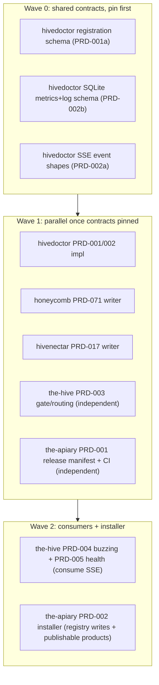

# Initiative: Portal and Telemetry Realignment

> Category: Initiative | Version: 1.0 | Date: July 2026 | Status: Active

The cross-repo coordination index for the portal + telemetry realignment. This is an INDEX ONLY: the requirements live in the constituent PRDs in each submodule, and the decisions live in the ADRs. This doc exists to sequence the implementation and to let an orchestrator (the-beekeeper / the-queen) dispatch parallel per-repo agents safely.

**Related:**
- Umbrella ADRs: [`ADR-0001`](../knowledge/private/architecture/ADR-0001-hive-release-manifest-and-combined-release-train.md), [`ADR-0002`](../knowledge/private/architecture/ADR-0002-one-line-installer-product-loading-and-install-time-telemetry.md)
- Umbrella PRDs: [`PRD-001`](../requirements/backlog/prd-001-hive-release-manifest-and-ci/prd-001-hive-release-manifest-and-ci-index.md), [`PRD-002`](../requirements/backlog/prd-002-installer-product-loading-and-phone-home/prd-002-installer-product-loading-and-phone-home-index.md)

---

## 1. Goal

- One always-on portal (`the-hive`) is the single origin of UI truth: path-based, server-gated routing (health, then auth, then the dashboard at `/`).
- `hivedoctor` is the single source of truth for hive health + telemetry: services write their own local SQLite, hivedoctor polls (about 1s) + probes `/health`, and maintains ONE SSE stream to the-hive.
- Every service (`honeycomb`, `hivenectar`, `the-hive`) checks in with hivedoctor and writes non-sensitive telemetry to local SQLite.
- The fleet ships as a version-pinned release with a one-line installer that loads products by flag/code and phones home reliably.

## 2. Decisions (the contracts everything conforms to)

| ADR | Repo | Decision |
|---|---|---|
| [ADR-0001 telemetry transport + SoT](../../hivedoctor/library/knowledge/private/architecture/ADR-0001-hive-telemetry-transport-and-single-source-of-truth.md) | hivedoctor | services write local SQLite; hivedoctor polls + is SoT; one SSE to the-hive |
| [ADR-0002 registration](../../hivedoctor/library/knowledge/private/architecture/ADR-0002-service-registration-static-registry-plus-runtime-sqlite.md) | hivedoctor | static installer registry + runtime SQLite status, merged |
| [ADR-0004 portal gate + routing](../../the-hive/library/knowledge/private/architecture/ADR-0004-portal-landing-gate-and-path-based-routing.md) | the-hive | path-based, server-gated: health, then login, then root `/` |
| [ADR-0001 release manifest](../knowledge/private/architecture/ADR-0001-hive-release-manifest-and-combined-release-train.md) | the-apiary | version-pinning manifest; independent OIDC publishes |
| [ADR-0002 installer + phone-home](../knowledge/private/architecture/ADR-0002-one-line-installer-product-loading-and-install-time-telemetry.md) | the-apiary | flags + product code; shell-fired PostHog phone-home |

## 3. Dependency graph

The load-bearing rule: the shared CONTRACTS (registration schema, the SQLite metrics/log schema, and the SSE event shapes) must be pinned before the writers and the consumer are built, or parallel agents will drift.

## 4. Dispatch table

Spec status is the merged PRD (the specification). Impl status is the code work this table coordinates. Model is the suggested best-fit for the IMPLEMENTATION per `.cursor/model-comparison-matrix.md`; each runs on its own `feature/<slug>` branch in its submodule.

| # | Repo | PRD (spec) | Wave | Depends on | Spec | Impl | Suggested model |
|---|---|---|---|---|---|---|---|
| 1 | hivedoctor | [PRD-001 registration + ingestion](../../hivedoctor/library/requirements/backlog/prd-001-service-registration-and-telemetry-ingestion/prd-001-service-registration-and-telemetry-ingestion-index.md) | 0 to 1 | hivenectar PRD-004 (done) | Merged | Pending | `claude-opus-4-8-thinking-high` |
| 2 | hivedoctor | [PRD-002 SSE SoT + schema](../../hivedoctor/library/requirements/backlog/prd-002-telemetry-sot-sse-and-schema/prd-002-telemetry-sot-sse-and-schema-index.md) | 0 to 1 | row 1 contracts | Merged | Pending | `claude-opus-4-8-thinking-high` |
| 3 | honeycomb | [PRD-071 check-in + SQLite telemetry](../../honeycomb/library/requirements/backlog/prd-071-service-checkin-and-sqlite-telemetry/prd-071-service-checkin-and-sqlite-telemetry-index.md) | 1 | rows 1, 2 (schemas) | Merged | Pending | `composer-2.5` |
| 4 | hivenectar | [PRD-017 check-in + SQLite telemetry](../../hivenectar/library/requirements/backlog/prd-017-service-checkin-and-sqlite-telemetry/prd-017-service-checkin-and-sqlite-telemetry-index.md) | 1 | rows 1, 2 (schemas) | Merged | Pending | `composer-2.5` |
| 5 | the-hive | [PRD-003 landing gate + routing](../../the-hive/library/requirements/backlog/prd-003-portal-landing-gate-and-routing/prd-003-portal-landing-gate-and-routing-index.md) | 1 | `/setup/state` (exists) | Merged | Pending | `composer-2.5` |
| 6 | the-hive | [PRD-004 buzzing + service loaders](../../the-hive/library/requirements/backlog/prd-004-buzzing-service-loaders/prd-004-buzzing-service-loaders-index.md) | 2 | rows 1, 2 (SSE + registration) | Merged | Pending | `composer-2.5` |
| 7 | the-hive | [PRD-005 health rail + page](../../the-hive/library/requirements/backlog/prd-005-health-rail-and-page/prd-005-health-rail-and-page-index.md) | 2 | rows 1, 2 (SSE + schema) | Merged | Pending | `composer-2.5` |
| 8 | the-apiary | [PRD-001 release manifest + CI](../requirements/backlog/prd-001-hive-release-manifest-and-ci/prd-001-hive-release-manifest-and-ci-index.md) | 1 | independent | Merged | Pending | `gpt-5.3-codex-high` |
| 9 | the-apiary | [PRD-002 installer + phone-home](../requirements/backlog/prd-002-installer-product-loading-and-phone-home/prd-002-installer-product-loading-and-phone-home-index.md) | 2 | rows 1 (registry writes), 8 (publishable products) | Merged | Pending | `gpt-5.3-codex-high` |

Superseded (honeycomb, banners in place, no work): PRD-068, PRD-070 (by the-hive PRD-003/004), PRD-069 (by hivedoctor PRD-001/002 + the-hive PRD-005), PRD-054 read-only-dashboard portion (by the-hive PRD-005 + hivedoctor PRD-002).

## 5. Execution protocol

1. **Wave 0, pin the contracts first.** Land the registration schema (hivedoctor PRD-001a), the SQLite metrics/log schema (PRD-002b), and the SSE event shapes (PRD-002a) as concrete, reviewed artifacts before starting rows 3, 4, 6, 7, 9. These three are the entire realignment's critical path.
2. **Wave 1, fan out in parallel.** Rows 1 to 2 (hivedoctor), 3 (honeycomb), 4 (hivenectar), 5 (the-hive gate), 8 (the-apiary release) run concurrently, each on its own submodule feature branch and PR.
3. **Wave 2, consumers + installer.** Rows 6, 7 (the-hive consumes the SSE) and 9 (installer writes the registry + installs the now-publishable products).
4. **Per-repo gates before merge.** Each implementation PR runs `/security-worker-bee` then `/quality-worker-bee` and clears medium-and-above findings before merge (per `.cursor/rules/plan-construction-protocol.mdc`).
5. **Superproject pointer bump after each wave.** Once a wave's submodule PRs merge, bump the-apiary submodule pointers so the superproject tracks the merged set.
6. **Isolation rule.** One PRD per branch per submodule; do not touch another agent's in-flight submodule branch (this initiative already had to defer hivenectar PRD-017 once for that reason).

## 6. Status

All nine specs are merged to their repos' `main` (spec PRs: the-hive #4, hivedoctor #5, honeycomb #207, hivenectar #10, the-apiary #1). Implementation has not started. Update the Impl column as rows are picked up.
