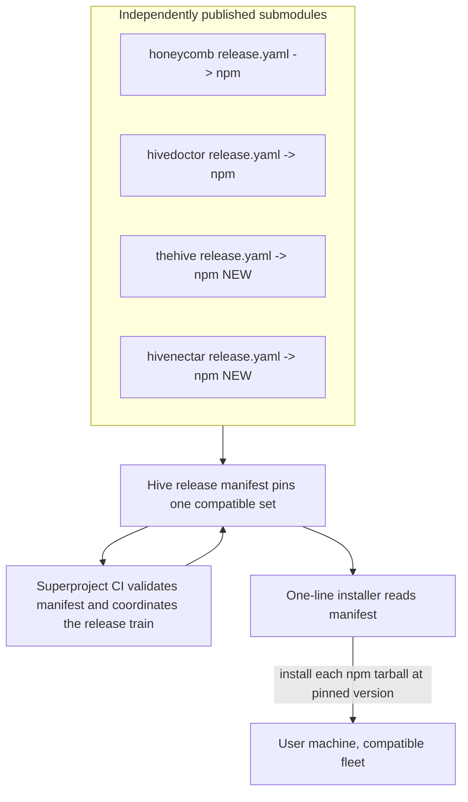

# ADR-0001, pin the fleet with a hive release manifest and a combined release train

> **Status:** Active · **Date:** 2026-07-01
> **Supersedes:** none · **Refines:** none
> **Owners:** platform, honeycomb, hivedoctor, thehive, hivenectar
> **Related:** [`ADR-0002`](./ADR-0002-one-line-installer-product-loading-and-install-time-telemetry.md), [`../../../requirements/backlog/prd-001-hive-release-manifest-and-ci/prd-001-hive-release-manifest-and-ci-index.md`](../../../requirements/backlog/prd-001-hive-release-manifest-and-ci/prd-001-hive-release-manifest-and-ci-index.md), [`../../../../doctor/library/knowledge/private/architecture/ADR-0002-service-registration-static-registry-plus-runtime-sqlite.md`](../../../../doctor/library/knowledge/private/architecture/ADR-0002-service-registration-static-registry-plus-runtime-sqlite.md)

## Context

The Apiary is an umbrella git repository that aggregates four independently-versioned products as git submodules:

- **honeycomb** (`@legioncodeinc/honeycomb`), published to npm today, with its own CI (`honeycomb/.github/workflows/ci.yaml`) and an OIDC Trusted Publishing release workflow (`honeycomb/.github/workflows/release.yaml`) that fires on `v*` tags. It also ships an install surface to Cloudflare Pages at `get.theapiary.sh` via `honeycomb/.github/workflows/deploy-install-site.yaml`.
- **hivedoctor** (`@legioncodeinc/doctor`), also published to npm with its own CI and its own OIDC release pipeline.
- **the-hive**, the always-on portal daemon, NOT yet published to npm.
- **hivenectar**, NOT yet published to npm.

Each published submodule releases on its own cadence. That independence is a feature: a honeycomb patch should not force a hivedoctor version bump, and each product owns its own tarball, its own changelog, and its own tag namespace. But independence alone gives the fleet no notion of a *compatible set*. A user who installs "the latest of everything" can land honeycomb `A`, hivedoctor `B`, the-hive `C`, and hivenectar `D` in a combination that no one ever tested together. As the products grow shared contracts (the loopback port map, hivedoctor's registry schema, the-hive's proxy routing table, the embeddings runtime), an untested cross-product combination becomes a real support and correctness hazard.

The superproject itself has, until now, carried NO continuous integration and NO library. It was a pure aggregation point: a set of submodule pointers on a branch. Two of the four products (the-hive, hivenectar) cannot even be installed from a package registry yet, because they have no publish pipeline. The one-line installer today installs only honeycomb and hivedoctor and then opens the-hive's URL without ever installing the-hive or hivenectar, which is a real coverage gap this decision must make closeable.

The open question this ADR answers: **how does The Apiary guarantee that the products installed on a machine form a compatible set, without collapsing the four products back into a single monolithic artifact?**

## Decision

**The superproject owns a versioned "hive release manifest" that pins one compatible set of submodule versions, and a combined release train that validates and publishes that set. Each submodule keeps publishing its own npm package independently.**

Concretely:

- **The manifest is the source of truth for "what ships together."** A single versioned file in the superproject (a `hive-release.json` / manifest under the superproject root, itself carrying a manifest version) pins the exact honeycomb, hivedoctor, the-hive, and hivenectar versions that constitute a tested fleet release. The manifest is the only artifact that expresses cross-product compatibility.

- **Submodules stay independently published.** Every submodule continues to release its own npm package through its existing per-repo OIDC Trusted Publishing workflow. There is no monolithic tarball. the-hive and hivenectar each GAIN their own publish pipeline (mirroring honeycomb's and hivedoctor's OIDC release model) so they become installable products; the manifest can only pin versions that a registry can actually serve.

- **The installer consumes the manifest to install a set.** The one-line installer reads the manifest to learn which version of each selected product to install, then installs each product from its own npm tarball at the pinned version. A "bundle" is therefore not a new build output; it is the list of each submodule's own published tarball at the manifest-pinned version. (How the installer selects *which* products and applies configuration is [`ADR-0002`](./ADR-0002-one-line-installer-product-loading-and-install-time-telemetry.md).)

- **The superproject gains CI for the release train.** New superproject CI validates the manifest (every pinned version exists on the registry and the pinned set is internally consistent) and coordinates the combined release train: it is the place that promotes a set of individually-published versions into a named, reproducible fleet release.

## Consequences

**Positive.**

- **Reproducible fleet installs.** A manifest version names an exact, tested combination of all four products. Two machines that install the same manifest version get the same fleet, so a support conversation can pin a single number instead of four.
- **Independence is preserved.** No product loses its own release cadence, tag namespace, changelog, or tarball. The manifest sits *above* the products; it never merges them.
- **A clean onboarding path for new products.** A new product joins the fleet by (a) gaining its own OIDC publish pipeline and (b) being added to the manifest. the-hive and hivenectar are the first two products to walk this path, which also closes the installer coverage gap where they were previously never installed.
- **The superproject earns a reason to have CI.** The release train gives the umbrella repo a concrete, testable responsibility (manifest validity and set promotion) rather than being a bare pointer aggregation.

**Negative.**

- **A new artifact to maintain.** The manifest must be kept honest: every fleet release requires choosing and pinning a compatible set, and superproject CI must be able to prove the set is installable. A stale or wrong manifest is now a failure mode that did not exist before.
- **A coordination step is added.** Promoting a fleet release is a deliberate act (bump the manifest, run the train), not an emergent side effect of each product publishing. This is the intended trade: compatibility guarantees cost a coordination point.
- **Two products need new pipelines before the manifest is complete.** Until the-hive and hivenectar have publish pipelines, the manifest can only pin the two products that are published. The decision is only fully realized once all four are installable.

**Reversibility.** High. If the manifest proves not worth its cost, it can be abandoned and the installer can fall back to "latest of each" without touching any submodule's independent release machinery. The submodules never depended on the manifest to publish; only the fleet-compatibility guarantee is lost.

## Alternatives considered and rejected

### A monolithic combined artifact built by superproject CI (REJECTED)

Superproject CI checks out all four submodules, builds them together, and produces one combined installable artifact (a single tarball or image containing the whole fleet). Rejected because it fights the independent-publish model that honeycomb and hivedoctor already use successfully: it would require the superproject to own every product's build, it duplicates build work the per-repo pipelines already do, and it is heavy to produce and to distribute. It also erases the per-product tarball, changelog, and tag namespace that each product relies on. The manifest achieves the same "known good set" outcome by *pinning* the independently-published artifacts rather than *re-building* them.

### Status quo, "install latest of each" with no pinning (REJECTED)

Keep installing whatever the newest published version of each product is, with no manifest. Rejected because it provides no compatibility guarantee across the fleet: a user can assemble a never-tested combination of the four products, and as shared contracts grow (ports, registry schema, proxy routing) that combination can be subtly broken with no single number to reproduce or to roll back to. The whole point of the umbrella repo is fleet coherence, which "latest of each" cannot provide.

## References

- `honeycomb/.github/workflows/release.yaml` - the existing per-submodule OIDC Trusted Publishing release the manifest pins against; the model the-hive and hivenectar copy.
- `honeycomb/.github/workflows/ci.yaml` - the per-submodule CI that stays as-is; the superproject CI sits above it, not in place of it.
- `honeycomb/.github/workflows/deploy-install-site.yaml` - deploys the install surface to `get.theapiary.sh`; the surface the installer (and manifest) are served from.
- `honeycomb/scripts/install/install.sh` - the one-line installer that will read the manifest to install a pinned set (its product-selection and telemetry model are [`ADR-0002`](./ADR-0002-one-line-installer-product-loading-and-install-time-telemetry.md)).
- [`../../../../doctor/library/knowledge/private/architecture/ADR-0002-service-registration-static-registry-plus-runtime-sqlite.md`](../../../../doctor/library/knowledge/private/architecture/ADR-0002-service-registration-static-registry-plus-runtime-sqlite.md) - hivedoctor's registry, which the installer writes when it installs a pinned set.
- [`../../../requirements/backlog/prd-001-hive-release-manifest-and-ci/prd-001-hive-release-manifest-and-ci-index.md`](../../../requirements/backlog/prd-001-hive-release-manifest-and-ci/prd-001-hive-release-manifest-and-ci-index.md) - the forthcoming PRD that specifies the manifest format and the superproject release-train CI.
