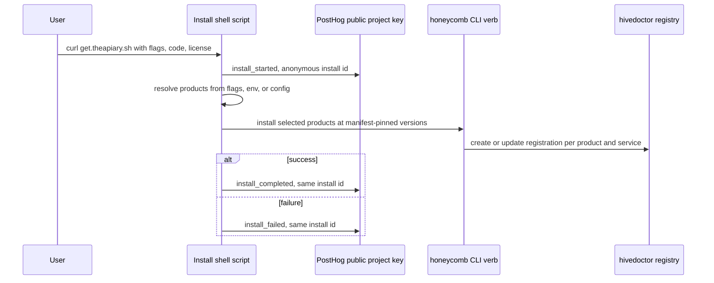

# ADR-0002, load products by flags and phone home from the install shell script

> **Status:** Active · **Date:** 2026-07-01
> **Supersedes:** none · **Refines:** [`ADR-0001`](./ADR-0001-hive-release-manifest-and-combined-release-train.md) (this ADR consumes the manifest that ADR-0001 pins)
> **Owners:** platform, honeycomb, hivedoctor
> **Related:** [`ADR-0001`](./ADR-0001-hive-release-manifest-and-combined-release-train.md), [`../../../requirements/backlog/prd-002-installer-product-loading-and-phone-home/prd-002-installer-product-loading-and-phone-home.md`](../../../requirements/backlog/prd-002-installer-product-loading-and-phone-home/prd-002-installer-product-loading-and-phone-home.md), [`../../../../hivedoctor/library/knowledge/private/architecture/ADR-0002-installer-owned-service-and-product-registry.md`](../../../../hivedoctor/library/knowledge/private/architecture/ADR-0002-installer-owned-service-and-product-registry.md)

## Context

The Apiary has one front door: `curl -fsSL https://get.theapiary.sh | sh` (and the PowerShell twin `install.ps1`). Today that installer (`honeycomb/scripts/install/install.sh`) is deliberately thin: it provisions Node, installs `@legioncodeinc/honeycomb` and `@legioncodeinc/hivedoctor`, and hands off to the `honeycomb install` CLI verb, which opens the-hive's URL. Two structural weaknesses have emerged.

First, **the installer has no product-selection model.** It always installs the same two products. There is no way for a user or a repo administrator to say "install honeycomb and the-hive but not hivenectar," "install with this profile," or "install against this license." As [`ADR-0001`](./ADR-0001-hive-release-manifest-and-combined-release-train.md) makes the-hive and hivenectar installable and pins a compatible set, the installer needs a real seam for choosing *which* products from that set to load and *how* to configure them. That seam is also the natural place a future licensing and product-code system would plug in, so it should be designed for that now rather than retrofitted later.

Second, **install-time telemetry does not work well today.** The `honeycomb_installed` event is fired from the Node CLI (`honeycomb/src/commands/install.ts`) after a successful install. That has three problems rolled into one: it depends on a build-time PostHog key baked into the Node package (so a keyless build sends nothing), it is fire-and-forget with no retry (a slow or failed hop is silently lost, intentionally not awaited so it never delays the installer), and it never fires at all when the install fails before the Node CLI runs or when the-hive/hivenectar are not installed. The result is that the single most important business event, "someone installed," is the least reliable one. A separate event, `honeycomb_first_link`, fires from the daemon on Deep Lake login (`honeycomb/src/daemon/runtime/auth/deeplake-issuer.ts`); that one is well-placed and is not in question here.

PostHog project API keys are safe to expose in client-side surfaces by design, which opens a more reliable transport than the Node build-time key. The install site (`honeycomb/site/install/`, deployed by `honeycomb/.github/workflows/deploy-install-site.yaml`) is a natural place to bake such a public key.

## Decision

**The installer selects products and configuration through flags (with codes and licenses as first-class inputs), and it phones home from the install shell script itself using a public PostHog key baked into the install site.**

### Product loading is flag-driven

- The single installer entry takes **flags** as its primary interface:
  - `--products=` selects the product set, e.g. `--products=honeycomb,thehive,hivenectar`.
  - `--profile=` selects a named configuration preset.
  - `--license=` / `--code=` pass a license key or a product code.
- A **product code** resolves at the install site to a product set plus configuration, so a short code can stand in for a longer flag combination.
- **Combo / alias URLs are optional sugar** that map to flag presets (for example a vanity path that expands to a fixed `--products=` set). They are a convenience layer over flags, never the primary mechanism.
- **Environment variables and a config file are supported** so a repo administrator can pin what to deploy and where, without editing the pasted command. Flags, env, and config resolve to the same internal selection.
- This flag set is the explicit **seam** for later serialization, product codes, configuration flags, and license keys. Designing it now means the licensing path is a fill-in, not a redesign.

The versions the installer loads for the selected products come from the hive release manifest of [`ADR-0001`](./ADR-0001-hive-release-manifest-and-combined-release-train.md); this ADR owns *selection and configuration*, ADR-0001 owns *which versions are compatible*.

### Registration is written on every lifecycle transition

- The installer **creates** a registration entry when it installs a product or service, and **updates** it on install, update, and deletion of a service or product. The installer writes hivedoctor's registry as the durable record of what is deployed on the machine. See hivedoctor [`ADR-0002`](../../../../hivedoctor/library/knowledge/private/architecture/ADR-0002-installer-owned-service-and-product-registry.md) for the registry contract this cross-references.

### Install telemetry is fired from the shell script

- The install-time PostHog **phone-home is fired from the install shell script itself** (`install.sh` / `install.ps1`), at **start** and at **completion or failure**.
- It uses a **public PostHog project key baked into the install site**, independent of the Node build-time key. Because PostHog project keys are safe client-side, this transport is legitimate and, crucially, present even when the Node build is keyless or the install aborts before the Node CLI runs.
- The script generates a **stable anonymous install id** so start and completion/failure events for one run correlate and repeat installs are distinguishable from first installs, without collecting identifying information.
- The existing daemon-side `honeycomb_first_link` login event **stays exactly where it is** (`honeycomb/src/daemon/runtime/auth/deeplake-issuer.ts`). This decision changes only the install-lifecycle event's transport, not the login event.

## Consequences

**Positive.**

- **Reliable install analytics.** Firing from the shell with a public key that is always present, at both start and terminal state, means the "installed" signal survives keyless Node builds and early failures, the exact cases where it is lost today. Start plus completion/failure also yields an install funnel and a real failure rate.
- **A clean path to licensing.** `--code=` and `--license=` exist from day one as resolvable inputs, so product codes, entitlement, and serialization can be layered on without reworking the installer interface.
- **Admin-configurable deployments.** Environment variables and a config file let an administrator standardize what and where the fleet installs across many machines, without handing each user a bespoke command line.
- **A single, honest deployment record.** Because registration is created and updated on every install, update, and deletion, hivedoctor's registry stays an accurate picture of the machine's fleet rather than a create-once snapshot.

**Negative.**

- **Telemetry logic now lives in two shell dialects.** The phone-home must be implemented and kept consistent across `install.sh` and `install.ps1`. This is accepted because the shell is the only layer guaranteed to run in every install path, including the failure paths the Node CLI never reaches.
- **A public key in the install site is a deliberate exposure.** It is safe by PostHog's design for project API keys, but it does mean the ingest endpoint for these events is public and could receive spoofed events. This is the standard trade for client-side product analytics and is acceptable for install-funnel counting.
- **More surface in the installer.** Flag parsing, code and config resolution, env and file precedence, and the anonymous-id lifecycle add logic to a script that was intentionally thin. The seam is worth the weight because it is where licensing and multi-machine deployment will land.

**Reversibility.** Moderate. The flag interface is additive over the current fixed behavior, so it can be narrowed without breaking existing pasted commands. The shell-fired telemetry can be reverted to Node-only firing, but doing so would reintroduce exactly the keyless, fire-and-forget, skipped-on-early-failure gaps this ADR exists to close, so reversal is unlikely to be desirable.

## Alternatives considered and rejected

### Product-combo URLs as the primary mechanism (REJECTED)

Make distinct vanity URLs (one per product combination) the main way users choose what to install. Rejected because URLs are far less composable than flags and cannot cleanly carry a resolvable code or license, and the combinatorial space of product sets and profiles would explode into an unmanageable set of URLs. Flags plus codes cover the same space compositionally; combo URLs are kept only as optional sugar that expands to flag presets.

### Flags only, with no codes or licenses (REJECTED)

Support `--products=` and `--profile=` but omit `--code=` and `--license=`. Rejected because a core intent of this decision is to build the licensing and product-code seam *now*. Adding codes and licenses later would mean reworking the installer interface and the site-side resolution a second time; designing them in from the start makes licensing a fill-in.

### Keep firing install telemetry only from the Node CLI (REJECTED)

Leave `honeycomb_installed` firing from `honeycomb/src/commands/install.ts` and try to harden it. Rejected because the Node-only transport is the root cause of today's unreliability: it depends on a build-time key that may be absent, it is fire-and-forget with no retry, and it cannot fire when the install fails before the CLI runs or when the selected products do not include the Node CLI at all. No amount of hardening inside the Node CLI reaches the pre-CLI failure paths; only the shell script does.

## References

- `honeycomb/scripts/install/install.sh` - the POSIX installer that gains flag parsing, code/license/config resolution, and the start and completion/failure phone-home.
- `honeycomb/scripts/install/install.ps1` - the PowerShell twin that must mirror the same product-loading and telemetry behavior.
- `honeycomb/site/install/` - the install surface where the public PostHog project key is baked; also where product codes and combo aliases resolve to flag presets.
- `honeycomb/.github/workflows/deploy-install-site.yaml` - deploys the install site to `get.theapiary.sh` (Cloudflare Pages).
- `honeycomb/src/commands/install.ts` - the Node CLI that fires `honeycomb_installed` today (the transport this ADR moves to the shell).
- `honeycomb/src/daemon/runtime/auth/deeplake-issuer.ts` - fires `honeycomb_first_link` on Deep Lake login; unchanged by this ADR.
- [`../../../../hivedoctor/library/knowledge/private/architecture/ADR-0002-installer-owned-service-and-product-registry.md`](../../../../hivedoctor/library/knowledge/private/architecture/ADR-0002-installer-owned-service-and-product-registry.md) - the hivedoctor registry the installer creates and updates on every product and service lifecycle transition.
- [`ADR-0001`](./ADR-0001-hive-release-manifest-and-combined-release-train.md) - the manifest that supplies the pinned versions this installer loads for the selected products.
- [`../../../requirements/backlog/prd-002-installer-product-loading-and-phone-home/prd-002-installer-product-loading-and-phone-home.md`](../../../requirements/backlog/prd-002-installer-product-loading-and-phone-home/prd-002-installer-product-loading-and-phone-home.md) - the forthcoming PRD specifying the flag grammar, code/license resolution, and the phone-home payloads.
