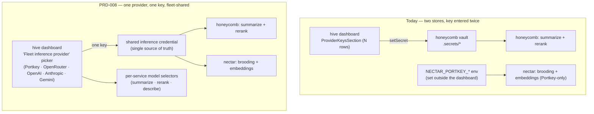

# PRD-008: Unified fleet inference credential — one provider, one key

> **Status:** Backlog
> **Priority:** P1 (the multi-key setup is a top onboarding-friction complaint; it makes the fleet feel like three products to configure instead of one)
> **Effort:** L
> **Schema changes:** None to any Deeplake catalog. Adds one catalog provider (`gemini`), one fleet-shared inference-credential read path, and per-service model settings (all `setting`-class scalars — additive).
> **Date:** 2026-07-12

---

## Overview

Product-owner complaint (2026-07-12): *"Why do we have so many places for API keys? You should be able to put one API key and select models for the various services, but one key should be sufficient for all."*

They are right, and the cause is architectural, not cosmetic. Today the fleet has **two independent inference-credential stores**, built per daemon:

1. **Honeycomb** (memory-formation summarization, recall rerank, inference) stores keys in its **encrypted vault**, written from the hive dashboard's `ProviderKeysSection` via `setSecret` — one secret per provider (`ANTHROPIC_API_KEY`, `OPENAI_API_KEY`, `OPENROUTER_API_KEY`, `COHERE_API_KEY`, `PORTKEY_API_KEY`), the on-disk `secret` class at `.secrets/<scope>/<name>` ([`honeycomb/src/daemon/runtime/vault/store.ts`](../../../../honeycomb/src/daemon/runtime/vault/catalog.ts)). Model choice is a single global `activeProvider` + `activeModel` setting ([`honeycomb/src/daemon/runtime/vault/api.ts`](../../../../honeycomb/src/daemon/runtime/vault/api.ts)).
2. **Nectar** (brooding = codebase-graph descriptions, and hosted embeddings) does **not** read that vault at all. It sources its key from **environment variables** — `NECTAR_PORTKEY_ENABLED` / `NECTAR_PORTKEY_API_KEY` / `NECTAR_PORTKEY_CONFIG` ([`nectar/src/brood-prereqs.ts`](../../../../nectar/src/brood-prereqs.ts)) — set outside the dashboard entirely, and it is **Portkey-only**.

So the *same* Portkey key must be entered **twice** (Honeycomb's vault via the dashboard, and Nectar's env vars), and the dashboard lists **one row per provider**, which reads as "fill in all of these" even though only the active provider's key is needed. Cohere appears too (rerank-only), deepening the "why so many keys?" confusion.

The pieces for the fix already exist. Portkey and OpenRouter are **gateways** — one key fronts many upstreams — and within Honeycomb a single Portkey config already serves both inference and rerank ([`transport-portkey.ts`](../../../../honeycomb/src/daemon/runtime/inference/transport-portkey.ts), [`rerank-portkey.ts`](../../../../honeycomb/src/daemon/runtime/recall/rerank-portkey.ts)). Honeycomb already has a single global active provider. What is missing is (a) a **shared** place to put one key so both daemons read it, (b) **Gemini** as a first-class choice, and (c) a **UI** that asks for one key and then lets you pick models per service.

PRD-008 makes the fleet's inference credential a single choice:

> **Pick one provider — Portkey, OpenRouter, OpenAI, Anthropic, or Gemini — enter its one key once, and the whole fleet uses it. Then choose models per service.**

Gateways (Portkey, OpenRouter) front other vendors' models; direct providers (OpenAI, Anthropic, Gemini) use their own. Either way it is **one key, one place**, and each service (memory summarization, recall rerank, codebase-graph descriptions) gets its own model selector drawing on that one credential.

### Where this changes the fleet

| Concern | Repo | Change |
|---|---|---|
| Add Gemini; make one provider/key the authoritative fleet inference selection; per-service model settings | honeycomb | [`prd-008a`](./prd-008a-unified-fleet-inference-credential-provider-catalog-and-gemini.md) |
| One shared credential both daemons read; Nectar sources the chosen provider/key from it (retiring `NECTAR_PORTKEY_*`-only); support direct providers, not just Portkey | nectar (+ honeycomb read surface) | [`prd-008b`](./prd-008b-unified-fleet-inference-credential-shared-store-and-nectar-sourcing.md) |
| Collapse the dashboard to one "fleet inference provider" picker + one key + per-service model selectors; rework the hive PRD-013a onboarding key step to ask for one key | hive | [`prd-008c`](./prd-008c-unified-fleet-inference-credential-single-key-dashboard-and-onboarding.md) |

---

## Sub-features

| Sub-PRD | Scope | Status |
|---|---|---|
| [`prd-008a-...-provider-catalog-and-gemini`](./prd-008a-unified-fleet-inference-credential-provider-catalog-and-gemini.md) | honeycomb: extend `PROVIDER_CATALOG` with `gemini` (direct) and its transport; make the fleet inference credential a single authoritative `{ provider, key }` selection with per-service model settings (`model.summarize`, `model.rerank`, `model.describe`); keep gateways (Portkey/OpenRouter) fronting others and direct providers using their own models | Draft |
| [`prd-008b-...-shared-store-and-nectar-sourcing`](./prd-008b-unified-fleet-inference-credential-shared-store-and-nectar-sourcing.md) | The single shared inference-credential source of truth and Nectar reading the chosen provider/key from it instead of `NECTAR_PORTKEY_*`-only env; Nectar gains non-Portkey (direct + OpenRouter) transport parity for brooding/describe so any picked provider works fleet-wide | Draft |
| [`prd-008c-...-single-key-dashboard-and-onboarding`](./prd-008c-unified-fleet-inference-credential-single-key-dashboard-and-onboarding.md) | hive: replace the N-row `ProviderKeysSection` with a single "fleet inference provider" picker + one write-only key field + per-service model selectors; rework the PRD-013a onboarding API-key step to ask for one key; honest presence/validation/fail-soft states | Draft |

---

## Goals

- **One key, one place.** A user picks exactly one inference provider (Portkey, OpenRouter, OpenAI, Anthropic, or Gemini), enters its single key once, and the whole fleet — Honeycomb summarization + rerank, Nectar brooding + embeddings — uses it. No key is ever entered in two places.
- **Model choice per service, under one credential.** After the one key, the user selects a model for each model-consuming service (summarization, rerank, codebase-graph descriptions); gateways expose free-form model ids, direct providers expose their curated lists.
- **Gemini is a first-class choice** alongside the existing four.
- **The dashboard stops implying you need many keys.** The N-row provider list is replaced by one provider picker + one key field; Cohere's rerank-only key stops reading as a required separate provider.
- **Retire the split-brain.** Nectar no longer requires `NECTAR_PORTKEY_*` env vars set by hand out-of-band; it reads the fleet selection. Existing env vars remain honored as an override for advanced/headless use (back-compat), but are no longer the primary path.
- **Beginner-legible and honest.** Presence, validation, and "which provider is active" are shown plainly; a missing/invalid key degrades honestly per the existing fail-soft posture, never a fabricated "configured".

## Non-Goals

- **No change to the Deeplake auth credential.** `~/.deeplake/credentials.json` (the device-flow identity, [`PRD-003`](../../completed/prd-003-fleet-lifecycle-login-and-uninstall/prd-003-fleet-lifecycle-login-and-uninstall-index.md)) is untouched; the *inference* credential is a distinct concern from the *identity* credential.
- **No multi-provider-at-once routing.** One active inference provider fleet-wide, not per-service providers. (A future "different provider per service" is explicitly deferred; the win here is one key.) Per-service **model** selection is in scope; per-service **provider** selection is not.
- **No embeddings-provider rework.** Embeddings are a **distinct layer** from inference and from rerank: the fleet uses **Nomic** (`nomic-embed-text-v1.5`, **768-dim**, local by default) to produce the `FLOAT4[768]` vectors the recall schema requires. This PRD does **not** touch the embedding model or dimension — the local-vs-hosted embeddings toggle ([`nectar/src/embeddings/config.ts`](../../../../nectar/src/embeddings/config.ts)) keeps its own control; when hosted embeddings are on they draw on the same shared credential, but the 768-dim Nomic default is unchanged. (Note: a Cohere *embeddings* model would be dimension-incompatible with the 768 schema — but Cohere is **not** an embeddings provider here; see the rerank clarification below.)
- **No secret read-back.** The write-only vault discipline is preserved (no `getSecret`); presence is names-only. Sharing the key with Nectar is a daemon-local read of the source of truth, never a browser-reachable value.
- **No new provider beyond Gemini.** Cohere stays a rerank-only key (or is folded into the gateway path); no other vendors are added here.
- **No team/hybrid mode changes.** Local-mode loopback only, like the rest of the vault/settings surface.

---

## Acceptance criteria (module-level)

| ID | Criterion |
|---|---|
| AC-1 | A user can select exactly one fleet inference provider from `{ portkey, openrouter, openai, anthropic, gemini }` and store its single key once; that one credential drives Honeycomb summarization + rerank and Nectar brooding + embeddings with no second entry anywhere ([`prd-008a`](./prd-008a-unified-fleet-inference-credential-provider-catalog-and-gemini.md), [`prd-008b`](./prd-008b-unified-fleet-inference-credential-shared-store-and-nectar-sourcing.md), [`prd-008c`](./prd-008c-unified-fleet-inference-credential-single-key-dashboard-and-onboarding.md)). |
| AC-2 | `gemini` is a first-class catalog provider with a curated model list and a working chat transport, selectable and validatable exactly like `anthropic`/`openai` ([`prd-008a`](./prd-008a-unified-fleet-inference-credential-provider-catalog-and-gemini.md)). |
| AC-3 | Each model-consuming service (summarization, rerank, codebase-graph descriptions) has its own model selector under the one provider; a gateway provider accepts free-form model ids, a direct provider validates against its curated list ([`prd-008a`](./prd-008a-unified-fleet-inference-credential-provider-catalog-and-gemini.md)). |
| AC-4 | Nectar reads the chosen provider + key from the shared source of truth and brood/describe works for any of the five providers (not only Portkey); `NECTAR_PORTKEY_*` env vars remain honored as an explicit override but are not required when the fleet selection is set ([`prd-008b`](./prd-008b-unified-fleet-inference-credential-shared-store-and-nectar-sourcing.md)). |
| AC-5 | The dashboard shows a single "fleet inference provider" picker + one write-only key field + per-service model selectors, replacing the N-row `ProviderKeysSection`; presence is names-only, the value is never echoed, and an empty value is rejected before any write ([`prd-008c`](./prd-008c-unified-fleet-inference-credential-single-key-dashboard-and-onboarding.md)). |
| AC-6 | The hive PRD-013a onboarding API-key step asks for **one** key (the chosen provider's), not a provider list; the memory-formation gate and dashboard checklist read the same single-credential "configured" signal ([`prd-008c`](./prd-008c-unified-fleet-inference-credential-single-key-dashboard-and-onboarding.md)). |
| AC-7 | A missing or invalid inference credential degrades honestly everywhere (memory formation shows "provider needed", brooding reports its dormancy reason, recall falls back), never a fabricated "configured" ([`prd-008a`](./prd-008a-unified-fleet-inference-credential-provider-catalog-and-gemini.md), [`prd-008b`](./prd-008b-unified-fleet-inference-credential-shared-store-and-nectar-sourcing.md)). |
| AC-8 | No inference key is stored in two places by any supported flow; a change to the fleet provider/key takes effect for both daemons (immediately or on the documented restart), with no hand-editing of env vars required ([`prd-008b`](./prd-008b-unified-fleet-inference-credential-shared-store-and-nectar-sourcing.md), [`prd-008c`](./prd-008c-unified-fleet-inference-credential-single-key-dashboard-and-onboarding.md)). |
| AC-9 | The dogfood protocol below passes on the owner's Windows machine. |

---

## Test plan: dogfood on the owner's Windows machine (primary acceptance path)

1. **Fresh install, reach setup.** Complete install + login + tenancy. Expected: the onboarding key step asks for a single provider + key, not a five-row list.
2. **Pick Gemini and enter one key.** Expected: Gemini is offered; the key saves write-only; no other key field is required.
3. **Verify both daemons use it.** Turn on memory formation and bind a project. Expected: Honeycomb summarization/rerank and Nectar brooding both operate against the single Gemini key with **no** `NECTAR_PORTKEY_*` env set anywhere on the machine.
4. **Per-service models.** In Settings, set a summarization model, a rerank model, and a describe model. Expected: each selector reflects Gemini's curated models; changes persist and are honored per service.
5. **Switch to a gateway.** Change the fleet provider to Portkey with one config/key. Expected: both daemons switch to Portkey; model fields accept free-form ids; still one key, one place.
6. **Confirm no second store.** Grep the machine for a second inference key entry. Expected: the key exists in exactly one source of truth; the dashboard shows presence names-only and never the value.
7. **Honest degradation.** Remove the key. Expected: memory formation shows "provider needed", brooding reports `portkey_disabled`/`credentials`-style dormancy honestly, recall falls back to lexical — no surface claims "configured".

---

## Decisions (confirmed 2026-07-12)

- **Source of truth → a dedicated fleet inference-credential file.** The one provider + key (and per-service models) live in a **dedicated fleet inference-credential file beside `~/.deeplake/credentials.json`**, read by every daemon. *Why (owner's choice):* symmetric with the identity credential both daemons already share, and simple for Nectar to read directly. *Implementation guardrails:* the file is a secret at rest — daemon-written, `0600`, loopback/daemon-local, **never** browser-reachable; the dashboard write path stays write-only with names-only presence (the browser POSTs the key, the daemon persists it to the file, and no read-back API exists). Route this through `security-worker-bee`, since it changes at-rest secret storage from the encrypted vault to a plaintext sibling file (matching the existing `~/.deeplake/credentials.json` posture).
- **Per-service models → three selectors.** `model.summarize`, `model.rerank`, `model.describe`, each falling back to `activeModel` when unset (zero migration for existing single-model configs). Plus the untouched embeddings toggle.
- **Nectar parity → full five-provider parity in first ship.** Nectar's brood/describe transport gains direct Anthropic/OpenAI/Gemini support **and** the gateways (Portkey/OpenRouter) in the first ship, so all five choices work fleet-wide on day one (no phasing). This is the largest single lift in the PRD and is called out as such in [`prd-008b`](./prd-008b-unified-fleet-inference-credential-shared-store-and-nectar-sourcing.md).
- **Cohere + rerank → retire the standalone Cohere key; route rerank through the chosen provider/gateway.** Clarification: **Cohere is a rerank provider, not embeddings** (the "Cohere-via-Portkey rerank seam", honeycomb PRD-063c). Rerank is cross-encoder scoring with **no** embedding-dimension constraint, so the 768-dim point does not apply to it — that constraint is the **embeddings** layer, which uses **Nomic (768-dim, local default)** and is out of scope here. Decision: drop the standalone Cohere key from the unified UI and route rerank through the selected provider/gateway (Portkey already fronts Cohere rerank); a user picking a gateway gets rerank for free, a direct-provider pick uses that provider's rerank (or falls back). Embeddings (Nomic) are untouched.
- **`NECTAR_PORTKEY_*` back-compat → kept as an override (judgment call).** The env vars remain honored as an explicit headless/advanced override, documented as secondary to the fleet-file selection, and are no longer required. *(This one was a reasonable default, not explicitly confirmed — flag if you'd rather remove them outright.)*

---

## Related

- Hive [`prd-013-guided-onboarding-setup`](../../../../hive/library/requirements/backlog/prd-013-guided-onboarding-setup/prd-013-guided-onboarding-setup-index.md) — the onboarding API-key step this PRD reshapes to ask for one key ([`prd-008c`](./prd-008c-unified-fleet-inference-credential-single-key-dashboard-and-onboarding.md)).
- [`honeycomb/src/daemon/runtime/vault/catalog.ts`](../../../../honeycomb/src/daemon/runtime/vault/catalog.ts) — `PROVIDER_CATALOG` / `PROVIDERS` (add `gemini`) and `isValidProviderModel`.
- [`honeycomb/src/daemon/runtime/vault/api.ts`](../../../../honeycomb/src/daemon/runtime/vault/api.ts) — `KNOWN_SETTING_KEYS` (`activeProvider`/`activeModel`/`portkey.*`), the settings write surface the per-service model keys extend.
- [`honeycomb/src/daemon/runtime/inference/transport-portkey.ts`](../../../../honeycomb/src/daemon/runtime/inference/transport-portkey.ts) and [`recall/rerank-portkey.ts`](../../../../honeycomb/src/daemon/runtime/recall/rerank-portkey.ts) — the gateway transports that already serve two services from one config.
- [`nectar/src/brood-prereqs.ts`](../../../../nectar/src/brood-prereqs.ts) — the `NECTAR_PORTKEY_*` env gate this PRD demotes from primary to override.
- [`nectar/src/portkey/transport.ts`](../../../../nectar/src/portkey/transport.ts) and [`nectar/src/embeddings/config.ts`](../../../../nectar/src/embeddings/config.ts) — Nectar's Portkey-only inference/embeddings paths that gain shared-credential sourcing + direct-provider parity.
- Hive dashboard [`ProviderKeysSection`](../../../../hive/src/dashboard/web/pages/settings.tsx) and [`PROVIDER_KEY_NAME`](../../../../hive/src/dashboard/web/panels.tsx) — the N-row UI collapsed to one picker.
- [`PRD-003 fleet lifecycle`](../../completed/prd-003-fleet-lifecycle-login-and-uninstall/prd-003-fleet-lifecycle-login-and-uninstall-index.md) — the "authentication is a hive concern when hive is present" precedent this PRD mirrors for the inference credential.
