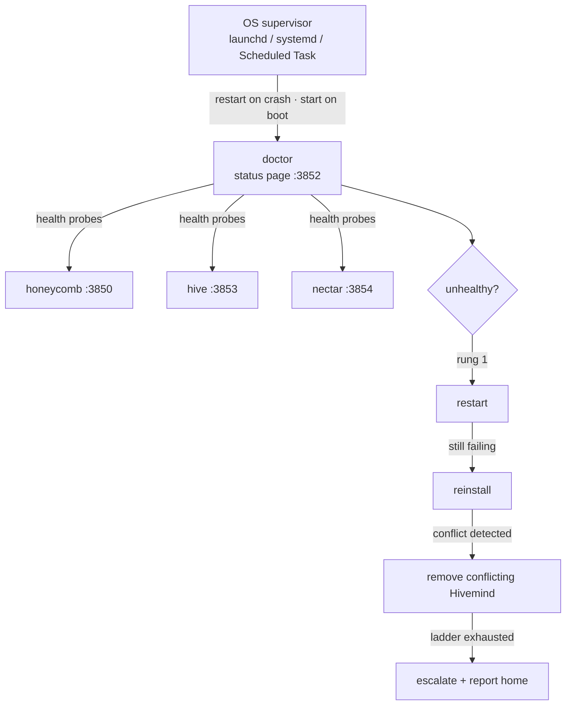
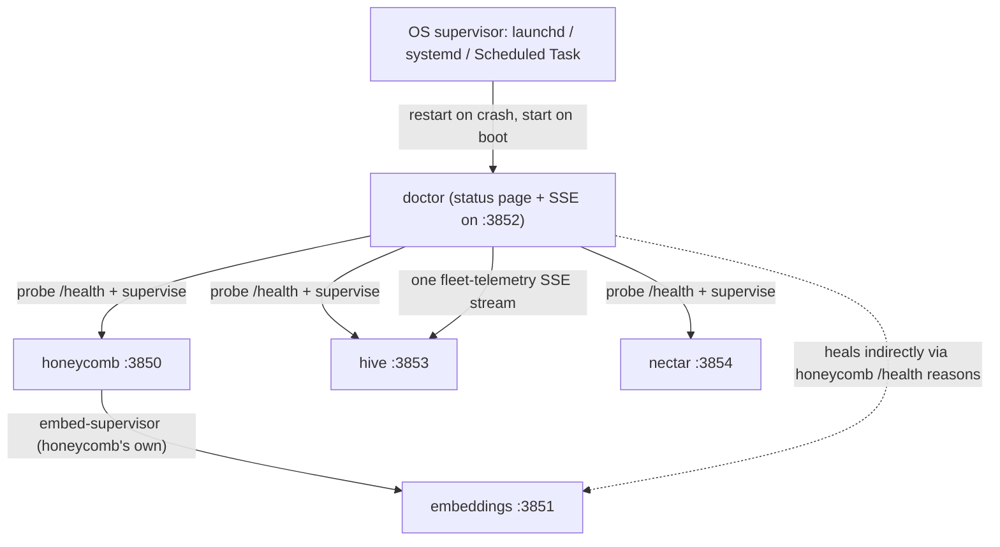
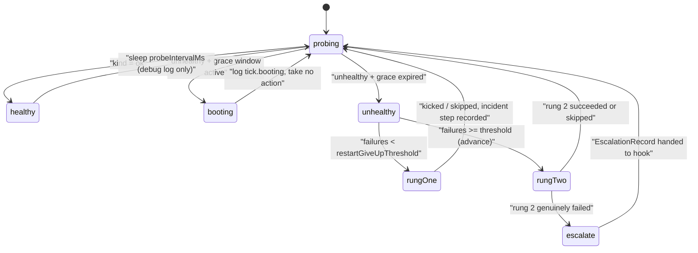
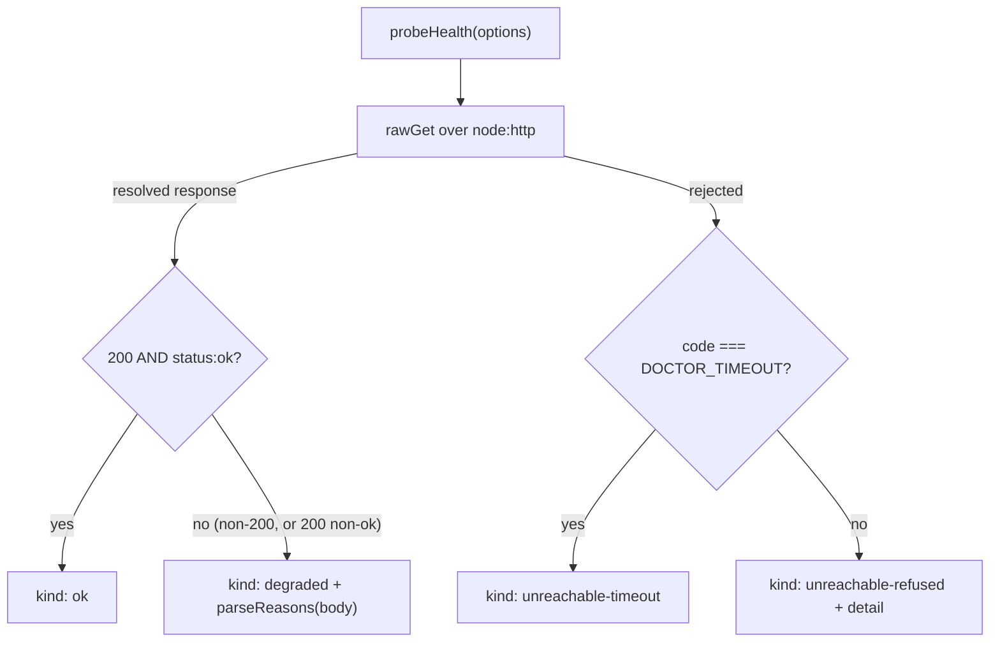
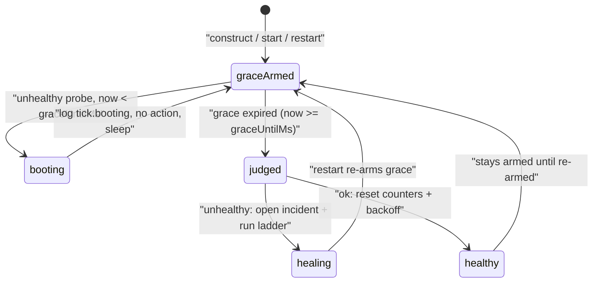
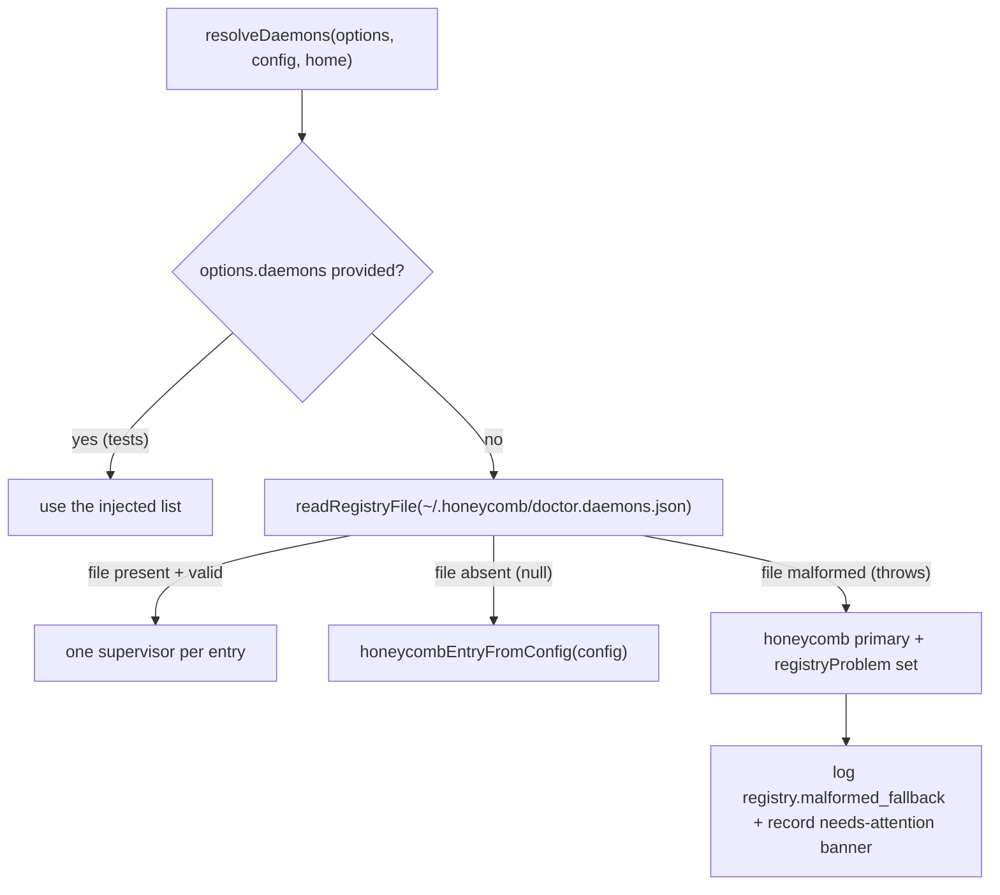
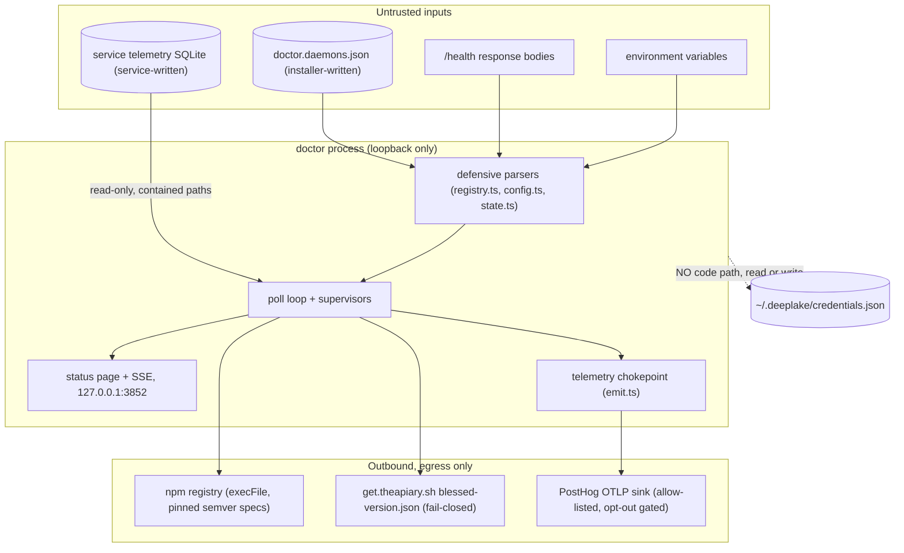
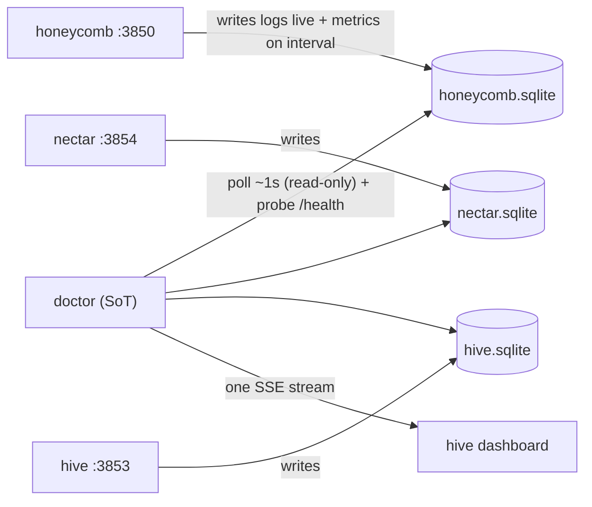
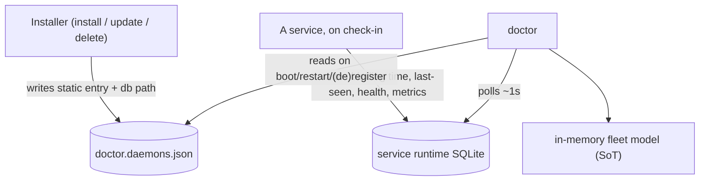

# Doctor: Technical Manual & Specification

*Architecture, supervision model, health classification, and trust boundaries for the Apiary watchdog.*

> **The Apiary** by Legion Code Inc., in collaboration with Activeloop.

## Foreword

Doctor is deliberately small and deliberately boring: zero dependencies, Node built-ins only, harder to kill than anything it watches. This manual is the engineering account of how that holds together. It covers the design principles, the supervision and remediation ladder, how health is probed and classified, the registry and state model, and where the trust boundaries are drawn. If you are extending Doctor or auditing it, start here.

## Doctor: Overview & Quickstart

### What makes Doctor different

Most watchdogs are either a cron job with delusions or a monitoring platform that needs its own monitoring. Doctor picked a harder lane:

- **Zero runtime dependencies.** Node built-ins only. There is no supply chain to compromise and no dependency that can take the watchdog down with it.
- **OS-supervised, not self-supervised.** launchd / systemd / Windows Scheduled Task restart it on crash and start it on boot. It never depends on the daemons it watches to stay alive, and they never depend on it.
- **An escalating repair ladder, not a blind restart loop.** It climbs restart, reinstall, remove-conflict, escalate, with exponential backoff between rungs, and stops the instant health returns.
- **Silent when healthy.** A green probe is a debug line. An unhealable install is a high-signal escalation. Nothing in between wastes your attention.
- **Never touches your credentials.** If it suspects a credential fault, it escalates instead of touching them. Full stop.

### Features

- ** Watches and heals.** Probes each daemon's `/health` on a fixed interval, reads per-subsystem detail, and repairs what it can without waking you up.
- ** Repair ladder with backoff.** Restart, then reinstall, then remove a conflicting `@deeplake/hivemind` global (the package only, never your `~/.deeplake/` data), then escalate. Exponential backoff between rungs; stops the moment health returns.
- ** Multi-daemon registry.** Supervises the whole fleet from a static registry at `~/.honeycomb/doctor.daemons.json`: honeycomb, hive, and nectar. A daemon that is down is still supervised, because "should exist" survives independently of "is running."
- ** Status endpoint on `:3852`.** A loopback status page plus machine-readable `/status.json`, so you can see the whole fleet's health in one place.
- ** Blessed-release auto-update with rollback.** Keeps daemons current behind a blessed-version gate: verify health after the update, roll back on failure.
- ** Opt-out scrubbed telemetry.** When it genuinely cannot heal, it phones home a scrubbed diagnosis so problems get fixed proactively. Never credentials, tokens, or your code. Opt out with `DO_NOT_TRACK=1`, `HONEYCOMB_TELEMETRY=0`, or the dashboard.

### Install (one command)

You almost never install Doctor by hand. The Apiary stack installer sets it up and registers its OS service automatically (opt out with `--no-doctor`):

```bash
# macOS / Linux
curl -fsSL https://get.theapiary.sh | sh
```

```powershell
# Windows (PowerShell)
irm https://get.theapiary.sh/install.ps1 | iex
```

To install or update it on its own:

```bash
npm install -g @legioncodeinc/doctor
doctor install-service   # register the OS service (restart-on-crash, start-on-boot)
```

Prefer to build from source?

```bash
git clone https://github.com/legioncodeinc/doctor.git
cd doctor
npm install            # dev deps only; the shipped package has zero runtime deps
npm run typecheck
npm run test
npm run build          # tsc + esbuild -> the single-file bin at bundle/cli.js
```

`npm run ci` runs the typecheck + test gate. `npm run pack:check` verifies the publish payload before a cut.

### Using the dashboard

The dashboard is **Hive portal at `http://127.0.0.1:3853`**: fleet health lives there, rendered from the data Doctor feeds it. Behind it, Doctor serves its own raw status surface on loopback at **`http://127.0.0.1:3852`**, the authoritative source of truth: every registered daemon's state (`ok`, `degraded`, `unreachable`, or `unknown`), what Doctor last did about it, and whether anything needs your attention. The same data is machine-readable at **`/status.json`**. When something is unhealable, the "needs attention" report surfaces here first, on your machine, before anything leaves it.

### Using the CLI

Run `doctor` with no arguments for the banner and menu. The full surface:

| Command | What it does |
|---|---|
| `doctor status` | daemon health, service state, versions, last heal, opt-out flags |
| `doctor diagnose` | classify health and print the recommended fix, taking **no** action |
| `doctor heal` | run the remediation ladder once (gated steps confirm first) |
| `doctor restart` | restart the primary daemon (rung 1) |
| `doctor reinstall` | reinstall the primary daemon (rung 2) |
| `doctor uninstall-hivemind` | remove a conflicting `@deeplake/hivemind` global (rung 3, confirms) |
| `doctor update [--check]` | update the primary daemon via the blessed gate |
| `doctor self-update` | update Doctor's own package (the **only** thing that does) |
| `doctor install-service` / `uninstall-service` | register or remove the OS service |
| `doctor logs` | tail incident logs for all daemons, or one via `--daemon ` |

Doctor never updates itself in the background. `self-update` is the single, explicit way to bump it, and there is deliberately no `clear-credentials` command: credential purges are only ever recommended via escalation, never automated.

### Kill it. Watch it come back.

Do not take our word for it. Shoot the daemon and watch:

```bash
# Kill the honeycomb daemon on purpose…
pkill -f honeycomb

# …give the doctor one probe interval, then check
doctor status
# honeycomb    ok    healed 12s ago (rung 1: restart)
```

That is the whole pitch: the failure happened, the fix happened, and you were never on the hook for either.

### How it works

The OS supervises the doctor; the doctor supervises everything else. Health flows in through probes, repairs flow out through the ladder, and nothing shares a failure domain with what it watches.



Per-daemon supervision knobs (probe interval, startup grace, restart give-up threshold, cooldown) live in the registry, and every probe URL is pinned to loopback as defense in depth. Repairs back off exponentially and stop the instant health returns.

### Why this matters

A daemon you cannot see is a daemon you cannot trust. Your agents' memory is infrastructure now, and the difference between a demo and infrastructure is not the happy path. It is what happens when it breaks at 2am with nobody watching.

Trust is not a feeling here, it is a mechanism. You trust the stack because something dumber, smaller, and tougher than the stack is standing watch over it, because that something is restarted by your operating system rather than by hope, and because when it fails to heal a machine it says so loudly instead of quietly rotting. Doctor is built to be boring in exactly the way load-bearing things should be boring.

And when it truly cannot fix something, it does not shrug. It writes a structured report, surfaces it on the local status page, and (unless you opt out) sends the scrubbed diagnosis to the maintainers, so the fix ships before the support thread starts.

### Other interfaces

- **Status page.** `http://127.0.0.1:3852` on loopback, human-readable fleet health at a glance.
- **`GET /status.json`.** The same fleet model as JSON, for scripts and anything else that wants machine-readable truth.
- **SSE telemetry feed.** Doctor is the single source of truth for fleet health and telemetry: it polls each service's local SQLite telemetry (read-only, via Node's built-in `node:sqlite`) plus `/health`, merges the results, and streams one Server-Sent-Events feed to [hive](https://theapiary.sh) portal, which renders the live health rail and readiness screens.

No MCP server, no SDK, no inbound ports beyond the loopback status page. That is by design: the watchdog's attack surface stays as small as its dependency tree.

 Status & Roadmap

Doctor is **production ready (v0.2.x)** and versions independently of the rest of the stack. Its full PRD program has shipped and been tested in live scenarios: multi-daemon registry supervision, the repair ladder with exponential backoff, OS service registration on macOS, Linux, and Windows, the blessed-update gate with verify-and-rollback, the `:3852` status page plus machine-readable `/status.json`, and scrubbed escalation telemetry. The richer telemetry pipeline is shipped too: per-service SQLite ingestion with the poll-and-merge loop, and the single SSE feed the Hive portal renders as its live health rail. Vote on what comes next at **[ideas.theapiary.sh](https://ideas.theapiary.sh)**.

### Development

Self-contained: its own `tsconfig.json` and `vitest.config.ts`, independent of the repo-root gates.

```bash
npm install          # dev deps only
npm run typecheck    # tsc --noEmit
npm run test         # vitest run
npm run ci           # typecheck + test, the gate every change must pass
npm run build        # tsc + esbuild -> the single-file bin at bundle/cli.js
npm run pack:check   # verify the publish payload
```

The build inlines the package version at bundle time: esbuild reads `package.json` and defines `__DOCTOR_VERSION__`, so the shipped binary always reports exactly what was cut. One manifest is the single source of truth; there is no cross-manifest sync to run.

### Credits

- **[Activeloop](https://activeloop.ai/)** brings **[Deeplake](https://deeplake.ai/)** (the versioned, multi-modal database for AI with native vector + columnar indexing and hybrid search) and **[Hivemind](https://github.com/activeloopai/hivemind)**, the open-source agent-memory project Honeycomb is built upon.
- **[Legion Code Inc](https://github.com/legioncodeinc)** brings the **multi-tier memory system** (Tier 1 / 2 / 3 keys, summaries, raw), **code base atlas memory architecture**, **auto healing service**, **session priming**, **automatic skill development & propagation**, the **pollinating loop**, the **knowledge graph**, **cross device cross repository cross team skill sharing**, and the daemon architecture that turns Deeplake into a shared brain your coding agents read and write on every turn.

### License

Doctor is licensed under the **GNU Affero General Public License v3.0 or later** (AGPL-3.0-or-later).

Use it commercially or privately, free of charge. In return: keep the copyright and license notices intact, and if you modify it, your changes ship under the same AGPL license with source available. The "Affero" part is the point: run a modified version as a network service and you owe its source to the users who interact with it. No locking a fork behind a SaaS wall.

© 2026 Legion Code Inc.

  Built by Legion Code Inc · Powered by <a href="https://deep

## System Overview: Why Doctor Exists

Read this first if you are new to the doctor repo: it explains why the watchdog exists, the four principles every module obeys, the fleet it supervises, and where the code came from.

### The problem: who restarts the restarter

The Apiary's memory daemon dies at 2am and nothing notices. The user finds out the next morning, one session in, when their agent has forgotten a codebase it knew yesterday. Honeycomb already had internal supervision (its embed-supervisor restarts the embeddings child), but nothing supervised honeycomb itself, and nothing supervised the supervisor either. Every self-monitoring scheme eventually hits the same wall: the monitor shares a failure domain with the thing it monitors.

Doctor is the answer to that wall, and it is deliberate about where it draws the line. Doctor supervises the workload fleet. The operating system supervises doctor. launchd, systemd, or a Windows Scheduled Task restarts doctor on crash and starts it on boot, so doctor never depends on anything it watches to stay alive, and nothing it watches depends on doctor to run. Doctor is Mario Aldayuz's answer to that specific design problem in The Apiary: the stack needed one process dumber, smaller, and tougher than everything else, standing outside every failure domain it observes.

### The four design principles

Every module in `src/` cites these by number in its header comments. They are not aspirations; they are enforced shapes.

**1. Incapable of crashing.** The runtime is Node built-ins only, zero npm dependencies (`package.json` declares none; `esbuild.config.mjs` externalizes only `node:*`). There is no zod, no HTTP client, no CLI framework. Every external action sits behind an injected seam that resolves a value instead of throwing. Failures are values: a failed probe is a classification, a failed write is a logged loss, a thrown rung is a failed `RungResult`. `installCrashNet` in `src/supervisor.ts` adds the last-resort `uncaughtException` and `unhandledRejection` net on top. Losing an incident line is strictly better than crashing the watchdog that is trying to heal the box.

**2. OS-supervised, never self-supervised.** `src/service/` registers doctor with the platform's native service manager (`com.legioncode.doctor`), user scope by default, with restart-on-crash and start-on-boot encoded in the unit templates. Doctor does not have a "restart myself" code path; it does not need one.

**3. Targeted repair, not a blind restart loop.** The health probe classifies into four kinds (`ok`, `degraded` with per-subsystem reasons, `unreachable-refused`, `unreachable-timeout`), and the remediation ladder climbs restart, reinstall, remove-conflicting-package, escalate, with geometric backoff between attempts and a hard stop the moment health returns. A green probe is a debug log line. An unhealable install is a high-signal escalation. Nothing in between wastes attention.

**4. Never touch credentials, and be honest about telemetry.** There is no code path anywhere in doctor that reads, writes, or deletes `~/.deeplake/credentials.json`. A suspected credential fault escalates with `recommendedAction: "clear-credentials"` and a `wouldHaveTaken` note describing the action doctor deliberately did not take. All outbound telemetry flows through one chokepoint (`src/telemetry/emit.ts`) with allow-list scrubbing and layered opt-out gates (`DO_NOT_TRACK=1`, `HONEYCOMB_TELEMETRY=0`).

### Fleet topology

Doctor reads a static registry at `~/.honeycomb/doctor.daemons.json` and spawns one independent supervisor per entry. The known workload daemons are honeycomb (`:3850`), hive (`:3853`), and nectar (`:3854`). The embeddings child (`:3851`) is honeycomb's own supervised process; doctor observes it indirectly through honeycomb's `/health` reasons and heals it by healing honeycomb. Doctor serves its own loopback status page on `:3852`, which also carries the single SSE telemetry stream hive renders.



A daemon that is down is still supervised: the static "should exist" entry survives independently of "is running", which is the whole point of the two-layer registration model in ADR-0002. When the registry file is absent, doctor falls back to supervising the honeycomb primary at built-in defaults. When the file is present but malformed, doctor does not crash-loop; it falls back to the honeycomb primary, logs `registry.malformed_fallback`, and records a needs-attention banner so an operator fixes the file instead of running silently degraded (`resolveDaemons` in `src/compose/index.ts`).

### What runs inside the process

`createDoctor()` in `src/compose/index.ts` is the composition root. One process arms:

- one supervisor watch loop per registered daemon (probe, classify, heal via the ladder, persist per-daemon state shards),
- the telemetry poll-and-merge loop (about once per second, read-only SQLite plus `/health`, per ADR-0001),
- the single SSE producer mounted at `GET /events` on the status page,
- the 30-minute jittered auto-update poll loop for the primary daemon, behind the blessed-version gate,
- the hourly install-health telemetry heartbeat,
- the loopback status page on `:3852`.

Everything is armed fail-soft: `start()` never throws, a bind conflict on `:3852` is swallowed and logged, and `stop()` disarms every loop idempotently.

### The zero-dependency commitment

The commitment is structural, not stylistic. A watchdog with a supply chain can be taken down by its supply chain, and a dependency that crashes takes the can't-crash process with it. So:

- HTTP probing is `node:http` (`src/health-probe.ts`), not fetch wrappers or clients.
- SQLite reads are `node:sqlite`'s `DatabaseSync` (`src/telemetry/sqlite-reader.ts`), the same built-in honeycomb already relies on, opened read-only.
- Validation is hand-rolled defensive coercion in `src/config.ts`, `src/registry.ts`, and `src/state.ts`. A malformed env var or registry field falls back to its default; it never throws.
- The CLI is a hand-rolled dispatcher over a single-sourced command table (`src/cli/command-table.ts`).
- Shell-outs go through `execFile` with argv arrays, never a shell (`src/rungs/command-runner.ts`).

The published package's `dependencies` field does not exist. `devDependencies` (TypeScript, esbuild, vitest) never ship.

### Module map

Where each responsibility lives, so you land in the right file first:

| Area | Files |
|---|---|
| Config resolution and defaults | `src/config.ts` |
| Daemon registry parse + containment | `src/registry.ts`, `src/safe-path.ts` |
| Health probe + classification | `src/health-probe.ts` |
| Watch loop + crash net | `src/supervisor.ts` |
| Repair ladder + rung 1 | `src/remediation.ts` |
| Rungs 2/3 + escalation + command runner | `src/rungs/` |
| Backoff machine | `src/backoff.ts` |
| Durable state + incidents | `src/state.ts`, `src/incidents.ts` |
| Escalation stores and hosted sink | `src/escalation/` |
| Telemetry ingestion (poll loop, SSE) | `src/ingestion/`, `src/telemetry/schema.ts`, `src/telemetry/sqlite-reader.ts` |
| Outbound telemetry chokepoint | `src/telemetry/emit.ts`, `src/telemetry/otlp-serializer.ts` |
| Status page | `src/status-page/server.ts` |
| Auto-update engine + blessed channel | `src/update/` |
| OS service registration | `src/service/` |
| CLI | `src/cli/` |
| Production assembly | `src/compose/index.ts` |

### Provenance

Doctor was designed and built by Mario Aldayuz. It started life as an embedded `doctor/` folder inside the honeycomb repository, specced by honeycomb's PRD-064 program ("Doctor: Self-Healing Watchdog Daemon", still tracked in honeycomb's `library/requirements/in-work/prd-064-doctor-self-healing-watchdog/` with follow-ups PRD-065 go-live and PRD-067 boot-grace in honeycomb's backlog). It was extracted into this standalone repository as its own npm package, `@legioncodeinc/doctor`, versioned independently of the honeycomb package (PRD-063 OD-6). In July 2026, fleet-wide naming decision #32 (2026-07-02, recorded in nectar's `library/requirements/PRD-DECISIONS-AND-DEFAULTS.md`) renamed the product from hivedoctor to doctor: the OS service label is `com.legioncode.doctor`, the systemd unit is `doctor.service`, and the Windows task is `doctor`. Every install best-effort deregisters the legacy `com.legioncode.hivedoctor`, `hivedoctor.service`, and `HiveDoctor` units so a migrated box never runs two watchdogs racing over one daemon (`src/service/platform.ts`, `src/service/argv.ts`).

The registry-driven multi-daemon supervision arrived via nectar's PRD-004a, and the telemetry single-source-of-truth role arrived via this repo's own ADR-0001/ADR-0002 and PRD-001/PRD-002, pinned as fleet-wide Contracts A, B, and C in the-apiary's `library/ledger/EXECUTION_LEDGER.md`.

### Where to go next

- How the watch loop, ladder, and backoff actually behave: supervision-and-remediation.md, then the deep dives on health probe classification, backoff and restart policy, and the remediation rungs
- How the whole process is assembled from one function: composition-root.md
- The engineering patterns that make can't-crash possible: ../standards/zero-dependency-engineering.md
- How telemetry flows from services through doctor to hive: telemetry-single-source-of-truth.md, then the ingestion pipeline, the SSE producer, and outbound telemetry and privacy
- The give-up surface and the auto-update engine: escalation and needs-attention and the auto-update engine
- Every on-disk file doctor reads or writes, with full schemas: ../data/registry-and-state.md
- Operating it day to day: ../operations/status-page-and-cli.md and ../operations/os-service-registration.md
- How it builds, ships, and updates: ../infrastructure/build-and-release.md
- What it trusts and what it refuses to: ../security/trust-boundaries.md

## Supervision And Remediation

For engineers working on the watch loop, health classification, the repair ladder, backoff, or incident records: this is how doctor decides a daemon is sick and what it does about it. The whole path is shipped and exercised in live scenarios; kill a daemon and it is typically back inside one probe interval.

### One supervisor per daemon

`createDoctor()` builds one fully independent supervisor per registry entry (`buildDaemon` in `src/compose/index.ts`). Each daemon gets its own probe bound to its `healthUrl`, its own restart rung reading its own `pidPath` with an entry-local cooldown clock, its own backoff machine, its own ladder with its own `restartGiveUpThreshold`, and its own state and incident shards (`state-.json`, `incidents-.ndjson`). Nothing about nectar's crash loop can contaminate honeycomb's remediation state.

The loop cadence and windows come from the registry entry, defaulting to the values in `src/config.ts` `DEFAULTS`: probe every 30s (`probeIntervalMs: 30_000`), 2s per-probe timeout (`probeTimeoutMs: 2_000`), 60s startup grace (`startupGraceMs: 60_000`), give up on restarts after 3 consecutive failures (`restartGiveUpThreshold: 3`), 5s post-restart cooldown (`restartCooldownMs: 5_000`), backoff floor 1s and ceiling 30s (`backoffFloorMs` / `backoffCeilingMs`).

### The tick

`Supervisor.tick()` in `src/supervisor.ts` is the whole algorithm: probe, classify, and either rest or heal. The clock and every I/O action are injected, so tests step the loop deterministically with fake timers.



On a healthy tick the loop logs `tick.healthy` at debug and, only if there is something to reset (a non-zero failure count, a non-zero backoff rung, or a previous non-ok health), writes state back with `consecutiveRestartFailures: 0`, `backoffRung: 0`, `currentRung: 1`, and a fresh `lastHealAt`. Reset-on-healthy is what makes the ladder stop the instant health returns.

On an unhealthy tick past the grace window, the loop opens an incident episode, asks the ladder to decide a rung, runs it, records the step, persists state, and writes the episode. The whole tick sits inside try/catch: a thrown heal path logs `tick.heal_threw`, routes to the error-telemetry seam, and the loop survives to the next tick.

### The four health kinds

`probeHealth` in `src/health-probe.ts` issues one bounded `GET` over `node:http` and never throws. It resolves exactly one of four classifications:

```typescript
export type HealthClassification =
	| { readonly kind: "ok" }
	| { readonly kind: "degraded"; readonly reasons: ProbeHealthReasons }
	| { readonly kind: "unreachable-refused"; readonly detail: string }
	| { readonly kind: "unreachable-timeout" };
```

- `ok`: HTTP 200 with a JSON body whose top-level `status` is `"ok"`.
- `degraded`: the daemon answered but not cleanly (non-200, or 200 with a non-ok status). Carries the per-subsystem `reasons` (`storage`, `embeddings`, `schema`) parsed defensively from the body; a non-JSON body still classifies degraded, just without detail.
- `unreachable-refused`: the connection was refused, reset, or failed DNS. The daemon is down. Restart it.
- `unreachable-timeout`: the socket accepted but never answered within `probeTimeoutMs`. The daemon is wedged, which is a different disease than dead (the memory_jobs-backlog failure mode PRD-064a exists to fix).

The refused-versus-timeout distinction is load-bearing: it flows into the incident trigger (`unreachable` vs `timeout` via `triggerForClassification` in `src/incidents.ts`) and into what an operator reads on the status page. The response body is buffered to a hard cap (256 chunks) so a misbehaving endpoint streaming megabytes cannot exhaust memory.

### Startup grace

A daemon that was just started deserves time to boot before the watchdog judges it. Each supervisor arms a grace window of `startupGraceMs` (default 60s) at construction, at `start()`, and again whenever rung 1 kicks a restart. During the window an unhealthy probe logs `tick.booting` with the remaining ms and takes no action. The auto-update engine also re-arms the primary supervisor's grace after a successful post-update restart (PRD-067), so a fresh binary is never punished for a slow boot.

### The repair ladder

`createRemediationLadder` in `src/remediation.ts` holds the rung registry and the pure `decide()` function: fewer than `restartGiveUpThreshold` consecutive failed restarts means rung 1; at or past the threshold it advances to rung 2. The composition root registers rungs 1, 2, and 3 for every daemon's ladder (`rungs: [entryRestartRung, reinstallRung, uninstallRung]` in `src/compose/index.ts`). Escalation is the terminal hand-off, not a numbered rung.

**Rung 1: restart (`src/remediation.ts` `createRestartRung`).** Two guards run before anything happens. Guard one: if doctor restarted this daemon within `restartCooldownMs` (default 5s), skip with `detail: "cooldown"`, so doctor never fights the daemon's own restart helper. Guard two: if the PID/lock file names a process and `/health` answers, skip with `detail: "lock-held-and-healthy"`, because starting a second daemon would just hit the single-instance lock and exit. Otherwise run the injected `RestartFn` and start the cooldown. A deliberate skip never counts toward the give-up threshold; a genuine failure increments `consecutiveRestartFailures` and advances backoff. The production composition injects the OS-service restart into this seam, so a killed daemon is kicked back to life through the same launchd, systemd, or Scheduled Task registration doctor installed. The default fallback (used only by a bare assembly with no restart function injected, as in tests) logs `compose.restart_no_os_service` and returns `false`, an honest failure that drives the ladder toward escalation rather than a fake success.

**Rung 2: reinstall the primary (`src/rungs/reinstall.ts`).** Fires after 3 consecutive failed restarts. It resolves the blessed version fail-soft (live channel first, static fallback, empty string tolerated), short-circuits to a skip if the installed version already matches the blessed one, acquires the shared install lock so it can never race the auto-update engine, then runs `npm install -g @legioncodeinc/honeycomb` through the execFile runner and verifies against the globally-installed package version (not `/health`, which cannot be trusted while the daemon is sick). With no blessed version known it still reinstalls but reports `unverified-no-blessed` instead of failing: a missing CDN object never blocks a repair.

**Rung 3: uninstall a conflicting Hivemind global (`src/rungs/uninstall-hivemind.ts`).** Honeycomb and `@deeplake/hivemind` cannot run side by side. Detection first (`npm ls -g @deeplake/hivemind --depth 0`); nothing detected means a safe idempotent skip. Before removal it appends a timestamped backup record to `removed-packages.ndjson` in doctor's workspace; if that record cannot be written, the destructive step is skipped rather than performed unrecorded. The one hard boundary: rung 3 removes the npm package only and has literally no code path that touches `~/.deeplake/`. In the automated loop `decide()` only ever selects rungs 1 and 2; rung 3 runs when targeted directly (the `doctor uninstall-hivemind` CLI verb, or `heal` when the decision routes there).

**Escalation (terminal, `src/rungs/escalation.ts`).** When an advanced rung genuinely fails (not a skip, not a success), the supervisor builds an `EscalationRecord`: a plain-language diagnosis, the ordered steps attempted with outcomes, a `recommendedAction`, and, for deferred actions, a `wouldHaveTaken` note. The record goes to the injected escalation hook crash-safely; a throwing sink becomes a failed step, never a process death. For the honeycomb primary the hook writes `needs-attention.json` (the dashboard read seam) and emits to the hosted PostHog sink; for every other daemon the escalation lives in its own incident shard plus the hosted sink, deliberately not the shared file, so nectar's give-up can never overwrite honeycomb's banner. `clear-credentials` is only ever a recommendation; there is no purge code anywhere.

### Backoff

`createBackoff` in `src/backoff.ts` is a pure state machine: delay is `floorMs * 2^rung`, clamped to `ceilingMs` before jitter, then multiplied by a symmetric jitter factor in `[0.8, 1.2]` (jitter 0.2 by default) so a fleet that flapped together does not stampede the daemon in lockstep. Defaults: floor 1s, ceiling 30s. The backoff rung (geometric step count) is distinct from the remediation rung (which repair runs) and is persisted to the state shard, so a reboot does not reset a crash loop's memory. A confirmed healthy tick resets it to zero.

### Incident episodes

Every unhealthy tick past grace produces one `Incident` line in the daemon's incident shard (`src/incidents.ts`): a UUID id, `openedAt`/`closedAt`, the trigger (`unreachable` | `timeout` | `degraded` | `unknown`), the health kind and degraded reasons at trigger time, the ordered steps with outcomes (`succeeded` | `failed` | `skipped`), and `resolved`. The file is append-only NDJSON, capped at 5 MiB with a single-generation rotation to `.ndjson.1`. A failed append is swallowed and logged: the healing matters more than the record of it.

### A worked incident

Kill honeycomb (`pkill -f honeycomb`) and watch one episode end to end:

1. Next tick (within 30s): the probe's socket is refused. Classification `unreachable-refused`, grace long expired, log `tick.unhealthy`.
2. The loop opens an incident with trigger `unreachable` and asks the ladder: 0 consecutive failures, so rung 1.
3. Rung 1 guards pass (no recent restart, no live lock), the restart fn kicks the OS service, `markRestarted` starts the 5s cooldown, the grace window re-arms for 60s, and the step `{ rung: 1, action: "restart-daemon", outcome: "succeeded" }` is recorded. State persists `lastRestartAt`; the episode is written.
4. Next tick: the daemon is still booting, probe says refused, but grace is active, so the loop logs `tick.booting` and does nothing. No incident, no double restart.
5. Two ticks later: `/health` answers `{ status: "ok" }`. The loop resets failures and backoff to zero, stamps `lastHealAt`, and goes quiet. `doctor status` now shows the heal; the status page shows `ok`.

Had the restart failed three ticks running, `decide()` would have advanced to rung 2, the reinstall would have run under the install lock, and a genuine rung 2 failure would have produced an escalation record on the status page, in `needs-attention.json`, and (unless opted out) at the hosted sink.

### Invariants for contributors

Touching this path means preserving these, and the test suite asserts most of them:

- A rung MUST resolve a `RungResult`, never throw; the ladder wraps it anyway, but a throw is a bug.
- A deliberate skip never counts toward the give-up threshold. Only a genuine failed restart increments `consecutiveRestartFailures`.
- Health is confirmed on the NEXT probe, never assumed from a kicked restart; failure counters reset only on a confirmed `ok`.
- Every timer and clock is injected. New time-dependent behavior takes a `clock`/`now` seam or it will be untestable and flaky.
- The error-telemetry seam (`onError`) is fire-and-forget and fail-soft; it must ne

## Health Probe Classification

For engineers working on `src/health-probe.ts` or anything that reads a probe result: this is how doctor turns one HTTP GET into exactly one of four classifications, why the four kinds exist, and how both the supervisor and the telemetry poll loop consume them.

### Why four kinds and not a boolean

A watchdog that only knows "up" or "down" restarts everything the same way, which is the blind-restart loop doctor's third design principle exists to reject. The information that makes remediation targeted lives in the difference between the failure modes: a daemon that refused the connection is a different disease than one that accepted the socket and then went silent, and both differ from one that answered with a specific subsystem broken. `probeHealth` in `src/health-probe.ts` preserves that difference by resolving one of four mutually exclusive classifications:

```typescript
export type HealthClassification =
	| { readonly kind: "ok" }
	| { readonly kind: "degraded"; readonly reasons: ProbeHealthReasons }
	| { readonly kind: "unreachable-refused"; readonly detail: string }
	| { readonly kind: "unreachable-timeout" };
```

The type is the contract. Every downstream consumer (the supervisor's `tick`, the incident trigger mapping, the telemetry poll loop's health merge, the status page) reads `classification.kind` and nothing else has to guess.

### The probe never throws

`probeHealth` is a total function: every input, including a hard transport failure, maps to a classification. This is what lets the watch loop always make a decision and continue. The design principle is stated in the module header itself:

> The probe NEVER throws - any error resolves to a classification, so the loop can always continue.

That totality is load-bearing for crash-safety. The supervisor still wraps the call in try/catch (`tick.probe_threw` routes to the error-telemetry seam), but that guard is defense in depth against a test seam override, not the primary defense. In production `probeHealth` cannot throw, because every path inside it either resolves a classification or is caught.

### Node built-ins only: the transport

The probe issues one bounded `GET` over `node:http`'s `request`, not `fetch`, not an HTTP client, not a wrapper. This is design principle 1 (zero runtime dependencies) made concrete at the transport layer. `rawGet` builds the request, buffers the response, and resolves a small `RawResponse`:

```typescript
interface RawResponse {
	readonly statusCode: number;
	readonly body: string;
}
```

Two hardening details ride on `rawGet`, and both matter more than they look:

**Bounded body buffering.** The response body is accumulated chunk by chunk, but the accumulator refuses to grow past a hard cap:

```typescript
if (chunks.length < 256) chunks.push(chunk);
```

A `/health` endpoint that starts streaming megabytes (whether by bug or by malice) cannot exhaust memory in the process whose entire job is to not crash. The comment on that line reads "64 KiB is far more than /health needs", and it is: a health body is a few hundred bytes.

**A tagged timeout.** The distinction between refused and wedged (see below) depends on being able to tell a socket-level failure from a never-answered socket. `rawGet` arms `req.setTimeout` and, when it fires, destroys the request with an error carrying a stable code:

```typescript
req.setTimeout(timeoutMs, () => {
	req.destroy(Object.assign(new Error("probe_timeout"), { code: "DOCTOR_TIMEOUT" }));
});
```

The classifier keys off `code === "DOCTOR_TIMEOUT"` to route to `unreachable-timeout`, so a wedged socket is never mistaken for a refused connection.

### The classification decision

`probeHealth` awaits `rawGet` and applies a small total mapping:



- **`ok`** requires both HTTP 200 and a JSON body whose top-level `status` field reads `"ok"` (`isStatusOk`). A 200 with any other status is not ok.
- **`degraded`** is the answered-but-not-clean bucket: a non-200 response, or a 200 whose `status` is not `"ok"`. It carries `reasons` parsed defensively from the body. A body that is not JSON, or is JSON without a `reasons` object, still classifies degraded, just with an empty reasons object: the daemon answered, so it is not unreachable, but it is not clean either.
- **`unreachable-timeout`** is the tagged-abort path: the socket was accepted but no response arrived within `timeoutMs`. The daemon is alive but wedged.
- **`unreachable-refused`** is every other transport failure (connection refused, reset, DNS failure). It carries a `detail` string, preferring the error's `code` when present so an operator sees `ECONNREFUSED` rather than a message.

### Parsing subsystem reasons, defensively

When the daemon answers degraded, the body may carry per-subsystem detail mirroring the daemon's own `HealthReasons` shape:

```typescript
export interface ProbeHealthReasons {
	readonly storage?: string;
	readonly embeddings?: string;
	readonly schema?: string;
}
```

`parseReasons` extracts these three fields and nothing else. It is deliberately paranoid: a `null` parse, a non-object body, a missing `reasons` key, or a non-object `reasons` value all resolve to `{}` rather than throwing. Only string-typed subsystem values survive; anything else becomes `undefined`. The three subsystems are the daemon's `storage` (Deeplake reachability), `embeddings` (the embed seam state), and `schema` (required-table presence). These are the same three subsystems the status page and incident records surface, and they are what a `degraded` incident carries in its `healthReasons` field so an operator reading `doctor logs` sees which subsystem opened the episode.

### How the two loops consume a classification

The classification feeds two independent consumers, and it means slightly different things to each.

**The supervisor** (`src/supervisor.ts`) maps the kind to a coarse persisted health via `coarseHealth` (`ok` stays `ok`, `degraded` stays `degraded`, both `unreachable-*` collapse to `unreachable`) and to an incident trigger via `triggerForClassification` in `src/incidents.ts`:

| Classification kind | Incident trigger | Coarse state |
|---|---|---|
| `ok` | (never opens an incident) | `ok` |
| `degraded` | `degraded` | `degraded` |
| `unreachable-refused` | `unreachable` | `unreachable` |
| `unreachable-timeout` | `timeout` | `unreachable` |

The refused-versus-timeout distinction survives all the way into the incident trigger, so `doctor logs` shows `timeout` for a wedged daemon and `unreachable` for a dead one. That trigger is the operator's hint that the box hit a backlog wedge rather than a crash. The full remediation flow that follows is in supervision-and-remediation.md.

**The telemetry poll loop** (`src/ingestion/poll-loop.ts`) calls the same probe per entry through its injected `probe` seam and collapses the classification into the fleet-visible vocabulary with `classifyProbe`: `ok` to `ok`, `degraded` to `degraded`, and both unreachable kinds to `unreachable`. That coarse health then merges with the service's own SQLite `service_status.health` and its `last_seen` staleness to produce one `FleetHealth` per service. The poll loop's own re-catch (`poll-loop.probe_threw`) is, again, defense in depth against an injected seam that throws, since the real `probeHealth` cannot. The merge rules are documented in telemetry-single-source-of-truth.md.

### The probe is injected everywhere it is used

Nothing in doctor calls `probeHealth` on a hard-coded URL in the hot path. The composition root builds a per-entry probe bound to each daemon's `healthUrl` and `config.probeTimeoutMs`, and passes it as a seam to both the supervisor and the telemetry loop (`buildDaemon` and `telemetryProbe` in `src/compose/index.ts`). A single injected `options.probe` overrides both at once, which is how the whole assembly stays hermetic under test: no test ever opens a real socket. The `healthUrl` itself is not trusted input; it is coerced to a loopback host at registry-parse time (`coerceHealthUrl`), the SSRF gate documented in ../security/trust-boundaries.md.

### Invariants for contributors

- `probeHealth` MUST remain total: every new failure path resolves a classification, never throws.
- The body buffer cap MUST stay bounded. A new parse path that reads the whole body without a cap reintroduces the memory-exhaustion vector.
- The timeout MUST stay tagged (`DOCTOR_TIMEOUT`) so the refused-versus-timeout distinction survives. Removing the tag collapses two failure modes into one and blinds the incident trigger.
- `parseReasons` MUST stay defensive: a hostile or malformed body degrades to an empty reasons object, never a throw.
- New consumers read `classification.kind`; they do not re-probe or re-derive health from raw HTTP.

## Backoff And Restart Policy

For engineers touching `src/backoff.ts`, the restart rung, or the give-up-and-advance logic: this is the geometric backoff machine, how startup grace interacts with it, and the exact counters that carry a crash loop's memory across doctor's own restarts.

### Two rungs that are easy to confuse

There are two independent counters in doctor's remediation, and keeping them separate is the first thing to understand. The **remediation rung** is which repair action runs: rung 1 is restart, rung 2 is reinstall, rung 3 is uninstall-conflicting-package. The **backoff rung** is a geometric step count that governs how long doctor waits between attempts. They live in different modules (`src/remediation.ts` versus `src/backoff.ts`), advance on different events, and are persisted as different fields (`currentRung` and `consecutiveRestartFailures` versus `backoffRung` in `src/state.ts`). This doc is about the backoff rung and the restart policy that drives it; the remediation rungs are in remediation-rungs-deep-dive.md.

### The backoff machine is pure

`createBackoff` in `src/backoff.ts` is a pure value object: no timers, no I/O, no clock. It computes the next delay and advances or resets an integer rung. The supervisor owns the actual sleeping and the persistence; the machine only does arithmetic, which is what makes it trivially testable with a seeded RNG.

```typescript
export interface Backoff {
	readonly rung: number;
	delayMs(): number;
	advance(): number;
	reset(): void;
}
```

The delay for the current rung is `floorMs * 2^rung`, clamped to `ceilingMs` before jitter, then multiplied by a symmetric jitter factor:

```typescript
const factor = rung >= 30 ? ceiling / floor : 2 ** rung;
const base = clamp(floor * factor, floor, ceiling);
const jittered = base * (1 - jitter + random() * (2 * jitter));
return Math.round(clamp(jittered, floor, ceiling));
```

Three details are deliberate:

- **The `rung >= 30` guard** prevents `2 ** rung` from overflowing into a meaningless huge number on a box that has been crash-looping for a very long time. Past rung 30 the base is simply pinned at the ceiling ratio, which is where the clamp would land it anyway.
- **The clamp happens before jitter**, so the jitter band is centered on the clamped value rather than on an unclamped exponential that would then be truncated. A rung at the ceiling still jitters symmetrically around the ceiling, not below it.
- **Jitter is symmetric and multiplicative**, a factor in `[1 - jitter, 1 + jitter]` (default jitter 0.2, so `[0.8, 1.2]`). This is the anti-stampede: a fleet of boxes that all flapped at the same moment do not retry in lockstep and hammer the daemon (or npm, at higher rungs) simultaneously.

The defaults come from `src/config.ts` `DEFAULTS`: floor 1s (`backoffFloorMs`), ceiling 30s (`backoffCeilingMs`). Config resolution normalizes an inverted pair (a ceiling below the floor clamps up to the floor) so a fat-fingered `DOCTOR_BACKOFF_CEILING_MS` can never produce a negative or inverted delay.

### The rung survives a reboot

The backoff rung is persisted to the daemon's state shard (`backoffRung` in `state-.json`) precisely so that doctor restarting does not reset a crash loop's memory. The machine rehydrates from `initialRung` at construction. This is the difference between doctor's backoff and the daemon's own embed-supervisor, which uses a fixed in-memory `restartBackoffMs`: doctor generalizes it to a geometric schedule with a persisted rung, so a box that has failed to restart honeycomb ten times in a row does not forget that history when doctor itself is restarted by launchd.

A confirmed healthy tick resets the rung to zero. That reset is what makes the ladder and the backoff stop the instant health returns.

### The restart give-up counter

Separate from the backoff rung is `consecutiveRestartFailures`, the counter that decides when the ladder advances off rung 1. It is not a backoff concept; it is the remediation ladder's give-up threshold. But the two advance together on a genuine failed restart, so they are worth reading side by side. From `heal` in `src/supervisor.ts`, on a restart that genuinely failed (not a skip, not a success):

```typescript
deps.backoff.advance();
return {
	...state,
	consecutiveRestartFailures: state.consecutiveRestartFailures + 1,
	backoffRung: deps.backoff.rung,
};
```

Both increment on the same event. `consecutiveRestartFailures` drives the ladder's `decide()`: at or past `restartGiveUpThreshold` (default 3, per-daemon `restartGiveUpThreshold`), the ladder advances to rung 2. `backoffRung` drives how long the next attempt waits. A deliberate skip (cooldown, or lock-held-and-healthy) increments neither: only a genuine failed restart counts toward the give-up threshold, which is the rule that keeps doctor from advancing to a reinstall just because it correctly declined to double-restart a daemon that was already fine.

### Startup grace: the window before judgment

A daemon that was just started deserves time to boot before the watchdog judges it dead. Each supervisor arms a grace window of `startupGraceMs` (default 60s) at three moments, tracked as an absolute deadline `graceUntilMs` in `src/supervisor.ts`:

1. at construction (`armStartupGrace()` runs once in the factory),
2. at every `start()`,
3. whenever rung 1 kicks a restart (the `heal` path calls `armStartupGrace(now)` on a successful restart).

During the window an unhealthy probe logs `tick.booting` with the remaining ms and takes no action at all: no incident, no restart, no backoff advance.



There is a fourth arming point that lives outside the supervisor: the auto-update engine re-arms the primary supervisor's grace after a successful post-update restart (`restartDaemon` in `src/compose/index.ts` calls `primary.supervisor.armStartupGrace()`). A freshly installed binary is never punished for a slow first boot, which is the boot-grace concern honeycomb's PRD-067 exists to cover.

### The full restart-attempt lifecycle

Putting the counters and the grace window together, one restart attempt over the ladder and backoff looks like this:

1. **Probe unhealthy, grace expired.** The loop opens an incident and asks the ladder for a rung. With `consecutiveRestartFailures` below threshold, that is rung 1 (restart).
2. **Rung 1 guards.** If doctor restarted this daemon within `restartCooldownMs` (default 5s), or if the PID lock is held and `/health` answers, rung 1 skips. A skip touches no counter and advances no backoff. Otherwise it runs the injected restart.
3. **Genuine failure.** `consecutiveRestartFailures` and `backoffRung` both increment. The persisted state carries both across doctor restarts.
4. **Next tick.** After the probe-interval sleep, the loop probes again. Health is confirmed on the next probe, never assumed from a kicked restart.
5. **Threshold reached.** Once `consecutiveRestartFailures` hits `restartGiveUpThreshold`, `decide()` advances to rung 2 (reinstall), and a genuine rung-2 failure escalates.
6. **Health returns.** A confirmed `ok` tick resets `consecutiveRestartFailures` to 0, `backoffRung` to 0, `currentRung` to 1, and stamps `lastHealAt`. Both memories are wiped together.

Note that the backoff `delayMs()` is a computed value the supervisor can consult, but the primary loop cadence between healthy ticks is the fixed `probeIntervalMs` (default 30s); the geometric delay governs the spacing of failed restart retries, and the persisted `backoffRung` is what makes that spacing survive a reboot rather than resetting to the floor.

### Invariants for contributors

- The backoff machine stays pure. New time-dependent behavior takes a clock/RNG seam or it is untestable.
- The `rung >= 30` overflow guard stays. Removing it lets `2 ** rung` produce `Infinity` on a long crash loop.
- Clamp before jitter. Jittering an unclamped exponential and then clamping loses the symmetric band.
- A deliberate skip increments neither `consecutiveRestartFailures` nor `backoffRung`. Only a genuine failed restart does.
- Both counters reset only on a confirmed `ok` probe, never on a kicked restart.
- Startup grace is per-daemon and absolute-deadline based. New restart paths that start a daemon must re-arm the grace, or the very next tick will judge the booting daemon dead.

## The Composition Root

For engineers reading `src/compose/index.ts`: this is how `createDoctor()` assembles the whole watchdog from wave-built primitives, the fallback ladder that resolves which daemons to supervise, why every external action is an injected seam, and how `start()` and `stop()` stay fail-soft.

### One function builds the whole process

`createDoctor()` in `src/compose/index.ts` is the composition root: the single place every collaborator is constructed and wired together, returning a `{ start, stop }` handle the OS service execs. Everything the running process does is armed here. One `createDoctor()` call builds:

- one independent supervisor watch loop per registered daemon (probe, classify, heal via the ladder, persist per-daemon state and incident shards),
- the escalation hook wired to both the local needs-attention store and the hosted PostHog sink,
- the telemetry poll-and-merge loop feeding the `/events` SSE stream,
- the auto-update poll loop, gated on the resolved opt-out precedence,
- the hourly install-health telemetry heartbeat,
- the loopback status page on `:3852`.

The reason a single composition root exists, rather than each subsystem wiring itself, is testability and fail-soft discipline: every external action lives behind an injected seam with a production default, so the smoke test drives the entire assembly hermetically (no real sockets, no real npm, no real network), and every seam that could throw is replaced by one that resolves a value.

### Resolving which daemons to supervise

The first real decision `createDoctor()` makes is which daemons to supervise, and it is a three-step fallback ladder (`resolveDaemons`) that never crashes the boot path:



The three postures are all deliberate:

- **File absent.** `readRegistryFile` returns `null` and the root falls back to a single honeycomb entry derived from the resolved config, which preserves any `DOCTOR_*` env overrides (`honeycombEntryFromConfig`) rather than dropping to bare defaults.
- **File present and valid.** One supervisor per entry, in registry order, with the honeycomb primary listed first.
- **File present but malformed.** `readRegistryFile` throws `RegistryError`; `resolveDaemons` catches it, falls back to the honeycomb primary, and returns a `registryProblem` string. The root surfaces that as a loud `registry.malformed_fallback` log plus a needs-attention banner recommending manual intervention.

The malformed-file case is the load-bearing one. Throwing out of `createDoctor()` would exit the process, and the OS service unit's restart policy (launchd `KeepAlive`, systemd `Restart=always`) would restart doctor straight back into the same parse failure: a crash loop. The fallback refuses to hand the OS supervisor that crash loop.

### One supervisor per daemon, fully independent

`buildDaemon` constructs one fully independent supervisor per entry. Each daemon gets its own probe bound to its `healthUrl`, its own state and incident shards keyed by name (`state-.json`, `incidents-.ndjson`), its own restart rung reading its own `pidPath` with an entry-local `lastRestartAt` clock, its own backoff, and its own ladder with its own `restartGiveUpThreshold`. Nothing about one daemon's crash loop can contaminate another's remediation state:

```typescript
let entryLastRestartAt: number | null = null;
const entryRestartRung = createRestartRung({
	restart,
	readDaemonPid: () => readDaemonPid(entry.pidPath),
	isHealthy: entryIsHealthy,
	cooldownMs: entry.restartCooldownMs,
	clock,
	lastRestartAt: () => entryLastRestartAt,
	markRestarted: (at: number) => { entryLastRestartAt = at; },
});
```

The higher rungs (reinstall, uninstall) act on the primary honeycomb package regardless of which daemon triggered them, so they are stateless factories built once and shared across every entry's ladder. Only rung 1 is per-daemon, because only rung 1 reads a daemon-specific PID path and cooldown.

The primary (the first entry) backs the process-global surfaces: the exposed `supervisor`/`ladder`, the status page's top-level health, the install-health snapshot, and the auto-update restart re-arm. The exposed `supervisors` and `ladders` arrays let a test step each daemon's loop independently.

### Why every external action is injectable

`CreateDoctorOptions` is a long list of optional seams, and the pattern is uniform: each has a production default, and each can be overridden. The reason is stated plainly in the module header: "all I/O behind seams so the smoke test drives the whole assembly hermetic." The seams that matter most:

| Seam | Production default | Why it is injectable |
|---|---|---|
| `probe` | `probeHealth` over `config.healthUrl` | one override governs both supervisor and telemetry health |
| `restart` | the OS-service restart wired via the service integration | a bare assembly falls back to a logged no-op returning `false` |
| `runner` | `createExecFileRunner` (execFile, no shell) | rungs 2/3 and auto-update never touch real npm in tests |
| `readDaemonPid` | reads the pid file from disk | tests assert the lock-held guard against a recorded path |
| `blessedChannel` | the real CDN fetch over global fetch | tests pass a recorder fetch so no real HTTP runs |
| `openTelemetryDb` | the real read-only `node:sqlite` reader | tests inject a fixture reader |
| `emitDeps` | the build-injected PostHog key + global fetch | tests inject a recorder so nothing is posted |
| `clock` | the real wall-clock (timers + `Date.now`) | tests step time deterministically |

The `restart` seam deserves note: in production it kicks the daemon back to life through the OS service registration doctor installed, so a killed daemon returns without an operator. When no restart function is injected (a bare assembly, as in tests), it falls back to a logged no-op that returns `false` (`compose.restart_no_os_service`), an honest failure that drives the ladder toward escalation rather than a fake success. That same `restart` seam is forwarded to the update engine's `restartDaemon`, which re-arms the primary supervisor's startup grace on a successful restart.

### The self-update boundary is sacred here

The composition wires the auto-update engine hard-coded to the primary daemon package, `@legioncodeinc/honeycomb`. There is no code path in `createDoctor()` that installs `@legioncodeinc/doctor`; doctor updating itself is reachable only through the explicit CLI `self-update` command. This is enforced by construction, not by convention: the composition simply never constructs a self-update seam. See ../operations/auto-update-engine.md.

### The escalation hook and per-daemon isolation

The escalation hook the ladder calls on give-up is built per entry by `buildEscalationHookFor`, and it encodes a subtle isolation rule:

```typescript
const buildEscalationHookFor = (entryName: string): EscalationHook => {
	return async (record): Promise<void> => {
		if (entryName === "honeycomb") {
			needsAttention.record(record);
		}
		await hostedEscalation(record);
	};
};
```

Only the honeycomb primary writes the shared `needs-attention.json` file (the honeycomb dashboard's read seam). Every other daemon's escalation is durably recorded in its own `incidents-.ndjson` shard, read back by `readPerDaemonEscalation` for the status page row. If every entry wrote the shared file, one daemon giving up (say nectar) would overwrite honeycomb's dashboard banner. The hosted PostHog sink fires for every entry regardless, because a give-up on any daemon is useful signal. The full escalation surface is in ../operations/escalation-and-needs-attention.md.

### Fail-soft start and idempotent stop

`start()` arms everything and never throws. The order matters: the crash net is installed first, so anything thrown during wiring or boot is caught. Then the status page starts best-effort (a bind failure is swallowed inside `start()` already). Then each loop's `start()` is called but not awaited, because each loop's promise resolves only when stopped; the root holds the promises and lets `stop()` resolve them. Every held promise gets a `void run.catch(...)` that logs an unexpected rejection without rethrowing.

```typescript
supervisorRuns = built.map((b) => b.supervisor.start());
pollRun = pollLoop.start();
telemetryPollRun = telemetryPollLoop.start();
installHealthStopped = false;
installHealthRun = runInstallHealthLoop();
```

`stop()` is idempotent and disarms everything: every supervisor loop, the update poll loop, the telemetry poll loop (plus `telemetryPollLoop.close()` to release every open SQLite handle so a stopped watchdog never holds a service's database file open), the install-health heartbeat, and the status page. It then `Promise.allSettled`s every held run promise so the loops unwind their final iteration, and removes the crash net last. The install-health loop is the one loop the composition owns directly rather than delegating: it emits one snapshot immediately on arm, then every `installHealthIntervalMs`, each emit fail-soft so a telemetry heartbeat can never wedge the loop.

### The shared install lock and device id

Two process-global resources are built once and shared. The install lock (`src/install-lock.ts`) serializes rung 2's reinstall against the auto-update engine so two `npm i -g` operations never interleave. The device id (`safeResolveDeviceId` wrapping `resolveDeviceId`) is the shared per-install UUID read from or minted into `~/.honeycomb/device.json`, stamped on every telemetry record and escalation so doctor and the daemon correlate to one install. Both resolve fail-soft: the lock returns `null` when held rather than throwing, and the device-id resolution has an `"unknown-device"` last-resort net for the impossible case that resolution throws.

### Invariants for contributors

- `createDoctor()` never throws. A new subsystem that can fail on construction gets a fail-soft wrapper or an injected default.
- `resolveDaemons` never throws out of boot. A malformed registry falls back and surfaces a banner; it does not crash-loop.
- Per-daemon state stays in per-daemon shards. Only the honeycomb primary writes the shared `needs-attention.json`.
- The auto-update engine stays hard-wired to the primary package. Nothing in the composition installs `@legioncodeinc/doctor`.
- `stop()` releases

## Registry And State: Every File Doctor Reads Or Writes

The complete on-disk data reference: the daemon registry schema with every field, default, and coercion rule, doctor's own state files, the incident streams, and the full telemetry SQLite DDL.

### The filesystem map

Everything lives under `~/.honeycomb/`:

| Path | Writer | Reader | Purpose |
|---|---|---|---|
| `~/.honeycomb/doctor.daemons.json` | installer | doctor | Static supervision registry (Contract A) |
| `~/.honeycomb/daemon.pid` | honeycomb daemon | doctor | Primary PID/lock file rung 1 respects |
| `~/.honeycomb/telemetry/.sqlite` | each service | doctor (read-only) | Runtime telemetry (Contract B) |
| `~/.honeycomb/doctor/state.json` | doctor | doctor | Legacy/process-global state (lifecycle dedupe markers) |
| `~/.honeycomb/doctor/state-.json` | doctor | doctor | Per-daemon remediation state shard |
| `~/.honeycomb/doctor/incidents.ndjson` | doctor | doctor, `doctor logs` | Process-global incident/escalation stream |
| `~/.honeycomb/doctor/incidents-.ndjson` | doctor | doctor, `doctor logs --daemon` | Per-daemon incident shard |
| `~/.honeycomb/doctor/needs-attention.json` | doctor | honeycomb dashboard, status page | Latest primary escalation (read seam) |
| `~/.honeycomb/doctor/removed-packages.ndjson` | doctor (rung 3) | humans | Backup record of removed conflicting packages |
| `~/.honeycomb/doctor/launchd.out.log`, `launchd.err.log` | launchd | humans | macOS service stdout/stderr |

The workspace dir defaults to `~/.honeycomb/doctor` and is overridable with `DOCTOR_WORKSPACE_DIR`. Every fixed filename is joined under the workspace through `resolveInBase` (`src/safe-path.ts`) so no composed path can escape it.

### doctor.daemons.json

The root shape is a JSON object with a non-empty `daemons` array. Parsed by `readRegistryFile` in `src/registry.ts`, hand-validated with built-ins only.

```json
{
  "daemons": [
    {
      "name": "honeycomb",
      "healthUrl": "http://127.0.0.1:3850/health",
      "pidPath": "~/.honeycomb/daemon.pid",
      "probeIntervalMs": 30000,
      "startupGraceMs": 60000,
      "restartGiveUpThreshold": 3,
      "restartCooldownMs": 5000,
      "telemetryDbPath": "~/.honeycomb/telemetry/honeycomb.sqlite"
    }
  ]
}
```

#### Field-by-field rules

| Field | Type | Required | Default | Coercion rule |
|---|---|---|---|---|
| `name` | string | YES | none | Must match `/^[a-zA-Z0-9][a-zA-Z0-9_-]*$/` (filename-safe; it keys the state and incident shards). Missing or garbage name throws `RegistryError`: fail loud, this is the one non-defaultable field. |
| `healthUrl` | string | no | `http://127.0.0.1:3850/health` | Must parse as http/https AND resolve to a loopback host (`127.0.0.1`, `localhost`, `::1`, `[::1]`). Anything else, including a perfectly valid non-loopback URL, silently falls back to the default. This is the SSRF gate. |
| `pidPath` | string | no | `~/.honeycomb/daemon.pid` | Non-empty string, leading `~` expanded to the home dir. Garbage falls back. |
| `probeIntervalMs` | integer | no | `30000` | Positive integer or the default. |
| `startupGraceMs` | integer | no | `60000` | Positive integer or the default. |
| `restartGiveUpThreshold` | integer | no | `3` | Positive integer or the default. |
| `restartCooldownMs` | integer | no | `5000` | Non-negative integer (0 is legal) or the default. |
| `telemetryDbPath` | string | optional | absent | `~` expanded, must be ABSOLUTE post-expansion (a relative path is rejected outright because it would anchor to whatever cwd the process happens to have), then resolved and asserted to live under `~/.honeycomb/telemetry/` via `assertWithinBase`. Any escape, relative path, or garbage degrades to absent, which means health-probe-only. Never a crash, never a silently honored escape. |

The known daemon names are `honeycomb`, `hive`, and `nectar` (`KNOWN_DAEMON_NAMES`), but parsing is permissive: any filename-safe token loads.

#### Failure postures, both deliberate

- **File absent:** `readRegistryFile` returns `null`; `loadRegistry`/`resolveDaemons` falls back to a single honeycomb entry. The compose-root fallback (`honeycombEntryFromConfig`) preserves env overrides from `resolveConfig`, so a missing registry does not drop your `DOCTOR_*` tuning.
- **File present but malformed** (unparseable JSON, wrong root shape, empty `daemons`, bad `name`): the parser throws `RegistryError`, and the composition root catches it (`resolveDaemons` in `src/compose/index.ts`), falls back to the honeycomb primary, logs `registry.malformed_fallback`, and records a needs-attention escalation recommending manual intervention. Throwing out of boot would hand the OS supervisor a crash loop; this path refuses to.

The `telemetryDbPath` containment is the fix from the security review of the telemetry ingestion work (commit `ad2174a`): without it, a poisoned registry could point doctor's read-only poller at any user-readable SQLite file and leak Contract-B-shaped contents over the unauthenticated loopback `/events` stream.

### state.json and state-\.json

`src/state.ts`. One shard per supervised daemon (`state-honeycomb.json`, `state-nectar.json`, ...); the un-suffixed `state.json` remains as the process-global store used for lifecycle telemetry dedupe markers.

```typescript
export interface DoctorState {
	readonly version: 1;
	readonly lastKnownHealth: "ok" | "degraded" | "unreachable" | "unknown";
	readonly currentRung: number;                 // 1 = restart
	readonly consecutiveRestartFailures: number;  // drives the give-up-after-3 advance
	readonly backoffRung: number;                 // geometric step count, survives reboots
	readonly lastHealAt: string | null;           // ISO-8601 of last confirmed return to healthy
	readonly lastRestartAt: string | null;        // ISO-8601 of last doctor-performed restart (cooldown)
	readonly installedEventReported?: boolean;            // doctor_installed dedupe marker
	readonly updatedEventReportedVersion?: string;        // doctor_updated per-version dedupe marker
}
```

Defaults (`DEFAULT_STATE`): `lastKnownHealth: "unknown"`, `currentRung: 1`, counters 0, timestamps null. Reads are total: a missing file, unreadable dir, or garbage JSON yields `DEFAULT_STATE`, and a partially valid object is hand-merged field by field over the defaults (`mergeState`), so a corrupt file degrades to a coherent state instead of propagating junk into the loop. Writes are atomic: serialize to a random-suffixed `.tmp` in the same dir, then `renameSync` over the target; any failure is swallowed and logged as `state.write_failed`.

### incidents.ndjson and incidents-\.ndjson

`src/incidents.ts`. Append-only NDJSON, one `Incident` per line:

```typescript
export interface Incident {
	readonly id: string;                       // UUID
	readonly openedAt: string;                 // ISO-8601
	readonly trigger: "unreachable" | "timeout" | "degraded" | "unknown";
	readonly healthKind: HealthClassification["kind"];
	readonly healthReasons?: ProbeHealthReasons;   // degraded only: storage/embeddings/schema
	readonly steps: readonly IncidentStep[];       // ordered, each { rung, action, outcome, detail?, at }
	readonly resolved: boolean;
	readonly closedAt: string;
}
```

Step outcomes are `succeeded`, `failed`, or `skipped`. The file caps at 5 MiB (`DEFAULT_MAX_BYTES`); at or past the cap it rotates once to `.1`, so a box that flaps for days never grows an unbounded log. Failed appends are swallowed and logged with the incident id. The per-daemon shards are what `doctor logs --daemon ` tails, and what the status page reads back per-daemon escalations from (`readPerDaemonEscalation` in `src/compose/index.ts`).

### needs-attention.json

`src/escalation/needs-attention-store.ts`. The dashboard read seam: doctor writes, the honeycomb dashboard (and doctor's own status page) reads. Strictly one-directional.

```typescript
export interface NeedsAttentionFile {
	readonly version: 1;
	readonly escalation: EscalationRecord;  // diagnosis, steps, recommendedAction, wouldHaveTaken?, at
	readonly resolved: boolean;             // true once a later heal cycle restored health
	readonly recordedAt: string;
	readonly resolvedAt?: string;           // absent while unresolved
}
```

A missing file means "no escalation has occurred" and is not an error. Readers must check `version` and tolerate unknown fields. Only the honeycomb primary's escalation hook writes this shared file; every other daemon's escalations stay in their own incident shards so one daemon's give-up can never overwrite another's banner.

### removed-packages.ndjson

Rung 3's audit trail (`src/rungs/uninstall-hivemind.ts`). One record appended BEFORE each removal of a conflicting `@deeplake/hivemind` global; if the record cannot be written, the destructive uninstall is skipped.

```typescript
export interface RemovedPackageRecord {
	readonly package: string;        // "@deeplake/hivemind"
	readonly version: string | null;
	readonly at: string;             // ISO-8601, written before the uninstall ran
}
```

### Telemetry SQLite DDL (Contract B, complete)

Doctor reads these tables; it never creates or writes them. Each service owns its database in WAL mode; doctor opens it with `new DatabaseSync(path, { readOnly: true, timeout: 1000 })`.

```sql
CREATE TABLE IF NOT EXISTS service_status (
  id INTEGER PRIMARY KEY CHECK (id = 1),
  name TEXT NOT NULL,
  binding_time TEXT NOT NULL,       -- ISO-8601, set once at process start
  last_seen TEXT NOT NULL,          -- ISO-8601, updated every heartbeat
  health TEXT NOT NULL,             -- 'ok' | 'degraded' | 'unconfigured'
  deeplake_connected INTEGER,       -- 0/1, nullable
  deeplake_last_comm TEXT           -- ISO-8601, nullable
);

-- honeycomb's metric set (3 counters)
CREATE TABLE IF NOT EXISTS service_metrics (
  id INTEGER PRIMARY KEY CHECK (id = 1),
  actions_taken INTEGER NOT NULL DEFAULT 0,
  files_processed INTEGER NOT NULL DEFAULT 0,
  memories_created INTEGER NOT NULL DEFAULT 0,
  updated_at TEXT NOT NULL
);

-- nectar's metric set (5 counters; own table variant, additive per PRD-002b-AC-4)
CREATE TABLE IF NOT EXISTS service_metrics (
  id INTEGER PRIMARY KEY CHECK (id = 1),
  files_registered INTEGER NOT NULL DEFAULT 0,
  nectars_minted INTEGER NOT NULL DEFAULT 0,
  descriptions_generated INTEGER NOT NULL DEFAULT 0,
  hive_graph_versions INTEGER NOT NULL DEFAULT 0,
  embeddings_computed INTEGER NOT NULL DEFAULT 0,
  updated_at TEXT NOT NULL
);

CREATE TABLE IF NOT EXISTS service_logs (
  id INTEGER PRIMARY KEY AUTOINCREMENT,
  ts TEXT NOT NULL,
  level TEXT NOT NULL CHECK (level IN ('error','warn','info','debug')),
  message TEXT NOT NULL
);
CREATE INDEX IF NOT EXISTS idx_service_logs_ts ON service_logs(ts DESC);
```

Contract rules: `service_status` and `service_metrics` are single-row (`id = 1`) latest-wins tables updated in place. `service_logs` is append-only, writer-capped at 5,000 rows (oldest deleted past the cap). Metrics reset to zero on process start; `binding_time` is the "since last restart" anchor. Non-sensitive columns only. Doctor's reads are all either a single-row `id = 1` lookup or a windowed `id > ? ORDER BY id ASC LIMIT ?` scan (`readNewLogs`), so memory stays bounded regardless of history.

### Config env overrides

`resolveConfig` in `src/config.ts` layers these over `DEFAULTS`; every parse falls back to the default on garbage, never throws:

`DOCTOR_PROBE_INTERVAL_MS`, `DOCTOR_PROBE_TIMEOUT_MS`, `DOCTOR_STARTUP_GRACE_MS`, `DOCTOR_HEALTH_URL`, `DOCTOR_STATUS_PAGE_PORT` (0 asks the OS for an ephemeral port), `DOCTOR_BACKOFF_FLOOR_MS`, `DOCTOR_BACKOFF_CEILING_MS` (a ceiling below the floor clamps up to the floor), `DOCTOR_RESTART_GIVE_UP`, `DOCTOR_RESTART_COOLDOWN_MS`, `DOCTOR_INSTALL_HEALTH_INTERVAL_MS` (default 3,600,000 = 60 min), `DOCTOR_WORKSPACE_DIR`, `HONEYCOMB_DAEMON_PID_PATH`.

## Trust Boundaries

The security model: what doctor exposes, what it refuses to trust, the attack the telemetryDbPath containment closes, the credential non-touch policy, and exactly what leaves the box over telemetry.

### The boundary map



### Loopback-only surfaces

Doctor's entire inbound surface is one HTTP listener bound to `127.0.0.1` on `:3852` (`LOOPBACK` constant in `src/status-page/server.ts`), serving `GET /`, `GET /status.json`, and the `GET /events` SSE stream. It is read-only by construction: no route mutates anything, proxies anything, or triggers an action. There is no MCP server, no SDK, no remote management port, and no 0.0.0.0 bind anywhere. All dynamic strings on the HTML page are entity-escaped (`escapeHtml`), so even hostile daemon names or escalation text cannot inject into the local page.

The outbound directions are equally narrow: `/health` probes to loopback daemons, `npm` invocations through `execFile`, the blessed-version CDN fetch, and the PostHog telemetry POST. That is the complete network story.

### The registry is untrusted installer-written input

`~/.honeycomb/doctor.daemons.json` is an external file another process writes, so `src/registry.ts` validates it at the boundary like it came from the internet:

**SSRF gate on `healthUrl`.** Doctor fetches every entry's `healthUrl` on a timer and reflects reachability on the status page. A tampered registry with a non-loopback URL would turn the watchdog into a server-side request forgery primitive: attacker-chosen origins fetched from the user's machine on a schedule. `coerceHealthUrl` therefore requires http/https AND a hostname on the loopback allow-list (`127.0.0.1`, `localhost`, `::1`, `[::1]`); anything else silently falls back to the safe loopback default, mirroring hive's `isLoopbackBaseUrl` gate so both watchdog surfaces share one loopback-trust model.

**Containment on `telemetryDbPath`.** This is the fix landed in commit `ad2174a` off the security review of the telemetry ingestion work. The attack it closes: an unconstrained `telemetryDbPath` lets a poisoned registry point doctor's poller at ANY user-readable SQLite file. Doctor opens it read-only, sure, but if the file happens to carry Contract-B-shaped tables, its contents get polled and forwarded over the unauthenticated loopback `/events` stream, turning the watchdog into a local file-exfiltration relay. `coerceTelemetryDbPath` closes it: the value is tilde-expanded, rejected unless absolute (a relative path would anchor to whatever cwd the process has, so a parse-time check could validate one file and the poll loop could open another), resolved, and asserted to sit under `~/.honeycomb/telemetry/` via `assertWithinBase`, which returns the exact candidate it checked so nothing downstream can reinterpret it. An escaping path degrades to absent (health-probe-only), never a crash and never a silently honored escape. Downstream, the poll loop adds a second check: a `service_status.name` that does not match the registry entry's name is treated as a malformed DB and isolated before any row is cached or forwarded, so a mispointed path cannot cross-wire one service's telemetry onto another.

**Fail postures.** A missing file falls back to the honeycomb primary. A malformed file fails loudly at parse (`RegistryError`) but is caught at the composition root, which falls back, logs, and records a needs-attention record instead of handing the OS supervisor a crash loop.

Doctor's own state files get the same treatment in the other direction: every fixed filename is joined under the workspace dir through `resolveInBase`/`assertWithinBase` (`src/safe-path.ts`), so no composed write can land outside `~/.honeycomb/doctor`.

### Command execution hygiene

Every shell-out (npm installs, service managers, detection probes) goes through `createExecFileRunner` (`src/rungs/command-runner.ts`): `execFile` with argv arrays and no shell, so a path or label can never be re-parsed as a metacharacter. The update engine adds npm-spec hygiene on top: any version string headed into `npm install -g @` is validated as strict semver first, because the rollback path's version once came from a network-sourced `/health` body and a spoofed `latest` or `>=0.0.0` range must never reach npm's resolver. The shared install lock serializes rung 2's reinstall against the auto-update engine so two global installs can never interleave.

### The credential non-touch policy

Doctor never reads, writes, or deletes `~/.deeplake/credentials.json`. This is enforced by absence: there is no credential-purge code path in the codebase, no `clear-credentials` CLI verb in the command table (deliberately, AC-064f.4), and rung 3's only filesystem write is the backup record under doctor's own workspace. When doctor suspects a credential fault it escalates with `recommendedAction: "clear-credentials"` and a `wouldHaveTaken` note ("would clear ~/.deeplake/credentials.json (DEFERRED - not performed in v1)"), so the recommendation reaches a human without the action ever being automated. The status page renders that recommendation as a comment, not a command.

The same boundary shapes rung 3: removing a conflicting `@deeplake/hivemind` global removes the npm PACKAGE only. Credentials and onboarding state in `~/.deeplake/` are shared with honeycomb and are untouchable.

### Telemetry: scrubbed, gated, one chokepoint

Everything that leaves the box goes through `emitTelemetry` in `src/telemetry/emit.ts`, one function, which is what makes the opt-out verifiable in a single place. Four gates run in order, and any hit means nothing is sent:

1. Empty PostHog key (an unkeyed local/fork build): hard-disabled.
2. `DO_NOT_TRACK=1` (any value other than empty or `0` counts): opted out.
3. `HONEYCOMB_TELEMETRY=0`: opted out.
4. `state.json` `telemetryDisabled: true` (the dashboard toggle): opted out.

What can be sent is allow-listed structurally: only keys on `ALLOWED_ATTRIBUTE_KEYS` survive `buildAllowedAttributes`, so credential contents, tokens, file paths, and PII are not scrubbed out so much as impossible to include. The payload is operational facts: severity, stream kind (errors, install-health, escalation episodes), the per-install device id, coarse OS/arch, version strings, remediation step verbs and outcomes, and heal-age buckets. The ingest key is a public write-only key sent as a Bearer header (never a query param, so it never lands in intermediary access logs). Every emit is fire-and-forget with an abort timeout; a telemetry failure is a warn log, never a wedge. The escalation hosted sink and the auto-update outcome events ride the same chokepoint and the same gates.

### Security review checklist for changes

Reviewing a doctor PR? These are the questions that have caught real findings:

- Does any new input (file, env var, HTTP body, SQLite row) reach a syscall, a URL fetch, or an npm spec without passing a coercion that falls back or a containment assertion? The registry's `healthUrl` and `telemetryDbPath` gates are the templates to copy.
- Does any new path composition skip `resolveInBase`/`assertWithinBase`? Fixed filenames under variable dirs must route through them, both for real containment and for SAST taint visibility.
- Does any new shell-out use anything other than the `CommandRunner` seam with an argv array?
- Does any new outbound data skip the `emitTelemetry` chokepoint or add an attribute without extending the allow-list deliberately?
- Could the change let doctor write outside `~/.honeycomb/doctor`, or read under `~/.deeplake/`? Both are hard no's.
- Does any new listener bind to anything other than `127.0.0.1`?

### What a compromise would get, and would not

An attacker who can write the registry file already runs code as the user, but doctor still refuses to amplify them: no off-loopback fetches, no out-of-containment file reads, no shell interpretation, no credential access. An attacker on the local machine reading `:3852` sees fleet health and scrubbed telemetry, nothing secret-bearing, because nothing secret-bearing is ever loaded into the model. And a compromised npm publish of the primary daemon is contained by the blessed gate plus verify-and-rollback: a bad version that never gets blessed never auto-installs, and a blessed-but-broken one is rolled back on the failed health verify. The release pipeline itself splits privileges so publish credentials (a short-lived OIDC identity, no long-lived token exists) never coexist with third-party code execution; see ../infrastructure/build-and-release.md.

## ADR-0001, hive telemetry transport and doctor as the single source of truth

### Context

The Apiary runs a four-process fleet: honeycomb (workload daemon, `:3850`), nectar (workload daemon, `:3854`), hive (always-on portal, `:3853`), and doctor (the supervisor watchdog, loopback status page `:3852`). doctor already supervises the workload daemons from a static registry and serves a coarse `GET /status.json` (per-daemon `ok|degraded|unreachable|unknown` only, no metrics). hive already consumes that status via its `/api/fleet-status` route.

Two forces converge:

1. The portal needs far more than coarse health: it needs live metrics (actions taken, files processed, memories created since last restart), live logs at selectable verbosity, and Deeplake connection/stats, rendered in near real time.
2. doctor is deliberately a "can't-crash", ZERO-runtime-dependency watchdog (Node built-ins only). Any telemetry mechanism it gains must not add an external dependency or a failure mode that can wedge it.

The question this ADR settles: how does telemetry flow from each service to doctor, and from doctor to the portal?

### Decision drivers

- A dying service cannot reliably push a "I am crashing" message before it dies, so a push channel from services is exactly the wrong shape for the failure we care most about.
- doctor must stay dependency-light and crash-proof.
- Memory must stay bounded: the portal wants live logs, but doctor must never hold whole log histories in memory.
- The portal wants one authoritative, near-real-time feed, not N direct connections to N services.

### Decision

**Services write to SQLite; doctor polls and owns the truth; one SSE stream feeds the portal.**

1. **Services are producers, SQLite is the transport.** Each service (honeycomb, nectar, hive, and any future product) writes its own NON-SENSITIVE telemetry to its OWN local SQLite database: logs written live, health and metric check-ins written on an interval. Services never push to doctor.
2. **doctor is the puller and the single source of truth.** doctor polls each registered service's SQLite database (about once per second) and probes each service's `/health`, merges the results into an in-memory model, and is the one authoritative source of hive health and telemetry. Which databases/tables it polls comes from the registry (`ADR-0002`).
3. **One SSE stream, doctor to hive.** doctor maintains exactly one Server-Sent-Events stream to hive, which renders the health rail, the `/buzzing` readiness screen, and the health page in near real time. There is NO service-to-doctor SSE and no other streaming surface. This makes real the future direction hive `ADR-0003` recorded as Proposed, scoped to the single doctor to hive hop.
4. **Zero-dependency SQLite.** doctor uses Node's built-in `node:sqlite` (Node >= 22.5, the `--experimental-sqlite` builtin honeycomb already relies on for its local queue), so it gains SQLite access without any external runtime dependency, preserving the watchdog's zero-dep ethos. Databases run in WAL mode so a service writes while doctor reads without lock contention. doctor opens service databases read-only.

Memory stays bounded because doctor queries windows (recent rows, aggregates) rather than loading whole logs; the portal pages request bounded slices over the SSE feed.



### Consequences

**Positive.**

- Robust to crashes: a service that dies simply stops updating its SQLite rows and stops answering `/health`; doctor detects it within roughly one poll interval, no lost "dying" push required.
- doctor stays crash-proof and dependency-light (built-in `node:sqlite` only).
- Decoupled producer/consumer: services do not need to know doctor's address or protocol; they only write local files.
- One authoritative feed to the portal, not N browser-to-daemon connections.

**Negative.**

- Detection latency is roughly the poll interval (about 1s), acceptable for a local operator dashboard but not instantaneous.
- doctor must manage many SQLite readers and be disciplined about windowed queries to keep memory bounded.
- SQLite schemas become a contract between each service (writer) and doctor (reader); schema drift must be handled additively (owned by doctor PRD-002 and the per-service PRDs).

**Reversibility.** Moderate. The producer/consumer split via SQLite is a clean seam; a future move to a push or hybrid model would change doctor's ingestion side and the service writers, but the portal-facing SSE contract would be unaffected.

### Alternatives considered and rejected

#### Services push health/logs to doctor over SSE or HTTP (REJECTED)

Each service opens a stream (or posts) to doctor. Rejected because the failure we most need to detect, a crash, is precisely when a service cannot push; it also adds N inbound streams, makes doctor a server for its supervisees (inverting the watchdog relationship), and couples every service to doctor's address and protocol.

#### Hybrid: SQLite for logs/metrics, plus a lightweight push for immediate state changes (CONSIDERED, REJECTED for v1)

Keep the SQLite pull for bulk telemetry but add a small service-to-doctor push so a clean shutdown or state change is reflected instantly. Deferred: it reintroduces an inbound channel and its failure modes for a marginal latency win over a 1s poll. Can be revisited if sub-second state transitions ever matter.

#### doctor reads each service's data over HTTP `/metrics` instead of SQLite (REJECTED)

Rejected because it requires each service to keep serving while degraded, does not survive a crashed-but-not-exited process well, and does not give the portal durable history; SQLite gives durable, queryable, crash-surviving local state for free.

### Relationship to the corpus ADRs

- nectar `ADR-0004` decision #2 (hive holds no Deeplake client; it aggregates from daemon APIs) is unchanged: the portal still holds no data plane. This ADR routes fleet health/telemetry through doctor as SoT rather than through per-daemon API aggregation, which is complementary (workload data via hive's BFF proxy per hive ADR-0002; fleet health/telemetry via doctor's SSE per this ADR).
- hive `ADR-0003`: this ADR makes its Proposed SSE real, but only for the doctor to hive health/telemetry feed.

### References

- `doctor/src/status-page/server.ts` - the current coarse `/status.json` this telemetry feed enriches.
- `doctor/src/registry.ts` - the registry that will also record each service's SQLite database location (see `ADR-0002`).
- nectar `prd-004` - the registry + hive module this builds on.
- Shipped: doctor `prd-001` (registration + ingestion) and `prd-002` (SSE + schema) implement this ADR.


## ADR-0002, service registration: static installer registry plus runtime SQLite status

### Context

doctor supervises the fleet from a static JSON registry at `~/.honeycomb/doctor.daemons.json` (introduced by nectar PRD-004a). Each entry today carries `name`, `healthUrl`, `pidPath`, and the per-daemon supervision knobs (`probeIntervalMs`, `startupGraceMs`, `restartGiveUpThreshold`, `restartCooldownMs`); the root is `{ "daemons": [ ... ] }`. doctor reads this file on boot and falls back to the honeycomb primary when it is absent, and (per the recent fail-soft change) surfaces a needs-attention record rather than crash-looping when it is malformed.

`ADR-0001` makes doctor the single source of truth by polling each service's SQLite database and `/health`. That requires doctor to know, per service: that it should exist (even while it is down), how to supervise it, where its SQLite database lives, and its live runtime state (last check-in, binding time, last-seen, health, metrics). A single JSON file cannot cleanly hold both the static "should exist" contract and the churning runtime state.

### Decision

**Two layers: an installer-written static registry, and a service-written runtime SQLite status.**

1. **Static registry (installer-owned).** The installer writes `doctor.daemons.json`, extended so each entry also records where that service's SQLite database(s) live (the path[s] doctor polls per `ADR-0001`). This layer answers "who SHOULD exist and how do I supervise it", and it must survive while a service is down, so doctor still supervises, probes, and restarts a stopped service. Registration is created on install and updated on install / update / deletion of a product (the installer owns those writes; see the-apiary `ADR-0002`).
2. **Runtime status (service-owned, SQLite).** On check-in, each service writes its runtime state (registration record, binding time, last-seen, current health, metrics) into SQLite. This is the churning, live layer.
3. **doctor merges.** doctor loads the static registry into memory on boot, restart, or explicit registration/deregistration, and retains in memory who to poll for health and which SQLite databases/tables to check. It merges the static "should exist" list with the runtime status to produce the authoritative fleet model. On a service disconnect (missed check-ins + failing `/health`), doctor records a last-seen time.

The static registry stays the durable source for supervision; the runtime SQLite is the live source for telemetry. doctor is the only reader that unifies them.



### Consequences

**Positive.**

- doctor can supervise a service that is currently DOWN, because the static "should exist" entry persists independently of runtime state.
- Runtime churn (health flaps, metric updates, last-seen) never rewrites the installer's static config.
- Clean ownership: installers own the static registry; services own their runtime rows; doctor owns the merge.

**Negative.**

- Two sources to keep coherent; a service registered statically but never checking in shows as "registered but never seen" (which is the correct, useful signal).
- The registry schema grows (SQLite db path[s] per entry); the extension must stay backward compatible with the existing PRD-004a parser and its fail-soft fallback.

**Reversibility.** Moderate. The static layer is the existing registry extended; the runtime layer is additive SQLite. Collapsing to one store later would be a migration, but the two-layer split is the low-risk starting point.

### Alternatives considered and rejected

#### Unify everything into a single SQLite registration table (REJECTED)

One table that both installers and runtime check-ins write, dropping the JSON registry. Rejected because it loses the durable, human-editable "who should exist while down" list doctor needs to keep supervising a stopped service; it also couples install-time writes and high-frequency runtime writes into one contended store.

#### Keep the JSON registry only and add runtime fields to it (REJECTED)

Cram last-seen/health/metrics into `doctor.daemons.json`. Rejected because it turns a static installer-owned config file into a high-churn runtime file (rewritten every check-in), fighting the atomic-write + fail-soft-parse posture and inviting corruption.

### References

- `doctor/src/registry.ts` - the static registry loader/parser this extends (schema, fallback, fail-soft).
- nectar `prd-004` (PRD-004a registry + 004d registration) this builds on.
- the-apiary `ADR-0002` - the installer that creates/updates registration on install/update/delete.
- Shipped: doctor `prd-001` implements this ADR.

