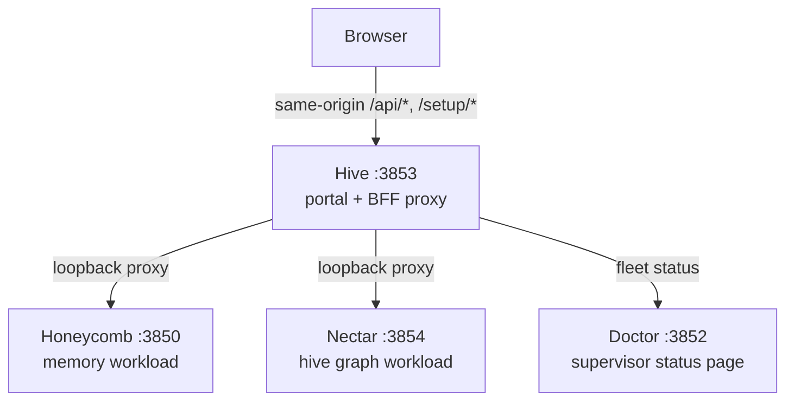
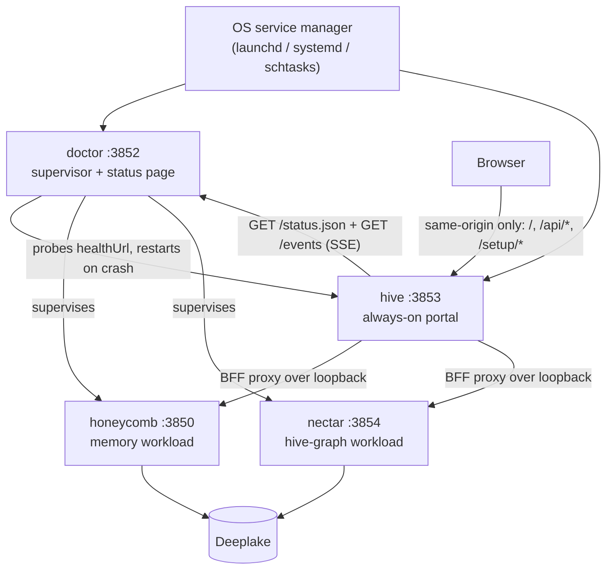
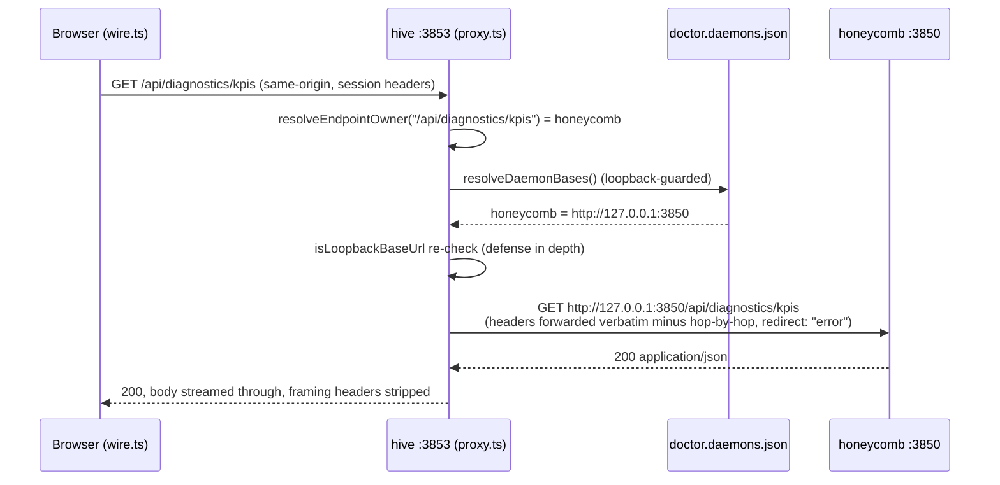
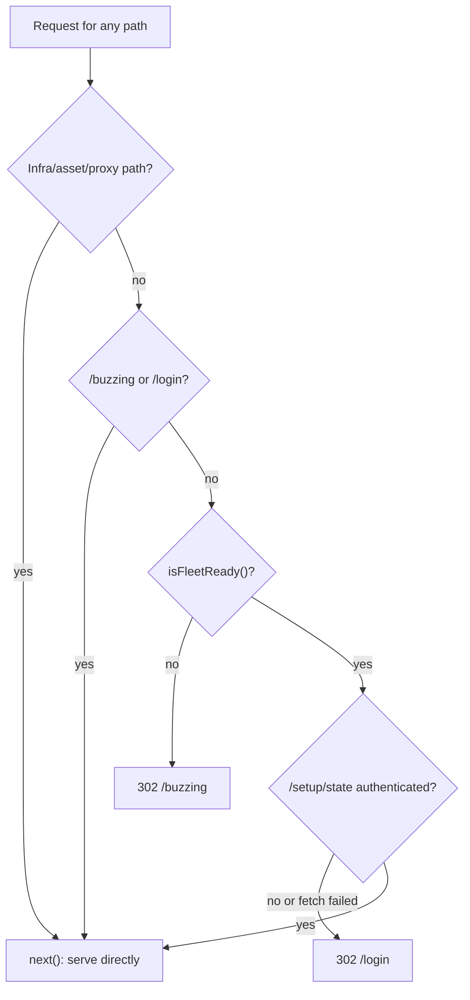
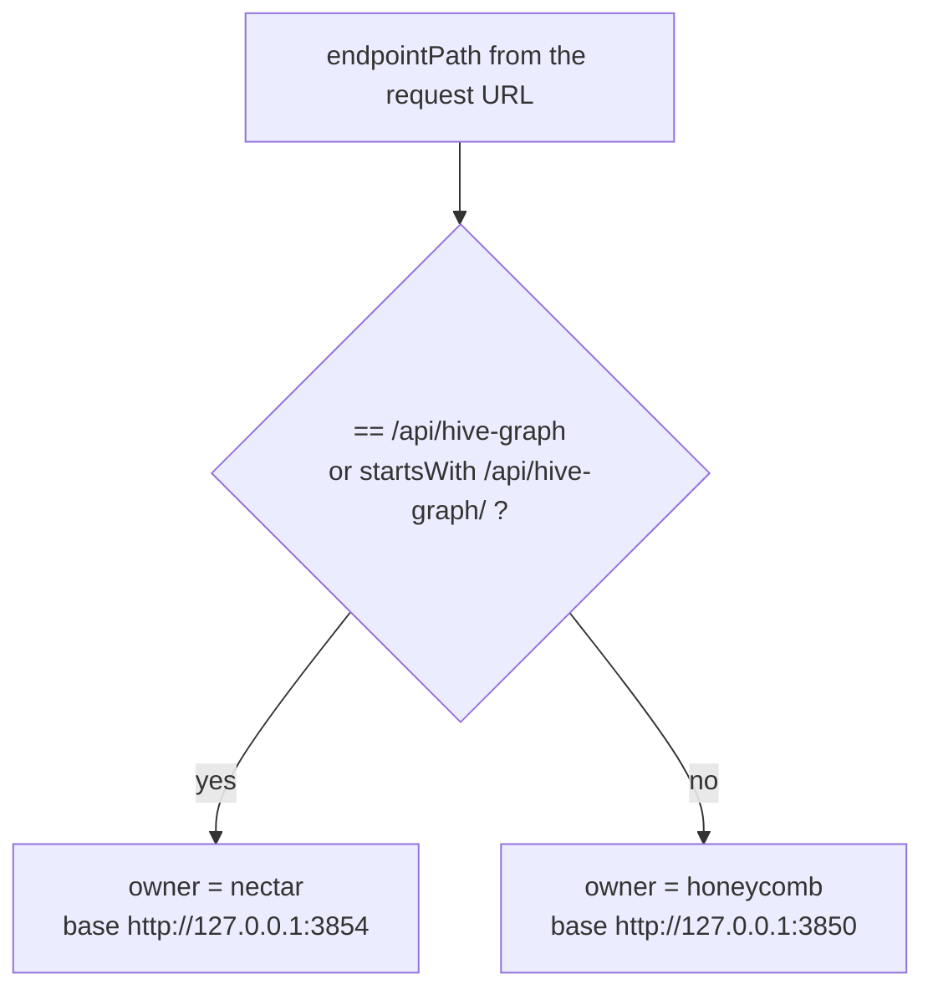
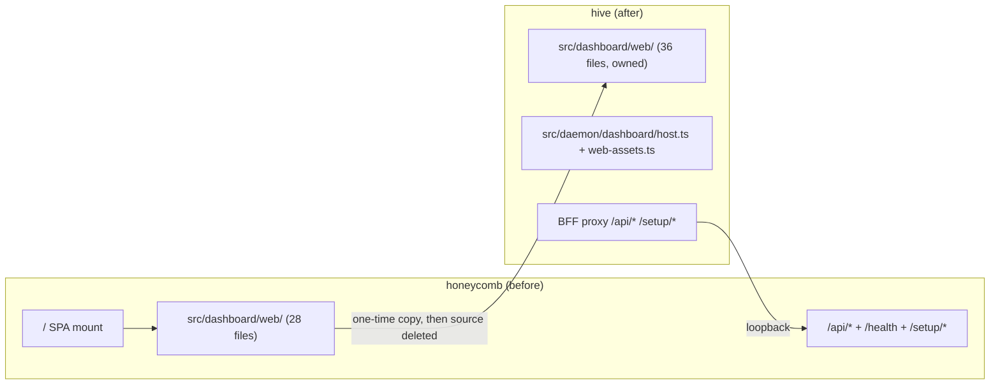
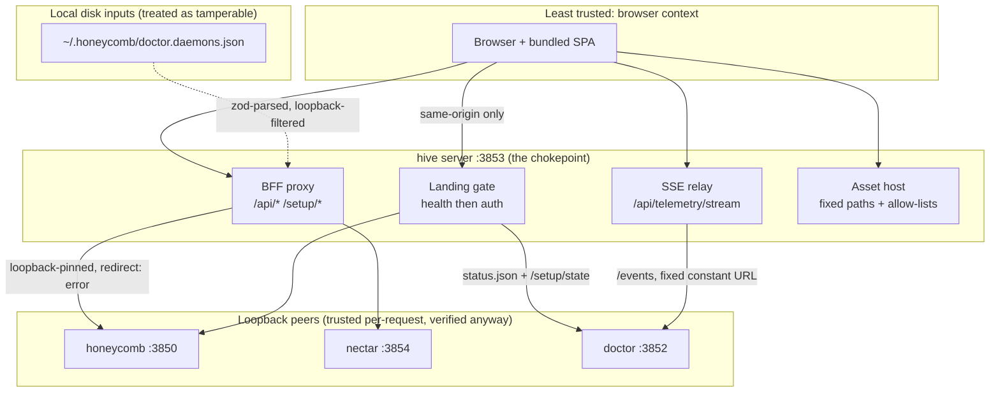
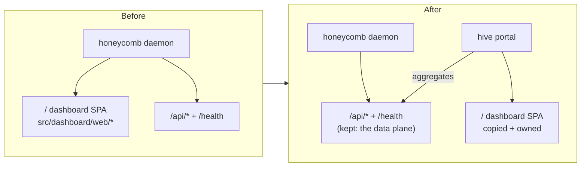
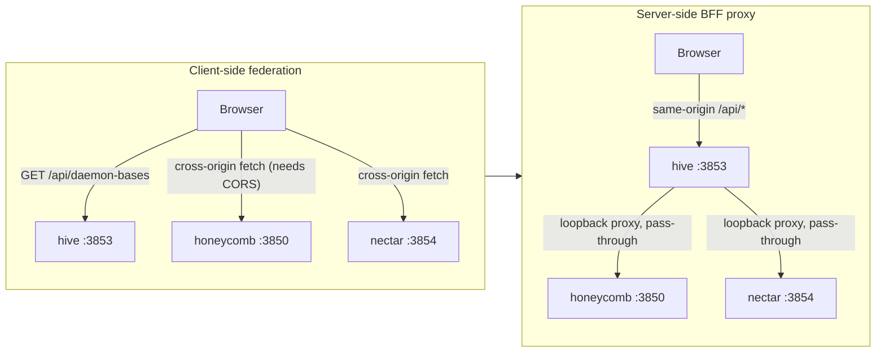
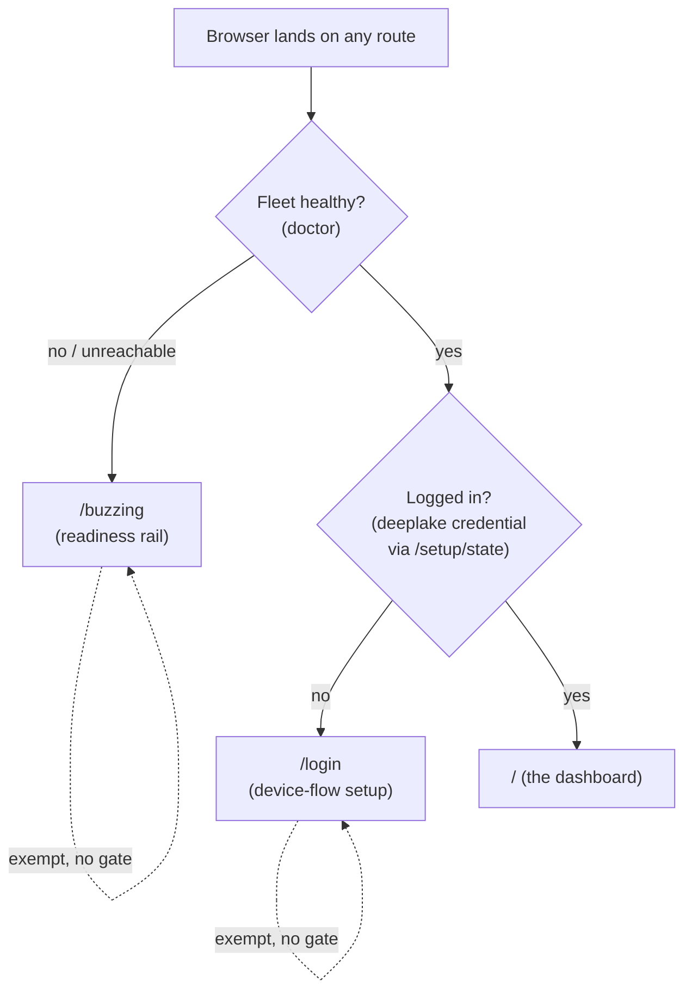

# Hive: Technical Manual & Specification

*Portal daemon, BFF federation, routing, and the copy-and-own provenance behind the Apiary dashboard.*

> **The Apiary** by Legion Code Inc., in collaboration with Activeloop.

## Foreword

Hive became its own service for one reason: the old dashboard lived inside the memory daemon, so it went dark exactly when you needed a status view most. This manual documents the portal daemon, the server-side BFF proxy that federates every other service, the landing gate and path-based routing, how Hive registers with Doctor, and the trust boundaries it enforces. It is written for engineers building on or auditing the portal.

## Hive: Overview & Quickstart

### What makes Hive different

Plenty of tools bolt a status page onto a daemon. Hive is built the other way around: the portal is the product, and four deliberate decisions make it hold up.

- **A single portal.** Every dashboard route in the Apiary lives here. Honeycomb's in-daemon dashboard is retired; Hive is the one source of always-on UI truth.
- **Server-side BFF proxy.** Per ADR-0002, the browser talks to Hive's origin only. The server resolves which daemon owns each `/api/*` and `/setup/*` request, fetches it over loopback, and streams it back. No CORS on any workload daemon, no daemon ports handed to a browser, loopback trust enforced on the server with redirect pinning.
- **Copy-and-own dashboard.** Per ADR-0001, the dashboard code was copied out of Honeycomb once and is owned here outright. No live shared module to drift, no fork to babysit, no second copy left to diverge from.
- **Always on.** Hive is its own supervised OS process, boot-ordered, not gated on any workload daemon's health. It ships on its own release train, so a dashboard change never forces a supervisor or workload release.

### Features

- **The unified Apiary dashboard**, served from one process the moment the socket binds.
- **Server-side BFF proxy** routing `/api/*` and `/setup/*` to the owning daemon: Honeycomb (`:3850`), Nectar (`:3854`), each resolved from Doctor's registry.
- **Single browser origin.** Same-origin fetches only; your browser never learns another daemon's port.
- **Credential-free by design.** Transparent auth pass-through; Hive stores no token and holds no Deeplake client.
- **Fail-soft aggregation.** One daemon down means one panel shows unreachable while the rest of the dashboard keeps working.
- **Fleet readiness via Doctor.** `/api/fleet-status` reads the supervisor's status page server-side, so the portal shows honest per-fleet health instead of guessing from failed fetches.
- **Always-on daemon on `:3853`** with `/health`, a PID/lock single-instance guard, and OS service units (launchd, systemd, schtasks) that restart it on crash and start it on boot.
- **Supervised by Doctor** through an idempotent registry entry, installed at setup time.

### Install (one command)

Hive doesn't install alone; it comes up as part of the Apiary stack. One line, and the installer handles Node, npm, the daemons, and the watchdog.

```bash
# macOS / Linux
curl -fsSL https://get.theapiary.sh | sh
```

```powershell
# Windows (PowerShell)
irm https://get.theapiary.sh/install.ps1 | iex
```

That single line installs the whole Apiary: Honeycomb, Nectar, Doctor, and Hive, which comes up at **`127.0.0.1:3853`** and becomes the one address you ever need to remember. The terminal is just a progress log; the portal is the product.

Prefer to build from source?

```bash
git clone https://github.com/legioncodeinc/hive.git
cd hive
npm install
npm run build        # tsc + esbuild → dist/cli.js

npm start            # runs `node dist/cli.js start`, binds :3853
npm run typecheck    # tsc --noEmit
npm test             # vitest run
```

The portal aggregates its data from the other Apiary daemons over loopback, so a source build of Hive alone gets you the shell and fleet status; the full dashboard lights up when Honeycomb and friends are running.

### Using the dashboard

Open `http://127.0.0.1:3853` and the shell renders immediately, even on a cold boot. While the fleet is still waking up you get a readiness splash with per-daemon health rows instead of a false "first time setup" screen. Once the fleet is ready, the full portal takes over: the memory pages, the graph, sync, and ROI views migrated from Honeycomb, plus fleet status pulled from Doctor. Every page hydrates through the same-origin wire, proxied server-side to whichever daemon owns the data.

### Using the CLI

The `hive` binary keeps a deliberately small surface. It's a portal daemon, not a Swiss Army knife:

```bash
hive start                # run the portal daemon on :3853 (the default verb)
hive install-service      # install the OS service unit (launchd / systemd / schtasks)
hive uninstall-service    # remove the service unit
hive register             # append Hive to Doctor's daemon registry
```

That's the whole list, on purpose. Day to day you never touch it; the installer wires the service unit and registration, Doctor keeps the process alive, and you live in the browser.

### Open one URL, see the whole hive

```bash
# One address. No port hunting, no tab juggling.
open http://127.0.0.1:3853

# Honeycomb up, Nectar up, Doctor watching, memories flowing.
# You just checked four daemons without remembering a single port number.
```

Kill a workload daemon mid-session and the dashboard doesn't blink: that daemon's panels go "unreachable," everything else keeps rendering, and the page recovers on its own when Doctor brings the daemon back. That's the moment this thing earns its keep.

### How it works

The browser talks to exactly one origin. Hive's server does the reaching around, over loopback, with the trust checks on its side of the line.



The browser never talks to the back daemons directly. Hive resolves each request's owner from Doctor's registry, guards every resolved base as loopback-only, pins redirects so a daemon can't bounce a proxied fetch off the machine, and forwards your session headers verbatim without keeping any credential of its own.

### Why one front door matters

Here's the thing about a stack of loopback daemons: individually they're clean, collectively they're a chore. Four processes means four ports, and four ports means the knowledge of your own tooling lives in your head instead of in the product. Every "wait, which one was 3854" is a small tax, and small taxes compound.

One front door collapses that. Your credentials cross exactly one boundary, enforced by a server you control, instead of being sprayed across browser tabs that each talk to a different origin. Your bookmark bar holds one entry. When something breaks at 2 a.m., you don't run a mental port scan; you open the one page and the sick daemon is the red row.

And there's a quieter payoff: the stack starts feeling like one product. Honeycomb, Nectar, and Doctor stay sharply separated where it counts, in process boundaries and data ownership, while you experience them as a single coherent surface. Separation of concerns for the machine, one front door for the human. That's the trade Hive makes, and it's the right one.

### Other interfaces

Straight talk: Hive ships two surfaces, and that's it for now.

- **Dashboard.** The web portal at `http://127.0.0.1:3853`. This is the product.
- **HTTP portal API.** Hive's own loopback endpoints: `GET /health` for cheap liveness (status, uptime, version) and `GET /api/fleet-status` for fleet health, plus the proxied `/api/*` and `/setup/*` surfaces of the daemons behind it.

No MCP server, no SDK, and none pretending. The workload daemons own those surfaces; Hive owns the door.

 Status & Roadmap

Hive is **production ready (v0.2.x)** and fully tested in live scenarios. The whole PRD program has shipped: the portal daemon, the migrated dashboard, the server-side BFF proxy, the OS service units and registry wiring, the portal gate, the fleet readiness surface, the Hive Graph page, and the onboarding installer. We document what's shipped; the roadmap and idea board for what comes next live at [ideas.theapiary.sh](https://ideas.theapiary.sh).

### Development

```bash
npm install
npm run build        # tsc + esbuild → dist/cli.js
npm run typecheck    # tsc --noEmit
npm test             # vitest run
```

Node `>= 22`, TypeScript, Hono on the server, React on the dashboard. The proxy surface (header hygiene, redirect pinning, streaming) carries its own test coverage; keep it that way.

### Credits

- **[Activeloop](https://activeloop.ai/)** brings **[Deeplake](https://deeplake.ai/)** (the versioned, multi-modal database for AI with native vector + columnar indexing and hybrid search) and **[Hivemind](https://github.com/activeloopai/hivemind)**, the open-source agent-memory project Honeycomb is built upon.
- **[Legion Code Inc](https://github.com/legioncodeinc)** brings the **multi-tier memory system** (Tier 1 / 2 / 3 keys, summaries, raw), **code base atlas memory architecture**, **auto healing service**, **session priming**, **automatic skill development & propagation**, the **pollinating loop**, the **knowledge graph**, **cross device cross repository cross team skill sharing**, and the daemon architecture that turns Deeplake into a shared brain your coding agents read and write on every turn.

### License

Hive is licensed under the **GNU Affero General Public License v3.0 or later** (AGPL-3.0-or-later).

Use it commercially or privately, free of charge. In return: keep the copyright and license notices intact, and if you modify it, your changes ship under the same AGPL license with source available. The "Affero" part is the point: run a modified version as a network service and you owe its source to the users who interact with it. No locking a fork behind a SaaS wall.

© 2026 Legion Code Inc.

  Built by Legion Code Inc · Powered by Activeloop Deeplake · theapiary.sh

<p alig

## Hive System Overview

Read this first if you work on any part of hive: it explains why the portal daemon exists, where it sits in the Apiary fleet, and what happens from OS boot to a rendered dashboard.

### Why hive exists

The Apiary runs four daemons on one machine: honeycomb (the memory workload, `:3850`), nectar (the hive-graph workload, `:3854`), doctor (the supervisor, status page on `:3852`), and hive (the portal, `:3853`). Before hive, the dashboard lived inside honeycomb. That put the status surface inside the process most likely to be the thing you are trying to diagnose. When honeycomb was down, the dashboard was down, which is exactly when an operator needs it most.

Hive fixes that failure mode with a velocity/stability split. Doctor is the "can't-crash" watchdog: zero runtime dependencies, updated rarely, deliberately boring. The portal is the opposite: it is UI, it changes often, and it must never force a supervisor release. So the dashboard gets its own always-on daemon with its own release train. Doctor supervises hive like any other daemon, but a dashboard change ships as a hive release and touches nothing else. That split is nectar ADR-0004 decision #4, and it is the reason hive is a separate repository and a separate npm package (`@legioncodeinc/hive`, version 0.1.0).

The second reason is origin consolidation. Four daemons means four loopback ports, and the browser should not have to know any of them except one. Hive is the single origin of UI truth: the browser bookmarks `http://127.0.0.1:3853`, and hive's server reaches every other daemon over loopback on its behalf. No CORS on workloads, no port hunting, no credential in the browser beyond what honeycomb's own session posture already sends. Mario Aldayuz designed hive around that one bet: the portal is the product, not a status page bolted onto a daemon, so it gets a process, a gate, and a proxy built for exactly that job.

### Fleet position



Hive holds no Deeplake client and persists nothing of its own beyond a PID/lock pair and a telemetry dedupe ledger. Every row the dashboard renders comes from a workload daemon's API (proxied server-side) or from doctor's status page and SSE stream. `tests/wire/*` and the PRD-001 QA audit both verify the no-Deep-Lake constraint.

### The four decisions that shape the codebase

1. **Copy-and-own the dashboard** (hive ADR-0001). The React SPA was copied out of honeycomb once, honeycomb's copy was deleted, and hive owns the code outright. No shared package, no fork, no drift. See copy-and-own-provenance.md.
2. **Server-side BFF proxy** (hive ADR-0002). The browser talks to hive's origin only. `src/daemon/proxy.ts` resolves the owning daemon per request from doctor's registry and forwards over loopback with transparent auth pass-through. See bff-proxy-federation.md.
3. **Health-first, auth-second landing gate** (hive ADR-0004). `src/daemon/gate.ts` runs ahead of every route: unhealthy fleet redirects to `/buzzing`, logged-out operator redirects to `/login`, everything else falls through to the requested path. See landing-gate-and-routing.md.
4. **Doctor is the single health source** (doctor ADR-0001, hive ADR-0003). Hive never probes workload `/health` endpoints itself. It reads doctor's `status.json` for the gate and relays doctor's `fleet-telemetry` SSE stream to the browser at `/api/telemetry/stream`. See ../frontend/buzzing-and-health-rail.md.

### Lifecycle: boot to dashboard

Hive boots with the device and serves immediately. Nothing about a workload daemon's health delays the socket bind.

1. **OS start.** The service unit (`com.legioncode.hive` on macOS, `hive.service` user unit on Linux, the `hive` Scheduled Task on Windows) runs `node  start` at boot/login and restarts it on crash. `hive install-service` writes the unit; see doctor-registration-and-lifecycle.md.
2. **Single-instance lock.** `startHive()` (`src/daemon/server.ts`) calls `acquireSingleInstanceLock()` (`src/lock.ts`), which creates `~/.honeycomb/hive.lock` with the `wx` flag and writes `~/.honeycomb/hive.pid`. A live lock holder makes the second start exit with `DaemonAlreadyRunningError`; a stale lock (dead PID) is reclaimed.
3. **Bind `127.0.0.1:3853`.** The Hono app serves the shell the moment the socket binds. The constants are hard-pinned in `src/shared/constants.ts`:

```typescript
export const HIVE_HOST = "127.0.0.1" as const;
export const HIVE_PORT = 3853 as const;
export const DOCTOR_STATUS_URL = "http://127.0.0.1:3852/status.json" as const;
export const DOCTOR_EVENTS_URL = "http://127.0.0.1:3852/events" as const;
```

4. **Doctor supervision.** Doctor probes `http://127.0.0.1:3853/health` every 30 seconds (the registry entry hive's installer wrote) and restarts the process if it stops answering. Registration happened at install time, not at boot; boot does not touch the registry.
5. **First browser load.** The landing gate evaluates health then auth and serves `/buzzing`, `/login`, or the requested page. A cold fleet shows per-service bee tiles on `/buzzing`, never a false "first time setup" screen. That failure mode and its fix are the subject of ../frontend/portal-readiness-splash.md and its successor screens.

There is no runtime env configuration for host or port. The only env vars hive reads are the telemetry opt-outs (`HONEYCOMB_TELEMETRY=0`, `DO_NOT_TRACK`); everything else is injectable only through code options, which is a test seam, not an operator surface.

### Provenance and the rename

Hive began life as "the-hive", a planned package inside the honeycomb repository (nectar ADR-0003/ADR-0004 era). Two things changed: hive became a first-class product in its own repository, and honeycomb's dashboard was retired rather than shared. The rename left one visible scar the code still handles: the pre-decision-#32 OS service names (`thehive`, `thehive.service`) are deregistered best-effort at the start of every `install-service` run (`legacyUninstallCommands` in `src/service/commands.ts`) so a re-run migrates a legacy unit instead of leaving two units racing over one daemon. The dashboard itself is a copy-and-own transfer from honeycomb, documented file-by-file in copy-and-own-provenance.md.

### Repo map

Where things live, so you can go from this overview to the code in one hop:

```
src/
  cli.ts, cli-commands.ts      # the four verbs: start | install-service | uninstall-service | register
  lock.ts, errors.ts           # single-instance PID/lock guard
  daemon/
    server.ts                  # createHive/startHive: the route table, in registration order
    gate.ts                    # the landing gate (health then auth)
    proxy.ts                   # the BFF proxy for /api/* and /setup/*
    registry.ts                # doctor registry reader: daemon bases + registered service names
    fleet-status.ts            # GET /api/fleet-status projection of doctor's status.json
    setup-auth.ts              # the gate's auth input (honeycomb /setup/state, fail-closed)
    telemetry-proxy.ts         # GET /api/telemetry/stream, the SSE relay of doctor's /events
    dashboard/host.ts          # shell + asset routes; web-assets.ts locates/reads assets
  dashboard/
    contracts.ts               # partial copy of honeycomb's web-consumed ROI types
    web/                       # the SPA: 36 files (registry, router, wire, pages/, screens)
  install/registry.ts          # idempotent upsert into ~/.honeycomb/doctor.daemons.json
  service/                     # per-OS unit plans, templates, manager commands
  shared/                      # constants, daemon-routing, fleet-readiness, fleet-telemetry, service-status
  telemetry/emit.ts            # the single telemetry-egress chokepoint
tests/                         # 33 files mirroring the src domains
assets/                        # design tokens CSS, brand mark, fonts (served by host.ts)
```

Every domain above has a deeper doc in this knowledge base; start from the Related list at the top or the private README index.

### Program state

Hive is production ready and fully tested in live scenarios: the whole portal PRD program has shipped and is QA-verified on main. PRD-001 (portal daemon), PRD-002 (readiness splash), PRD-003 (landing gate + path routing), PRD-004 (buzzing loaders), PRD-005 (health rail + page), and PRD-009 (onboarding installer) are all implemented, tested, and verified, with the CI and release train (`ci.yaml` + `release.yaml`) closing out the independent-release-train acceptance criterion. Every domain in this knowledge base describes shipped, exercised behavior rather than intended behavior. The `@legioncodeinc/hive` package carries a `published: false` pin in the superproject's `hive-release.json`, which reflects only the one-time trusted-publisher npm bootstrap th

## BFF Proxy Federation

Read this if you touch `src/daemon/proxy.ts`, `src/daemon/registry.ts`, or `src/shared/daemon-routing.ts`: it explains how every dashboard read reaches the daemon that owns it without the browser ever leaving hive's origin.

### The model

The browser talks to exactly one origin: `http://127.0.0.1:3853`. The copied `wire` client (`src/dashboard/web/wire.ts`) fetches only relative paths (`/api/*`, `/setup/*`, `/health`). Hive's server owns federation: `createApiProxy` (`src/daemon/proxy.ts`) is mounted with `app.all("/api/*")` and `app.all("/setup/*")` in `src/daemon/server.ts`, resolves which daemon owns each request, fetches it over loopback, and streams the response back.

This replaced the first implementation, which federated client-side: hive served a routing table at `GET /api/daemon-bases` and the browser fetched each workload daemon's origin directly. That model forced a CORS middleware onto honeycomb and handed every daemon's port to a browser context, with the loopback-trust check living in the least-trusted tier. ADR-0002 killed it. The `/api/daemon-bases` route and honeycomb's `dashboard-cors.ts` are gone; no workload daemon emits a CORS header for the dashboard today, and none ever needs to again.

### Target resolution

Ownership is a static routing rule plus a dynamic base lookup.

**The rule** lives in `src/shared/daemon-routing.ts`: nectar owns the hive-graph surface, honeycomb owns everything else.

```typescript
export const DEFAULT_DAEMON_BASES = Object.freeze({
  honeycomb: "http://127.0.0.1:3850",
  nectar: "http://127.0.0.1:3854"
} as const);

const HIVE_GRAPH_PREFIX = "/api/hive-graph";

export function resolveEndpointOwner(endpointPath: string): DaemonName {
  return endpointPath === HIVE_GRAPH_PREFIX || endpointPath.startsWith(`${HIVE_GRAPH_PREFIX}/`)
    ? "nectar"
    : "honeycomb";
}
```

**The bases** come from doctor's registry file. `resolveDaemonBases` (`src/daemon/registry.ts`) reads `~/.honeycomb/doctor.daemons.json`, zod-validates each entry, derives a base URL by stripping the `/health` suffix from the entry's `healthUrl`, and rejects any entry whose host is not loopback before it can become a base. A missing, unreadable, or corrupt registry degrades to the documented loopback defaults above; it never throws and never blocks hive from serving.

Three hive-owned routes are registered before the catch-all proxy so they win by registration order: `/health`, `/api/fleet-status`, `/api/registered-services`, and `/api/telemetry/stream`. Everything else under `/api/*` and `/setup/*` is proxied.

### A request end to end



If the fetch to honeycomb throws (connection refused, network error, blocked redirect), the proxy returns the fail-soft response instead of an exception:

```typescript
function unreachableResponse(daemon: DaemonName): Response {
  return new Response(JSON.stringify({ error: "unreachable", daemon }), {
    status: 502,
    headers: { "content-type": "application/json" }
  });
}
```

### Transparent auth pass-through

Hive forwards the browser's own request headers verbatim to the workload daemon and stores no credential of its own. There is no token minting, no session store, no injected authorization header anywhere in `src/`; the proxy's only header work is subtraction. This preserves honeycomb's existing loopback + local-mode + session-header posture (including the `x-honeycomb-project` scope header the wire sends) without hive becoming an auth authority. "Logged in" for the portal is honeycomb's `/setup/state` `authenticated` bit, which itself just reflects the presence of `~/.deeplake/credentials.json`; hive reads it, never writes it.

Header hygiene is two fixed strip sets in `proxy.ts`. Requests drop `host` (fetch re-derives it from the target) plus the RFC 7230 hop-by-hop headers and `content-length` (recomputed from the forwarded body). Responses drop the hop-by-hop set plus `content-encoding`/`content-length`, because fetch already decompressed the upstream body before hive re-streams it, so the original framing headers would lie.

Bodies are asymmetric by design: the request body is buffered (`await incoming.arrayBuffer()`, small JSON payloads, avoids the `duplex: "half"` dance), while the response body is streamed through (`new Response(upstream.body, ...)`) so SSE tails and large payloads never accumulate in hive's memory.

### Fail-soft aggregation

One dead daemon never blanks the portal. The guarantee is layered:

1. **Per-request**: the proxy converts every upstream failure into the 502 `{ error: "unreachable", daemon }` JSON above. No exception crosses into Hono's error path.
2. **Per-panel**: `wire.ts` parses every payload through a zod schema per endpoint and degrades a non-2xx or malformed response to a typed empty/zero state. A dead nectar means the Hive Graph page shows its empty state while every honeycomb-backed panel keeps rendering, and vice versa.
3. **Per-registry**: a corrupt or missing registry file falls back to default loopback bases rather than taking the proxy down.

`tests/daemon/proxy.test.ts` and `tests/wire/fail-soft.test.ts` pin all three layers.

### Why no CORS on workloads

Same-origin is not just tidier; it is the security posture. A CORS allowance on a daemon that serves captured session and memory data is an attack surface that has to be maintained forever and audited on every new daemon. With the BFF model the browser never issues a cross-origin request, so the question never arises: workload daemons owe hive a loopback `/api/*` surface and nothing else. Every future daemon inherits this for free by registering with doctor; the proxy routes to it the day `resolveEndpointOwner` learns its prefix.

### SSRF posture

The proxy is the one place in the fleet where a server fetches URLs influenced by a file on disk, so it is defended in depth:

- `baseUrlFromHealthUrl` rejects non-loopback registry entries before they can become bases (a tampered `doctor.daemons.json` cannot point the proxy off-machine).
- The proxy re-checks the resolved base with `isLoopbackBaseUrl` immediately before use, so a future refactor of base resolution cannot silently remove the guard.
- Every proxied fetch pins `redirect: "error"`, so a compromised loopback listener cannot 3xx-redirect the request (and its forwarded body) to an external origin after the initial URL passed the loopback check. The same pin exists in `fleet-status.ts`, `setup-auth.ts`, and `telemetry-proxy.ts`.

The trusted hostname set is exactly `127.0.0.1`, `localhost`, `::1`, `[::1]` (`LOOPBACK_HOSTNAMES` in `src/shared/daemon-routing.ts`). See ../security/trust-boundaries.md for the full boundary picture.

### Freshness

Data freshness is polling for the copied pages (`usePoll` through the proxy) and SSE for the health surface (`/api/telemetry/stream`, the same-origin relay of doctor's `fleet-telemetry` stream). ADR-0003 records the intent to generalize SSE beyond health and logs when the real-time benefit justifies the added moving parts; the proxy already streams response bodies, so a `text/event-stream` response rides through unchanged, which the Logs tail (`/api/logs/stream`) proves in production today.

## Landing Gate And Routing

Read this if you touch `src/daemon/gate.ts`, `src/daemon/server.ts` route registration, or the client boot path: it explains the health-first-auth-second gate, the exact route table, and the redirect semantics.

### What changed and why

The copied dashboard originally routed from `location.hash` and made its landing decision in React: `main.tsx` mounted `ReadinessSplash` (poll fleet status), which mounted `SetupGate` (poll `/setup/state`), which finally mounted the `Shell`. The server served one shell for every load and never saw the fragment, so nothing authoritative decided what a visitor was allowed to see, and the wrong screen could flash while a client gate resolved.

ADR-0004 moved the decision to the server and made the URL real. Routes are paths, the gate is a Hono middleware registered ahead of every route, and the browser's first paint is already the correct screen. The nested `ReadinessSplash`/`SetupGate` client gates are retired; `main.tsx` now does one pure lookup (`resolveBootScreen` in `src/dashboard/web/boot-route.ts`) from `location.pathname` to a top-level screen and never re-derives health or auth client-side.

### The gate precedence

`createPortalGate` (`src/daemon/gate.ts`) is registered first (`app.use("*", ...)`) and evaluates, for every non-exempt page navigation:

1. **Health first.** `fetchFleetStatus` reads doctor's `GET http://127.0.0.1:3852/status.json` server-side and `isFleetReady()` decides. Not ready means `302` to `/buzzing`. Auth is never even evaluated in this branch: an unhealthy fleet makes a login prompt pointless and misleading.
2. **Auth second.** `fetchSetupAuthenticated` (`src/daemon/setup-auth.ts`) resolves honeycomb's base the same way the proxy does, fetches `GET /setup/state` over loopback, and reads its `authenticated` bit. `false`, or any failure at all (network error, non-OK, bad JSON, schema mismatch, abort), means `302` to `/login`. This fails closed: a transient fault sends you to `/login`, never into the dashboard.
3. **Serve.** Healthy and authenticated: the middleware calls `next()` and the routes behind it serve the request. `/` is the dashboard; the root is never blank.

The readiness rule is one shared predicate, so "healthy" means the same thing to the gate, the `/buzzing` screen's dismissal poll, and anything else that asks:

```typescript
export const V1_REQUIRED_PEERS = ["honeycomb"] as const;

export function isFleetReady(status: FleetStatusResponse): boolean {
  if (status.supervisor !== "reachable") return false;
  if (status.health !== "ok") return false;
  return V1_REQUIRED_PEERS.every((name) =>
    status.daemons.some((daemon) => daemon.name === name && daemon.health === "ok")
  );
}
```

`degraded` blocks exactly like `unreachable`; only `ok` passes. Nectar is not yet a required peer (it joins when a shipped page depends on it); its row is display-only.



### Exemptions: screens vs infra

Two kinds of path bypass the precedence, for two different reasons.

**Exempt screens** (`GATE_EXEMPT_ROUTES = ["/buzzing", "/login"]`): checked before the precedence so they are always served directly. This is the loop-termination proof: the only two redirect targets are themselves exempt from producing another redirect, so the gate can never bounce a browser in a cycle.

**Exempt infra**: paths that are not page navigations at all.

- Fixed assets: `/app.js`, `/styles.css`, `/honeycomb-memory-cluster.svg`. The exempt screens are the same SPA bundle, so the bundle must load even for a visitor the gate just redirected.
- Prefixes: `/api/`, `/setup/`, `/fonts/`. Data-plane traffic belongs to the BFF proxy, which handles its own requests untouched; gating it would break same-origin `/setup/*` flows and add a redirect surface to an API.
- `/health`, conditionally: see below.

**The `/health` double duty.** `/health` is both hive's machine-liveness probe (doctor polls it; monitoring polls it) and the operator-facing health page in the SPA. The gate and `server.ts` make the identical content-negotiation call: a request whose `Accept` header includes `text/html` is a page navigation (gated, served the SPA shell); anything else is a probe (bypasses the gate, gets the liveness JSON `{ status, uptimeMs, version }`). The two code paths cite each other so they stay in lockstep.

### Redirect semantics

Every redirect the gate issues is a `302` to a hard-coded literal, `/buzzing` or `/login`. No `?next=` parameter, no `Referer` echo, no request path reflected anywhere. There is structurally no code path where attacker-influenced input reaches `c.redirect`, which is the whole open-redirect defense: it is not validated away, it is absent. The auth fetch is also tied to the incoming request's abort signal (`c.req.raw.signal`), so a client disconnect aborts the upstream `/setup/state` call instead of pinning it, and an abort reads as fail-closed.

Once `/buzzing` observes readiness it hard-navigates to `/` rather than swapping screens client-side, so the server gate re-evaluates health and auth on a fresh request and routes the operator to the dashboard or `/login`, whichever the now-current state calls for.

### The full route table

Registration order in `createHive` (`src/daemon/server.ts`) is the authority; Hono serves the first matching handler.

| Order | Route | Handler | Gated? |
|---|---|---|---|
| 1 | `*` (middleware) | `createPortalGate` | is the gate |
| 2 | `GET /app.js`, `GET /styles.css`, `GET /honeycomb-memory-cluster.svg`, `GET /fonts/:name` | `mountDashboardAssets` (host.ts) | no (infra) |
| 3 | `GET /health` | liveness JSON, or the SPA shell when `Accept` includes `text/html` | probe: no; page: yes |
| 4 | `GET /api/fleet-status` | `fetchFleetStatus` projection of doctor's status page | no (`/api/` prefix) |
| 5 | `GET /api/registered-services` | `resolveRegisteredServiceNames` from doctor's registry file | no |
| 6 | `GET /api/telemetry/stream` | `createTelemetryStreamHandler`, the SSE relay of doctor's `/events` | no |
| 7 | `ALL /api/*`, `ALL /setup/*` | `createApiProxy` (BFF, honeycomb or nectar) | no |
| 8 | `GET *` | `mountDashboardShellFallback`: the SPA shell for every page path | yes |

The shell catch-all serves one byte-identical shell for every authorized path (`/`, `/projects`, `/harnesses`, `/memories`, `/graph`, `/hive-graph`, `/sync`, `/logs`, `/health`, `/roi`, `/settings`, plus `/buzzing`, `/login`, and any unknown deep link). The bundle self-hydrates from `location.pathname`: `resolveBootScreen` mounts `BuzzingScreen`, `LoginScreen`, or the `Shell`, and inside the shell `usePathRoute` (`router.tsx`) plus `matchRoute` (`registry.tsx`) resolve the specific page, with unknown paths falling back to the Dashboard entry rather than a blank screen. Client navigation uses `history.pushState` and a broadcast `hive:pathchange` event; there is no react-router and no new dependency.

### Implementation status

PRD-003 (gate, `/login` device-flow screen, hash-to-path migration) is shipped and QA-verified on main, covered by `tests/daemon/gate.test.ts`, `tests/dashboard/boot-route.test.ts`, `tests/dashboard/router.test.tsx`, and `tests/dashboard/login-screen.test.tsx`, and exercised in live cold-boot and logged-out scenarios. The `/buzzing` content (PRD-004) and the health rail and `/health` page (PRD-005) are shipped alongside it; see ../frontend/buzzing-and-health-rail.md for the full health-surface detail. The gate behavior des

## Shared Contracts And Routing

Read this if you touch anything under `src/shared/`, or if you need to know how a URL path becomes a decision about which daemon owns it: this is the contract layer every other hive module builds on, and the place the fleet-wide pinned contracts land in hive.

### Why a shared layer exists at all

`src/shared/` is the set of modules that both the node server and the browser bundle import. That dual-consumption is the whole reason the directory is separate: `constants.ts` pins the port that `server.ts` binds and that `wire.ts` never needs to know, `service-status.ts` derives the same five bee states whether the SSE model or the coarse REST row produced the signal, and `fleet-telemetry.ts` is a hand-kept copy of doctor's wire shape that has to compile in a browser and in Node. Nothing here reaches for `node:fs` or the DOM, because a module that both sides import cannot depend on either side's runtime.

The layer is also where the fleet's three pinned cross-daemon contracts surface inside hive. The superproject's `library/ledger/EXECUTION_LEDGER.md` pins Contracts A, B, and C in writing so honeycomb, nectar, and hive could all build against them in parallel without waiting on doctor's code to exist. Hive consumes two of the three: Contract A (the extended registry entry) through `registry.ts`, and Contract C (the doctor-to-hive SSE event shape) through `fleet-telemetry.ts`. Contract B (the per-service SQLite schema) is doctor's and each workload's business; hive only ever sees its projection arrive over Contract C.

### The routing rule: one prefix, two daemons

Every dashboard read has exactly one owning daemon, and the ownership rule is a single function in `src/shared/daemon-routing.ts`. Nectar owns the hive-graph surface; honeycomb owns everything else.

```typescript
const HIVE_GRAPH_PREFIX = "/api/hive-graph";

export function resolveEndpointOwner(endpointPath: string): DaemonName {
  return endpointPath === HIVE_GRAPH_PREFIX || endpointPath.startsWith(`${HIVE_GRAPH_PREFIX}/`)
    ? "nectar"
    : "honeycomb";
}
```

`DaemonName` is `keyof typeof DEFAULT_DAEMON_BASES`, and the default bases are the only two workload daemons hive proxies to:

```typescript
export const DEFAULT_DAEMON_BASES = Object.freeze({
  honeycomb: "http://127.0.0.1:3850",
  nectar: "http://127.0.0.1:3854"
} as const);
```

This is a deliberately blunt rule. There is no per-endpoint registry, no wildcard table, no config file: a path is nectar's if and only if it is `/api/hive-graph` or begins with `/api/hive-graph/`, and honeycomb's otherwise. Adding a third workload daemon means teaching `resolveEndpointOwner` one more prefix and adding one more base; the proxy, the gate, and the wire all inherit the routing for free because they all call this one function.



### The loopback trust boundary lives here

`daemon-routing.ts` also owns the one hostname allow-list the whole server tier defends against SSRF with. The trusted set is exactly four names:

```typescript
const LOOPBACK_HOSTNAMES = new Set(["127.0.0.1", "localhost", "::1", "[::1]"]);

export function isLoopbackBaseUrl(baseUrl: string): boolean {
  try {
    return LOOPBACK_HOSTNAMES.has(new URL(baseUrl).hostname);
  } catch {
    return false;
  }
}
```

Every server-side fetch in the codebase (the proxy, the gate's auth check, the fleet-status fetch, the SSE relay) re-checks its resolved target with `isLoopbackBaseUrl` immediately before firing. A URL that does not parse returns `false`, so a garbage base fails closed. The rationale is documented right in the source: hive forwards request bodies that can carry captured session and memory content, so a base that points off-machine would be an exfiltration primitive. `normalizeBaseUrl` and `normalizeDaemonBases` round out the module, trimming trailing slashes and filling absent daemons from the defaults so downstream code always sees a complete `DaemonBases` record. The full boundary picture is in ../security/trust-boundaries.md; this module is where the predicate itself is defined.

### Constants: the pins with no env override

`src/shared/constants.ts` is short on purpose. The host, port, and doctor URLs are hard-pinned literals with no environment-variable path, which is a security decision as much as a simplicity one: there is no operator surface that can move the listener off loopback or point the relay at another host.

```typescript
export const HIVE_HOST = "127.0.0.1" as const;
export const HIVE_PORT = 3853 as const;
export const HIVE_VERSION = packageJson.version;
export const DOCTOR_STATUS_URL = "http://127.0.0.1:3852/status.json" as const;
export const DOCTOR_EVENTS_URL = "http://127.0.0.1:3852/events" as const;
export const HONEYCOMB_HOME_DIR = join(homedir(), ".honeycomb");
export const HIVE_PID_PATH = join(HONEYCOMB_HOME_DIR, "hive.pid");
export const HIVE_LOCK_PATH = join(HONEYCOMB_HOME_DIR, "hive.lock");
```

`HIVE_VERSION` reads straight off `package.json`, so the liveness probe, the telemetry payload, and the release guard all report one number. `HONEYCOMB_HOME_DIR` is the shared `~/.honeycomb` directory hive co-locates its state in; the full on-disk story is in ../operations/on-disk-footprint.md.

### Fleet readiness: one predicate, three callers

`src/shared/fleet-readiness.ts` defines what "the fleet is ready" means, and it means the same thing to the landing gate, the `/buzzing` dismissal poll, and any future caller. The predicate is strict: the supervisor must be reachable, doctor's coarse health must be exactly `ok`, and every required peer must report `ok`.

```typescript
export const V1_REQUIRED_PEERS = ["honeycomb"] as const;

export function isFleetReady(status: FleetStatusResponse): boolean {
  if (status.supervisor !== "reachable") return false;
  if (status.health !== "ok") return false;
  return V1_REQUIRED_PEERS.every((name) =>
    status.daemons.some((daemon) => daemon.name === name && daemon.health === "ok")
  );
}
```

`degraded` blocks exactly like `unreachable`; only `ok` passes. Nectar is not in `V1_REQUIRED_PEERS`, so a down nectar does not send an operator to `/buzzing`; its row is display-only until a shipped page hard-depends on it. `FleetStatusResponse` is a discriminated union on `supervisor`: the reachable arm carries `health`, a `daemons` array, and `asOf`; the unreachable arm carries only an empty `daemons` tuple, which is the fail-soft shape `fetchFleetStatus` returns when doctor cannot be reached. That derivation happens in `src/daemon/fleet-status.ts`; readiness is defined in shared so both server and any client consumer agree on it.

### Service status: the five-state derivation

`src/shared/service-status.ts` turns a raw health signal into one of five locked bee states, and it is source-agnostic by construction. Both the rich SSE `FleetServiceModel` and the coarse REST daemon row normalize into the same `ServiceSignal` first, so the same condition always yields the same state regardless of which feed reported it.

```typescript
export const SERVICE_STATES = ["error", "degraded", "starting", "warming", "active"] as const;
export type ServiceState = (typeof SERVICE_STATES)[number];

export interface ServiceSignal {
  readonly health: FleetHealth;                        // "ok" | "degraded" | "unreachable" | "unknown"
  readonly lastSeen: string | null;                    // ISO-8601, null on the coarse REST feed
  readonly telemetryFault: TelemetryFaultReason | null; // "missing" | "locked" | "malformed" | "read-error"
}

export function deriveServiceState(input: ServiceDerivationInput): ServiceState;
export function nextFirstActiveAt(health: FleetHealth, previous: number | null, now: number): number | null;
```

The rule order inside `deriveServiceState` is: no signal at all is `starting`; a per-service telemetry fault is `degraded` (isolated, never contagious); `unreachable` health or a `lastSeen` staler than the stale window is `error`; `degraded` health is `degraded`; `unknown` health is `starting`; `ok` is `warming` inside the grace window and `active` after it. The function is per-service by construction: it never reads a sibling's state, which is exactly what makes "one bad service flips only its own tile" a property rather than a promise. The consuming UI (the `/buzzing` tiles, the health rail, the `/health` page) is documented in ../frontend/fleet-telemetry-client.md and ../frontend/buzzing-and-health-rail.md.

### Fleet telemetry: Contract C, hand-kept

`src/shared/fleet-telemetry.ts` is hive's copy of doctor's `src/telemetry/schema.ts`, the SSE wire shape pinned as Contract C. Hive does not depend on the doctor npm package (each fleet member is its own package), so this module is a browser-and-server-safe hand-kept copy that must stay in lockstep if doctor's schema ever changes. It exports the shape and a defensive parser:

```typescript
export const FLEET_TELEMETRY_EVENT_NAME = "fleet-telemetry" as const;

export interface FleetTelemetryEvent {
  readonly asOf: string;
  readonly services: readonly FleetServiceModel[];
  readonly logs: readonly FleetLogEntry[];
}

export function parseFleetTelemetryEvent(raw: string): FleetTelemetryEvent | null;
```

The load-bearing design choice is that `metrics` is typed `Readonly>`, not a fixed shape. Honeycomb ships three counters (`actionsTaken`, `filesProcessed`, `memoriesCreated`) and nectar ships five (`filesRegistered`, `nectarsMinted`, `descriptionsGenerated`, `hiveGraphVersions`, `embeddingsComputed`), and nothing in hive hardcodes either set. Every reader is schema-tolerant, so a workload can add a counter and hive's `/health` page renders it with no code change. `parseFleetTelemetryEvent` returns `null` on anything malformed rather than throwing, so one bad SSE frame never crashes the consuming hook. `FleetServiceModel` carries `name`, `health`, `lastSeen`, `metrics`, a nullable `deeplake` block, and a nullable `telemetryFault`; `FleetLogEntry` is `{ service, ts, level, message }`, and the event's `logs` field is a bounded slice of only the rows new since the previous tick, never a history.

### Copied contract types

Two shared modules exist purely so that copied-verbatim pages keep their imports byte-identical. `src/shared/lifecycle-flags.ts` and `src/shared/memory-types.ts` came over from honeycomb with the dashboard so that `settings.tsx` and `memories.tsx` did not have to be edited on copy; they are part of the copy-and-own transfer documented in copy-and-own-provenance.md. They are contract-shaped (enumerations and record types the pages branch on) rather than behavioral, and they carry no server logic.

### The maintenance contract

The shared layer has exactly one standing obligation to another repo: `fleet-telemetry.ts` mirrors doctor's `schema.ts` (Contract C), so if doctor's SSE shape changes, this copy must be updated deliberately. The parse is zod-defensive either way, so a drift degrades to empty rather than crashing, but a silently stale copy would drop fields the UI could otherwise render. Everything else in `src/shared/` is hive's own and moves only when hive's own code moves. `tests/shared/service-status.test.ts` and `tests/shared/fleet-telemetry.test.ts` pin the derivation and the parse; `tests/wire/federation.test.ts` pins `resolveEndpointOwner`'s ownership split.

## Doctor Registration And Lifecycle

Read this if you operate hive or touch `src/lock.ts`, `src/install/registry.ts`, or `src/service/`: it covers the single-instance guard, the OS service units, registration with doctor, and what uninstall does and honestly does not do.

### The CLI surface

Four verbs, dispatched in `src/cli.ts`, implemented in `src/cli-commands.ts`:

```
hive start                # run the daemon on 127.0.0.1:3853 (the default verb)
hive install-service      # write + start the OS unit, then register with doctor
hive uninstall-service    # deregister + remove the OS unit (registry entry stays; see below)
hive register             # upsert hive's entry into doctor's registry, standalone
```

Each verb also fires one fail-soft lifecycle telemetry event through `src/telemetry/emit.ts` (`hive_installed`, `hive_uninstalled`, `hive_first_run`, `hive_updated`); a telemetry failure never changes a verb's exit code. See ../infrastructure/build-and-release.md for the chokepoint details.

### Single-instance guard

`startHive` acquires the lock before the socket, in `acquireSingleInstanceLock` (`src/lock.ts`):

1. Open `~/.honeycomb/hive.lock` with the `wx` flag (exclusive create). Success means we own the instance; write our PID into the lock file and mirror it to `~/.honeycomb/hive.pid`.
2. On `EEXIST`, read the PID out of the existing lock and probe it with `process.kill(pid, 0)`. A live process (including `EPERM`, which means "alive but not ours") throws `DaemonAlreadyRunningError`, and the second `hive start` exits 1 with `hive is already running (pid N) and holds lock ...`.
3. A dead PID means a stale lock (crash, power loss): remove it and retry the exclusive create exactly once. Losing that race to another starter also throws `DaemonAlreadyRunningError`.

`stop()` (and signal handlers for SIGINT/SIGTERM) closes the server and releases both files. The lock is PID-probe based, not flock-based, which is what lets a crashed daemon's lock be reclaimed without manual cleanup. `tests/lock.test.ts` covers acquisition, stale reclaim, and the race.

The `pidPath` in doctor's registry entry points at the same `hive.pid`, so the supervisor and the lock agree on which process is "the" hive.

### OS service unit

`hive install-service` resolves a per-platform plan (`src/service/platform.ts`), renders the unit (`src/service/templates.ts`), writes it, and runs the manager commands (`src/service/commands.ts`) through `execFile` (argv arrays, no shell, 15 s timeout per command).

| Platform | Manager | Unit name | Unit path |
|---|---|---|---|
| macOS | launchd (user domain `gui/`) | `com.legioncode.hive` | `~/Library/LaunchAgents/com.legioncode.hive.plist` |
| Linux | systemd (user) | `hive.service` | `~/.config/systemd/user/hive.service` |
| Windows | schtasks | task `hive` | XML staged at `~/.honeycomb/hive/hive-task.xml` |

All three units run `node  start` and encode restart-on-crash plus start-on-boot/login: launchd sets `RunAtLoad` + `KeepAlive` with a 5 s `ThrottleInterval` (stdout/stderr to `~/.honeycomb/hive/launchd.*.log`); systemd sets `Restart=always`, `RestartSec=5`, `StartLimitIntervalSec=0`, `WantedBy=default.target`; the Windows task uses a `LogonTrigger`, `RestartOnFailure` every `PT1M` up to 999 times, and `MultipleInstancesPolicy: IgnoreNew` (the OS-level echo of the PID lock).

**Legacy migration (decision #32).** Hive shipped briefly under the name `thehive` (`thehive` launchd label, `thehive.service`, Windows task `thehive`). Every install now begins by best-effort deregistering those legacy units and deleting their unit files (`legacyUninstallCommands`, `legacyUnitPath`), so a re-run migrates an old install instead of leaving two units racing over one daemon. When no legacy unit exists the commands fail harmlessly and the install proceeds.

### Idempotent doctor registration

After the unit is installed (or standalone via `hive register`), `registerHiveWithDoctor` (`src/install/registry.ts`) upserts hive's entry into `~/.honeycomb/doctor.daemons.json`:

```typescript
export function buildHiveRegistryEntry(): RegistryDaemonEntry {
  return {
    name: HIVE_REGISTRY_NAME,                       // "hive"
    healthUrl: HIVE_REGISTRY_HEALTH_URL,            // "http://127.0.0.1:3853/health"
    pidPath: HIVE_REGISTRY_PID_PATH,                // "~/.honeycomb/hive.pid"
    probeIntervalMs: HIVE_REGISTRY_PROBE_INTERVAL_MS,          // 30_000
    startupGraceMs: HIVE_REGISTRY_STARTUP_GRACE_MS,            // 60_000
    restartGiveUpThreshold: HIVE_REGISTRY_RESTART_GIVE_UP_THRESHOLD, // 3
    restartCooldownMs: HIVE_REGISTRY_RESTART_COOLDOWN_MS       // 5_000
  };
}
```

The write is read-modify-write with real idempotence: an existing `name: "hive"` entry is merged in place (`{ ...existing, ...hiveEntry }`, preserving any extra keys doctor added), a missing one is appended, and every other daemon's entry is left byte-for-byte alone. The file is written atomically: serialize to `doctor.daemons.json.tmp--`, then `rename` over the original, with the temp file removed on a failed rename. A corrupt or missing registry parses to an empty document rather than an error, so registration works on a box where doctor has never run. No doctor restart is required; doctor picks the entry up from the file. `tests/install/registry.test.ts` pins the upsert, the merge, and the atomicity.

### Uninstall: what it does and does not do

`hive uninstall-service` runs the manager's deregister command (`launchctl bootout` / `systemctl --user disable --now` / `schtasks /Delete`) and removes the unit file. The daemon stops and will not start on next boot.

**It does NOT deregister hive from doctor's registry.** There is no registry-removal code anywhere in the package; `runUninstallServiceCommand` touches only the service module. After an uninstall, doctor still carries hive's entry, still probes `http://127.0.0.1:3853/health` every 30 seconds, and will report hive as unreachable (and, depending on doctor's remediation config, may try to restart a process that no longer has a unit). If you want doctor to forget hive, edit `~/.honeycomb/doctor.daemons.json` by hand today. This asymmetry is a known, honest gap, not a documented feature.

### Boot order and lifecycle

Hive is deliberately not gated on any peer at boot. The OS starts doctor and hive independently; hive binds and serves its shell immediately, and whatever the fleet looks like is rendered honestly by the landing gate (`/buzzing` while doctor or honeycomb are still coming up). Doctor's `startupGraceMs: 60_000` gives hive a minute after boot before missed probes count against the restart threshold (3 strikes, 5 s cooldown between restarts).

```mermaid
sequenceDiagram
    participant OS as OS service manager
    participant D as doctor :3852
    participant H as hive :3853
    participant B as Browser

    OS->>D: start (own unit)
    OS->>H: start (com.legioncode.hive / hive.service / task "hive")
    H->>H: acquire ~/.honeycomb/hive.lock, write hive.pid
    H->>H: bind 127.0.0.1:3853, serve shell
    D->>H: GET /health every 30s (registry entry)
    B->>H: GET / (gate: fleet not ready yet)
    H-->>B: 302 /buzzing
    Note over D,H: workloads come up; doctor reports fleet ok
    B->>H: GET /buzzing poll observes ready, hard-navigates /
    H-->>B: dashboard
```

There is no ordering dependency between hive and the workload daemons at all: the gate and the fail-soft proxy absorb every combination of who is up first.

## Copy-And-Own Provenance: Where The Dashboard Came From

Read this if you need to know which hive file came from which honeycomb file, what was changed in transit, and why there is deliberately no shared package or fork to keep in sync.

### The story in one paragraph

Nectar ADR-0004 originally said hive would reuse honeycomb's dashboard "by runtime import". Two facts killed that mechanism: hive became its own repository (you cannot import another repo's internal module at runtime across a submodule boundary), and honeycomb's dashboard was being retired anyway (there would be nothing left to import). Hive ADR-0001 replaced the mechanism with two coupled decisions: honeycomb stops serving the dashboard (Decision A), and hive copies the `honeycomb/src/dashboard/web/` subtree once and owns it outright (Decision B). Because the source copy was deleted in the same program, this is an ownership transfer, not a fork. There is exactly one live dashboard codebase, and it lives here.

### What was copied, what was adapted, what was retired

Of the 36 files that lived under `honeycomb/src/dashboard/**` at cutover:

- **24 copied verbatim**: the origin-agnostic shell/infra files and the page components. They were already portable because every page takes `PageProps` and hydrates through an injected `wire` client; nothing in them knew which daemon served the bundle.
- **4 copied with modification**: `wire.ts` (federation model changed, see below), `app.tsx`, `main.tsx`, `setup-gate.tsx` (boot and gating model changed).
- **1 copied partially**: `contracts.ts`. Hive took only the web-consumed ROI view-model types that `wire.ts` imports; the daemon-side contract machinery stayed in honeycomb.
- **2 adapted daemon-side files**: honeycomb served the bundle in-process; hive needed its own Hono host. `host.ts` and `web-assets.ts` were adapted rather than copied clean.
- **7 stayed in honeycomb**: the ViewBlock/TUI dashboard layer (`dashboard.ts`, `views.ts`, `html.ts`, `launch.ts`, `logs.ts`, `contracts.ts`, `index.ts` plus `CONVENTIONS.md`), which powers the `honeycomb dashboard` CLI and is out of scope for the web portal.

### Concrete file mapping

Verified against both trees. Honeycomb's `src/dashboard/web/` no longer exists (deleted at cutover, Wave 5 of the PRD-001 execution ledger); the honeycomb paths below are the pre-deletion sources.

| honeycomb source | hive destination | Disposition |
|---|---|---|
| `src/dashboard/web/registry.tsx` | `src/dashboard/web/registry.tsx` | Verbatim, later extended (path routes, `/health`, `/hive-graph`) |
| `src/dashboard/web/router.tsx` | `src/dashboard/web/router.tsx` | Verbatim at copy; rewritten by PRD-003c (hash to path) |
| `src/dashboard/web/sidebar.tsx`, `page-frame.tsx`, `panels.tsx`, `primitives.tsx`, `scope-context.tsx`, `needs-project.tsx`, `folder-picker.tsx`, `harness-strip.tsx`, `build-graph-button.tsx`, `graph-layout.ts` | same paths under `src/dashboard/web/` | Verbatim |
| `src/dashboard/web/pages/*.tsx` (dashboard, projects, harnesses, memories, graph, sync, logs, roi, roi-chart, settings, coming-soon, lifecycle-panel) | `src/dashboard/web/pages/*.tsx` | Verbatim |
| `src/dashboard/web/wire.ts` | `src/dashboard/web/wire.ts` | Modified: single-origin, then briefly client-federated, now same-origin against hive's BFF proxy (ADR-0002) |
| `src/dashboard/web/app.tsx` | `src/dashboard/web/app.tsx` | Modified: hive shell concerns (health rail mount, path router) |
| `src/dashboard/web/main.tsx` | `src/dashboard/web/main.tsx` | Modified: boot entry, now a pure path-keyed screen lookup (`boot-route.ts`) |
| `src/dashboard/web/setup-gate.tsx` | `src/dashboard/web/setup-gate.tsx` | Modified: the nested React gate became the `/login` screen (`LoginScreen`) |
| `src/dashboard/contracts.ts` | `src/dashboard/contracts.ts` | Partial: web-consumed ROI types only |
| `src/daemon/runtime/dashboard/host.ts` | `src/daemon/dashboard/host.ts` | Adapted: serves at `/` not `/dashboard`; shell catch-all split out for the gate |
| `src/daemon/runtime/dashboard/web-assets.ts` | `src/daemon/dashboard/web-assets.ts` | Adapted: font route prefix `/fonts/`, bundle name `app.js` |
| `assets/styles.css`, `assets/tokens/*`, `assets/logos/honeycomb-memory-cluster.svg` | `assets/` (same relative layout) | Copied |
| `src/shared/lifecycle-flags.ts`, `src/shared/memory-types.ts` | `src/shared/` | Copied so two verbatim pages (`settings.tsx`, `memories.tsx`) keep their relative imports byte-identical |

`tests/dashboard/copy-map.test.ts` pins the completeness claim mechanically: it counts exactly 36 files under `src/dashboard/web/` and asserts the presence of every shell/infra file by name. The count grew from the original 28 copied files because hive has since added its own natives: `buzzing-screen.tsx`, `service-icons.tsx`, `use-fleet-telemetry.ts`, `health-rail.tsx`, `boot-route.ts`, `pages/health.tsx`, `pages/hive-graph.tsx`, `hive-graph-projection.ts`. Those are hive-born, not copied; the test comments mark which is which.

### What honeycomb retired

At cutover honeycomb deleted, in one wave, everything that made it a dashboard server:

- The unprotected `/` SPA mount in `honeycomb/src/daemon/runtime/assemble.ts` (the local-mode block now mounts only the setup API routes: `/setup/login`, `/setup/state`, `/setup/migrate-from-hivemind`).
- The 28-file `src/dashboard/web/` subtree, `src/daemon/runtime/dashboard/host.ts`, and `web-assets.ts`.
- The dashboard-web bundle entry in `honeycomb/esbuild.config.mjs`.
- The dashboard CORS middleware (removed by ADR-0002 once the browser stopped issuing cross-origin requests to honeycomb at all).

Honeycomb kept its entire data plane: `/health`, every `/api/*` group, and the setup routes, because hive proxies all of them. It also kept the non-web TUI dashboard layer. `honeycomb install` and its `openDashboard` helper now point operators at `http://127.0.0.1:3853/`.

The cutover sequencing constraint in ADR-0001 (hive must serve before honeycomb drops `/`, so operators are never dashboard-less) was honored: hive's Waves 1-4 landed and were verified before the honeycomb deletion wave ran.

### Auditing the provenance yourself

The claims above are mechanically checkable, and you should re-check them after any large refactor rather than trusting this doc:

```bash
# The copy-map completeness pin (fails if a file is added/removed without updating the map):
npx vitest run tests/dashboard/copy-map.test.ts

# Honeycomb no longer has a web dashboard tree (expect: no such directory):
ls ../honeycomb/src/dashboard/web

# Honeycomb kept its TUI layer and data plane (expect: dashboard.ts, views.ts, html.ts, ...):
ls ../honeycomb/src/dashboard

# Hive holds no Deeplake client (expect: no matches):
grep -ri "deeplake" src --include="*.ts" -l | grep -v "shared/fleet-telemetry"
```

The last check has one legitimate near-miss: `fleet-telemetry.ts` mentions Deeplake because doctor's telemetry carries per-service Deeplake connection stats that the health page renders. Rendering another daemon's stats is not holding a client.

### The divergence policy going forward

There is no sync obligation, because there is nothing to sync with. Honeycomb has no web dashboard; future dashboard improvements happen in hive and only in hive. Three seams remain and are the whole maintenance contract:

1. **`contracts.ts` ROI shapes.** Hive carries a partial copy of honeycomb's view-model types. If honeycomb changes an ROI view-model shape, hive's zod schemas in `wire.ts` degrade fail-soft (empty state, never a React throw), but the copy should be updated deliberately. This is the one place a honeycomb change can silently stale a hive type.
2. **The wire endpoint contract.** `wire.ts` validates what honeycomb's and nectar's `/api/*` routes actually return. Endpoint changes on a workload daemon are API contract changes and get coordinated like any API change, not like shared UI code.
3. **`src/shared/fleet-telemetry.ts`** is a hand-kept copy of doctor's SSE wire shape (doctor `src/telemetry/schema.ts`, Contract C in the execution ledger). Keep it in lockstep if doctor's schema ever changes; the parse is zod-defensive either way.

Everything else in the copied tree is hive's to refactor without asking anyone.



## Trust Boundaries

Read this before changing anything that fetches, redirects, serves a file, or forwards a header: it maps hive's trust boundaries and the invariants that keep the portal from becoming the fleet's weakest link.

### The trust map



### Loopback binding

Hive binds `127.0.0.1:3853`, hard-pinned in `src/shared/constants.ts` with no env override. Nothing off-machine can reach the portal, and hive itself refuses to talk to anything off-machine: every server-side fetch target is either a fixed loopback constant (`DOCTOR_STATUS_URL`, `DOCTOR_EVENTS_URL`) or a registry-derived base filtered through `isLoopbackBaseUrl` (`src/shared/daemon-routing.ts`), whose trusted hostname set is exactly `127.0.0.1`, `localhost`, `::1`, `[::1]`.

### The proxy is the single auth chokepoint

Every byte of dashboard data crosses one seam: the BFF proxy in `src/daemon/proxy.ts` (plus its two specialized siblings, the fleet-status fetch and the SSE relay). That concentration is the design. There is one place to audit header handling, one place to pin redirects, one place where the loopback decision is made, and it lives on the server tier that already owns the registry, not in the browser.

**Hive never mints or stores workload credentials.** Verified in code: there is no token generation, no credential file read or write, no session store, and no injected auth header anywhere under `src/`. The proxy forwards the browser's own headers verbatim (minus a fixed hop-by-hop strip set) and the response back (minus framing headers fetch already consumed). "Logged in" is honeycomb's `/setup/state` `authenticated` bit, which reflects the presence of `~/.deeplake/credentials.json`; hive reads the bit through the same proxy path and holds nothing. An always-on process that stores no secret has no secret to leak, which is precisely why ADR-0002 rejected giving hive a service credential.

Header handling, exactly:

- Request strip set: `host`, `connection`, `keep-alive`, `proxy-authenticate`, `proxy-authorization`, `te`, `trailer`, `transfer-encoding`, `upgrade`, `content-length`.
- Response strip set: the hop-by-hop set plus `content-encoding` and `content-length` (fetch decompressed the body; the original framing would lie).
- Nothing is added in either direction.

### SSRF defense in depth

The registry file on disk is treated as tamperable input, because it is one: any local process in the user's account can edit `~/.honeycomb/doctor.daemons.json`. Three independent layers keep a tampered registry from turning the proxy into an exfiltration primitive for the session/memory bodies it forwards:

1. **Parse-time filter**: `baseUrlFromHealthUrl` (`src/daemon/registry.ts`) drops any entry whose `healthUrl` host is not loopback before it can become a daemon base. Corrupt JSON parses to defaults, never a throw.
2. **Use-time re-check**: the proxy, the setup-auth fetch, the fleet-status fetch, and the SSE relay each re-verify their resolved target with `isLoopbackBaseUrl` immediately before fetching, so no future refactor of base resolution can silently bypass the guard.
3. **Redirect pinning**: every server-side fetch sets `redirect: "error"`. Native fetch follows 3xx by default and the loopback check only validates the first hop, so without the pin a compromised loopback listener could redirect hive's request (headers and body included) to an external origin. With it, any redirect rejects the fetch, which degrades fail-soft.

This exact class of bug is hive's security history: the PRD-001 audit found and fixed the missing loopback gate (High), and the PRD-002 audit found and fixed the missing redirect pin on the doctor status fetch (Medium). Both reports live under the PRD `qa/` folders.

### What the landing gate protects

The gate (`src/daemon/gate.ts`) is a UX authority more than a hard authorization boundary, and it is important to be honest about which. It guarantees a logged-out or unhealthy visitor never receives dashboard chrome: the server decides `/buzzing` vs `/login` vs the page before anything renders. Its own hardening:

- **No open redirect, structurally.** Both redirect targets are hard-coded literals. No `?next=`, no `Referer` echo, no path reflection; there is no code path where attacker-influenced input reaches `c.redirect`.
- **Fail-closed auth.** Any failure of the `/setup/state` read (network, non-OK, bad JSON, schema mismatch, client abort) resolves to "not logged in" and redirects to `/login`. A transient fault can never fail-soft an unauthenticated visitor into the dashboard.
- **No gate on the data plane.** `/api/*` and `/setup/*` bypass the gate by design; their protection is the workload daemons' own loopback + session posture, passed through transparently. The gate protects screens; the daemons protect data. Requests to the data plane are loopback-only in the first place because hive binds loopback.

### The asset surface

The static host serves fixed paths only. The one parameterized route, `GET /fonts/:name`, matches against a frozen allow-list of six filenames; anything else, including any traversal attempt, is `null` and 404s, because the name is never joined to a path unless it is a known leaf filename. The shell HTML carries no inline data, no token, and no third-party reference; the bundle is compiled at build time (no in-browser Babel, no CDN script). `main.tsx` sanitizes the one DOM-read value (`data-asset-base`) against `/^[A-Za-z0-9._/-]*$/` before it can flow into an asset URL, closing the DOM-text-to-sink taint path even though the host, not the user, writes that attribute.

### Telemetry egress

The only outbound-to-internet call hive can ever make is the lifecycle telemetry POST in `src/telemetry/emit.ts`, and it is fenced: a closed five-key property allow-list (`package`, `version`, `os`, `arch`, `node`; no hostname, no paths), a build-injected public write-only PostHog key that compiles to hard-disabled when unset, `HONEYCOMB_TELEMETRY=0` / `DO_NOT_TRACK` opt-outs, a dedupe ledger, and a 2 s bounded fire-and-forget POST that never throws and never alters an exit code. See ../infrastructure/build-and-release.md.

### The invariants, as a review checklist

If a PR touches the server tier, check the diff against these. Every one of them is currently true and tested; breaking any of them is a security regression, not a style call.

- [ ] Hive binds `127.0.0.1` only; no listener gains an env-configurable host or port.
- [ ] Every server-side fetch target is a fixed loopback constant or passes `isLoopbackBaseUrl` at the point of use.
- [ ] Every server-side fetch pins `redirect: "error"` (proxy, gate auth, fleet status, SSE relay).
- [ ] The proxy adds no header in either direction; strip sets only grow deliberately.
- [ ] No code path stores, mints, or logs a credential; `grep -ri "authorization" src` should keep returning only the hop-by-hop strip entries.
- [ ] Gate redirects remain hard-coded literals; no request-derived value reaches `c.redirect`.
- [ ] The auth check stays fail-closed: every new failure mode of `fetchSetupAuthenticated` resolves `false`.
- [ ] Parameterized asset routes stay allow-listed; no user-supplied string is path-joined.
- [ ] Telemetry properties stay inside the closed five-key allow-list; no free-form property path is introduced.
- [ ] Service-manager invocations stay `execFile` with argv arrays; no shell string interpolation.

### Known gaps, stated plainly

- The registry file's permissions are not tightened by hive (documented Low in the PRD-001 audit); the loopback filter is the compensating control.
- Unauthenticated loopback GETs (`/health`, `/api/fleet-status`, `/api/registered-services`) expose coarse fleet metadata to any local process. Accepted: it is health data, on loopback, in the user's own account.
- `hive uninstall-service` leaves the doctor registry entry behind (see ../architecture/doctor-registration-and-lifecycle.md); stale registry entries are an operational wart, not a privilege issue.

## ADR-0001, retire honeycomb's dashboard and copy-and-own it into hive

### Context

The three-daemon topology (nectar `ADR-0003`) and hive's role (nectar `ADR-0004`) were recorded while hive was still framed as a package **inside the honeycomb repository**. ADR-0004's decision #3 said hive owns the unified dashboard and gets there by **reusing honeycomb's dashboard code by runtime import** (the route registry, the page components, the `wire` data-fetch abstraction), on the reasoning that a fork would diverge.

Two facts changed that make the reuse-by-import mechanism unworkable and force this decision:

1. **hive is now a first-class product in its own repository, `hive`** (a submodule of the Apiary umbrella, sibling to `honeycomb` and `nectar`), not a package inside honeycomb. A separate repository cannot import honeycomb's internal `src/dashboard/web/` module at runtime.
2. **honeycomb's dashboard is being retired.** hive becomes the single source of always-on UI truth (the whole point of ADR-0004's decision #1). Once honeycomb stops serving the dashboard, there is no live honeycomb dashboard module left to import.

Today the honeycomb dashboard is a React single-page app served by the honeycomb daemon. The daemon mounts it as an unprotected `/` route (`honeycomb/src/daemon/runtime/server.ts:108`, `{ path: "/", protect: false, session: false }`) alongside `/health` (`honeycomb/src/daemon/runtime/server.ts:319-341`) and the protected `/api/*` groups (`honeycomb/src/daemon/runtime/server.ts:73-107`). The SPA source lives under `honeycomb/src/dashboard/web/` (the route registry `honeycomb/src/dashboard/web/registry.tsx:196-218`, the `wire` client `honeycomb/src/dashboard/web/wire.ts`, `pages/*`, and the shell). When honeycomb is down, the dashboard is down: exactly the failure mode hive exists to survive.

This ADR records how the dashboard physically moves out of honeycomb and into hive.

### Decision drivers

- **hive and honeycomb are separate repositories.** A runtime `import` of honeycomb's `src/dashboard/web/` from hive is not available across a submodule boundary; only a network API (`/api/*`) crosses it.
- **honeycomb's dashboard-serving surface is being retired.** The reuse-by-import mechanism assumed a live honeycomb dashboard module to import; after retirement there is none.
- **The dashboard component layer must survive the move unchanged.** The pages are already origin-agnostic: each takes `PageProps` and hydrates through an injected `wire` (`honeycomb/src/dashboard/web/registry.tsx:10-22, 83-94`), so the same components render whether served by honeycomb or hive as long as `wire` is supplied.
- **Operators must never be dashboard-less during cutover.** honeycomb's `/` mount cannot be removed before hive is serving.

### Decision

Two coupled decisions.

#### Decision A, retire honeycomb's dashboard-serving surface

honeycomb stops serving the dashboard. Its unprotected `/` SPA mount (`honeycomb/src/daemon/runtime/server.ts:108`) and the `honeycomb/src/dashboard/web/` subtree are retired from honeycomb. honeycomb **keeps** its data plane: `/health` (`honeycomb/src/daemon/runtime/server.ts:319-341`) and the protected `/api/*` groups (`honeycomb/src/daemon/runtime/server.ts:73-107`) remain, because hive aggregates them (per ADR-0004 decision #2). honeycomb also keeps its non-web ViewBlock/TUI dashboard layer (`honeycomb/src/dashboard/dashboard.ts`, `views.ts`, `html.ts`, `launch.ts`, `logs.ts`, `index.ts`, `CONVENTIONS.md`), which powers the `honeycomb dashboard` CLI and the Cursor webview and is out of scope for the web-portal move.

#### Decision B, copy-and-own (not runtime import, not fork)

hive takes ownership of the dashboard by **copying** the `honeycomb/src/dashboard/web/` code into `hive` and owning it thereafter. It does not import honeycomb's module at runtime, and it does not maintain a live fork. Because Decision A retires honeycomb's copy, there is no second live copy to diverge from: this is a one-time ownership transfer paired with source retirement, not an ongoing dual-maintenance fork.

The file-by-file copy-map (dispositions, modifications, retirements) is owned by `prd-001b-dashboard-migration-and-copy-map.md`. In summary, of the 36 files under `honeycomb/src/dashboard/**`:

- **24 copy verbatim** to hive (12 `web/` shell/infra files + 12 `web/pages/` files; all origin-agnostic, hydrate through the injected `wire`).
- **4 copy with modification** (`wire.ts` moves from single-origin to federated aggregation, plus `app.tsx`, `main.tsx`, `setup-gate.tsx`).
- **1 copies partially** (`contracts.ts`, only the web-consumed ROI types that `wire.ts` imports at `honeycomb/src/dashboard/web/wire.ts:27`).
- **1 is net-new in hive** (the daemon-side Hono host that serves the bundle; honeycomb served it in-process, hive needs its own).
- **7 stay in honeycomb** (the ViewBlock/TUI layer named in Decision A).
- **28 `web/` files plus the `/` mount are deleted from honeycomb** (the retirement of Decision A).



### Consequences

**Positive.**

- hive can own and evolve the dashboard without a cross-repo import that a separate-repository build cannot satisfy.
- No dual-maintenance fork: honeycomb keeps no dashboard-serving copy, so there is nothing to keep in sync.
- honeycomb's data plane (`/api/*` + `/health`) is unchanged, so the API-aggregation contract (ADR-0004 decision #2) works unmodified.
- The component layer moves unchanged because the pages are already origin-agnostic (`PageProps` + injected `wire`).

**Negative.**

- A one-time copy transfers ~28 files into hive that hive now owns and maintains. Future honeycomb dashboard-component improvements do not automatically flow to hive, but Decision A means honeycomb no longer has a dashboard to improve, so this cost does not recur.
- A **cutover-sequencing constraint** appears: honeycomb must not drop its `/` mount until hive is serving the dashboard, or operators are momentarily dashboard-less. The safe order is: hive ships and serves, then honeycomb removes `/`.
- `contracts.ts` is split (web-consumed types copied to hive; the rest stays honeycomb-side), a small ongoing seam if the ROI view-model shapes change.

**Reversibility.** Moderate. The copy is a one-time operation; reverting would mean re-adding honeycomb's `/` mount and either re-importing or re-copying the components back. The API-aggregation half is untouched by this ADR, so a rollback of the copy does not disturb the data contracts.

### Alternatives considered and rejected

#### Import honeycomb's dashboard module at runtime (REJECTED)

This is ADR-0004 decision #3's original mechanism. Rejected here because hive and honeycomb are separate repositories: hive cannot import honeycomb's internal `src/dashboard/web/` module at runtime across the submodule boundary, and Decision A retires that module anyway, so there would be nothing to import.

#### Extract the dashboard into a shared package both repos import (REJECTED)

Rejected as disproportionate. It keeps one source of truth, but adds a third published package, a versioning surface, and release coordination between honeycomb and hive, for a component layer that honeycomb is retiring and will no longer consume. Copy-and-own removes the second consumer entirely, so the shared-package machinery has no second consumer to justify it.

#### Rewrite the dashboard from scratch in hive (REJECTED)

Rejected because the existing dashboard is a working, mature surface (route registry, `wire`, pages, shell). A rewrite discards proven code and re-introduces bugs for no benefit; the pages are already origin-agnostic and move unchanged.

#### Fork honeycomb's dashboard and keep both live (REJECTED)

This is the fork ADR-0004 already rejected, and it is rejected again for a stronger reason: Decision A retires honeycomb's copy, so "both live" is not even on the table. Copy-and-own is distinct from a fork precisely because only one live copy remains after the move.

### Relationship to the corpus ADRs

- **nectar `ADR-0003` (three-daemon topology):** unchanged. This ADR does not alter the topology, the four roles, or the process boundaries. hive is still the always-on portal, honeycomb and nectar are still workload daemons, doctor is still the supervisor.
- **nectar `ADR-0004` (hive role + boundaries):** decision #1 (always-on + boot order), decision #2 (API aggregation, not Deeplake), and decision #4 (independent update cadence) are unchanged and still binding. This ADR **refines only the mechanism half of decision #3**: "hive owns the unified dashboard" stands; "gets there by reusing honeycomb's code via runtime import" is replaced by copy-and-own, because hive now lives in its own repository and honeycomb's dashboard is retired. ADR-0004 has been annotated with `Refined by:` pointers at the relevant anchors.

### References

- `prd-001-hive-portal-daemon-index.md` - the module that implements Decisions A + B.
- `prd-001b-dashboard-migration-and-copy-map.md` - the file-by-file copy-map summarized here.
- nectar ADR-0003 - the topology this ADR leaves unchanged.
- nectar ADR-0004 - the role ADR whose decision #3 mechanism this refines.
- `honeycomb/src/daemon/runtime/server.ts:73-108` - the `/api/*` groups and the `/` dashboard mount (retired by Decision A).
- `honeycomb/src/dashboard/web/registry.tsx:196-218` - the route registry copied into hive.
- `honeycomb/src/dashboard/web/wire.ts:27` - the ROI-type import that drives the `contracts.ts` partial copy.

## ADR-0002, federate dashboard data server-side through a hive BFF proxy

### Context

`ADR-0001` moved the dashboard SPA into hive (copy-and-own) and retired honeycomb's `/` mount. It left open HOW hive fetches each dashboard row from the daemon that owns it. The first implementation federated **client-side**: hive served a routing table at `GET /api/daemon-bases`, and the browser `wire` client fetched each workload daemon's origin directly (`http://127.0.0.1:3850` honeycomb, `http://127.0.0.1:3854` nectar) via a `buildFederatedUrl`/`createFederatedFetch` pair.

Client-side federation has two structural costs:

1. **It forces CORS onto every workload daemon.** A browser page served from hive's origin (`:3853`) issuing a JSON `POST` or a custom-header `GET` to honeycomb's origin (`:3850`) triggers a CORS preflight. honeycomb had to grow a dedicated CORS middleware (`honeycomb/src/daemon/runtime/middleware/dashboard-cors.ts`) with an origin allowlist just to let the browser read its own loopback data. Every future workload daemon would owe the same allowance.
2. **It exposes workload daemon ports to a browser context and pushes the loopback-trust boundary into the browser.** The browser learned every daemon's origin from `/api/daemon-bases` and had to re-validate that each base was loopback (`isLoopbackBaseUrl`) before trusting it, because the response (and the session/memory bodies the wire POSTs) could otherwise be redirected to an attacker-influenced origin. The trust check lived in the least-trusted tier.

The product intent (nectar `ADR-0004` decision #1) is that hive is the always-on single origin of UI truth. A client that reaches around hive to the workload daemons contradicts that framing.

### Decision

**hive federates dashboard data SERVER-SIDE, as a backend-for-frontend (BFF) proxy.**

- The browser talks to **hive's own origin only**. The copied `wire` client (`hive/src/dashboard/web/wire.ts`) fetches same-origin relative paths (`/api/*`, `/setup/*`, `/health`) exactly like honeycomb's original same-origin dashboard did. The client-side `buildFederatedUrl`/`createFederatedFetch`/`loadDaemonBases` federation and the `/api/daemon-bases` route are removed.
- hive's **server** owns federation. A proxy handler (`hive/src/daemon/proxy.ts`, mounted on `app.all("/api/*")` and `app.all("/setup/*")` in `hive/src/daemon/server.ts`) resolves the owning daemon per request from doctor's registry (`resolveEndpointOwner` + `resolveDaemonBases`), fetches that daemon over loopback, and streams the response back. hive's own routes (`/health`, `/api/fleet-status`) are registered ahead of the proxy so they win.
- **Auth is transparent pass-through.** The proxy forwards the browser's own request headers (session headers, and any auth) verbatim to the workload daemon and stores no credential of its own. This preserves honeycomb's existing loopback + local-mode + session-header posture and keeps team/hybrid auth working without hive becoming an auth authority. The `host` and hop-by-hop headers are stripped; `content-encoding`/`content-length` are dropped from the response (fetch already decoded the body).
- **SSRF stays a server-side guard.** `resolveDaemonBases` drops any non-loopback `healthUrl` from the registry and only ever returns loopback origins; the proxy re-checks the resolved base with `isLoopbackBaseUrl` and pins `redirect: "error"` so a workload daemon cannot 3xx-redirect the proxied fetch off loopback. The browser is out of the trust decision entirely.
- **honeycomb's dashboard CORS middleware is removed.** With the browser never issuing a cross-origin request to honeycomb, `dashboard-cors.ts` and its mount in `honeycomb/src/daemon/runtime/server.ts` are deleted.

Data freshness stays **polling** for now (the copied pages hydrate via `usePoll` same-origin, proxied). Moving to server-sent events is recorded as a future direction in `ADR-0003`.



### Consequences

**Positive.**

- No workload daemon needs CORS. honeycomb's dashboard CORS middleware is deleted, and future workload daemons owe hive only a loopback `/api/*` surface, never a browser-facing CORS allowance.
- One browser origin. The dashboard is genuinely same-origin against hive, matching the always-on single-origin framing (nectar ADR-0004 decision #1).
- Smaller attack surface. Workload daemon ports are never handed to a browser context, and the loopback-trust decision lives on hive's server, the tier that already owns the registry.
- The pages are unchanged. Because honeycomb's dashboard pages were already origin-agnostic (they fetch relative paths through the injected `wire`), same-origin fetching is the pages' original mode; only the `wire`'s base resolution was removed.

**Negative.**

- hive is now on the data path for every dashboard read, not just the shell. If hive is down, the dashboard data is down. This is acceptable because hive is the always-on, doctor-supervised process whose entire purpose is to be up; a workload daemon being down still degrades fail-soft per source (the proxy returns a 502 the wire renders as an empty/unreachable panel).
- hive owns a small proxy surface (header hygiene, redirect pinning, streaming) that must stay correct. It is covered by `hive/tests/daemon/proxy.test.ts`.

**Reversibility.** Moderate. Reverting to client-side federation would mean restoring `/api/daemon-bases` + the federated `wire` and re-adding honeycomb's CORS middleware. The endpoint-to-owner routing table (`resolveEndpointOwner`) and the registry base resolution are shared by both mechanisms, so only the fetch location (browser vs hive server) changes.

### Alternatives considered and rejected

#### Client-side federation (the prior mechanism, REJECTED)

The browser fetches each daemon's origin directly using a base table from `/api/daemon-bases`. Rejected for the two structural costs above: it forces CORS onto every workload daemon and pushes the loopback-trust boundary into the browser. It is the mechanism this ADR supersedes.

#### hive holds a service credential and authenticates on the dashboard's behalf (REJECTED)

hive stores a local service token and injects it into every proxied request. Rejected as unnecessary: the daemons bind loopback and honeycomb's dashboard data is already reachable under the local-mode + session-header posture the browser sends. Transparent pass-through keeps hive credential-free, so an always-on portal process holds no secret to leak. This could be revisited if a workload daemon ever requires a token even for loopback local-mode reads.

#### Keep client-side federation but relax honeycomb's CORS to a wildcard (REJECTED)

Rejected outright: a wildcard CORS allowance on a daemon that serves captured session/memory data is a security regression, and it does not address the port-exposure or trust-boundary problems.

### Relationship to the corpus ADRs

- **nectar `ADR-0004` decision #2 (API aggregation, not Deeplake):** unchanged as a BOUNDARY. hive still holds no Deeplake client and still fetches every row from the owning daemon's `/api/*`. This ADR refines only the MECHANISM: the aggregation happens on hive's server (a proxy) rather than in the browser.
- **`ADR-0001` Decision B (copy-and-own):** unchanged. hive still owns the copied dashboard. This ADR only changes how the copied `wire` reaches data: same-origin to hive, which proxies, instead of cross-origin to each daemon.

### References

- `hive/src/daemon/proxy.ts` - the server-side proxy handler this ADR introduces.
- `hive/src/daemon/server.ts` - mounts the proxy on `/api/*` and `/setup/*`; the `/api/daemon-bases` route is removed.
- `hive/src/dashboard/web/wire.ts` - the copied wire, now same-origin (client-side federation removed).
- `hive/src/shared/daemon-routing.ts` - `resolveEndpointOwner` (the routing table the proxy uses) and `isLoopbackBaseUrl` (the loopback guard).
- `hive/src/daemon/registry.ts` - `resolveDaemonBases`, the loopback-guarded base resolution from doctor's registry.
- `honeycomb/src/daemon/runtime/server.ts` - the honeycomb daemon whose CORS middleware is removed by this ADR (its `/api/*` + `/health` data plane is unchanged).
- `prd-001c-api-aggregation-wire.md` - the sub-PRD reconciled to this server-side model.

## ADR-0004, gate the portal landing on health-then-auth and serve path-based routes from hive

### Context

`ADR-0001` moved the dashboard SPA into hive, and `ADR-0002` made hive the single origin that serves the shell and proxies every `/api/*` and `/setup/*` read to the owning workload daemon. What neither ADR settled is what an operator sees the instant a browser lands on the portal, and how the URL space is shaped.

Today the landing behavior is entirely client-side and unconditional:

1. **Routing is hash-based.** `hive/src/dashboard/web/router.tsx` (`useHashRoute`, `routeFromHash`) resolves the active route from `location.hash`, and `hive/src/dashboard/web/registry.tsx` declares eight routes (`/`, `/projects`, `/harnesses`, `/memories`, `/graph`, `/sync`, `/logs`, `/roi`, `/settings`). The daemon host serves one shell for every load and never sees the fragment, so there is no server route per screen and no server-side decision about which screen is allowed.
2. **There is no `/login` route and no `/health` route in the SPA.** Boot instead flows through two nested React gates. `hive/src/dashboard/web/main.tsx` renders `` (PRD-002), which polls hive's own `GET /api/fleet-status` (a projection of doctor's fleet status) until the fleet is ready; it then mounts ``, which polls the proxied honeycomb `GET /setup/state` and, on the `authenticated` bit, decides whether to show device-flow setup or the ``.
3. **"Logged in" is credential presence, not a session.** There is no portal cookie or portal session. The `authenticated` bit that honeycomb's `/setup/state` returns is true exactly when a valid `~/.deeplake/credentials.json` exists. hive holds no credential of its own (it is a transparent pass-through proxy per ADR-0002).

Two structural problems follow from doing all of this in the SPA. First, the decision of what to show is made after the shell has already loaded and after React has mounted, so the wrong screen can flash before a gate resolves (the operator briefly sees a dashboard chrome that then swaps to a setup screen, or an empty panel before readiness resolves). Second, the URL is not authoritative: a deep link or refresh always re-runs the client gate from scratch, and nothing at the server tier can enforce that an unhealthy or logged-out visitor cannot reach a data screen. The gate lives in the least-authoritative tier.

Upstream, honeycomb's backlog carried this concern as `prd-070-first-browser-load-experience` (what the first browser load should show) and `prd-068-portal-daemon-boot-shell` (the boot shell). Both were framed while the portal still lived inside honeycomb. hive is now the always-on single origin of UI truth (ADR-0001, ADR-0002), so the first-load experience and the boot shell belong to hive, not honeycomb.

### Decision

**hive serves path-based routes and gates the landing decision on its own server, health first and auth second. The root URL `/` is the dashboard, and `/buzzing` and `/login` are the only gate-exempt screens.**

#### The gate precedence

On landing on ANY route, hive's server evaluates a three-step precedence before it decides what to serve:

1. **If the fleet is not healthy, redirect to `/buzzing`.** "Not healthy" means doctor reports the required services unhealthy, or doctor is itself unreachable. Health is checked before anything else because an unhealthy fleet makes every other screen useless.
2. **Else if the user is not logged in, redirect to `/login`.** "Not logged in" means no valid `~/.deeplake/credentials.json`, determined via the proxied honeycomb `/setup/state` `authenticated` bit (the existing, shared source of truth, no new portal session).
3. **Else serve the requested route, defaulting to `/`, which IS the dashboard.** The root must never be blank and the dashboard is served at `/`, never at `/dashboard`.

`/buzzing` and `/login` are EXEMPT from the gate so the redirect can terminate and never loops:

- **`/buzzing` is the readiness screen.** The existing PRD-002 `ReadinessSplash` concept becomes this route. It reads the service registration and per-service health from doctor and renders a per-service loading state, so an operator watching a cold or degraded fleet sees exactly which service is not yet up.
- **`/login` renders the device-flow guided setup**, reusing honeycomb's existing `/setup/login` (proxied through hive per ADR-0002). It is the same device flow the current `` drives, now addressable as its own path.



#### Server-side, path-based, not client hash

Routes become real server-served paths and the gate is a server redirect, replacing the hash-router-plus-nested-React-gates model. The server is the authority: it decides `/buzzing` vs `/login` vs the requested route before the browser renders anything, so a logged-out or unhealthy visitor never receives dashboard chrome to flash. Deep links and refreshes hit the same authoritative decision, because the path (not a fragment the server never sees) carries the route.

#### Health arrives live over SSE

Near-real-time health on the dashboard and on `/buzzing` now arrives via the doctor to hive server-sent-events stream rather than the interval poll of `/api/fleet-status`. This makes the future direction proposed in `ADR-0003` real for the health view-model: the health rail is the first concrete SSE-through-proxy consumer beyond the existing Logs tail, sourced from doctor's telemetry (doctor `ADR-0001`) and its service registry (doctor `ADR-0002`).

### Rationale

- **Root-is-dashboard.** A blank `/` is unacceptable for an always-on portal. The dashboard is the product, so it owns the root; `/buzzing` and `/login` are transient waystations the operator only sees when the fleet or the credential is not ready.
- **Health-before-auth.** An unhealthy fleet shows `/buzzing` even to a logged-out operator, because when nothing behind the portal will answer, prompting for login is pointless and misleading. Health is the precondition for auth to be meaningful, so it is checked first.
- **Reuse the Deeplake credential, do not invent a portal session.** "Logged in" is already defined, shared, and observable through the proxied honeycomb `/setup/state` `authenticated` bit. Introducing a portal-specific session would create a second, divergent notion of authentication for hive to store and keep in sync, which contradicts the credential-free pass-through posture ADR-0002 established.
- **Server-side gate over a client hash-gate.** A server redirect is authoritative and cannot flash the wrong screen; a client gate necessarily loads the shell first and decides afterward. Putting the decision on hive's server (the tier that already owns the proxy and the doctor registry) keeps the trust and routing decision where the other authoritative decisions already live.

### Consequences

**Positive.**

- No wrong-screen flash. The operator's first paint is already the correct screen (`/buzzing`, `/login`, or the dashboard) because the server chose it before render.
- Deep links and refreshes are authoritative and refresh-safe against real paths, and the gate re-evaluates identically on every entry.
- One notion of "logged in" across the corpus: the Deeplake credential, surfaced through the existing `/setup/state` bit. hive stays credential-free.
- The health view-model gets live freshness for free by consuming doctor's SSE stream, proving out the ADR-0003 direction on the screen that needs it most.

**Negative.**

- hive grows a server-side gate and per-route serving (redirect logic, exemptions, a catch-all that serves the shell for gated paths), more server surface than the four static routes the host serves today, and it must stay correct or it can wrongly trap an operator.
- The hash-router (`useHashRoute`) and the nested `ReadinessSplash` / `SetupGate` React gates are replaced by path routing plus the `/buzzing` and `/login` routes, a migration of the copied SPA's routing layer.
- hive now consumes a long-lived SSE connection for health with explicit reconnect and fail-soft, the added moving part ADR-0003 anticipated.

**Reversibility.** Moderate. The gate is server logic and the routes are additive; reverting to the client hash-gate would mean restoring `useHashRoute` as the sole router and moving the health/auth decision back into `ReadinessSplash` / `SetupGate`. The credential-presence definition of "logged in" and the doctor health source are unchanged by a rollback, so only the location and authority of the decision (hive server vs the browser) would move back.

### Alternatives considered and rejected

#### Keep client-side hash routing and implement the gate in the SPA (REJECTED)

Leave `useHashRoute` as the router and let `ReadinessSplash` / `SetupGate` (or their successors) keep deciding health and auth in React. Rejected because a client gate loads the shell first and decides afterward, so it can flash the wrong screen, and it is not authoritative: nothing at the server tier enforces that an unhealthy or logged-out visitor cannot request a data screen. Server redirects are cleaner and cannot flash.

#### Introduce a new portal session distinct from the Deeplake credential (REJECTED)

Give hive its own session or cookie that represents "logged into the portal", separate from `~/.deeplake/credentials.json`. Rejected because it duplicates authentication: credential presence is the existing, shared source of truth that honeycomb already exposes via `/setup/state`, and a second notion would have to be stored by hive and kept in sync, breaking the credential-free pass-through posture of ADR-0002 for no gain.

### Relationship to the corpus ADRs

- **hive `ADR-0002` (server-side BFF proxy):** unchanged and depended upon. The gate reads `/setup/state` and the health source through the same proxy this ADR does not modify; hive stays credential-free and the gate adds no cross-origin surface.
- **hive `ADR-0003` (future SSE):** this ADR turns its proposed direction into a concrete, Active consumer for the health view-model. ADR-0003 stays the general statement of the SSE-over-proxy pattern; this ADR realizes it for health first.
- **doctor `ADR-0001` (telemetry source of truth + SSE):** the health the gate checks and the `/buzzing` rail renders originates here; hive consumes it, it does not author health.
- **doctor `ADR-0002` (service registration):** the per-service registration `/buzzing` reads to show which services are up comes from doctor's registry.
- **honeycomb `prd-070` and `prd-068`:** superseded. The first-browser-load experience and the portal boot shell they scoped for honeycomb move to hive, which is now the always-on single origin (ADR-0001, ADR-0002); this ADR is where that ownership and behavior are decided.

### References

- `hive/src/dashboard/web/router.tsx` - `useHashRoute` / `routeFromHash`, the client hash router this ADR replaces with server path routing.
- `hive/src/dashboard/web/registry.tsx` - the eight-route registry that gains `/buzzing` and `/login` and loses hash addressing.
- `hive/src/dashboard/web/main.tsx` - the boot entry that renders `` then ``; the `ReadinessSplash` concept becomes the `/buzzing` route.
- `hive/src/daemon/proxy.ts` - the server proxy the gate reads `/setup/state` through and the SSE health stream rides over (ADR-0002).
- `prd-002-portal-readiness-splash` - the readiness splash whose concept becomes `/buzzing`.
- `prd-003-portal-landing-gate-and-routing`, `prd-004-buzzing-service-loaders`, `prd-005-health-rail-and-page` - the forthcoming PRDs that implement the gate, the `/buzzing` loaders, and the health rail and page.
