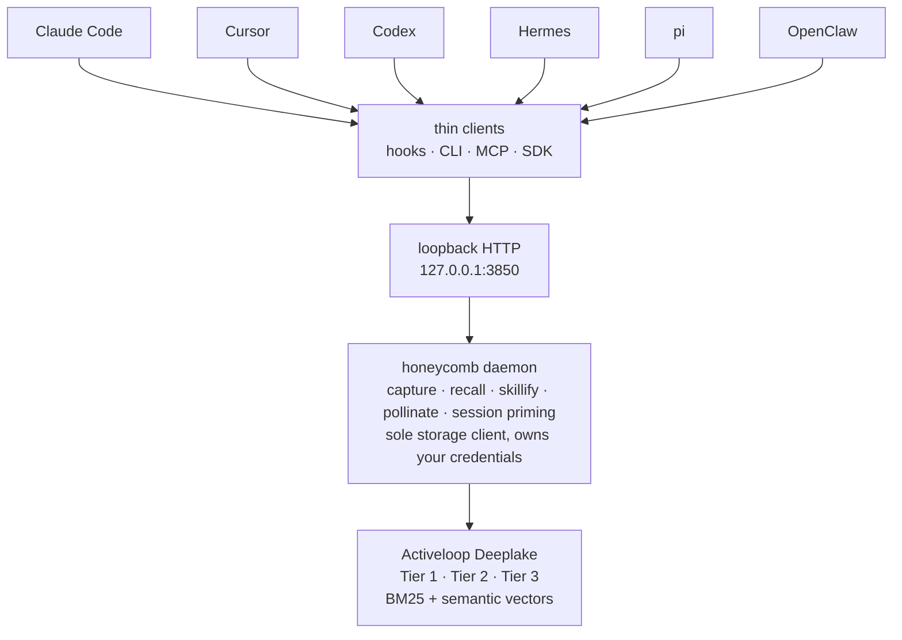
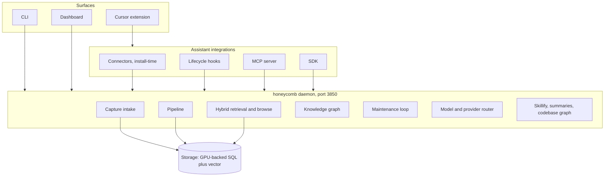
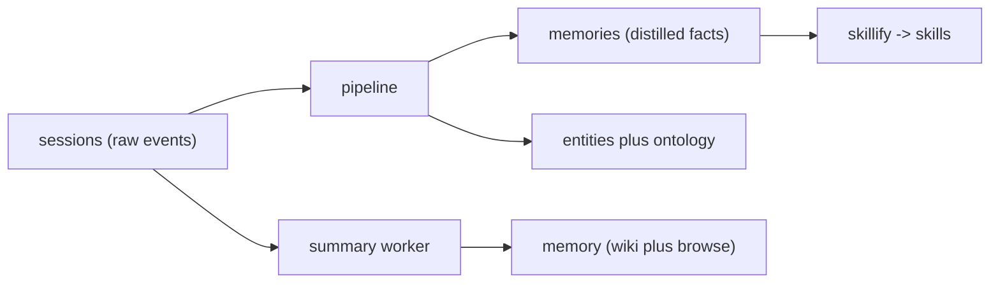
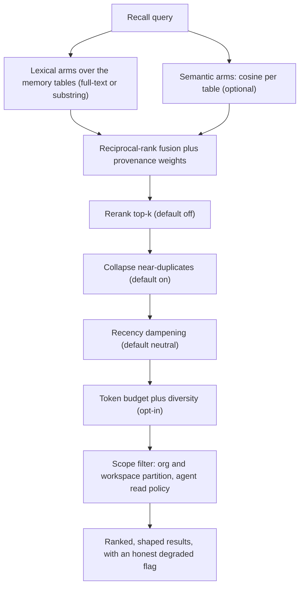
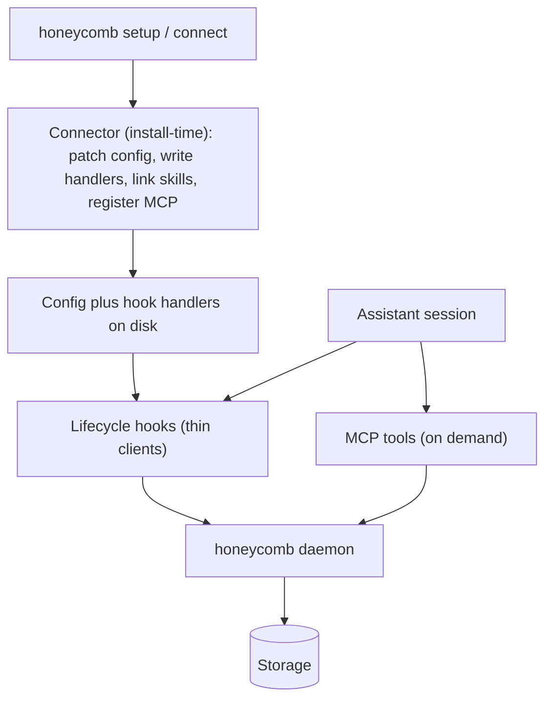
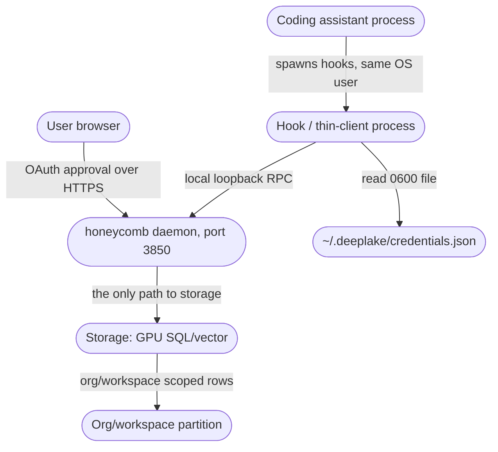
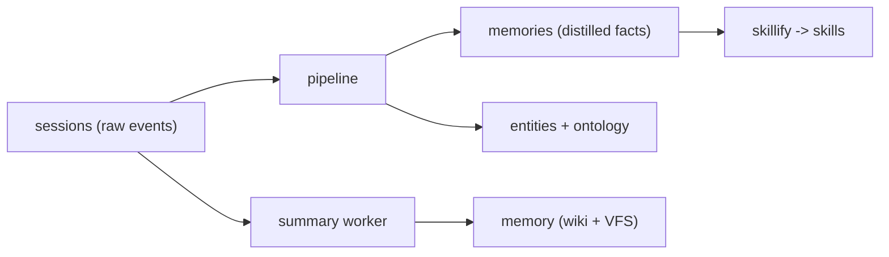
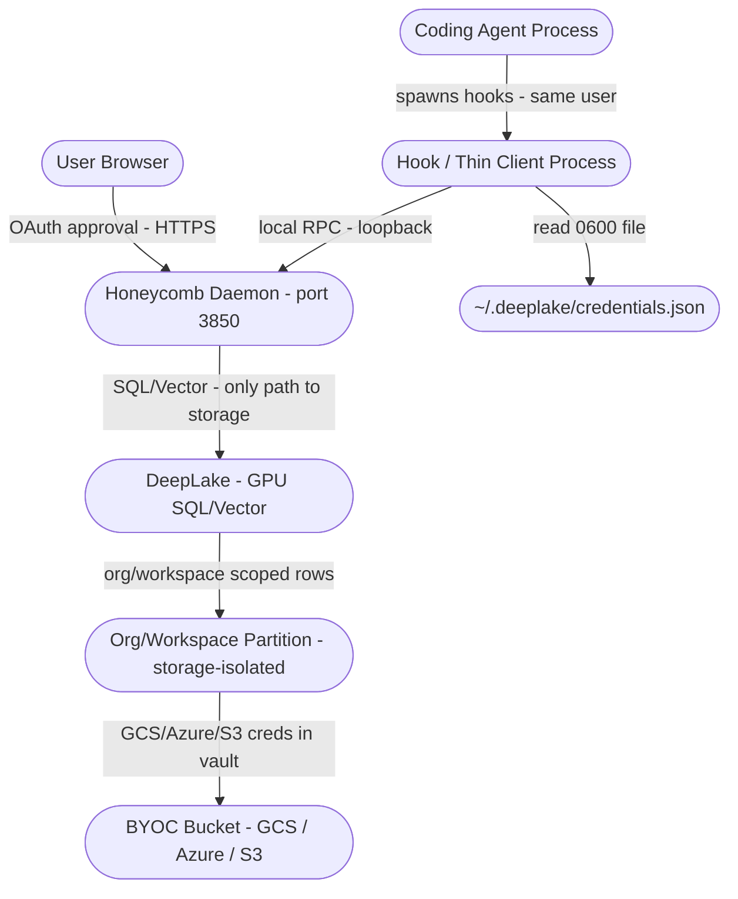
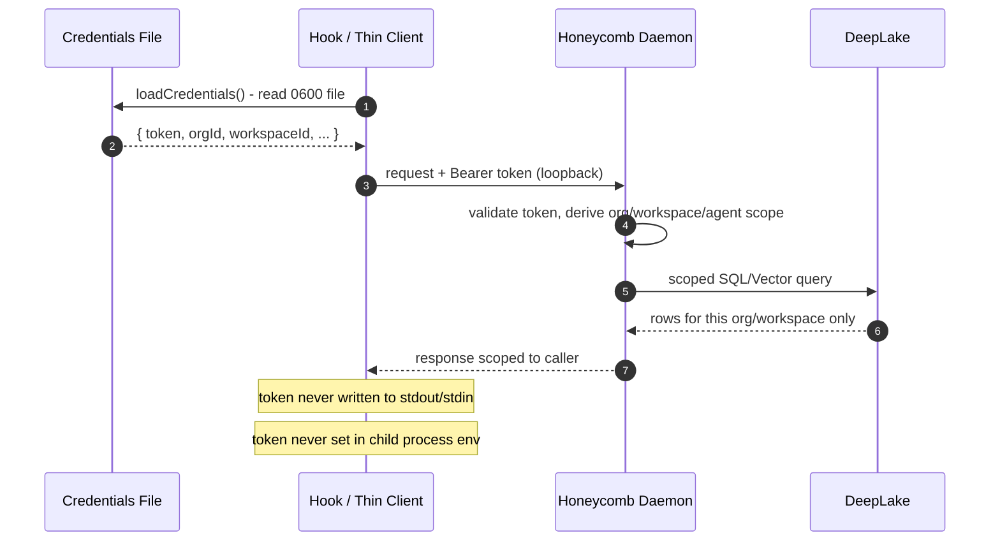

# Honeycomb: Technical Manual & Specification

*The daemon architecture, capture and recall pipeline, storage, knowledge graph, integrations, and full CLI/API/MCP reference.*

> **The Apiary** by Legion Code Inc., in collaboration with Activeloop.

## Foreword

Honeycomb is daemon-centric: write the memory logic once inside a daemon, then wrap it per assistant with thin shims. This manual is the complete technical account. It covers the four-plane architecture, how memory is captured and compacted, how it is stored in Deep Lake, the knowledge graph, the hybrid recall pipeline, harness integrations, and the security model, followed by the full CLI, HTTP API, and MCP tool reference. It is written for practitioners who need the real shape of the system.

## Honeycomb: Overview & Quickstart

### What makes Honeycomb different

A vector database can store text and hand it back by similarity. Honeycomb does that, and then keeps going. On top of [Activeloop Deeplake](https://deeplake.ai), **[Legion Code](https://github.com/legioncodeinc)** builds the memory system that turns raw recall into a brain your agents actually trust.

- ** Three-tier memory.** Every memory exists at three resolutions at once (one-line **key** → **summary** → full **raw** session). Agents skim the keys, then zoom into detail only when they need it. *(Legion Code)*
- ** Session priming.** At session start a tiny, bounded index (~300-800 tokens) of your most relevant keys is pushed once; the agent pulls deeper on demand. No per-turn injection, no "lost in the middle." *(Legion Code)*
- ** Skillify & propagation.** The daemon mines reusable skills out of real sessions, gates them for quality, and auto-pulls the team's latest skills into every agent at session start. Author a skill once; everyone gets it. *(Legion Code)*
- ** The pollinating loop.** A periodic maintenance pass reasons over accumulated memory and the entity graph to merge duplicates, prune junk, and supersede stale facts, so memory gets *sharper* over time, not noisier. *(Legion Code)*
- ** Knowledge graph.** An entity-centric, versioned, provenance-tracked index over your memories. Newer facts supersede stale ones; every claim traces back to the session that produced it. *(Legion Code)*
- ** Hybrid recall.** Lexical (BM25) and semantic (768-dim vectors) search fused by Reciprocal Rank Fusion, with a measured **recall@5 ≈ 0.72-0.78**. *(built on Deeplake)*
- ** Codebase graph.** A multi-language AST graph (TypeScript, JS, Python, Go, Rust, Java, Ruby, C/C++) of files, functions, and their call/import/extends edges, queryable for impact and neighborhood. *(Legion Code)*

### Install (one command)

No Node? No npm? No problem. The installer detects and sets up everything, then **opens a dashboard in your browser**. The terminal is just a progress log; the product is the first thing you touch.

```bash
# macOS / Linux
curl -fsSL https://get.theapiary.sh | sh
```

```powershell
# Windows (PowerShell)
irm https://get.theapiary.sh/install.ps1 | iex
```

That single line installs a current Node/npm if missing, installs **`@legioncodeinc/honeycomb`** globally, brings up the daemon on `127.0.0.1:3850`, opens the dashboard (Hive portal at `127.0.0.1:3853`), and sets up **[Doctor](https://github.com/legioncodeinc/doctor#readme)**, a tiny watchdog that keeps it all healthy (opt out with `--no-doctor`). Then:

1. The dashboard loads in a **pre-auth setup state**. No token ever touches your shell.
2. Click **"First time setup."** Honeycomb runs the Deeplake device-flow login *for* you, shows the code right on the page, and opens the verification tab.
3. Done. The same running daemon lights up its Deeplake-backed surfaces, and capture and recall go live.

> Already running **Hivemind**? The dashboard detects it, explains that running both is unsupported, and **"Proceed with Honeycomb"** migrates you cleanly. Prefer to inspect before you pipe? The script and a published `SHA256SUMS` are served from [get.theapiary.sh](https://get.theapiary.sh).

Prefer to build from source?

```bash
git clone https://github.com/legioncodeinc/honeycomb.git
cd honeycomb
npm install
npm run build          # tsc + esbuild → bundle/cli.js, daemon, harness, MCP, embed bundles

node bundle/cli.js setup     # detect your assistants, wire hooks, start the daemon
node bundle/cli.js status    # check the daemon and your environment
```

`setup` wires every coding assistant it detects and starts the loopback daemon; any storage command auto-starts the daemon if it is down. You'll need Activeloop Deeplake credentials; the device flow above writes them to the shared `~/.deeplake/credentials.json`.

> **Self-hosting the storage backend?** You can run Honeycomb against Activeloop's open-source [`pg_deeplake`](https://quay.io/activeloopai/pg-deeplake) Postgres extension instead of hosted Deeplake, and point Honeycomb at it with `honeycomb login --endpoint postgres://...` (direct) or `--endpoint https://...` (HTTP gateway), no Activeloop account required. See the self-hosting guide for the setup and the backend contract.

### Using the dashboard

The dashboard is **Hive portal at `http://127.0.0.1:3853`**, the one UI for the whole Apiary stack and the first thing the installer opens. Honeycomb's old in-daemon dashboard is retired; the daemon on `:3850` serves data, the portal serves the picture. Everything Honeycomb knows shows up there: KPIs up top (memories, turns, estimated savings, team skills), memory recall you can query by hand, the codebase graph, every captured turn, skill-sync status, and settings, hydrated server-side from the daemon's API. It doubles as the guided-setup surface for first-time login.

### Using the CLI

One unified `honeycomb` binary drives everything. Run `honeycomb --help` for the full list; these are the core verbs:

```bash
honeycomb install                    # one-shot install on a fresh machine
honeycomb setup                      # detect your coding assistants and wire hooks
honeycomb status                     # daemon + environment health at a glance
honeycomb daemon start|stop|status   # drive the daemon directly
honeycomb remember "<fact>"          # write a memory from anywhere
honeycomb recall "<query>"           # search the shared memory
honeycomb sessions                   # browse captured sessions
honeycomb skill                      # list, inspect, and sync mined skills
honeycomb goal                       # track goals across sessions
honeycomb sources                    # manage capture sources
honeycomb graph                      # query the codebase and knowledge graphs
honeycomb dashboard                  # open the dashboard (Hive portal, :3853)
```

### First memory, shared across tools

```bash
# Capture a decision once…
honeycomb remember "we deploy from the prd-022 branch, never from main"

# …recall it anywhere: same daemon, same Deeplake, any harness
honeycomb recall "how do we deploy"
```

Write it from Claude Code; recall it from Cursor tomorrow on a different laptop. That's the whole point.

### How it works

Honeycomb is a long-lived local **daemon** plus thin clients. The daemon is the *only* process that talks to storage. Every harness, the CLI, the MCP server, and the SDK reach it over loopback HTTP. One shared memory behind one boundary; your Deeplake credentials in exactly one place.



- **Capture on every turn.** Per-harness hooks stream each turn to the daemon, which distills and persists it: always-on, cheap, and soft-failing so a capture error never breaks your agent's turn.
- **Recall through the daemon.** Any harness asks for relevant memories; the daemon runs the query and returns results already scoped to your org and workspace. The client never sees a storage handle or a line of SQL.
- **Shared by construction.** Every client reaches the same daemon and the same dataset, so a memory written from one harness is recallable from all of them.

### The three-tier memory system

This is the heart of what **Legion Code** adds on top of Deeplake. The same memory lives at three levels of detail at once, and the agent chooses how far to zoom:

| Tier | What it is | When it's used |
|---|---|---|
| **Tier 1 · Key** | One keyword-dense sentence per session or fact. The index. | Skimmed at session start during priming. |
| **Tier 2 · Summary** | A distilled recap: goals, decisions, blockers, outcomes. Carries the semantic embedding. | Pulled when a key looks relevant. |
| **Tier 3 · Raw** | The full session dialogue: exact turns and tool calls, never rewritten. | Resolved when the agent needs ground truth. |

Resolution is a **deterministic SQL join, not a fuzzy search**. `key → summary → raw` is a pointer walk down three Deeplake tables. Mining ("find the thing I didn't know to name") is where the hybrid vector + lexical search kicks in. Cheap when you're skimming, precise when you're zooming.

### Why Deeplake makes the difference

Most agent-memory tools bolt onto a vector-only store, which forces *every* access pattern through a similarity engine. Honeycomb's zoom model needs both exact joins **and** semantic search, and [**Deeplake**](https://deeplake.ai), the database for AI, gives it both natively:

- **SQL + vector in one engine.** The cheap skim and the deterministic zoom run as SQL; semantic mining runs as vector search; a single store serves both. No second database, no sync problem.
- **Versioned & append-only.** Writes bump a version instead of mutating in place, so memory's full history stays on disk. Supersession marks old facts stale without losing them, which is what makes the pollinating loop safe and auditable.
- **Hybrid lexical + semantic search.** BM25 and 768-dim `nomic-embed-text-v1.5` cosine arms, fused by Reciprocal Rank Fusion. Turn embeddings off and recall silently falls back to lexical, never an error, no quality cliff.
- **Built to scale & BYOC.** The same substrate that serves one developer's laptop serves an organization's entire history, in your own cloud bucket if you want it.

> Honeycomb stands on two shoulders: **[Deeplake](https://deeplake.ai)** gives the memories somewhere durable and queryable to live, and **[Hivemind](https://github.com/activeloopai/hivemind)**, Activeloop's open-source agent-memory project, is the foundation Legion Code extended into Honeycomb's multi-tier system.

### Supported harnesses

Honeycomb supports 3 harnesses in production (Claude Code, Codex, Cursor). Hermes, pi, and OpenClaw are in progress.

| Supported today | In progress |
|---|---|
| **Claude Code**, **Cursor**, **Codex** | **Hermes**, **pi**, **OpenClaw** |

`honeycomb setup` detects the ones you have installed and wires each idempotently; `honeycomb uninstall` reverses only Honeycomb's changes. A skill mined while you were in Cursor is auto-pulled and ready in Claude Code on your next session.

### Other interfaces

Beyond the CLI, three more ways to reach the same daemon and the same shared memory:

- **Dashboard.** Hive portal at `http://127.0.0.1:3853`, covered above. One front door for the whole stack; Honeycomb's data hydrates through it.
- **MCP server.** A [Model Context Protocol](https://modelcontextprotocol.io) server (bundled to `mcp/bundle`) exposing Honeycomb's read/resolve and search/mine tools to any MCP-capable host.
- **TypeScript SDK.** The `@legioncodeinc/honeycomb` client with framework subpath entries (`/react`, `/vercel`, `/openai`). The core entry is fetch-only and browser-safe; `react` and `ai` are optional peers.

 Status & Roadmap

Honeycomb is **production ready (v0.2.x)** and fully tested in live scenarios. We document what's real and flag what's opt-in.

**Production today**
- Capture-to-recall, proven end-to-end and live-tested against Deeplake (`npm run smoke:golden-path` with credentials).
- One-command install → guided dashboard setup, the loopback daemon, the unified CLI, per-harness hooks, the MCP server, and the SDK.
- Three-tier memory, session priming, skillify + propagation, the pollinating loop, the knowledge graph, and the codebase graph.
- Self-hosted backends: point the CLI at your own Postgres-backed Deeplake endpoint with `honeycomb login --endpoint`, with idle connection hibernation for scale-to-zero.

**Opt-in / by design**
- **Embeddings are opt-in.** Recall runs the lexical BM25 path by default; turning on the local embedding runtime (≈600 MB, model fetched on first warmup) adds 768-dim semantic recall. The fallback is silent and intentional; recall never errors when embeddings are unavailable.
- **The distillation pipeline is off by default** to avoid surprise model spend; enable it when you want background summarization and graph extraction.
- The daemon binds **loopback only** (single machine). Cross-device and cross-user sharing happen through Deeplake's org/workspace scope, not a remote daemon bind.

Full documentation and guides live at **[theapiary.sh](https://theapiary.sh)**; vote on what ships next at **[ideas.theapiary.sh](https://ideas.theapiary.sh)**.

### Development

```bash
npm install          # dependencies
npm run build        # tsc + esbuild → bundle/cli.js, the daemon, harness, MCP, and embed bundles
npm run ci           # the gate: typecheck + duplication (jscpd) + tests (vitest) + SQL-safety audit
```

`npm run ci` is the quality gate every change must pass.

### Credits

Honeycomb exists because two halves fit together:

- **[Activeloop](https://activeloop.ai/)** brings **[Deeplake](https://deeplake.ai/)** (the versioned, multi-modal database for AI with native vector + columnar indexing and hybrid search) and **[Hivemind](https://github.com/activeloopai/hivemind)**, the open-source agent-memory project Honeycomb is built upon.
- **[Legion Code Inc](https://github.com/legioncodeinc)** brings the multi-tier memory system (Tier 1 / 2 / 3 keys, summaries, raw), code base atlas memory architecture, auto healing service, session priming, automatic skill development & propagation, the pollinating loop, the knowledge graph, cross device cross repository cross team skill sharing, and the daemon architecture that turns Deeplake into a shared brain your coding agents read and write on every turn.

### License

Honeycomb is licensed under the **GNU Affero General Public License v3.0 or later** (AGPL-3.0-or-later).

Use it commercially or privately, free of charge. In return: keep the copyright and lic

## Architecture overview

### The concept

honeycomb gives your AI coding assistants one shared, lasting memory. A small program (the daemon) runs on your machine, watches what happens as you work across the assistants you already use, distills it into clean notes, and serves those notes back to any assistant that asks. The design problem honeycomb solves is that coding assistants share almost nothing at their integration layer, yet a real memory system needs a single place to run its pipeline, its knowledge graph, and its maintenance loops. honeycomb answers both: write the memory logic once inside a daemon, then wrap it per assistant with thin shims that are clients of that daemon.

### The four planes

honeycomb is daemon-centric. Everything points at the daemon, and only the daemon points at storage.



- **Surfaces** are how a person drives honeycomb: the CLI, the local dashboard, and the Cursor extension.
- **Integrations** are how external assistants reach it: install-time connectors, lifecycle hooks, the MCP server, and the SDK.
- **The daemon** is the runtime where all logic lives, on port `3850` by default.
- **Storage** is the substrate: a GPU-backed SQL and vector store where all durable state lives, isolated by organization and workspace.

### The shape of the loop

Capture, distill, recall, compound. An assistant hook captures every prompt, tool call, and response as a raw event. The daemon's pipeline distills those events into facts, entities, and skills, each with provenance back to the source. Recall serves the right context before the next turn through hybrid search and a browsable virtual filesystem. Over time, a maintenance loop and a skill miner consolidate what was learned, so memory gets sharper instead of noisier.

### The daemon as the only storage client

The single most important property of the architecture is that no process other than the daemon talks to storage. Hooks, the CLI, the SDK, and MCP tools assemble a request, hand it to the daemon over a local loopback connection, and render the response. They never open a storage connection themselves. This collapses the storage-facing surface to one process, which is where scoping, SQL construction and escaping, encryption, and schema healing all live. Adding a new assistant means writing a new thin shim, not a new engine; fixing the engine means editing the daemon, and every assistant inherits the fix.

### Surfaces to reach the daemon

A consuming assistant or application can reach the daemon four ways, all thin clients:

| Surface | Used by | Nature |
|---|---|---|
| Connectors | Install time | Patch the assistant's config, write hook handlers, link skills, register MCP. Run once, never at session time. |
| Lifecycle hooks | Every session | Map native lifecycle events to capture and recall calls on the daemon. |
| MCP server | MCP-speaking assistants | On-demand tool surface in the assistant's native tool list. |
| SDK | Applications and custom agents | A typed HTTP client (`@honeycomb/sdk`) over the daemon API. |

### Contracts that keep the planes apart

Three contracts hold the system together:

- **One storage client.** The daemon is the only process with a storage handle. A compromised or buggy client cannot reach storage directly or cross a tenant boundary, because the daemon re-derives scope from the validated token on every request.
- **One active runtime path per session.** A session can be reachable through more than one integration surface. The first path to touch a session claims it; a request from the other path on that session returns `409`. Stale claims expire and are swept, so a crashed assistant never locks a session forever.
- **Three-level tenancy.** Organization, then workspace, then project. Organization and workspace isolation is enforced at the storage layer, so two workspaces never share a row, partition, or index. Project is the soft inner ring that scopes recall to the repository the agent is working in without ever dropping a capture. Within a workspace, an `agent_id` and a visibility setting separate agents.

### Getting in

Onboarding is one command. The installer detects and sets up a Node runtime, installs the global package, brings the daemon up, and lands you on the dashboard, with sign-in driven from the dashboard rather than the terminal. The daemon does not need credentials to boot; it serves a guided-setup state until you sign in, then serves the authenticated views on the next request with no restart. See the getting started guide and the CLI reference.

### Where to read next

- Capture and memory: how a raw event becomes a structured fact.
- Recall and retrieval: how the right context is found and shaped.
- The knowledge graph: the ontology and the codebase graph.
- Harness integrations: how honeycomb plugs underneath six assistants.
- Data and storage: the table catalog and the storage patterns.
- Security model: trust boundaries, scoping, secrets, and telemetry.

## Capture and memory

### The concept

A memory starts life as raw text: a prompt, a tool call, a response. On its own that is searchable but dumb. The capture-and-memory path turns it into something the retrieval layer can reason over, discrete facts with confidence scores, entities and relationships, and hints about what questions the memory could answer later. The one rule that never bends is that a slow or failing model must never cost you a memory. The raw content is committed first; everything after that is enrichment that runs asynchronously, off the write path.

### Capture: from a session event to a row

Every assistant fires lifecycle events. honeycomb's per-assistant hooks are thin clients: when an event fires, the hook reads the credential, normalizes the assistant's native payload into the shape the daemon expects, and makes a local request to the daemon. The daemon writes one row per event into the raw `sessions` table. The hook builds no SQL, holds no storage handle, and decides no scope; it states what happened and lets the daemon persist it.

Three event types are captured:

- **Prompt events** record the user's prompt text.
- **Tool-call events** record the tool name, its input, and its response.
- **Assistant-response events** record the assistant's last message.

Each request carries session metadata (session id, working directory, permission mode, the native event name, and the `agent_id`) and an optional message embedding. Capture is append-only: readers reconstruct a session by concatenating its rows in order.

#### Capture opt-out

Setting `HONEYCOMB_CAPTURE=false` places honeycomb in read-only mode for sensitive workflows. In that mode the capture hooks still run but skip asking the daemon to write any trace data, and the table-ensure step is skipped. Recall and search still work. This is a per-session escape hatch for working with credentials, PII-heavy files, or regulated data.

### The pipeline: from a raw memory to a distilled fact

Once a raw memory is written, the daemon makes it smart. The work runs as durable jobs with a lease, complete, fail, and dead-letter lifecycle, exponential backoff, and a reaper for stale leases. Jobs survive a daemon restart.

```mermaid
flowchart TD
    capture["Raw memory written"] --> extract["Extraction (model): facts plus entity triples"]
    extract --> decide["Decision (model): add / update / delete / none"]
    decide --> writes["Controlled writes to the distilled-memory table"]
    writes --> graph["Graph persistence (separate write)"]
    graph --> hints["Prospective hints (model)"]
    hints --> done["Done"]
```

#### Extraction

The extraction worker leases a job and asks the model to decompose the memory into facts (each with content, a type, and a confidence between 0 and 1) and entities (triples of source, relationship, target). Input is capped and output is bounded (roughly 20 facts and 50 entities, with per-fact length limits). Invalid fields are logged and dropped rather than failing the whole job.

#### Decision

For each extracted fact, the decision stage runs a hybrid search for the few existing candidates and asks the model what to do: add, update, delete, or none, with a target memory, a confidence, and a reason. With no candidates it proposes an immediate add without a model call. Every proposal, applied or not, is recorded to an audit history. That history is what makes shadow mode and audits possible.

#### Controlled writes

This is the only stage that mutates the distilled-memory table. Embeddings are prefetched before the write so no network call happens while committing. An add proposal must clear a minimum fact confidence (default 0.7), have non-empty normalized content, and not collide with an existing content hash (a content-hash check returns the existing memory rather than inserting a duplicate). Updates and deletes run a contradiction check, are flagged for review, and apply only when explicitly allowed, landing as append-only, version-bumped writes rather than in-place edits.

#### Graph persistence and prospective hints

After the memory write commits, graph structure is written separately: entities upsert by canonical name, relationships by their triple, and mention links insert-or-ignore so reprocessing is idempotent. A failure here logs a warning and does not revert the facts already written, because the facts matter more than the edges. Finally, if hints are enabled, a pass generates hypothetical future queries the memory would answer and indexes them, so retrieval can match a query against the hint, not only the literal text.

### Default posture: nothing surprises you with model spend

The pipeline worker is constructed and started on every daemon boot, but the stage handlers default **off** by design, so no model spend happens without an explicit opt-in. Stages are enabled individually through `HONEYCOMB_PIPELINE_*` environment variables (or the equivalent `agent.yaml` flags).

| Flag | Effect |
|---|---|
| `enabled` | Master switch. Off means no extraction jobs are processed. |
| `shadowMode` | Run extraction and decision but write nothing; proposals are logged to history. |
| `mutationsFrozen` | Emergency read-only brake; supersedes shadow mode. |
| `graph.enabled` | Enable graph reads, traversal, and recall boosting. |
| `graph.extractionWritesEnabled` | Let background extraction persist entity triples. |
| `autonomous.enabled` | Allow scheduled maintenance and retention. |
| `autonomous.frozen` | Hard stop on maintenance even when autonomous is enabled. |
| `hints.enabled` | Run prospective-hint generation at write time. |

Default flag states can change between versions; confirm the defaults that ship with your installed version.

### Embeddings

When embeddings are enabled (the default), captured turns and deliberately stored memories land with a real 768-dimension vector from a local embedding model (`nomic-embed-text-v1.5`), downloaded once and warmed in the background. The vector dimension is locked end to end against the storage columns and the model output; a vector of the wrong dimension is rejected rather than silently written. Turning embeddings off (`HONEYCOMB_EMBEDDINGS=false`) makes recall use its lexical fallback. The retrieval side of this is covered in recall and retrieval.

### The other workers

Beyond the write-path stages, the daemon runs background workers on their own schedules: a document worker that ingests URLs and files, a retention worker that runs batch-limited purges, a maintenance worker that runs diagnostics and either logs recommendations or executes repairs, a summary worker that writes the canonical transcript and summary at session end, and a synthesis worker that regenerates a rebuildable `MEMORY.md` projection from durable memories and the session ledger.

### Where to read next

- Recall and retrieval: how distilled memory is found and shaped.
- The knowledge graph: the ontology these writes feed.
- Data and storage: the table catalog.
- Harness integrations: the hooks that feed capture.

## Data and storage

### The concept

All of honeycomb's durable state lives in tables on a GPU-backed SQL and vector store. The daemon is the only process that opens that store; everything else reaches it through the daemon. The storage layer has a few unusual properties that shape every table and every write pattern, so it pays to understand them before reading the catalog.

### Storage properties a practitioner must know

- **Lazy schema healing.** Tables and columns are created on first write, not through an upfront migration. A new column added with a safe default is filled in on the next heal pass, so adding a field does not require a migration step ahead of the worker that writes it. Schema changes are additive.
- **No parameterized queries.** The query endpoint takes no bound parameters, so the daemon builds SQL by string composition and escapes every value itself through dedicated helpers. This is why all SQL construction lives in one place (the daemon) and never in a client.
- **Append-only, version-bumped writes.** The backend coalesces updates in a way that can silently drop concurrent edits, so honeycomb does not lean on naive in-place updates for hot tables. The current state of a versioned row is its highest version; a change appends a new version rather than mutating the old one.
- **Select-before-insert with drift detection.** Writes that must be unique check for an existing row first and re-verify after, making concurrent-writer races observable rather than silent, because the backend has no server-side unique constraint to lean on.
- **Tenant isolation at the storage layer.** Organization and workspace isolation is enforced at the storage partition, so two workspaces never share a row, partition, or index. Most tables therefore do not need explicit tenancy columns; a few cross-cutting tables carry explicit organization and workspace ids.

### The three "memory" tables

Three tables are easy to confuse because they all hold something called memory. Fix them first.

| Table | Holds | Written by |
|---|---|---|
| `sessions` | The raw capture stream, one row per event | Capture |
| `memories` | The distilled engine output, the facts the pipeline decided to keep | The pipeline |
| `memory` | Wiki summaries and the virtual-filesystem file rows | The summary worker |

Capture writes `sessions`; the pipeline reads `sessions` and writes `memories`; the summary worker writes `memory`.



- **`sessions`** holds one row per prompt, tool call, or response. Its message body is structured JSON, with an optional vector. Rows are append-only inserts; readers concatenate by path in time order.
- **`memory`** holds wiki summaries and browse-surface file rows. It is update-or-insert keyed by path and carries a one-line key for fast session priming.
- **`memories`** is the engine's distilled output, with confidence, importance, provenance, a dedup hash, a soft-delete flag, and scope columns. It is the table recall ranks over. Each row carries a durable one-sentence key written at distillation time so the session-priming digest can skim durable keys with a pure SQL select and no generation at read time.

### The distilled-memory schema (illustrative)

```sql
CREATE TABLE IF NOT EXISTS "memories" (
  id                 TEXT NOT NULL DEFAULT '',
  type               TEXT NOT NULL DEFAULT 'fact',
  content            TEXT NOT NULL DEFAULT '',
  key                TEXT NOT NULL DEFAULT '',
  normalized_content TEXT NOT NULL DEFAULT '',
  content_hash       TEXT NOT NULL DEFAULT '',
  confidence         FLOAT4 NOT NULL DEFAULT 1.0,
  importance         FLOAT4 NOT NULL DEFAULT 0.5,
  tags               TEXT NOT NULL DEFAULT '[]',
  project            TEXT NOT NULL DEFAULT '',
  project_id         TEXT NOT NULL DEFAULT '',
  source_id          TEXT NOT NULL DEFAULT '',
  source_type        TEXT NOT NULL DEFAULT '',
  pinned             BIGINT NOT NULL DEFAULT 0,
  is_deleted         BIGINT NOT NULL DEFAULT 0,
  agent_id           TEXT NOT NULL DEFAULT 'default',
  visibility         TEXT NOT NULL DEFAULT 'global',
  content_embedding  FLOAT4[],
  created_at         TEXT NOT NULL DEFAULT '',
  updated_at         TEXT NOT NULL DEFAULT ''
) USING deeplake;
```

The `key` column is additive and heal-compatible; a row with no derived key falls back to its content at read time, so a legacy un-keyed row is still primeable.

### The rest of the catalog

| Group | Tables | What they hold |
|---|---|---|
| Engine support | `memory_history`, `memory_jobs`, `embeddings` | The audit trail of every proposal, the durable distillation job queue, and the vectors mirrored for GPU search. |
| Knowledge graph | `entities`, `entity_aspects`, `entity_attributes`, `entity_dependencies`, `memory_entity_mentions`, `epistemic_assertions`, `ontology_proposals` | The ontology, with supersession by appended attribute version. |
| Sources and documents | `memory_artifacts`, `documents`, `document_memories`, `connectors` | Source-backed rows keyed by source id, the ingest lifecycle, the document-to-chunk join, and external-connector sync cursors. |
| Product tables | `skills`, `rules`, `goals`, `kpis`, `codebase` | Mined skill versions, org-wide rules, goals and KPIs, and codebase-graph snapshots. |
| Tenancy and auth | `agents`, `api_keys`, `projects`, `synced_assets` | The within-workspace agent roster and read policies, hashed connector keys, the per-workspace project registry, and the team asset-sync substrate. |
| Telemetry | (opt-in counters and an optional recall-quality ledger) | Usage counters and diagnostics; never carries secrets or request bodies. |

Skills and rules are append-only and version-bumped (the current state for a logical key is the highest version). Goals and KPIs are update-or-insert by their logical key. Snapshots in `codebase` are one row per repository-checkout identity, deduped by a content hash.

### Per-project scoping

Tenancy has a third, soft ring inside a workspace: the project. A `projects` registry records the projects a folder can bind to. Memory and skills carry a resolved project id that the scope clause segments on, defaulting to a reserved per-workspace inbox so a capture is never dropped when no project resolves. A project is a registry-backed identity, not a repository id; a canonical git remote is only an optional auto-bind signal. Cross-project sharing of a skill is an explicit, auditable opt-in recorded directly on the row.

### The memory virtual filesystem

honeycomb presents the team-shared database as an ordinary directory and intercepts the shell commands that touch that mount, so an assistant browses memory with `cat`, `ls`, `grep`, and `find` while every operation is really a scoped query. No real files exist at these paths: every read hits an in-memory cache, a pending-write buffer, or a query, and every write is buffered and flushed on a timer.

Three things the intercept hides from the agent:

- **Write batching.** A read immediately after a write reads from the pending buffer, so the agent sees its own write even before it reaches storage.
- **The multi-row session layout.** A session "file" is dozens of rows concatenated transparently. Session files are read-only at this layer; attempts to write, append, remove, copy, or move them are rejected, because they are an append-only event log owned by capture.
- **The structured goals and KPIs tables.** Goals and KPIs appear as plain markdown files, so an agent manages objectives with file operations while the CLI reads the same state from typed columns. Goal lifecycle is expressed through file verbs: removing a goal file is a soft close (status flipped, the row preserved for the audit trail), and moving a goal between status folders is a status transition that may change only the status component.

A synthesized index file at the mount root lists the most recent summaries and sessions, and a synthesized subtree renders the codebase-graph queries from the local snapshot. The same browse view is produced by both the long-lived shell object and the stateless pre-tool hook, sharing one renderer so they never disagree.

### Retention

Because the backend exposes no transactions at this layer, retention runs as batched, idempotent sweeps in a daemon worker rather than cascading deletes.

| Data | Default behavior |
|---|---|
| `sessions` raw events | Pruned by the sessions-prune operation; summaries retained in `memory` |
| `memories` | Soft-delete window before purge; history retained longer |
| `memory_jobs` | Completed jobs purged after a window; dead jobs later |
| `memory_artifacts` | Soft-delete on source-file removal, hard purge on source disconnect by source id |
| `skills` / `rules` | Append-only version history retained |
| Embeddings / vectors | Purged with their owning row during retention sweeps |

### Where to read next

- Capture and memory: the pipeline that writes these tables.
- Recall and retrieval: how recall ranks over them.
- The knowledge graph: the ontology and codebase tables.
- Security model: how rows stay in their tenant lane.

## The knowledge graph

### The concept

honeycomb keeps two graphs, and they answer different questions. The **memory knowledge graph** (the ontology) captures what was learned: the entities, claims, and relationships distilled from your sessions. The **codebase graph** captures how your code is actually wired: files, symbols, and the edges between them, extracted straight from source. Recall over raw traces tells an agent what was discussed; these graphs tell it what is true and how the code connects.

---

### Part one: the memory ontology

The pipeline that distills memories also writes graph structure. The ontology is a set of related concepts:

- **Entities** are canonical things (a service, a person, a convention), keyed by canonical name and carrying a type and an agent scope.
- **Aspects** are weighted dimensions of an entity.
- **Attributes** are claim values about an entity. Each attribute carries a kind, a status, a claim key that names the slot it fills, a group key, and a version.
- **Dependencies** are audited edges between entities, each with a type, a strength, a confidence, and a required reason for loose links.
- **Mentions** join a memory to the entities it references.
- **Assertions** record the epistemic act: who claimed, believed, observed, decided, preferred, denied, or questioned something.
- **Proposals** are the audited control plane for changes to the ontology.

#### Supersession instead of mutation

The storage backend cannot safely update a row in place, so the ontology never mutates a claim. When a claim changes, a new attribute version is appended and the prior one is marked superseded. Readers resolve a claim slot by its highest version, so the current value wins and the history is preserved. This is the same append-only discipline the rest of honeycomb uses, and it is why recall can keep a stale claim off the result set with a pure version comparison rather than a destructive edit.

#### How the ontology earns its place in recall

Graph traversal is one of recall's candidate channels: a high-degree entity can surface related memory identifiers. As with every other channel, it produces identifiers only, and the scope filter authorizes them before any content loads, so a strong graph hit can never leak content past an agent's read policy. Graph reads, traversal, and recall boosting are gated by the pipeline's graph flags, so an operator can run the engine with or without graph influence.

---

### Part two: the codebase graph

The codebase graph subsystem extracts files, symbols, and relationships directly from source, so an agent can ask "who calls this function", "what is the blast radius of changing this symbol", or "walk me through this subsystem" and get answers grounded in the current checkout rather than in prose.

The output mirrors the NetworkX node-link JSON format (a directed multigraph), so any tool that understands NetworkX graphs can consume a snapshot. The feature is AST-only: it uses tree-sitter parsers, never a language server, a type checker, or an LLM, which keeps builds fast and deterministic. Nine languages are supported: TypeScript, JavaScript, Python, Go, Rust, Java, Ruby, C, and C++.

#### The build pipeline

A build walks the repository, extracts every supported source file, aggregates one snapshot, and writes it to disk. Source discovery prefers git's own ignore engine so it honors `.gitignore` exactly, with a manual walk as a fallback when git is unavailable. Each file is content-hashed and looked up in a per-file cache before extraction, so a rebuild after a one-file change takes tens of milliseconds rather than seconds. Extraction routes each file to a language-appropriate extractor that produces a uniform shape, which keeps the snapshot builder language-agnostic.

#### The node and edge model

A node represents one code construct, with an id formatted `::`.

| Node field | Meaning |
|---|---|
| `id` | Unique key within a snapshot |
| `label` | Display name |
| `kind` | `function`, `class`, `method`, `interface`, `type_alias`, `enum`, `const`, `variable`, or `module` |
| `source_file` | Repository-relative path |
| `source_location` | A line or line range |
| `language` | One of the nine supported languages |
| `exported` | Whether the symbol is exported |
| `fan_in`, `fan_out`, `is_entrypoint` | Derived after cross-file resolution |

Edges are directed and typed. The relation is one of `imports`, `calls`, `extends`, `implements`, or `method_of`, and each carries a confidence (current edges are almost entirely concrete AST facts).

#### Cross-file resolution is high-confidence only

After every file is extracted, three passes turn per-file placeholders into real cross-file edges, and ambiguous cases are dropped rather than guessed. The calls pass resolves a call only when it matches a named or namespace import whose export exists in a resolvable local file; default imports, bare package specifiers, path aliases, barrel re-exports, instance dispatch, and dynamic imports are deliberately skipped. The imports pass repoints an import edge to the real module when the specifier resolves to a known repository file and keeps an `external:` marker otherwise, so "our code versus a dependency" stays distinguishable. The heritage pass resolves `extends` and `implements` to a same-file or named-import base type.

This is an honest limitation worth surfacing to consumers: because cross-file calls are resolved only for relative named and namespace imports, a symbol reading "incoming (0)" is **not** proof of dead code. A caller may reach it through an unresolved import path.

#### Deterministic, content-addressed snapshots

A snapshot is canonicalized before it is hashed or written: nodes and edges are sorted, and the JSON is serialized with sorted keys and no inserted whitespace, so the same code always serializes to the same bytes. The content hash covers only the stable graph fields and deliberately excludes volatile observation metadata (timestamp, branch, worktree, generator version), so two builds of identical code on different worktrees or at different times produce the same hash and dedup correctly. Snapshots are written atomically, so a crash leaves either the old file or the new one, never a partial.

#### Cloud sync and the query surface

A successful build best-effort pushes the snapshot to the cloud when you are authenticated; the local snapshot is the source of truth, and a push failure never blocks the build. The push uses a select-before-insert with drift detection: an identical hash is a no-op, a different hash for the same commit logs a drift warning and refuses to overwrite (because the same commit producing different content means extractor drift a human should investigate), and a missing row inserts. A teammate can pull the freshest snapshot for the current `HEAD`.

Agents read the graph through a synthesized query surface that renders text on the fly from the local snapshot:

| Query | Returns |
|---|---|
| Overview | Commit, node and edge counts, kind breakdowns, top files, limitations |
| Find | Substring and fuzzy search on node id and label |
| Show | Full node detail plus incoming and outgoing edges by relation |
| Impact | Transitive dependents (blast radius) of a symbol |
| Neighborhood | Symbols in a file plus their cross-file neighbors |
| Layers | Architectural subsystem grouping by path heuristic |
| Tour | A deterministic dependency-ordered walkthrough |
| Path | The shortest path between two symbol patterns |

The renderers carry an honest caveat: a snapshot whose source files have been edited since the build is stale and should be cross-checked against live source.

### Where to read next

- Capture and memory: the pipeline that writes the ontology.
- Recall and retrieval: traversal as a recall channel.
- Data and storage: the tables behind both graphs.
- CLI reference: the `honeycomb graph` commands.

## Recall and retrieval

### The concept

Recall is the moment honeycomb earns its keep: before the next turn, it hands the assistant the right context. That has to be four things at once. **Cheap**, because it cannot run a model on every query by default. **Scoped**, because it must never return a memory the requesting agent is not allowed to see. **Current**, because a superseded fact must not outrank the fact that replaced it. And **shaped**, because the few results that reach the assistant should be the distinct, fresh, relevant ones, not five paraphrases of one fact, and not a six-month-old claim above last week's.

### How a query flows



### Lexical and semantic arms

Recall runs a combined query over three tables: the durable distilled facts, the per-session summaries, and the raw dialogue rows. Each arm is separately guarded, so a missing sibling table degrades that one arm to empty rather than failing the whole recall. The lexical arms use full-text search when the index is present and fall back to a substring match when it is not.

When embeddings are enabled, the query is embedded and a cosine arm runs per table, scored as a normalized cosine in the range 0 to 1. Vectors are stored as tensor columns and searched on the GPU-backed engine, so the similarity filter and the scope filter run in one query rather than against a separate vector index.

### Semantic recall is the default

A fresh signed-in user gets hybrid lexical plus 768-dimension semantic recall out of the box. Sign-in provisions and warms the local embedding model in the background, so the cosine path is what a real user hits. The system is honest about when it is degraded: recall reports `degraded: false` when the semantic arm actually ran, and `degraded: true` only on a genuine fallback, embeddings explicitly off, the model still warming, the embed worker unreachable or crashed, a per-call timeout, or a malformed response. In every degraded case recall still answers from the lexical arms. **Recall never throws and never hangs on the embedding path**, because a degraded answer beats an error for an agent's turn.

### Fusion: provenance-forward ranking

Recall hits carry a real, comparable score, and results are ordered by relevance, never by arm order and never by a client-side fabrication. The per-arm ranked lists are blended with Reciprocal Rank Fusion, which is scale-free and needs no calibration between the lexical and semantic score scales. Two shaping rules ride the fusion:

- **Provenance weights** fold source quality into the rank: distilled summaries weight higher than raw session rows, so a raw tool-call blob needs a materially stronger signal to outrank a clean distilled fact. Distilled facts above raw dumps is the product-correct order.
- **Identity dedup** collapses the same source-plus-id across arms, and every hit keeps its source and scope provenance.

A note for practitioners: the storage backend ships a native hybrid operator that fuses vector and full-text in one statement. honeycomb deliberately does **not** use it, because measured evaluation found it did not beat the in-house fusion. "Hybrid" here means SQL for structure plus vector for similarity, fused in honeycomb's own reciprocal-rank step, not the backend's native operator. Treat that as a settled decision unless your installed version's documentation says otherwise.

### The shaping stages

Above the fusion floor, recall runs four shaping stages in a fixed order, each wired into the live pipeline behind an honest default that was measured (or measured neutral) on a committed evaluation set. The defaults are deliberately conservative: ship the behavior that measurably helps, and leave the rest opt-in.

| Stage | Default | What it does |
|---|---|---|
| Reranker | off (fusion order unchanged) | Re-scores the top-k by raw cosine of the query against candidate embeddings. Real and wired, dormant by default after a measured near-zero lift. Timeout-budgeted; on timeout it keeps the prior order. |
| Semantic dedup | on | Collapses near-duplicate hits whose embeddings exceed a similarity threshold, keeping the highest-provenance copy (memory over summary over session). Fails soft to the un-deduped list. |
| Recency dampening | neutral (near-infinite half-life) | A multiplicative age decay on the fused score; demotes stale rows, never a hard cutoff, never drops a row by age. Neutral until a caller tunes it. |
| Token budget and diversity | opt-in (engages on a positive token budget) | Fills a token budget with a maximal-marginal-relevance selection, trading a little pure relevance for diversity. With no budget, the unchanged top-k path runs. |

Default stage states can change between versions; confirm them against your installed version.

### The authorization boundary

Recall is where scoping has to be exactly right, because the candidate channels (full-text, vector, graph traversal, hints) cast a wide net. The defense is ordering: those channels produce memory identifiers only, and the scope filter authorizes candidates **before** any content loads. Every content-bearing stage that follows (reranking, summaries, transcript expansion, access tracking) runs only on the authorized set. A strong vector hit or a high-degree entity can surface an identifier, but it cannot leak content past the read policy. The outer ring (organization and workspace) is enforced at the storage partition beneath this, so even a buggy inner clause cannot cross a workspace boundary. The full scope model is in the security model.

### Currentness

Superseded facts are kept off the result set by the append-only model itself: a soft-delete flag and a superseded status exclude stale versions at query time, and readers resolve by the highest version, so a newer fact in the same slot outranks the one it replaced. Recency dampening is a soft freshness signal layered on top of this hard version invariant; the two are complementary, not redundant.

### The browse surface

Beyond scored recall, agents can browse memory as a virtual filesystem: ordinary shell commands against a memory mount, intercepted and routed to scoped queries. From the agent's point of view it is browsing files; underneath, each operation is a query against the session and memory tables. This is the explicit, agent-driven recall that bypasses the inject-on-confidence rule. Either way, scored recall or browse, the same authorization boundary applies before any content is returned. The browse mechanics are covered in data and storage.

### How recall is measured

Every ranking change is provable on a committed evaluation set, not asserted. A harness scores a hand-curated set of query-to-expected-memory pairs (deliberately including pairs with no surface-token overlap, so the set exercises the semantic lift) on recall at k, mean reciprocal rank, and a position-discounted graded-relevance metric. A committed baseline is enforced: a change that regresses it fails. This is what lets the "semantic on by default" posture and each shaping default be defended by measurement rather than by claim.

### Where to read next

- Capture and memory: how the facts recall ranks over are produced.
- The knowledge graph: traversal as a candidate channel.
- Security model: the scope and visibility rules recall enforces.
- MCP tools reference: the recall and browse tools.

## Harness integrations

### The concept

honeycomb does not try to be another agent shell. It runs underneath the coding assistants people already use and gives them one shared memory layer. The hard part is that every assistant exposes a different extension surface, and they share almost nothing at the integration layer. The answer is to write the memory logic once inside the daemon and wrap it per assistant with a thin shim. Adding an assistant means writing a shim and a connector, not a memory engine.

honeycomb wires six assistants: **Claude Code, Codex, Cursor, Hermes, pi, and OpenClaw**. Each reaches the daemon through the same surfaces, and the daemon, the only process that touches storage, does the real work behind every one.

### Three surfaces, one daemon

An assistant reaches honeycomb through three kinds of surface, all thin clients of the daemon. None touch storage directly.

- A **connector** is install-time. It runs once during `honeycomb setup` or `honeycomb connect `, patches the assistant's config, writes the compiled hook handlers, links team skills into the assistant's locations, and registers the MCP server where the assistant speaks MCP. Connectors never run at session time.
- A **hook** is a lifecycle event the assistant fires that calls the daemon. Hooks are how capture and automatic recall happen.
- An **MCP server** is the on-demand tool surface a registered server a harness invokes to ask for memory operations explicitly.



### The connector contract

Every per-assistant connector is a subclass of a shared base. The base owns install and uninstall and all the shared mechanics; a subclass overrides only four small seams: where the assistant keeps its hook config, which compiled handlers to write, where to link skills, and the native event-name map. All filesystem access goes through an injectable seam, so a connector is testable against an in-memory filesystem and a real config directory is never touched in a test.

Two invariants make a connector safe to run repeatedly:

- **Idempotent.** Every honeycomb config entry is stamped with a sentinel field. On re-install, the connector filters its own prior entries out by that sentinel, appends fresh ones, and writes the config only if the serialized bytes changed. A no-change re-run writes nothing, so the assistant's hook-trust fingerprint is unchanged and no re-trust dialog appears. This is why `honeycomb setup` is safe to run on every upgrade.
- **Foreign-safe.** A third-party hook never carries the sentinel, so honeycomb never reclaims it. Install preserves foreign entries verbatim; uninstall removes only honeycomb's entries and only honeycomb's skill links. A real directory or a foreign symlink at a target path is left untouched.

### Capability detection

Each connector reports whether its assistant is installed by checking that the assistant's config root exists on disk. The CLI drives the registry off that probe: `honeycomb setup` wires every detected assistant, `honeycomb connect ` wires exactly one, and `honeycomb uninstall` reverses only honeycomb's footprint for one assistant or for every detected one.

### The support matrix

Each assistant wires the same logical lifecycle events through its own mechanism; the shim normalizes the native event names and payloads into the daemon's shared shape.

| Assistant | Surfaces | Notes |
|---|---|---|
| Claude Code | Marketplace plugin plus hooks plus MCP | Reference connector and reference hook set; model-only context channel |
| Codex | Config-file hooks plus MCP | Nested matcher-block config shape; user-visible context |
| Cursor | Config hooks plus first-party extension plus MCP | Flat per-event config shape; editor extension; normalizes its shell tool to the canonical shape |
| Hermes | Skill plus shell hooks plus MCP | Terminal-only tool capture; user-visible context with an MCP-tools mention |
| pi | Managed extension plus an `AGENTS.md` marker block | On-demand recall; context from the static marker block |
| OpenClaw | Native extension (flagship) plus connector plus MCP | Batches capture at the end of an agent run; auto-routes the agent from the session key |

The differences are real but shallow: native event names and payload fields vary, and the context channel is model-only on some assistants and user-visible on others, so each shim normalizes before handing off and renders the context block through its assistant's channel.

### The hook lifecycle

Each assistant maps its native events onto a shared set of logical events. A blank in one assistant's column does not mean a gap in coverage: OpenClaw, for example, batches capture across the whole conversation at the end of a run rather than per event, producing the same rows the daemon would have written incrementally; pi reads its session-start context from a static marker block rather than a live event.

| Logical event | What it does |
|---|---|
| Session start / recall inject | Load credentials, heal token drift, self-update, ensure tables, render the rules and goals context block plus the memory-prime digest, auto-pull team skills and assets, spawn a graph-pull worker, return context. |
| Prompt capture | Send the user's prompt as one capture request. |
| Pre-tool intercept | Route memory-path tool calls to daemon-backed reads and searches (the browse surface). |
| Tool-call capture | Send the tool name, input, and response as one capture request. |
| Assistant-response capture | Send the assistant's last message; optionally evaluate a trigger that can fire the skill miner. |
| Session end / summary | Mark the session ended, record usage, fire skill mining, and spawn the summary worker. |

Every hook is a thin client: it reads the credential, normalizes the payload, and makes a local request to the daemon. The hook builds no SQL, holds no storage handle, and decides no scope. The cross-assistant logic (the session-start sequence, capture, the browse intercept, session end, context rendering) lives in a shared core that every shim routes through, so a Cursor shell tool and a Claude Code bash tool reach the same shared intercept.

#### The session-start auto-pull seam

The session-start step that makes team collaboration feel live is the auto-pull. On every session start the hook asks the daemon to pull the latest team skills and portable assets. Both pulls are idempotent (a re-pull of a version already on disk writes nothing), fail-soft (any error, daemon down, non-200, refused socket, or timeout, is swallowed so session start is never blocked), and time-budgeted (a short abort timer, so a hung daemon never delays the first turn). Both honor a kill switch (`HONEYCOMB_AUTOPULL_DISABLED=1` for skills, `HONEYCOMB_ASSET_AUTOPULL_DISABLED=1` for assets). This is why a teammate's freshly mined skill or promoted asset becomes visible within seconds of publication.

#### The browse intercept

Before a tool runs, the pre-tool hook looks for memory-path tool calls and rewrites the result from the daemon's response: `cat` or `Read` on a path becomes a direct row read, `grep` or `Glob` becomes a hybrid search, `ls` becomes a path-prefix listing, and `find` becomes a path-pattern query. Write and edit on a memory path are denied with guidance to use the CLI instead, and commands the browse layer cannot model are rewritten to a harmless no-op. Coverage differs by assistant (some intercept the shell tool, some terminal tools only, some have no intercept), but the normalized shape means the same daemon-backed intercept applies wherever it runs.

### MCP registration at install

For assistants that speak MCP, the MCP server is registered during install so its tools appear in the assistant's native tool list, with no separate "add an MCP server" step for the user. The server ships as a self-contained bundle and is registered as a stdio entry; the daemon additionally serves an HTTP transport for HTTP-speaking clients. The tool surface is documented in the MCP tools reference.

### Identity sync

A workspace `AGENTS.md` file is the source of truth for operating instructions, and the daemon's file watcher syncs it into each assistant's identity file, each copy stamped do-not-edit. A manual re-sync is available through the harnesses-regenerate route.

### Where to read next

- Architecture overview: how the surfaces fit the daemon.
- Capture and memory: what the hooks feed.
- MCP tools reference: the on-demand tool surface.
- CLI reference: `setup`, `connect`, and `uninstall`.

## Security model

### The concept

honeycomb captures coding sessions and memories, which is some of the most sensitive data a developer tool handles. Its security model rests on one structural decision: the daemon is the only process that talks to storage, so the storage-facing attack surface is a single chokepoint where scoping, escaping, encryption, and isolation all live. Everything else (hooks, the CLI, the SDK, MCP tools) is a thin client that asks the daemon to do work and never holds a storage handle.

### Trust boundaries



The single most important property of the map is that no process other than the daemon has a line into storage.

| Zone | Trust level |
|---|---|
| User browser (OAuth approval page) | User-trusted, separate from the assistant |
| Coding assistant process | Host OS user |
| Hook / thin-client process | Same OS user as the assistant |
| honeycomb daemon | Same OS user; the sole storage authority |
| Credentials file | Mode 0600, OS user only |
| Storage | Reached only by the daemon; tenant isolation enforced here, encrypted at rest |

Consequences of the chokepoint: a compromised hook can ask the daemon to do work on the user's behalf, but it cannot reach storage directly and cannot read another organization's data, because the daemon re-derives scope from the validated token on every request. SQL construction and escaping live in the daemon, so a thin client cannot smuggle raw SQL to storage. Tenant isolation is enforced at the storage layer, not at a client a user could patch.

### Authentication and authorization

honeycomb separates **who you are** from **what you can do**.

Identity comes from an OAuth 2.0 Device Authorization Flow that mints a long-lived, organization-bound token, written to a local file at mode `0600`. No password is ever sent, and the short-lived access token is discarded rather than persisted.

Authorization is mode-aware. The daemon runs in one of three modes:

| Mode | Posture |
|---|---|
| `local` | No authentication; the daemon binds to localhost. For a single developer. |
| `team` | Every request needs a valid token or API key; unauthenticated requests get `401`; all operations are rate-limited and scoped. The default for a shared deployment. |
| `hybrid` | Localhost requests are trusted by the TCP peer address from the socket (not the spoofable `Host` header); remote clients must present a token; missing socket info fails closed. |

In team and hybrid modes, four roles (`admin`, `operator`, `agent`, `readonly`) map to permission sets, and admin, token, diagnostics, source, connector, secret, ontology-mutation, and org or workspace routes always carry an explicit permission check. Remote connectors use named API keys: revocable, stored hashed, prefixed `hc_sk_...`, printed once at creation, narrowable with an explicit permission list, and bindable to a connector, harness, agent, and allowed projects.

#### Token handling at boundaries

The access token is read from disk at hook startup and handed to the daemon. It is never passed as a command-line argument (which would be visible in a process list) and never written to a child process environment. Only the daemon makes the network call to storage, over TLS, with the token in an HTTP header rather than a URL parameter. Token-adjacent log messages are written to standard error, not standard output, so callers that read hook output as structured data cannot parse them.

#### Resolving token drift

If a user switches organizations, the stored active organization can disagree with the token's organization claim, which would otherwise query the wrong tenant. The daemon heals this on session start: it decodes the token's organization claim, compares it to the active organization, and re-mints a corrected token if they disagree, before any request reaches storage.

### Scoping and visibility

honeycomb scopes memory in two rings, and both must hold for a row to be visible.

The **outer ring** is tenancy: organization and workspace, enforced at the storage partition so two workspaces never share a row, partition, or index. The organization and workspace passed with every request are validated server-side against the token's organization claim, so a token minted for one organization cannot read another by editing a header or the credentials file.

The **inner ring** is the agent: within a workspace, every read and write threads an `agent_id`, and an agent's roster row carries a read policy:

| Policy | What the agent sees within its workspace |
|---|---|
| `isolated` (fail-closed default) | Only its own memories |
| `shared` | Workspace-global memories plus its own |
| `group` | Global memories from agents in the same policy group, plus its own |

The inner ring is compiled into a SQL clause that every memory query carries, so a new code path either includes it or does not, which makes scoping auditable. The outer ring is enforced beneath it, so even a buggy inner clause cannot cross a workspace boundary.

#### The authorization boundary in recall

Recall's candidate channels (full-text, vector, graph traversal, hints) cast a wide net, so the defense is ordering: those channels produce identifiers only, and the scope clause authorizes candidates before any content loads. Every content-bearing stage that follows runs only on the authorized set, so a strong vector hit or a high-degree entity can surface an identifier but cannot leak content past the read policy.

#### Fail-closed posture

The subsystem leans toward refusing rather than over-sharing. A malformed caller falls back to `isolated` rather than widening access. Tenancy, scope, graph policy, mutation gates, and source access all fail closed. Failures return structured errors with enough context to diagnose, rather than silently downgrading. When in doubt, deny.

### Secrets: usable, never readable

If an assistant could read an API key, a single prompt injection could exfiltrate it. honeycomb breaks that link: secrets are encrypted at rest, an assistant can cause them to be used, and an assistant never receives the decrypted values. Secrets are the one class of data that does **not** live in the shared store; they sit encrypted on the daemon host, so even a full dump of the store yields no credentials.

- **Encryption.** Secrets are stored as encrypted files (mode 0600, directories 0700) using an audited, zero-dependency cipher. The key is derived from a machine-bound identifier and scope-bound, so copying the encrypted tree to another machine yields nothing usable.
- **No read path.** The API exposes secret names but never values. There is deliberately no "read a secret value" endpoint, through the API, the SDK, MCP, the dashboard, a connector, or diagnostics.
- **The exec model.** To use a secret, a caller queues an exec job. The daemon resolves the references, spawns a subprocess with the secrets in its environment under a timeout and a bounded worker pool, and redacts any secret value from the output before the caller sees it. A command can authenticate to an external service without the credential ever passing through the agent's context.

The local secret store generalizes into a single machine-bound encrypted vault that holds typed record classes behind one seam, with each class declaring its read posture (a value-returning setting versus an internal-only secret) as data, so a secret can never be read through the settings path. A credential-copy migration into the vault is non-destructive by construction: it copies the login token and performs zero writes to the original credentials file, which stays authoritative.

### Telemetry egress

honeycomb may emit anonymized operator telemetry from the daemon to an operator-owned analytics backend, for install-funnel attribution and operational health. This is the one outbound boundary other than the daemon-to-storage path, and it is governed by a single non-negotiable rule.

**The content versus operation bright line.** Telemetry may describe how the tool behaves (counts, durations, versions, states, error classes). It must never describe the content the tool handles (memory or session text, code, prompts, recall queries, file paths, working directory, repository or branch names, organization or workspace names, identities, secrets). The test for any property is the shrug test: would the user shrug if they saw this value in plaintext? If they would lean in and squint, it does not ship.

Boundary invariants worth knowing as a practitioner:

- **Daemon-only emitter** through a single chokepoint with a hardcoded allow-list; a structural test asserts the banned set is absent from every event.
- **No item-level egress**: no per-memory, per-query, or per-file events, because the cardinality itself is a signal.
- **Tiered consent**: operational lifecycle events are opt-out; usage-count events are opt-in. Setting `DO_NOT_TRACK=1` or `HONEYCOMB_TELEMETRY=0` silences all of it, and an unkeyed build emits nothing.
- **Glass-box**: `honeycomb telemetry --show` renders, in plaintext, exactly what has been and would be sent, so the displayed set is provably the egress set.
- **Anonymous identity**: the distinct id is a random per-machine install id, never an email or a content-derived hash, and the ingest key is write-only.

This boundary is independent of capture opt-out: `HONEYCOMB_CAPTURE=false` governs what your memory records into storage; the telemetry switches govern what operational metadata leaves for the operator.

### Hook consent

honeycomb installs hooks into assistant lifecycle events, and each assistant platform enforces its own consent model before running foreign hooks (a trust prompt, a marketplace approval, an operator-controlled config file, or a user-controlled directory). No hook runs silently without an explicit user action, and the install command shows a one-line consent notice before opening the browser for authentication.

### Data classification

| Data type | At rest | In transit | Access scope |
|---|---|---|---|
| Access token | Plaintext, mode 0600 | Bearer header, daemon to backend over TLS | OS user only |
| Secrets | Encrypted, decrypted in the daemon on demand | TLS | Scoped per the secrets rules; never returned |
| Session traces | Encrypted at rest in the tenant partition | TLS | All members of the organization workspace |
| Memory summaries | Encrypted at rest | TLS | Organization workspace members |
| Operator telemetry | No content at rest beyond the local event log | TLS, write-only ingest key | Operator only; opt-out and glass-box; never carries content |

Workspace-level isolation is the outer boundary; within a workspace, members share the trace and skill surface by design, with the agent read policy narrowing where the engine enforces it.

### Where to read next

- Architecture overview: the daemon-as-chokepoint design.
- Recall and retrieval: the authorization boundary in recall.
- Data and storage: how tenant isolation is enforced at the storage layer.
- API reference: the auth modes, roles, and status codes.

## Schema

The canonical table catalog for Honeycomb on DeepLake: the capture and summary tables, the distilled-memory engine model, the knowledge graph, sources, the product tables (skills, rules, goals, KPIs, codebase), and the tenancy and auth tables.

### How to read this catalog

Every table here lives in DeepLake and is written through the daemon using the patterns in `deeplake-storage.md`. Org and workspace isolation is enforced at the storage partition layer, so most tables do not need explicit tenancy columns; the engine tables additionally carry `agent_id` (default `'default'`), a `visibility` for within-workspace scoping, and a resolved `project_id` for per-project segmentation; and a few cross-cutting tenant-scoped tables (notably `codebase`, `projects`, and `synced_assets`) carry explicit `org_id` and `workspace_id`. DDL shown below is the logical shape; the runtime source of truth is the daemon's schema definition module, and the lazy heal pass converges every table toward it.

Three tables are easy to confuse because they all hold "memory," so fix them first. `sessions` is the raw capture stream (one row per event). `memories` is the distilled engine output (facts the pipeline decided to keep). `memory` is the wiki-summary and virtual-filesystem table. Capture writes `sessions`; the pipeline reads `sessions` and writes `memories`; the summary worker writes `memory`.



### Capture and summaries

`sessions` holds the raw event stream from capture: one row per prompt, tool call, or response. Its `message` is `JSONB` because each row is a structured payload, and `message_embedding` is the optional 768-dim vector. Rows are append-only INSERTs; readers concatenate by `path` ordered by `creation_date`.

```sql
CREATE TABLE IF NOT EXISTS "sessions" (
  id                TEXT NOT NULL DEFAULT '',
  path              TEXT NOT NULL DEFAULT '',
  filename          TEXT NOT NULL DEFAULT '',
  message           JSONB,
  message_embedding FLOAT4[],
  author            TEXT NOT NULL DEFAULT '',
  agent             TEXT NOT NULL DEFAULT '',
  project           TEXT NOT NULL DEFAULT '',
  project_id        TEXT NOT NULL DEFAULT '',
  plugin_version    TEXT NOT NULL DEFAULT '',
  agent_id          TEXT NOT NULL DEFAULT 'default',
  visibility        TEXT NOT NULL DEFAULT 'global',
  creation_date     TEXT NOT NULL DEFAULT '',
  last_update_date  TEXT NOT NULL DEFAULT ''
) USING deeplake;
```

The `project` column is the existing free-text raw cwd path, kept for display and back-compat. `project_id` is the **resolved registry key** the scope clause segments on (per-project isolation), defaulting to `''` which resolves to the workspace `__unsorted__` inbox at read time. The same `project` / `project_id` pair, and the `agent_id` / `visibility` scope columns, are added to `memory` and `memories` below. The resolution and isolation model is documented in `../architecture/multi-project-and-context-switching.md`.

`memory` holds wiki summaries and the virtual-filesystem file rows. Its `summary` is the file body and `summary_embedding` powers semantic recall over summaries. It is UPDATE-or-INSERT keyed by `path`. The VFS dispatch over this table is documented in `memory-virtual-filesystem.md`.

```sql
CREATE TABLE IF NOT EXISTS "memory" (
  id                TEXT NOT NULL DEFAULT '',
  path              TEXT NOT NULL DEFAULT '',
  filename          TEXT NOT NULL DEFAULT '',
  summary           TEXT NOT NULL DEFAULT '',
  summary_embedding FLOAT4[],
  description       TEXT NOT NULL DEFAULT '',
  key               TEXT NOT NULL DEFAULT '',
  version           BIGINT NOT NULL DEFAULT 0,
  author            TEXT NOT NULL DEFAULT '',
  mime_type         TEXT NOT NULL DEFAULT 'text/plain',
  project           TEXT NOT NULL DEFAULT '',
  project_id        TEXT NOT NULL DEFAULT '',
  agent             TEXT NOT NULL DEFAULT '',
  agent_id          TEXT NOT NULL DEFAULT 'default',
  visibility        TEXT NOT NULL DEFAULT 'global',
  creation_date     TEXT NOT NULL DEFAULT '',
  last_update_date  TEXT NOT NULL DEFAULT ''
) USING deeplake;
```

### Distilled memory: the engine model

`memories` is the engine's output, the facts the pipeline decided to keep, with confidence, importance, provenance, dedup hash, and scope. It is the table recall ranks over.

```sql
CREATE TABLE IF NOT EXISTS "memories" (
  id                 TEXT NOT NULL DEFAULT '',
  type               TEXT NOT NULL DEFAULT 'fact',
  content            TEXT NOT NULL DEFAULT '',
  key                TEXT NOT NULL DEFAULT '',
  normalized_content TEXT NOT NULL DEFAULT '',
  content_hash       TEXT NOT NULL DEFAULT '',
  confidence         FLOAT4 NOT NULL DEFAULT 1.0,
  importance         FLOAT4 NOT NULL DEFAULT 0.5,
  tags               TEXT NOT NULL DEFAULT '[]',
  who                TEXT NOT NULL DEFAULT '',
  project            TEXT NOT NULL DEFAULT '',
  project_id         TEXT NOT NULL DEFAULT '',
  source_id          TEXT NOT NULL DEFAULT '',
  source_type        TEXT NOT NULL DEFAULT '',
  pinned             BIGINT NOT NULL DEFAULT 0,
  is_deleted         BIGINT NOT NULL DEFAULT 0,
  extraction_status  TEXT NOT NULL DEFAULT 'none',
  agent_id           TEXT NOT NULL DEFAULT 'default',
  visibility         TEXT NOT NULL DEFAULT 'global',
  content_embedding  FLOAT4[],
  created_at         TEXT NOT NULL DEFAULT '',
  updated_at         TEXT NOT NULL DEFAULT ''
) USING deeplake;
```

The `key` column is the durable **Tier-1 key**: a one-sentence, keyword-dense headline of the distilled fact, written at distillation time so the session-priming digest can skim durable keys with a pure SQL select and no generation at read time. It is additive and heal-compatible (`NOT NULL DEFAULT ''`); a fact with no derived key falls back to its `content` at read time, so a legacy un-keyed row is still primeable. The same durable `key` appears on `memory` and on the wiki-summary rows. The priming flow is documented in `../ai/session-priming-architecture.md`.

Supporting the engine: `memory_history` is the audit trail (every proposal, applied or shadowed, with `changed_by` distinguishing the harness from `pipeline` and `pipeline-shadow`); `memory_jobs` is the durable distillation queue (lease, complete, fail, dead, with bounded retries) that lets work survive a daemon restart; embeddings are stored on the `content_embedding` column and mirrored for GPU vector search. The pipeline that writes these is `../ai/memory-pipeline.md`.

### Knowledge graph

The ontology is a set of related tables: `entities` (canonical name, type, agent scope, optional source provenance), `entity_aspects` (weighted dimensions), `entity_attributes` (claim values with `kind`, `status`, `claim_key`, `group_key`, and version lineage), `entity_dependencies` (audited edges with type, strength, confidence, and a required reason for loose links), `memory_entity_mentions` (the memory-to-entity join), `epistemic_assertions` (who claimed, believed, observed, decided, preferred, denied, questioned), and `ontology_proposals` (the audited control plane). Because DeepLake cannot safely update in place, supersession appends a new attribute version and marks the prior one superseded rather than mutating it. The model is documented in `../ai/knowledge-graph-ontology.md`.

```sql
CREATE TABLE IF NOT EXISTS "entity_attributes" (
  id                 TEXT NOT NULL DEFAULT '',
  aspect_id          TEXT NOT NULL DEFAULT '',
  agent_id           TEXT NOT NULL DEFAULT 'default',
  memory_id          TEXT NOT NULL DEFAULT '',
  kind               TEXT NOT NULL DEFAULT 'attribute',
  content            TEXT NOT NULL DEFAULT '',
  confidence         FLOAT4 NOT NULL DEFAULT 0.0,
  importance         FLOAT4 NOT NULL DEFAULT 0.5,
  status             TEXT NOT NULL DEFAULT 'active',
  superseded_by      TEXT NOT NULL DEFAULT '',
  claim_key          TEXT NOT NULL DEFAULT '',
  group_key          TEXT NOT NULL DEFAULT '',
  version            BIGINT NOT NULL DEFAULT 1,
  created_at         TEXT NOT NULL DEFAULT '',
  updated_at         TEXT NOT NULL DEFAULT ''
) USING deeplake;
```

### Sources and documents

External knowledge bases and ad-hoc documents land in their own tables. `memory_artifacts` holds source-backed rows keyed by `source_id` so a source can be purged cleanly; `documents` tracks ingested URLs and files through the `queued -> extracting -> chunking -> embedding -> indexing -> done` lifecycle; `document_memories` joins a document to its chunk memories; `connectors` tracks external connectors and their sync cursors. Soft-delete advances a status rather than updating in place, in keeping with the DeepLake write patterns. The lifecycle is documented in `../sources/source-lifecycle.md`.

### Skills, rules, goals, KPIs

These are the product tables carried from Hivemind. `skills` holds mined `SKILL.md` versions (append-only, version-bumped, with `scope`, `author`, `contributors`, `source_sessions`); `rules` holds org-wide principles (append-only, version-bumped); `goals` and `kpis` are UPDATE-or-INSERT by logical key, backed by the virtual-filesystem path conventions.

```sql
CREATE TABLE IF NOT EXISTS "skills" (
  id                    TEXT NOT NULL DEFAULT '',
  name                  TEXT NOT NULL DEFAULT '',
  project_key           TEXT NOT NULL DEFAULT '',
  project_id            TEXT NOT NULL DEFAULT '',
  scope                 TEXT NOT NULL DEFAULT 'me',
  install               TEXT NOT NULL DEFAULT 'project',
  author                TEXT NOT NULL DEFAULT '',
  contributors          TEXT NOT NULL DEFAULT '[]',
  source_sessions       TEXT NOT NULL DEFAULT '[]',
  description           TEXT NOT NULL DEFAULT '',
  trigger_text          TEXT NOT NULL DEFAULT '',
  body                  TEXT NOT NULL DEFAULT '',
  version               BIGINT NOT NULL DEFAULT 1,
  cross_project_scope   TEXT NOT NULL DEFAULT 'none',
  promoted_by           TEXT NOT NULL DEFAULT '',
  promoted_at           TEXT NOT NULL DEFAULT '',
  promoted_from_project TEXT NOT NULL DEFAULT '',
  agent_id              TEXT NOT NULL DEFAULT 'default',
  visibility            TEXT NOT NULL DEFAULT 'global',
  created_at            TEXT NOT NULL DEFAULT '',
  updated_at            TEXT NOT NULL DEFAULT ''
) USING deeplake;
```

The current state for a `(project_key, name)` pair is the highest version. The legacy path-derived `project_key` stays for back-compat, while `project_id` is the **resolved registry key** the surfacing predicate segments on, so a skill mined in one project is not surfaced in another. Cross-project sharing is an explicit, auditable opt-in recorded directly on the row: `cross_project_scope` (`none` is the project-scoped default; widened values are the promotion), with `promoted_by` / `promoted_at` / `promoted_from_project` carrying the provenance. The isolation and promotion model is in `../architecture/multi-project-and-context-switching.md`; skillify and team sharing that read and write this table are documented in `../ai/skillify-pipeline.md` and `../collaboration/team-skills-sharing.md`.

### Codebase graph

`codebase` stores one snapshot row per `(org, workspace, repo, user, worktree, commit)` identity. `snapshot_jsonb` holds the canonical node-link JSON and `snapshot_sha256` dedups identical content and detects extractor drift. The push path uses SELECT-before-INSERT and re-verifies to make concurrent-writer races observable. The build and pull lifecycle is in `codebase-graph.md`.

```sql
CREATE TABLE IF NOT EXISTS "codebase" (
  org_id            TEXT NOT NULL DEFAULT '',
  workspace_id      TEXT NOT NULL DEFAULT '',
  repo_slug         TEXT NOT NULL DEFAULT '',
  user_id           TEXT NOT NULL DEFAULT '',
  worktree_id       TEXT NOT NULL DEFAULT '',
  commit_sha        TEXT NOT NULL DEFAULT '',
  branch            TEXT NOT NULL DEFAULT '',
  snapshot_sha256   TEXT NOT NULL DEFAULT '',
  snapshot_jsonb    TEXT NOT NULL DEFAULT '',
  node_count        BIGINT NOT NULL DEFAULT 0,
  edge_count        BIGINT NOT NULL DEFAULT 0,
  generator_version TEXT NOT NULL DEFAULT '',
  schema_version    BIGINT NOT NULL DEFAULT 1
) USING deeplake;
```

### Tenancy, agents, and auth

`agents` is the within-workspace roster that drives read-policy enforcement (`isolated`, `shared`, `group` with a `policy_group`). `api_keys` holds named, revocable, hashed credentials for remote connectors, with a role, scope, optional explicit permission list, and connector/harness/agent binding. Org and workspace identity is carried on every request and resolved by DeepLake; the model is documented in `../multi-tenant/org-workspace-model.md`, and the auth that consumes `api_keys` and `agents` is in `../auth/auth-architecture.md` and `../security/scoping-and-visibility.md`.

```sql
CREATE TABLE IF NOT EXISTS "agents" (
  id           TEXT NOT NULL DEFAULT '',
  name         TEXT NOT NULL DEFAULT '',
  read_policy  TEXT NOT NULL DEFAULT 'isolated',
  policy_group TEXT NOT NULL DEFAULT '',
  created_at   TEXT NOT NULL DEFAULT '',
  updated_at   TEXT NOT NULL DEFAULT ''
) USING deeplake;
```

### Projects registry

`projects` is the per-workspace registry of projects a folder can be bound to, the third tenancy level (Org → Workspace → Project) that segments memory and skills inside a workspace. It is a cross-cutting tenant-scoped table carrying explicit `org_id` and `workspace_id` (like `agents` and `synced_assets`), UPDATE-or-INSERT keyed by `project_id` because project CRUD is low-frequency and human-driven. A project is a registry-backed identity, **not** a GitHub repo id; a canonical git remote is only an optional auto-bind signal.

```sql
CREATE TABLE IF NOT EXISTS "projects" (
  project_id    TEXT NOT NULL DEFAULT '',
  name          TEXT NOT NULL DEFAULT '',
  remote_signal TEXT NOT NULL DEFAULT '',
  bound_paths   TEXT NOT NULL DEFAULT '[]',
  is_reserved   BIGINT NOT NULL DEFAULT 0,
  org_id        TEXT NOT NULL DEFAULT '',
  workspace_id  TEXT NOT NULL DEFAULT '',
  created_at    TEXT NOT NULL DEFAULT '',
  updated_at    TEXT NOT NULL DEFAULT ''
) USING deeplake;
```

`remote_signal` is the canonicalized git remote (`host/owner/repo`) stored as a discrete column so the git-signal resolution branch is a single indexed equality lookup; `bound_paths` is a JSON array of normalized path prefixes, read whole by the longest-prefix matcher. `is_reserved` is `1` only on the reserved per-workspace `__unsorted__` inbox project, the bucket a session falls to when no binding, git signal, or path candidate resolves, so capture is never dropped. A user-created project may not collide with the reserved id or name. The resolution precedence and the local `~/.deeplake/projects.json` cache the thin client reads are documented in `../architecture/multi-project-and-context-switching.md`.

### Synced assets

`synced_assets` is the team asset-sync substrate: the rows that propagate skills (and other asset types) across a team's devices and harnesses. It is tenant-scoped (explicit `org` / `workspace`) and append-only, version-bumped, the current state for a `honeycomb_id` is the highest `version`, and a removal is a `tombstone` row, never a DELETE.

```sql
CREATE TABLE IF NOT EXISTS "synced_assets" (
  honeycomb_id  TEXT NOT NULL DEFAULT '',
  version       BIGINT NOT NULL DEFAULT 1,
  asset_type    TEXT NOT NULL DEFAULT 'skill',
  harness       TEXT NOT NULL DEFAULT '',
  native        TEXT NOT NULL DEFAULT '',
  canonical     TEXT NOT NULL DEFAULT '',
  content_hash  TEXT NOT NULL DEFAULT '',
  tombstone     TEXT NOT NULL DEFAULT 'false',
  tier          TEXT NOT NULL DEFAULT 'Local',
  style         TEXT NOT NULL DEFAULT 'Repository',
  org           TEXT NOT NULL DEFAULT '',
  workspace     TEXT NOT NULL DEFAULT '',
  author        TEXT NOT NULL DEFAULT '',
  device_set    TEXT NOT NULL DEFAULT '[]',
  created_at    TEXT NOT NULL DEFAULT ''
) USING deeplake;
```

The `native` and `canonical` blobs are the per-harness and canonical asset payloads; `tier` × `style` is the placement lattice cell a version was published at; `device_set` is the JSON array of device ids for Device-tier audience. The sync lifecycle that reads and writes this table is described in `../collaboration/asset-sync-substrate.md`.

### Telemetry

Telemetry is opt-in and local to the deployment: usage counters and an optional recall QA ledger, used for diagnostics and never carrying secrets or request bodies. The router's redacted routing history (see `../ai/model-provider-router.md`) lands here too.

### Spend ledger and teams (ROI)

`roi_metrics` is the **shared, cross-device spend ledger** that backs the ROI Tracker (see `../operations/roi-tracker.md`). It is tenant-scoped (explicit `org_id`/`workspace_id`) and **append-only**, one immutable row per session via `appendOnlyInsert`; a re-price APPENDs a new row with a fresh `price_ref` and the canonical row per `session_id` is `MAX(created_at)`, there is **no UPDATE path**. Every money column is **BIGINT integer cents, never FLOAT** (a ledger reconciles to the penny), and measured / modeled / allocated are kept as separate, self-describing columns so a modeled estimate can never read as a measured fact. `user_id` is **gated**, it stays `''` until a verified `backend-token` claim populates it (no git-email / `$USER` / OS-login fallback, no backfill). Indexes are lookup-only on the rollup columns; there is **no embedding column, no JSONB, no BM25, no vector**.

```sql
CREATE TABLE IF NOT EXISTS "roi_metrics" (
  id                            TEXT NOT NULL DEFAULT '',
  session_id                    TEXT NOT NULL DEFAULT '',
  org_id                        TEXT NOT NULL DEFAULT '',
  workspace_id                  TEXT NOT NULL DEFAULT '',
  agent_id                      TEXT NOT NULL DEFAULT 'default',
  project_id                    TEXT NOT NULL DEFAULT '',
  team_id                       TEXT NOT NULL DEFAULT '',
  user_id                       TEXT NOT NULL DEFAULT '',   -- GATED: '' until a verified backend-token claim
  input_tokens                  BIGINT NOT NULL DEFAULT 0,
  output_tokens                 BIGINT NOT NULL DEFAULT 0,
  cache_read_tokens             BIGINT NOT NULL DEFAULT 0,
  cache_creation_tokens         BIGINT NOT NULL DEFAULT 0,
  measured_cache_savings_cents  BIGINT NOT NULL DEFAULT 0,  -- MEASURED, billed fact
  modeled_savings_cents         BIGINT NOT NULL DEFAULT 0,  -- MODELED, labeled estimate
  modeled_assumption_ref        TEXT NOT NULL DEFAULT '',
  gross_cost_cents              BIGINT NOT NULL DEFAULT 0,
  infra_cost_cents              BIGINT NOT NULL DEFAULT 0,
  cost_basis                    TEXT NOT NULL DEFAULT 'none', -- measured | allocated | none
  allocation_method             TEXT NOT NULL DEFAULT '',
  price_ref                     TEXT NOT NULL DEFAULT '',
  period_start                  TEXT NOT NULL DEFAULT '',
  period_end                    TEXT NOT NULL DEFAULT '',
  created_at                    TEXT NOT NULL DEFAULT ''
) USING deeplake;
```

`teams` is the roster `roi_metrics.team_id` resolves against at ROI-write time. It is tenant-scoped and **version-bumped** (one row per (team, member); an edit APPENDs version N+1, read `ORDER BY version DESC`, the same primitive `api_keys` uses for the same backend-non-convergence reason). `member_type` is an `'agent'｜'user'` union, `agent` rows work today and `user` rows are inert until `user_id` is verified.

```sql
CREATE TABLE IF NOT EXISTS "teams" (
  id           TEXT NOT NULL DEFAULT '',
  team_id      TEXT NOT NULL DEFAULT '',
  team_name    TEXT NOT NULL DEFAULT '',
  member_type  TEXT NOT NULL DEFAULT 'agent',  -- agent (live) | user (inert until user_id verified)
  member_id    TEXT NOT NULL DEFAULT '',
  role         TEXT NOT NULL DEFAULT 'member',
  active       BIGINT NOT NULL DEFAULT 1,
  org_id       TEXT NOT NULL DEFAULT '',
  workspace_id TEXT NOT NULL DEFAULT '',
  version      BIGINT NOT NULL DEFAULT 0,
  created_at   TEXT NOT NULL DEFAULT '',
  updated_at   TEXT NOT NULL DEFAULT ''
) USING deeplake;
```

The `sessions` capture table additionally gained five additive token/cache columns (`input_tokens`, `output_tokens`, `cache_read_input_tokens`, `cache_creation_input_tokens`) plus a `source_tool` discriminant, added via additive schema healing so the measured-savings half has per-turn token data; a missing/legacy column degrades the read to "token data absent" rather than throwing.

### Retention summary

| Data | Default behavior |
|---|---|
| `sessions` raw events | Pruned by the `sessions prune` operation; summaries retained in `memory` |
| `memories` | Soft-delete window before purge; history retained longer |
| `memory_jobs` | Completed purged after a window; dead jobs later |
| `memory_artifacts` | Soft-delete on source file removal, hard purge on source disconnect by `source_id` |
| `skills` / `rules` | Append-only version history retained |
| `roi_metrics` | Append-only ledger retained (re-price appends a new row; canonical = `MAX(created_at)` per session) |
| embeddings / vectors | Purged with their owning row during retention sweeps |

Because DeepLake exposes no transactions at this layer, retention runs as batched, idempotent sweeps in a daemon worker rather than cascading deletes, consistent with the patterns in `deeplake-storage.md`.

## Trust Boundaries

Maps every trust boundary in the Honeycomb system: where code runs, what it can access, who controls each boundary, and what defenses prevent privilege escalation or data leakage between zones. The Honeycomb daemon is the central chokepoint; only it talks to DeepLake.

### Trust Boundary Map



Note: the credentials file and the BYOC bucket are the data-at-rest nodes, distinct from the process nodes. The single most important property of the map is that no process other than the daemon has a line into DeepLake.

---

### Zone Definitions

| Zone | Owner | What runs there | Trust level |
|---|---|---|---|
| **User Browser** | User's OS | OAuth device-flow approval page | User-trusted (separate from agent) |
| **Agent Process** | Coding agent (Claude Code, Codex, Cursor, etc.) | Agent LLM loop, tool calls | Host OS user |
| **Hook / Thin Client Process** | Agent runtime | Spawned Node bundles at lifecycle events; call the daemon | Same OS user as agent |
| **Honeycomb Daemon** | `honeycomb daemon` on port 3850 | Capture, recall, pipeline, secrets decrypt, the only DeepLake client | Same OS user; sole storage authority |
| **Credentials File** | File system | `~/.deeplake/credentials.json` | Mode 0600; OS user only |
| **DeepLake** | GPU-backed SQL/Vector backend | Session storage, memory, skill mining, vector search | Reached only by the daemon; org/workspace isolation enforced here |
| **Org/Workspace Partition** | DeepLake backend | Row- and partition-level org/workspace isolation | Server-enforced; AES-256 at rest |
| **BYOC Bucket** | Customer's cloud (GCS/Azure/S3) | Raw object storage | Customer-controlled; creds in DeepLake vault |

---

### The Daemon as Chokepoint

Honeycomb is daemon-centric. Hooks and CLI commands are thin clients: they assemble a request, hand it to the daemon over a local loopback connection, and render the response. They never open a connection to DeepLake themselves. This collapses the storage-facing attack surface to a single process.

Consequences for the trust model:

- The bearer token and any secrets-subsystem decryption happen inside the daemon. A compromised hook can ask the daemon to do work on the user's behalf, but it cannot reach storage directly and cannot read another org's data because the daemon re-derives scope from the validated token on every request.
- SQL construction, escaping, and the VFS allowlist all live in the daemon. A thin client cannot smuggle raw SQL to DeepLake because it has no DeepLake handle to smuggle it to.
- Org and workspace isolation is enforced at the storage layer behind the daemon, not at a client the user could patch.

---

### Token Handling at Boundaries

The access token is the primary client-side security primitive. It moves across boundaries as follows:



Key invariants:
- The token is read from disk at hook startup and handed to the daemon. It is never passed as a command-line argument (visible in `ps aux`) or written to `process.env` (visible to child processes).
- Only the daemon makes the network call to the backend, over TLS, with the token in an HTTP header rather than a URL query parameter.
- `authLog` writes to `process.stderr`, not `stdout`, so token-adjacent messages cannot be parsed by callers that read hook stdout as structured data.

---

### Hook Consent Model

Honeycomb installs hooks into agent lifecycle events (`sessionStart`, `beforeSubmitPrompt`, `postToolUse`, `afterAgentResponse`, `stop`, `sessionEnd`). Each agent platform enforces its own consent model before running foreign hooks:

| Platform | Consent mechanism |
|---|---|
| **Codex** | "Hooks need review" terminal prompt on first run. User must choose "Trust all and continue"; otherwise hooks are inert. |
| **Cursor** | `hooks.json` is written to `~/.cursor/hooks.json`. Cursor 1.7+ reads this file; the user controls the Cursor installation. |
| **Claude Code** | Plugin marketplace install; Claude Code's own approval flow for marketplace plugins. |
| **OpenClaw** | `openclaw plugins install clawhub:honeycomb`; ClawHub approval. |
| **Hermes** | `config.yaml` hooks section; operator-controlled config file. |
| **pi** | `AGENTS.md` marker block + TypeScript extension; user controls the `~/.pi/agent/` directory. |

In all cases, no hook runs silently without an explicit user action. The install command (`honeycomb install`) displays a one-line consent notice before opening the browser for authentication.

---

### VFS Allowlist

The virtual filesystem intercepts reads and writes to the memory path and routes them through the daemon. Commands routed through this layer are matched against an allowlist of approximately 70 built-in operations. Any command not on the allowlist is denied with an error. This prevents an agent from using the VFS path to execute arbitrary shell commands under the guise of memory operations.

Because DeepLake has no parameterized-query interface, the daemon builds SQL by string composition and must escape every agent-supplied value itself. Values passed into VFS-backed queries are escaped through three utility functions:
- `sqlStr(value)` - safe string literal
- `sqlLike(value)` - safe LIKE pattern
- `sqlIdent(value)` - safe identifier (table/column name)

These prevent SQL injection from agent-provided values such as memory keys or search terms. The escaping runs inside the daemon, which is the only place SQL is ever assembled.

---

### Org, Workspace, and Agent Isolation

DeepLake enforces multi-tenant isolation at the storage layer, behind the daemon, not only at the request layer:

- Sessions never share a row, partition, or index with another workspace. Org and workspace are the primary tenancy boundary.
- The org and workspace passed with every daemon request are validated server-side against the `org_id` claim in the JWT. A token minted for org A cannot be used to read org B data by spoofing a header or editing the credentials file.
- Within a workspace, `agent_id` scoping narrows reads and writes to the calling agent's lane where the engine requires it, so multiple agents sharing a workspace do not silently clobber one another. See `scoping-and-visibility.md` for the full scope-resolution rules.
- Honeycomb's credential store mirrors the outer boundary: `creds.orgId` and the `org_id` JWT claim are kept in sync by `healDriftedOrgToken`. A session that starts with a drifted token (claim and stored ID disagree) has its token reminted before any request reaches the daemon.

---

### Bring Your Own Cloud (BYOC)

BYOC moves object storage into the customer's own cloud account while leaving orchestration with the backend.

| Provider | Status | Boundary |
|---|---|---|
| Google Cloud Storage | Available | Customer GCS bucket; backend reads/writes via GCS credentials stored in DeepLake vault |
| Azure Blob Storage | Available | Customer Azure container; same vault model |
| Amazon S3 | Available | Customer S3 bucket |
| S3-compatible on-prem | On request | Customer network; requires private network or VPN |

In all BYOC configurations, the Honeycomb client (hooks, CLI) is unaware of the storage backend, and so is the daemon's caller. The daemon talks to the backend over TLS; the backend handles storage routing. The raw cloud provider credentials (GCS service account key, Azure SAS token, AWS credentials) are stored in the DeepLake vault and are never transmitted to the client process. Honeycomb's thin clients never see the raw keys.

---

### Capture Opt-Out

The `HONEYCOMB_CAPTURE=false` environment variable places Honeycomb in read-only mode. In this mode:
- Session capture hooks execute but skip asking the daemon to write any trace data.
- The DDL ensure step (which writes placeholder rows) is also skipped.
- Recall and search still function.

This provides a per-session escape hatch for sensitive workflows where trace capture is inappropriate (e.g. working with credentials, PII-heavy files, or regulated data).

---

### Telemetry Egress Boundary

Honeycomb may emit anonymized **operator telemetry** from the daemon to an operator-owned analytics backend (PostHog), install-funnel attribution and operational health (see PRD-050e). This is the one outbound boundary other than the daemon→DeepLake storage path, and because Honeycomb captures coding sessions and memories (the most sensitive data a dev tool handles), it is governed by a single non-negotiable rule.

**The content/operation bright line.** Telemetry may describe **how the tool behaves** (counts, durations, versions, states, error *classes*). It must never describe **the content the tool handles** (memory/session text, code, prompts, recall queries, file paths, cwd, repo/branch names, org/workspace names, identities, secrets). The operational test for any property is the **shrug test**: *would the user shrug if they saw this value in plaintext?* If they would lean in and squint, it is over the line and does not ship.

Boundary invariants:

- **Daemon-only emitter.** Telemetry leaves only from the daemon, through a single `emitTelemetry` chokepoint with a hardcoded allow-list; a structural test asserts no other call site posts to the endpoint and that the banned set (token, email, paths, repo/branch names, query strings, content, error messages, raw ids, secrets) is absent from every event.
- **No item-level egress.** No per-memory / per-query / per-file events, the cardinality itself is a signal. Tier-1 lifecycle events (install/link/upgrade) remain **exact** so the operator can count the funnel precisely; only Tier-2 usage *counts* are **bucketed** (the precise number never leaves the machine).
- **Tiered consent.** Operational (Tier 1) events are opt-out; usage-count (Tier 2) events are opt-in. `DO_NOT_TRACK=1` or `HONEYCOMB_TELEMETRY=0` silences all of it. An unkeyed build (no PostHog key baked in) emits nothing (fail-soft).
- **Glass-box.** `honeycomb telemetry --show` renders, in plaintext, exactly what has been and would be sent, the displayed set *is* the egress set, sourced from the same local events.
- **Anonymous identity.** The `distinct_id` is a random per-machine install-id, never an email or a content-derived hash. The write-only ingest key carries no read access to operator data.
- **Self-host conservatism.** A session against BYOC/self-hosted DeepLake defaults Tier-2 off (and Tier-1 minimal), an enterprise user firewalls egress anyway; respecting that before they ask is the posture.

This boundary is **additive to** Capture Opt-Out: `HONEYCOMB_CAPTURE=false` governs what the user's *memory* records into DeepLake; telemetry opt-out governs what *operational metadata* leaves for the operator. They are independent switches with independent defaults.

---

### Data Classification Summary

| Data type | Where stored | At rest | In transit | Access scope |
|---|---|---|---|---|
| Access token | `~/.deeplake/credentials.json` | Plaintext; mode 0600 | Bearer header, daemon to backend over TLS | OS user only |
| Secrets (key/value material) | Secrets subsystem via daemon | Encrypted; decrypted in daemon on demand | TLS | Scoped per `secrets.md` |
| Session traces (prompts, tool calls, responses) | DeepLake org/workspace partition | AES-256 | TLS | All members of the org workspace |
| Codified skills (`SKILL.md`) | Project directory + DeepLake | Plaintext files + AES-256 | TLS | Org workspace members |
| Memory summaries | DeepLake `memory` table | AES-256 | TLS | Org workspace members |
| BYOC cloud credentials | DeepLake vault | Encrypted | Never sent to client | Backend only |
| Operator telemetry (anonymized lifecycle/health) | Operator PostHog project | n/a (no content at rest locally beyond the local event log) | TLS, daemon to PostHog, write-only ingest key | Operator only; opt-out + glass-box; **never** carries content (see Telemetry Egress Boundary) |

Workspace-level isolation is the outer boundary; within a workspace, members share the trace and skill surface by design, with `agent_id` narrowing where the engine enforces it. See `../multi-tenant/org-workspace-model.md` and `../data/deeplake-storage.md` for the storage-layer detail.

## CLI reference

The `honeycomb` command-line tool is the single entry point for installing honeycomb, wiring it underneath your coding assistants, signing in, and running operational commands against your memory. It is a thin client of the local honeycomb daemon (default `127.0.0.1:3850`): every command that touches memory, sessions, the codebase graph, or any other stored data sends a request to the daemon, which is the only process that talks to the storage backend. This keeps the CLI fast to start and keeps storage, encryption, and tenancy logic in one place.

This page documents the command surface as the knowledge base describes it. Where the knowledge base does not enumerate a specific flag, that is noted inline; confirm the detail against your installed version.

---

### Conventions

- `honeycomb` is the global executable. Install it with the one-command installer (see Install).
- Arguments in angle brackets (``) are required; arguments in square brackets (`[value]`) are optional.
- Commands route through the daemon. If the daemon is not reachable, a command that needs it reports the failure on a single line and exits non-zero rather than printing a stack trace.
- Two global flags are recognized by the dispatcher: `--help` / `-h` / `help` prints usage, and `--version` / `-v` / `version` prints the installed version.

```bash
honeycomb --help
honeycomb --version
```

---

### Command summary

| Command | Purpose |
|---|---|
| `install` | Bootstrap entry: bring the daemon up, stamp the onboarding marker and referral code, open the dashboard |
| `setup` | Detect installed assistants, wire their hooks, and bring the daemon up |
| `connect ` | Wire exactly one named assistant |
| `uninstall []` | Remove honeycomb's footprint from one assistant, or from every detected assistant |
| `login` | Device-flow sign-in |
| `status` | Report daemon connectivity, login state, and environment health |
| `update` | Self-update the CLI, daemon, and assistant bundles |
| `dashboard` | Open the local dashboard |
| `remember` | Write a memory entry |
| `recall` | Query memory (lexical plus semantic) |
| `agent` | Manage `agent_id` scoping and per-agent settings |
| `ontology` | Inspect and edit the memory ontology |
| `secret` | Store, list, and use scoped secrets |
| `skill` | Skillify scope, pull, unpull, and force operations |
| `hook` | Inspect and re-wire lifecycle hooks |
| `route` | Manage routing rules between agents and tables |
| `sources` | Register and sync external source connectors |
| `graph` | Build, query, and inspect the codebase graph |
| `goal` | Manage org and session goals surfaced in agent context |
| `org` | Organization administration (create, switch, list) |
| `workspace` | Workspace administration within the active org |
| `sessions prune` | Scoped cleanup of captured trace history |
| `telemetry` | Inspect operator telemetry egress |

The full top-level set above is what the knowledge base enumerates. Skillify operations that older Hivemind docs referenced as `hivemind skillify ...` are reached under `honeycomb skill ...` in this merged surface. The `org` and `workspace` verbs are the merged home of multi-tenant administration.

---

### Install

#### `honeycomb install`

Bootstrap entry, the verb the one-command installer scripts hand off to once the global package is laid down. It composes existing daemon seams and is a thin daemon client.

**Synopsis**

```bash
honeycomb install [--ref <code>]
```

**Description**

`install` does three things, in order:

1. Health-gate the daemon up (idempotent: an already-healthy daemon is a no-op, never a second bind of `127.0.0.1:3850`). If the daemon never becomes reachable, the verb prints a "daemon didn't start" message plus a retry hint and exits non-zero.
2. Persist the onboarding marker (`phase: "installed"` plus the effective referral code) into `~/.deeplake/onboarding.json`. This write is fail-soft: a hiccup never fails the install.
3. Open the dashboard, best-effort at `honeycomb.local`, always falling back to the `http://127.0.0.1:3850/dashboard` loopback. The opener refuses any non-local URL. A failed launch is non-fatal; the URL is printed for you to open by hand.

Re-running is safe.

**Options**

| Flag | Description |
|---|---|
| `--ref ` | Override the referral code attributed at sign-up. The effective code resolves `--ref` first, then `onboarding.ref`, then the build-time default. An explicit blank value omits attribution. |

The one-command installer that lays down the package before this verb runs is:

```bash
# macOS or Linux
curl -fsSL https://get.theapiary.sh | sh

# Windows PowerShell
irm https://get.theapiary.sh/install.ps1 | iex
```

---

### Setup, connect, uninstall

#### `honeycomb setup`

Detect every installed coding assistant and wire each one: patch its config, write the compiled hook handlers, link team skills, and register the MCP server where the assistant speaks MCP. The wiring is idempotent and foreign-safe, so re-running writes nothing where nothing changed and never touches a third party's hooks.

**Synopsis**

```bash
honeycomb setup
```

It is safe to run again at any time, for example after installing a new assistant.

#### `honeycomb connect `

Wire exactly one named assistant rather than every detected one.

**Synopsis**

```bash
honeycomb connect <harness>
```

`` is one of the six supported assistants: `claude`, `codex`, `cursor`, `hermes`, `pi`, or `claw` (OpenClaw). Confirm the exact accepted identifiers against your installed version.

#### `honeycomb uninstall`

Reverse only honeycomb's footprint: remove its config entries and its skill links, and leave foreign entries untouched.

**Synopsis**

```bash
honeycomb uninstall [<harness>]
honeycomb uninstall [--only <platforms>]
```

With no target, uninstall reverses every detected assistant. With a named harness (or an `--only` list), it reverses just those. An emptied config is cleanly unlinked rather than left as an empty object.

---

### Authentication

#### `honeycomb login`

Sign in with the OAuth 2.0 Device Authorization Flow (RFC 8628), which works for headless installs, remote SSH, and local terminals. The CLI requests a device code, you approve in a browser, the CLI polls for a token, and the daemon mints a long-lived org-bound token. Credentials are written to the shared `~/.deeplake/credentials.json` at file mode `0600`.

**Synopsis**

```bash
honeycomb login
```

The same device flow can also be driven from the dashboard's "First time setup" button, which is the recommended path for new users (you read the code on the page instead of copying it out of a terminal). On session start the daemon also heals a drifted org token automatically: if the token's `org_id` claim disagrees with the active organization, it re-mints a corrected token.

#### `honeycomb status`

Report daemon connectivity, login state, and environment health (daemon reachable, signed in, hooks wired).

**Synopsis**

```bash
honeycomb status
```

---

### Update

#### `honeycomb update`

Self-update the CLI, the daemon, and the per-assistant bundles.

**Synopsis**

```bash
honeycomb update [--dry-run]
```

**Options**

| Flag | Description |
|---|---|
| `--dry-run` | Report what would be updated without applying changes. |

---

### Memory

#### `honeycomb remember`

Write a memory entry to the `memory` table through the daemon.

**Synopsis**

```bash
honeycomb remember "<text>"
```

The knowledge base shows additional metadata (for example importance and tags) on the equivalent SDK call. Whether those are exposed as CLI flags is not enumerated in the knowledge base; confirm against `honeycomb remember --help` on your installed version.

**Example**

```bash
honeycomb remember "we deploy from the release branch, never from main"
```

#### `honeycomb recall`

Query memory with hybrid lexical plus semantic recall through the daemon. When the semantic path is unavailable, recall transparently falls back to the lexical arms and still answers.

**Synopsis**

```bash
honeycomb recall "<query>"
```

**Example**

```bash
honeycomb recall "how do we deploy"
```

---

### Dashboard

#### `honeycomb dashboard`

Open the local dashboard web page served by the daemon at the loopback address. The dashboard shows your memories, the state of each connected assistant, team skills, a map of your codebase, and overall health.

**Synopsis**

```bash
honeycomb dashboard
```

---

### Codebase graph

The `graph` verb builds and inspects a live graph of files, symbols, and edges extracted from your source with tree-sitter (no language server, no LLM). The build is owned by the daemon; the CLI triggers it. The local snapshot is the authoritative source for reads.

#### `honeycomb graph build`

Walk the repository, extract every supported source file, aggregate one snapshot, and write it to disk. A successful build best-effort pushes the snapshot to the cloud when you are authenticated.

```bash
honeycomb graph build
```

#### `honeycomb graph init`

Install a managed post-commit hook that asks the daemon to rebuild the graph after each commit.

```bash
honeycomb graph init
```

#### `honeycomb graph pull`

Fetch a teammate's cloud snapshot for the current `HEAD`.

```bash
honeycomb graph pull
```

#### `honeycomb graph diff  `

Load two snapshots by commit and print added and removed node and edge counts with examples.

```bash
honeycomb graph diff <sha1> <sha2>
```

#### `honeycomb graph history`

Tail the per-repository `history.jsonl` audit log, where each entry records its own commit, hash, counts, and trigger.

```bash
honeycomb graph history
```

The knowledge base also describes query endpoints (find, impact, neighborhood, tour, and others) that agents read through the codebase-graph browse surface rather than as distinct CLI verbs. See the knowledge graph spec and the recall and retrieval spec.

---

### Sessions

#### `honeycomb sessions prune`

Scoped cleanup of your captured trace history. The command groups your session events by path, lets you filter, and asks the daemon to delete the matching rows from the `sessions` table and the corresponding summaries from the `memory` table, so traces and summaries never drift out of sync.

**Synopsis**

```bash
honeycomb sessions prune [--before <date>] [--session-id <id>]
```

**Options**

| Flag | Description |
|---|---|
| `--before ` | Prune sessions whose first event is before the given date. |
| `--session-id ` | Prune a single session by id. |

These two filters are the ones the knowledge base names. Confirm the exact date format and any additional filters against your installed version.

---

### Goals

#### `honeycomb goal`

Manage org and session goals that are surfaced in agent context. Goals are backed by the structured `goals` table and also appear as markdown files in the memory browse surface, so the same objective can be managed either with the CLI or by editing files. `honeycomb goal list` reads only the structured table.

```bash
honeycomb goal list
```

The full subcommand set (add, close, transition between `opened`, `in_progress`, and `closed`) is implied by the goal lifecycle but not exhaustively enumerated in the knowledge base. Confirm against `honeycomb goal --help`.

---

### Secrets

#### `honeycomb secret`

Store and use scoped secrets that an agent can cause to be used without ever reading. Secrets are encrypted at rest on the daemon host (not in the storage backend) and are never returned to a caller. The API exposes names but never values, and there is deliberately no "read a secret value" path.

```bash
honeycomb secret list
```

The store, list, delete, and exec operations are the ones the knowledge base names (mirroring the `/api/secrets/*` routes). Confirm the exact CLI subcommand names and arguments against `honeycomb secret --help`.

---

### Skills

#### `honeycomb skill`

Manage team skills mined from your sessions: set sharing scope, pull team skills onto disk, unpull them, and force operations. Skills auto-pull on session start, so a teammate's freshly mined skill becomes visible within seconds; the explicit verbs are for manual control.

```bash
honeycomb skill scope team --users alice,bob
honeycomb skill pull --force
```

The `--users` and `--force` flags shown above are the ones the knowledge base names. Confirm the complete subcommand and flag set against `honeycomb skill --help`.

---

### Other commands

The knowledge base names these additional top-level verbs without enumerating every subcommand and flag. They are listed here for completeness; confirm their surface against your installed version.

| Command | Purpose |
|---|---|
| `honeycomb agent` | Manage `agent_id` scoping and per-agent settings. |
| `honeycomb ontology` | Inspect and edit the knowledge-graph ontology (entities, aspects, claims). |
| `honeycomb hook` | Inspect and re-wire lifecycle hooks for each assistant. |
| `honeycomb route` | Manage routing rules between agents and tables. |
| `honeycomb sources` | Register and sync external source connectors. |
| `honeycomb org` | Organization administration: create, switch, list. |
| `honeycomb workspace` | Workspace administration within the active organization. |
| `honeycomb telemetry --show` | Render, in plaintext, exactly what operator telemetry has been and would be sent. |

---

### Environment variables

These environment variables change CLI and daemon behavior. They are read by the daemon and the hooks rather than passed as flags.

| Variable | Effect |
|---|---|
| `HONEYCOMB_PORT`, `HONEYCOMB_HOST`, `HONEYCOMB_BIND` | Override the daemon's port, host, and bind address (a team deployment widens the bind beyond localhost). |
| `HONEYCOMB_ORG_ID` | Override the organization selected at login. |
| `HONEYCOMB_CAPTURE=false` | Read-only mode: capture hooks run but write no trace data; recall and search still work. |
| `HONEYCOMB_EMBEDDINGS` | Opt out of semantic recall. Unset, `true`, or `1` keeps embeddings on; `false` or `0` turns them off and recall uses the lexical fallback. |
| `HONEYCOMB_TELEMETRY=0`, `DO_NOT_TRACK=1` | Silence all operator telemetry. |
| `HONEYCOMB_AUTOPULL_DISABLED=1` | Disable the session-start auto-pull of team skills. |
| `HONEYCOMB_ASSET_AUTOPULL_DISABLED=1` | Disable the session-start auto-pull of portable assets. |
| `HONEYCOMB_GRAPH_PUSH=0` | Skip pushing codebase-graph snapshots to the cloud. |

The pipeline stage toggles (the `HONEYCOMB_PIPELINE_*` family) are documented in the capture and memory spec.

---

### Related

- MCP tools reference
- API reference
- Architecture overview
- Security model

## API reference

honeycomb's data-access API is the HTTP surface of the local honeycomb daemon. The daemon is the only process that talks to the storage backend; every other surface (the CLI, the lifecycle hooks, the MCP server, the SDK) is a thin client that reaches storage through this API. There are two supported ways to consume it: the daemon HTTP API directly, and the typed `@honeycomb/sdk` client that wraps it.

---

### The service

The daemon serves everything from one HTTP server, by default on `127.0.0.1:3850`. The port, host, and bind address are overridable with `HONEYCOMB_PORT`, `HONEYCOMB_HOST`, and `HONEYCOMB_BIND` (a team deployment widens the bind beyond localhost).

| Root | Serves |
|---|---|
| `/` | The local dashboard and its static assets |
| `/health` | The cheap liveness check |
| `/api/*` | The working API |
| `/memory/*` | Search and similarity aliases |
| `/mcp` | The Model Context Protocol endpoint (streamable-HTTP transport) |
| `/v1/*` | The OpenAI-compatible inference gateway (gateway implemented; external HTTP mount deferred per the knowledge base; confirm availability against your installed version) |
| `/setup/*` | Pre-auth guided setup, loopback and local-mode only |

---

### Route groups

The API is organized into coherent groups. The table maps each group to what it covers and the permission posture it carries in team and hybrid modes (in `local` mode every route is open).

| Path group | Covers | Permission |
|---|---|---|
| `/health`, `/api/status` | Liveness, version, resolved config and providers | none |
| `/api/auth/*` | Device-flow login, token issuance, whoami, org switch | varies |
| `/setup/*` | Credential-presence state, on-page device-flow login, migration | none (loopback, local-mode only) |
| `/api/memories`, `/memory/*` | List, search, similarity, remember, recall, forget, modify, recover, and the session-start prime digest | scoped |
| `/api/assets/*` | Publish, pull, and tombstone synced assets across a team | scoped |
| `/api/hooks/*` | Session-start, user-prompt-submit, pre-compaction, compaction-complete, session-end, synthesis | remember / recall |
| `/api/embeddings/*` | Vector export, health, 2D/3D projection | recall |
| `/api/documents/*`, `/api/sources/*` | Document ingest, source connect / index / health / purge | documents / source |
| `/api/connectors/*`, `/api/harnesses` | Connector registry and sync, harness config regenerate | connectors / local |
| `/api/skills`, `/api/rules`, `/api/goals`, `/api/kpis` | Skillify output, rules, goals, KPIs | scoped |
| `/api/graph/*` | Codebase-graph query (find, impact, neighborhood, tour) | scoped |
| `/api/ontology/*` | Entities, aspects, proposals, assertions, apply | mutation |
| `/api/secrets/*` | List names, store, delete, exec with secrets | admin / secret |
| `/api/org/*`, `/api/workspace/*` | Tenancy administration and switching | admin |
| `/api/diagnostics`, `/api/pipeline/*`, `/api/repair/*` | Health report, pipeline stats, operator repair | diagnostics / operator |
| `/api/inference/*`, `/v1/*` | Native inference routing and the OpenAI-compatible gateway | deferred (confirm against your version) |
| `/api/tasks/*`, `/api/logs`, `/api/update/*`, `/api/git/*` | Scheduled tasks, logs, updates, git sync | local |

New routes are expected to land in the right group rather than inventing a parallel namespace.

---

### Authentication

The API authenticates with a Bearer token or a connector API key, depending on the daemon mode.

#### Daemon modes

| Mode | Posture |
|---|---|
| `local` | No authentication. Every request has full access; the daemon binds to localhost. For a single developer on one machine. |
| `team` | Every request needs a valid Bearer token or API key. Unauthenticated requests get `401`. All operations are rate-limited and scoped. The default for a shared deployment. |
| `hybrid` | Localhost requests are trusted by the TCP peer address from the socket (not the spoofable `Host` header); remote clients must present a token. If the socket info is unavailable, hybrid fails closed and requires a token. |

#### Tokens

Login uses the OAuth 2.0 Device Authorization Flow and mints a long-lived, org-bound token, written to `~/.deeplake/credentials.json` at mode `0600`. The token travels in an HTTP `Authorization` header, never in a URL query parameter, and only the daemon makes the network call to the storage backend (over TLS).

#### Connector API keys

Remote connectors authenticate with named API keys rather than user tokens. Keys are revocable, stored hashed (scrypt with a salt), prefixed `hc_sk_...`, and printed once at creation. A key carries a role and can be narrowed with an explicit permission list, and can be bound to a connector, harness, agent, and allowed projects. Connector keys default to a narrow permission set (recall, remember, documents).

#### Roles

| Role | Permissions |
|---|---|
| `admin` | Everything, including token creation, org and workspace admin, and secret operations. |
| `operator` | remember, recall, modify, forget, recover, documents, connectors, diagnostics, analytics. |
| `agent` | remember, recall, modify, forget, recover, documents. The default for harness connectors. |
| `readonly` | recall only. |

---

### Cross-cutting contracts

Two contracts cut across every route.

**Scoping.** Every route that touches user data threads `agent_id` (or `agentId`) and threads `visibility` where the data model supports it, all within the caller's org and workspace tenancy. Org and workspace isolation is enforced at the storage layer, not just at the request layer, so a token minted for one org cannot read another org's data by editing a header. A token or key may additionally carry a tighter `scope` of `project`, `agent`, or `user`; a request touching a different value for a set field gets `403`.

**Runtime path.** A session uses one active runtime path. Connectors send `x-honeycomb-runtime-path: plugin|legacy`, and a conflicting path on the same session returns `409`. This stops two integration surfaces from writing into one session.

---

### Errors and status codes

Errors return a structured shape, by default `{ "error": "human-readable message" }`, never a raw stack and never an upstream provider's error verbatim. Status codes carry meaning.

| Code | Meaning |
|---|---|
| `200` | Success. |
| `202` | Accepted: an async job was queued (for example a `secret_exec` job). |
| `401` | Missing or invalid auth (team / hybrid modes). |
| `403` | Authenticated but lacks the required permission or scope. |
| `404` | Not found, including a setup route requested when it is not mounted (team / hybrid). |
| `409` | State conflict, including a runtime-path conflict on a claimed session. |
| `429` | Rate limit exceeded, with a `Retry-After` header. |
| `503` | Mutation blocked by a kill switch (frozen mutations). |

Upstream errors are masked behind client-safe messages. Rate-limited operations surface a dedicated rate-limit error with `Retry-After`, and dead-lettered jobs are not retried.

---

### Rate limiting

Rate limiting is enforced only in `team` and `hybrid` modes. It is a sliding window keyed by the caller (the token subject or API key; unauthenticated requests share an `anonymous` bucket) and resets on daemon restart. Expensive and abuse-prone operations (forget, batch operations, admin, inference execution and the gateway, LLM-backed recall) carry tighter limits. Exceeding a limit returns `429` with `Retry-After`.

---

### Representative endpoints

The knowledge base names these specific endpoints with enough detail to call out here. For the full request and response bodies of each, consult the daemon's own `docs/API.md` and per-group docs on your installed version.

| Endpoint | Method | Purpose |
|---|---|---|
| `/health` | GET | Liveness, uptime, version, coarse pipeline status. No auth. |
| `/api/status` | GET | Full picture: resolved providers and tenancy. |
| `/api/memories/recall` | POST | The production hybrid-recall entry point. Returns ranked, shaped results with a `degraded` flag. |
| `/api/skills/pull` | POST | Idempotent team-skill pull plus cross-harness symlink fan-out. |
| `/api/assets/pull` | POST | Idempotent portable-asset pull. |
| `/api/harnesses/regenerate` | POST | Re-sync the per-harness identity files from the canonical workspace files. |
| `/api/secrets` | GET | List secret names only (never values). |
| `/api/secrets/:name` | POST | Store a secret. |
| `/api/secrets/:name` | DELETE | Delete a secret. |
| `/api/secrets/exec` | POST | Queue a command with secrets in its environment; returns `202` and a job id. |
| `/api/secrets/exec/:jobId` | GET | Inspect a queued exec job; output is redacted. |
| `/auth/device/code` | POST | Begin the device flow; carries referral-attribution headers on this request only. |
| `/auth/device/token` | POST | Poll for the long-lived token. |
| `/me` | GET | Validate a token and read the caller's identity. |
| `/users/me/tokens` | POST | Mint a long-lived org-bound API token. |

There is deliberately **no** `GET /api/secrets/:name`: a secret value can never be read through the API.

---

### The SDK

`@honeycomb/sdk` is a typed HTTP client with no native dependencies, safe in Node, Bun, and the browser. It wraps the daemon API so an application gets memory without speaking raw HTTP.

```typescript
import { HoneycombClient } from "@honeycomb/sdk";

const honeycomb = new HoneycombClient({
  daemonUrl: "http://localhost:3850",
  token: "Bearer hc_sk_...",   // for team / hybrid daemon modes
  actor: "agent-name",
  actorType: "llm",
});

await honeycomb.remember("prefers TypeScript", { importance: 0.9, tags: "language" });
const { results } = await honeycomb.recall("language preferences", { limit: 5 });
```

The client covers memory, the hook entry points, connectors and documents, sources, skills and goals, health and diagnostics, and the value-safe secrets surface. React bindings, a Vercel AI SDK helper, and an OpenAI tool helper ship alongside the core client.

#### Retry and error semantics

- **GET requests retry; mutating requests do not**, because mutations are not idempotent.
- Errors are typed: an API error for non-2xx responses, a network error for transport failures, and a timeout error when a request exceeds the configured budget.
- Authenticated calls carry the same token and API-key model as the rest of the daemon.

The package name `@honeycomb/sdk`, the constructor options, and the `remember` / `recall` method shapes are transcribed from the knowledge base. The full method list is described by capability area rather than enumerated method by method; confirm exact method names and signatures against your installed SDK version's types.

---

### Choosing a consumption surface

| Use | When |
|---|---|
| MCP server | The consumer is a coding assistant that speaks MCP and you want memory tools in its native tool list. |
| SDK | You are building an application, a worker, or a custom agent and want a typed client with explicit error handling. |
| Lifecycle hooks | You want automatic capture and recall around the session lifecycle. |
| HTTP API directly | You need a surface the SDK does not yet wrap, or a non-JavaScript runtime. |

All four end at the same daemon API, so the choice is about the calling environment, not about capability.

---

### Related

- CLI reference
- MCP tools reference
- Architecture overview
- Security model
- Data and storage spec

## MCP tools reference

honeycomb exposes a Model Context Protocol (MCP) server so that coding assistants which speak MCP can ask for memory operations explicitly, as native tools in their own tool list. The server is registered into each MCP-speaking assistant during `honeycomb connect`, so there is no separate "add an MCP server" step.

Every tool handler is a thin client of the honeycomb daemon (default `127.0.0.1:3850`): the tool states what is wanted, and the daemon does the real work and is the only process that talks to the storage backend. MCP traffic is stamped with actor headers so it is identified and scoped like any other client of the daemon. Tool input schemas are defined with `zod` (the MCP server pins the v3 line for SDK compatibility).

The server binds two transports against one MCP server: a stdio transport when run as a subprocess (`node mcp/bundle/server.js`), and a streamable-HTTP transport served at `/mcp` on loopback for HTTP-speaking clients.

---

### How the tools are grouped

The tool surface splits along a deliberate seam between resolving a known reference and mining for unknown matches:

- **Read / resolve** tools run deterministic lookups. They return exactly the row asked for; they do not rank.
- **Search / mine** tools run hybrid lexical-plus-semantic recall, fused by reciprocal-rank, with an honest `degraded` flag when the semantic path is unavailable.

The tools are organized into clusters by prefix:

| Cluster | Tools |
|---|---|
| Memory | `memory_search`, `memory_store`, `memory_get`, `memory_list`, `memory_modify`, `memory_forget`, `memory_feedback` |
| Browse (virtual filesystem) | `honeycomb_search`, `honeycomb_read`, `honeycomb_index` |
| Sessions | `session_search`, `session_bypass` |
| Prime pull | `hivemind_read`, `hivemind_search` |
| Goals and KPIs | `honeycomb_goal_add`, `honeycomb_kpi_add` |
| Codebase | `honeycomb_code_search`, `honeycomb_code_context`, `honeycomb_code_blast`, `honeycomb_code_impact` |
| Agent coordination | `agent_peers`, `agent_message_send`, `agent_message_inbox` |
| Secrets (value-safe) | `secret_list`, `secret_exec` |

The tool names above are transcribed verbatim from the knowledge base. The per-tool documentation below carries the honest name, purpose, input shape, output shape, side effects, and an example for the tools the knowledge base describes in enough detail. Where the knowledge base names a tool but does not detail its full schema, the entry says so plainly.

---

### Memory cluster

#### `memory_store`

**Purpose.** Write a memory through the daemon. This is the explicit "remember this" tool an agent calls when it wants a fact persisted.

**Input shape.** A memory body, plus optional metadata such as importance and tags (the SDK equivalent takes `importance` and `tags`). The exact zod field names are not published in the knowledge base; confirm against the installed server definition.

**Output shape.** A confirmation that the memory was stored (the daemon returns the stored memory's identity). Confirm the exact field shape against your installed version.

**Side effects.** Writes. A new row lands in the distilled-memory path through the daemon; the daemon de-duplicates by content hash, so storing the same content twice returns the existing memory rather than inserting a duplicate.

**Example**

```json
{ "content": "we deploy from the release branch, never from main", "importance": 0.9, "tags": "deploy" }
```

#### `memory_search`

**Purpose.** The hybrid recall tool: lexical plus semantic candidate collection over the memory tables, fused by reciprocal-rank and shaped (dedup on by default), scoped to what the calling agent is allowed to see. Reach for this on a cold query when you do not already hold a reference.

**Input shape.** A query string, and (per the SDK equivalent) an optional result limit. Confirm the exact field names and any additional filters against the installed server definition.

**Output shape.** A ranked, shaped result set. Each hit carries its provenance (`source` and scope). Recall reports `degraded: false` when the semantic arm actually ran and `degraded: true` only on a genuine fallback (embeddings off, model still warming, embed daemon unreachable, a timeout, or a malformed response); in every degraded case it still answers from the lexical arms. Recall never throws and never hangs on the embedding path.

**Side effects.** Read-only. Runs `SELECT` queries against the memory tables; writes nothing on the recall path. (Recall may record redacted access tracking on the daemon side, but it creates no memory.)

**Example**

```json
{ "query": "how do we deploy", "limit": 5 }
```

#### `memory_get`

**Purpose.** Resolve a single memory by its path or id. Deterministic: returns exactly that row, no ranking.

**Input shape.** A memory identifier (path or id). Confirm the exact field name against the installed server definition.

**Output shape.** The single memory row, or an empty result when no row matches.

**Side effects.** Read-only.

#### `memory_list`

**Purpose.** List memories within the caller's scope.

**Input shape.** Optional scope or filter parameters. Not fully enumerated in the knowledge base; confirm against the installed server definition.

**Output shape.** A list of memory rows, scoped to what the agent may see.

**Side effects.** Read-only.

#### `memory_modify`

**Purpose.** Change an existing memory.

**Input shape.** A target memory and the change, plus a required `reason` argument, because every mutation is audited.

**Output shape.** A confirmation of the change. Confirm the exact field shape against your installed version.

**Side effects.** Writes. The change lands as an append-only, version-bumped write (the storage layer does not mutate in place), and the proposal is recorded to the memory history audit trail.

#### `memory_forget`

**Purpose.** Remove a memory from recall.

**Input shape.** A target memory and a required `reason` argument (audited, like `memory_modify`).

**Output shape.** A confirmation. Confirm the exact field shape against your installed version.

**Side effects.** Writes. Implemented as a soft delete (an `is_deleted` flag) rather than a hard row delete, so the audit trail survives. This is an expensive, abuse-prone operation and carries a tighter rate limit in team and hybrid modes.

#### `memory_feedback`

**Purpose.** Record feedback on a recalled memory (signal that a result was useful or not), feeding the recall-quality loop.

**Input shape.** A target memory and the feedback signal. Not fully enumerated in the knowledge base; confirm against the installed server definition.

**Output shape.** A confirmation.

**Side effects.** Writes a feedback or telemetry record on the daemon side; creates no memory.

---

### Browse cluster (virtual filesystem)

These three tools are the read-only browse surface backed by the memory virtual filesystem: the team-shared database presented as an ordinary directory. They let an agent explore memory with familiar file operations.

#### `honeycomb_search`

**Purpose.** Search the memory browse surface. Routed to the daemon's hybrid lexical-plus-semantic search over the `sessions` and `memory` tables. This is also the "mine" half of the session-priming pull path.

**Input shape.** A query string (the search term). The knowledge base does not publish the full field list; confirm against the installed server definition.

**Output shape.** Returns text content: matching paths and snippets. On no match it reports that there were no matches for the query, and large result sets carry a truncation notice pointing at narrower queries. Confirm the exact wording against your installed version.

**Side effects.** Read-only. Runs scoped `SELECT` queries; creates nothing.

**Example**

```json
{ "query": "release branch deploy" }
```

#### `honeycomb_read`

**Purpose.** Read the content at a memory path. Deterministic resolve, not a search.

**Input shape.** A path to read.

**Output shape.** Returns text content: the full body at that path, or a "no content found at ``" message when nothing exists there. A session path is transparently concatenated from its many underlying event rows.

**Side effects.** Read-only.

**Example**

```json
{ "path": "/summaries/alice/2026-06-20-deploy.md" }
```

#### `honeycomb_index`

**Purpose.** List an index of the browse surface: the most recent memory summaries and raw sessions, so an agent can orient before reading or searching.

**Input shape.** Optional scope or prefix. Not fully enumerated in the knowledge base; confirm against the installed server definition.

**Output shape.** Returns text content: a two-section listing (memory summaries and raw sessions) with a per-section truncation notice pointing at search for older rows.

**Side effects.** Read-only.

---

### Sessions cluster

#### `session_search`

**Purpose.** Search session transcripts. Can infer parent lineage from a child session key, which is how OpenClaw resolves a parent session.

**Input shape.** A query and, optionally, a session key. Confirm the exact field names against the installed server definition.

**Output shape.** Matching session rows or transcript slices, scoped to the caller.

**Side effects.** Read-only.

#### `session_bypass`

**Purpose.** A session-scoped control tool the knowledge base names within the sessions cluster. Its precise contract is not detailed in the knowledge base; confirm the input, output, and any side effects against your installed version before relying on it.

---

### Prime pull cluster

These two tools carry the historical `hivemind_` names and back the session-priming pull path: a session that already holds a primed reference can resolve or mine it cheaply without re-running a full recall.

#### `hivemind_read`

**Purpose.** Resolve (zoom) a primed reference to its fuller summary or raw detail. Deterministic: returns the row asked for, no ranking.

**Input shape.** A reference (path or id) to resolve.

**Output shape.** The fuller content for the primed reference, or an empty result when nothing matches.

**Side effects.** Read-only.

#### `hivemind_search`

**Purpose.** Mine for unknown matches, the hybrid recall variant on the prime-pull path. Routes to the same daemon-backed hybrid search as the browse surface.

**Input shape.** A query string.

**Output shape.** Ranked matches with provenance; honest `degraded` flag on fallback.

**Side effects.** Read-only.

---

### Goals and KPIs cluster

These two tools **write**. They are the explicit way an agent records objectives.

#### `honeycomb_goal_add`

**Purpose.** Create a goal that is surfaced in agent context.

**Input shape.** The goal text. Per the goal model, a created goal starts in the `opened` status. Confirm the exact field names against the installed server definition.

**Output shape.** A confirmation carrying the new goal's identity. Confirm the exact field shape against your installed version.

**Side effects.** Writes. A row lands in the `goals` table (created lazily on first use) through the daemon. The goal then also appears as a markdown file in the memory browse surface under the `opened` status.

**Example**

```json
{ "text": "cut the cold-start time of the dashboard below 1 second" }
```

#### `honeycomb_kpi_add`

**Purpose.** Attach a measurable KPI to an existing goal. Call this only when the user explicitly asks for KPIs.

**Input shape.** A reference to the parent goal plus the KPI definition (a target and a unit, and a name). The exact field names are not fully published in the knowledge base; confirm against the installed server definition.

**Output shape.** A confirmation. Confirm the exact field shape against your installed version.

**Side effects.** Writes. A row lands in the `kpis` table (created lazily on first use) through the daemon.

---

### Codebase cluster

These tools surface the codebase-graph query endpoints once a graph exists for the workspace. They read the local graph snapshot; the graph is AST-only (tree-sitter, nine languages), so its answers are grounded in the current checkout.

| Tool | Purpose |
|---|---|
| `honeycomb_code_search` | Find symbols by name or pattern across the graph. |
| `honeycomb_code_context` | Return a symbol's detail plus its immediate neighbors (incoming and outgoing edges by relation). |
| `honeycomb_code_blast` | Return the transitive dependents (blast radius) of a symbol. |
| `honeycomb_code_impact` | Report the impact of changing a symbol. |

**Input shape.** A symbol name or pattern (and, for some, a scope). The knowledge base names the tools and the query semantics but does not publish each tool's exact zod fields; confirm against the installed server definition.

**Output shape.** Text renderings of the graph query (matches, neighborhoods, dependents). These carry an honest caveat: cross-file call edges are resolved only for relative named and namespace imports, so a symbol reading "incoming (0)" is not proof of dead code, and a snapshot whose source has been edited since the build is stale and should be cross-checked against live source.

**Side effects.** Read-only. They read the local snapshot and make no network call.

---

### Agent coordination cluster

| Tool | Purpose | Side effects |
|---|---|---|
| `agent_peers` | List the agents that share the workspace. | Read-only. |
| `agent_message_send` | Send a message to another agent. | Writes a message record through the daemon. |
| `agent_message_inbox` | Read messages addressed to the calling agent. | Read-only. |

The knowledge base names these tools and their roles; it does not publish their exact zod fields. Confirm the input and output shapes against the installed server definition.

---

### Secrets cluster (value-safe)

These two tools are deliberately value-safe: an agent can list secret names and cause a secret to be used, but it can never read a secret value through MCP (or any other surface).

#### `secret_list`

**Purpose.** List the names of stored secrets.

**Input shape.** Optional scope. Confirm against the installed server definition.

**Output shape.** Secret names only, never values.

**Side effects.** Read-only.

#### `secret_exec`

**Purpose.** Run a command with named secrets injected into its environment, without ever exposing the secret values to the agent.

**Input shape.** A command and the names of the secrets to inject. Confirm the exact field names against the installed server definition.

**Output shape.** The command's output with any secret value redacted to `[REDACTED]` before the caller sees it. The call is asynchronous: it queues a job and returns; the result is fetched once the job completes.

**Side effects.** Spawns a subprocess on the daemon host with the secrets in its environment, under a timeout (5 minutes default, 30 minutes maximum) and a bounded worker pool. It does not return or log the secret values.

---

### A note on read-only vs writing tools

Honest side-effect classification matters when an assistant picks a tool. In this surface:

- **Read-only:** `memory_search`, `memory_get`, `memory_list`, `honeycomb_search`, `honeycomb_read`, `honeycomb_index`, `session_search`, `hivemind_read`, `hivemind_search`, all four `honeycomb_code_*` tools, `agent_peers`, `agent_message_inbox`, and `secret_list`.
- **Writes:** `memory_store`, `memory_modify`, `memory_forget`, `memory_feedback`, `honeycomb_goal_add`, `honeycomb_kpi_add`, `agent_message_send`.
- **Runs a process (not a memory write):** `secret_exec`.

`memory_modify` and `memory_forget` require a `reason` because they are audited mutations. Confirm the side-effect class of any tool not fully detailed here against your installed version before relying on it.

---

### Related

- CLI reference
- API reference
- Harness integrations spec
- Recall and retrieval spec
- Security model
