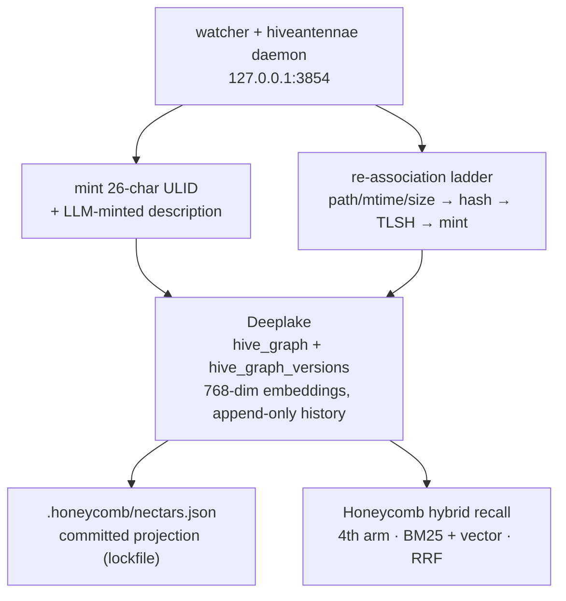
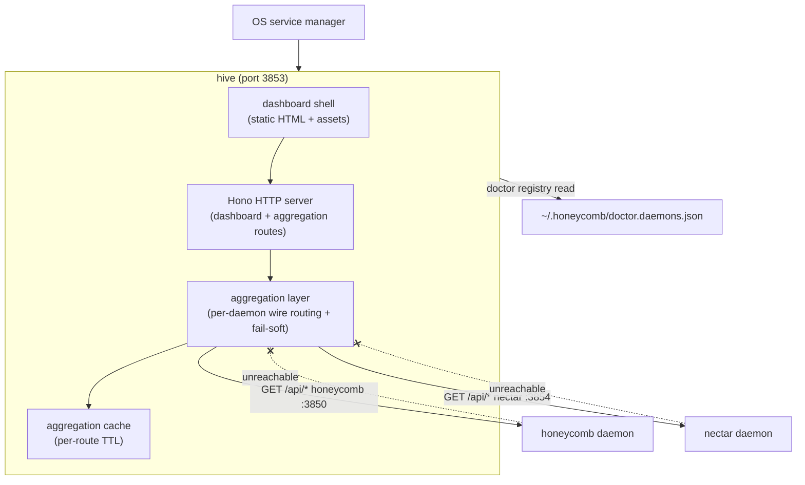
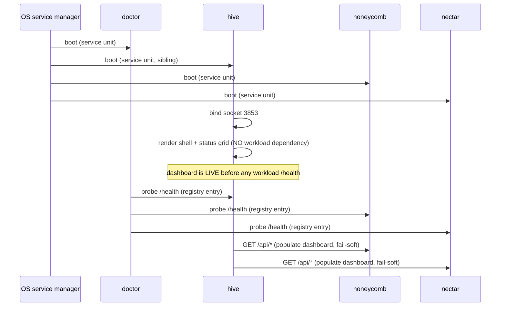
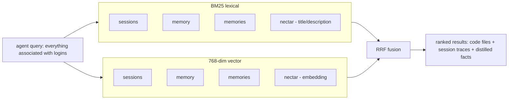
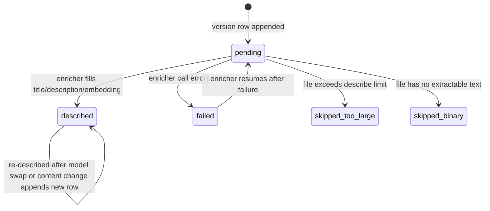
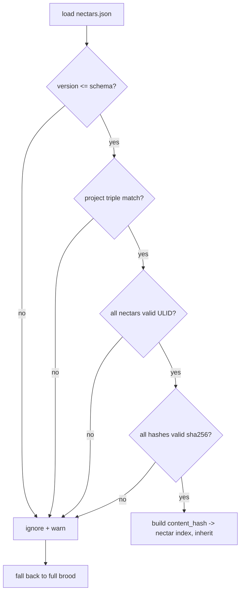
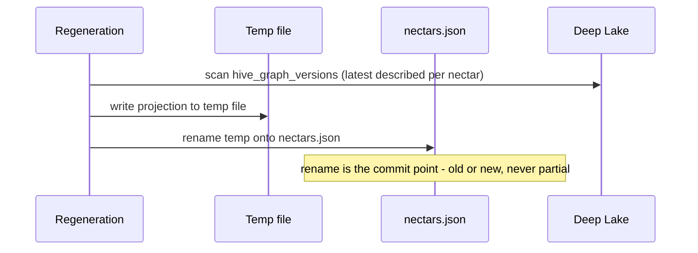
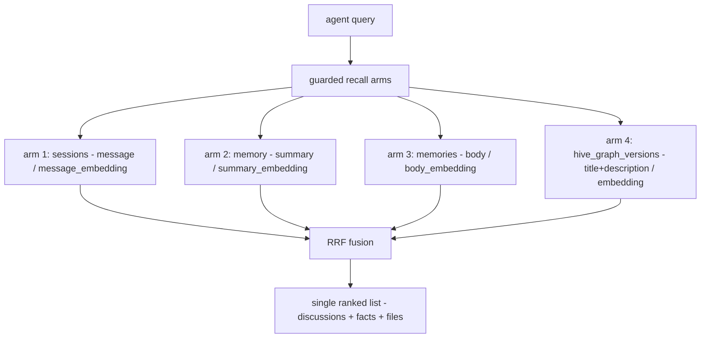
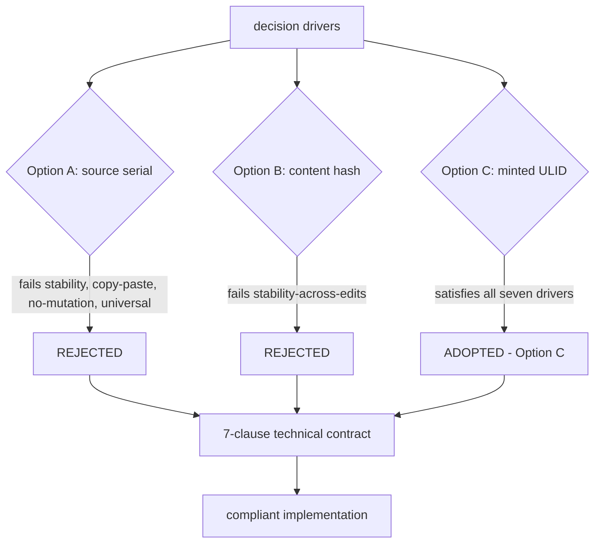

# Nectar: Technical Manual & Specification

*The brooding pipeline, hive graph, portable registry, recall integration, and identity model.*

> **The Apiary** by Legion Code Inc., in collaboration with Activeloop.

## Foreword

Nectar reads each file, writes down what it does in plain language, and keeps that memory current as files change. This manual documents how. It covers the daemon and its role in the topology, the hive graph schema, the portable registry that ships understanding with the project, the recall integration that surfaces descriptions through Honeycomb, and the identity model that makes minted descriptions trustworthy across a team. It is written for engineers building on or auditing Nectar.

## Nectar: Overview & Quickstart

### What makes Nectar different

- **Identity never lives in your source.** No serial numbers in comments, no sidecar files bolted next to your code. ADR-0001 kills that idea for four concrete reasons; read it before arguing about serials-in-source.
- **Daemon-minted ULIDs.** A nectar is a 26-character ULID minted once by the daemon and persisted in Deeplake. It is not derived from content, so edits don't churn it. It is not derived from path, so moves don't kill it.
- **The re-association ladder.** Five steps, first match wins: path/mtime/size fast path, path match with changed content, exact content-hash match for clean moves, TLSH fuzzy match for move-and-edit, mint fresh. Low-confidence fuzzy matches go to human review, never auto-claimed, because a mis-association corrupts the history chain.
- **Copy-paste as provenance, not ambiguity.** Copy a file and the copy gets a fresh nectar with a `derived_from_nectar` edge back to the original. The fork relationship survives forever, even after the copy diverges.
- **A committed lockfile, not a sidecar.** `.honeycomb/nectars.json` is a regenerable projection of Deeplake state. A fresh clone re-derives identity from it with zero LLM calls and zero network.
- **Hybrid recall, live in production.** `nectar search` runs a per-arm guarded lexical + vector query over described files, fused by Reciprocal Rank Fusion. Those hits also fold into Honeycomb's cross-memory recall as a 4th arm alongside sessions, memories, and skills, so nectars surface in the same recall your agents already use.

### Features

- **Stable file identity.** 26-char ULID per file, minted by the daemon, never reused, never deleted by the ladder. *(registration protocol shipped, PRD-006)*
- **5-step re-association ladder.** Survives renames, moves, offline edits, and cold catch-up after your laptop was closed. TLSH fuzzy matching with a confidence-scored review surface. *(shipped, PRD-006)*
- **Copy-paste provenance.** `derived_from_nectar` + `fork_content_hash` record every fork as a first-class edge.
- **Two Deeplake tables.** `hive_graph` (one row per logical file) + append-only `hive_graph_versions` (one row per observed state, carrying 768-dim embeddings). *(shipped, PRD-005)*
- **Supervised daemon.** `nectar daemon` binds `127.0.0.1:3854`, serves `/health`, registers with Doctor, and installs as an OS service on launchd, systemd, and Windows. *(shipped, PRD-002/003/004)*
- **LLM-minted descriptions.** Lazy, batched, cheap: a long-context model describes files on demand, not eagerly, so a full pass on a 2000-file repo lands at about $3.05 and a committed projection makes every subsequent clone free. *(shipped, PRD-007/010/016)*
- **Portable projection.** `.honeycomb/nectars.json`, regenerated from Deeplake after every brood and enrich. *(shipped, PRD-011)*
- **Hybrid recall.** `nectar search` (and `POST /api/hive-graph/search`) run a per-arm guarded lexical + vector query over described files, fused by Reciprocal Rank Fusion, with a silent BM25 fallback when embeddings are off. These hits also surface as a 4th arm inside Honeycomb's cross-memory recall alongside sessions, memories, and skills. *(shipped, PRD-012/013)*

### Install (one command)

No Node? No npm? No problem. The installer detects and sets up everything, then **opens a dashboard in your browser**. The terminal is just a progress log; the product is the first thing you touch.

```bash
# macOS / Linux
curl -fsSL https://get.theapiary.sh | sh
```

```powershell
# Windows (PowerShell)
irm https://get.theapiary.sh/install.ps1 | iex
```

That single line installs the Apiary stack and brings the **nectar daemon** up on `127.0.0.1:3854`, supervised by Doctor so it survives crashes and reboots without you thinking about it.

Prefer to build from source?

```bash
git clone https://github.com/legioncodeinc/nectar.git
cd nectar
npm install
npm run build          # tsc → dist/

npm start              # start the daemon (node dist/cli.js daemon)
node dist/cli.js install   # register the OS service unit + the Doctor registry entry
```

Requires Node ≥ 22. `npm run typecheck` and `npm test` are the local gates.

### Using the dashboard

Straight talk: Nectar does not ship its own dashboard, and that is by design. The always-on **hive portal** owns the unified dashboard for the whole Apiary and aggregates from each daemon's API, fail-soft per daemon (ADR-0004). The **Hive Graph page** (PRD-015, shipped) renders your file graph, identity search, and brood status by fetching Nectar's `/api/hive-graph/*` endpoints through the portal. If the Nectar daemon is down, that page degrades gracefully instead of taking the whole dashboard with it.

### Using the CLI

The `nectar` binary ships with the package. What works today:

```bash
nectar daemon                 # start the daemon (127.0.0.1:3854, /health)
nectar install                # register the OS service unit + Doctor registry entry
nectar uninstall              # deregister the OS service unit
nectar service-status         # report the OS service unit's running state
nectar brood --dry-run        # preview a full-codebase brood's cost locally (no LLM call, no writes)
nectar brood                  # run a full-codebase brood against Deeplake (needs the prerequisites below)
nectar search <query>         # hybrid recall over described files. Flags: --limit N, --json
nectar rebuild-projection     # regenerate .honeycomb/nectars.json from Deeplake
nectar prune --confirm        # prune long-missing nectars from the durable store
nectar review-matches         # review low-confidence identity matches against the durable store
nectar --help
```

`nectar search` reaches a running `nectar daemon` over loopback, so start the daemon first.

#### Brood prerequisites

A mutating `nectar brood` (and the boot auto-brood) describes files only when **both** prerequisites are in place:

- `~/.deeplake/credentials.json`, the shared Deeplake credentials `hivemind login` writes.
- Portkey, enabled via `NECTAR_PORTKEY_ENABLED=1`, `NECTAR_PORTKEY_API_KEY`, and `NECTAR_PORTKEY_CONFIG`.

Without them the daemon still boots and serves `/health`, but brooding stays dormant and says so: a startup log line names the missing pieces, `/health` reports `brooding.reason` (for example `credentials_missing` or `portkey_disabled`), and on an interactive terminal the daemon prints the exact configuration steps. `nectar brood --dry-run` and `nectar search` do not need Portkey.

#### Telemetry

Nectar sends anonymous, aggregate usage telemetry (install, first run, and version updates) by default, never file contents or paths. Opt out with `NECTAR_TELEMETRY=0` (it also accepts `off` and `false`, case-insensitive) or the cross-tool `DO_NOT_TRACK` standard.

### Identity that survives the refactor

```bash
# The daemon minted src/auth/session-refresh.ts a nectar and described it.
# Now gut your directory structure:
git mv src/auth/session-refresh.ts src/middleware/token-lifecycle.ts

# …then ask recall about it:
nectar search "where do we refresh login sessions"
# → src/middleware/token-lifecycle.ts
# "refreshes JWT claims on each authenticated request,
# part of the login session lifecycle"
```

Same nectar, same description, new path. The identity followed the file, so the memory never went stale. `nectar search` runs the recall over described files, and the same hits fold into your agent's cross-memory recall as a 4th arm (PRD-013), so the answer surfaces wherever your agent already asks.

### How it works



The daemon watches your source tree. New file: mint a nectar, queue a description. Known file: run the ladder, append a version row, keep the chain. Everything durable lands in Deeplake first; the projection is regenerated from it after every pass; recall unions over the described files alongside sessions, memories, and skills.

### Why identity beats paths

Path-keyed memory is a bet that your repo never changes shape. That bet loses every single sprint. Every rename orphans a memory, every directory reshuffle silently detonates the recall your agents depend on, and nobody notices until an agent confidently cites a file that has not existed for three weeks.

Stable identity flips the failure mode. The nectar is the anchor; the path is just the latest observation attached to it. The file can move, get edited offline, or get forked into a new module, and the daemon re-associates it and keeps writing to the same history chain. Memory attached to identity does not rot when the tree churns.

Meaning is the other half. Structural tools can tell you a symbol named `authenticate` exists; they cannot tell you that `session-refresh.ts` is a critical piece of login behavior. An LLM-minted description per file gives your agents the *what is this for* layer that grep and AST graphs structurally cannot provide. Identity keeps the answer alive; meaning makes it worth recalling.

### Why Deeplake makes the difference

Most code-indexing tools bolt onto a vector-only store, which forces every access pattern through a similarity engine. Nectar needs exact identity joins **and** semantic search, and [**Deeplake**](https://deeplake.ai), the database for AI, gives it both natively:

- **SQL + vector in one engine.** "Latest version row for this nectar" is a deterministic SQL join; "files that mean login" is a vector search over 768-dim embeddings. One store serves both. No second database, no sync problem, no sidecar.
- **Versioned and append-only.** `hive_graph_versions` never overwrites: every observed state of every file stays on disk. That is what makes re-association *auditable*: you can trace exactly when a nectar was carried across a move, at what confidence, and what the file looked like on both sides.
- **Identity table + versions table, cleanly split.** `hive_graph` anchors the stable key; `hive_graph_versions` carries the history. Collapsing them forces you to lose either history or the stable key. Deeplake makes the split cheap.
- **Graceful degradation.** Embeddings off? The embedding column stays NULL and recall falls back to BM25 over titles and descriptions. No error, no quality cliff.

> Nectar stands on the same two shoulders as the rest of the Apiary: **[Deeplake](https://deeplake.ai)** gives identity somewhere durable and queryable to live, and **[Hivemind](https://github.com/activeloopai/hivemind)**, Activeloop's open-source agent-memory project, is the foundation Legion Code extended into Honeycomb.

### Supported harnesses

Nectar's file identity and descriptions reach your harness through Honeycomb's recall integration: same daemon boundary, same shared memory, no per-harness wiring of its own. Three harnesses are supported through that integration; three more are in progress on the same boundary, so they inherit Nectar the moment their Honeycomb recall lands.

| Harness | Status |
|---|---|
| **Claude Code** | Supported |
| **Cursor** | Supported |
| **Codex** | Supported |
| **Hermes** | In progress |
| **pi** | In progress |
| **OpenClaw** | In progress |

### Other interfaces

- **Dashboard.** The hive portal's Hive Graph page (PRD-015, shipped), fed by Nectar's `/api/hive-graph/*` endpoints (PRD-008). Nectar deliberately owns no dashboard of its own.
- **MCP server.** Nectar does not ship a separate MCP server; its results surface through Honeycomb's existing MCP recall tools via the shipped recall arm (PRD-013). One boundary, not two.
- **TypeScript SDK.** `@legioncodeinc/nectar` ships a typed `dist/index` entry. The daemon and service lifecycle are the primary surface, and the API endpoints (PRD-008) that back the Hive Graph page are live.

 Status & Roadmap

Nectar is **v0.1.x and production stable**: the PRD program is fully built and tested in production. Shipped: the daemon, health, single-instance lock, OS service install, Doctor supervision, the Deeplake catalog tables, the file registration protocol, brooding, the enricher steady-state loop, the Portkey gateway, the portable projection, embeddings provider switching, service check-in telemetry, the API endpoints, and the recall arm that surfaces nectars through Honeycomb's hybrid recall, rendered in the Hive portal's Hive Graph page. The roadmap and idea board live at [ideas.theapiary.sh](https://ideas.theapiary.sh).

### Development

```bash
npm install
npm run build        # tsc → dist/
npm run typecheck    # tsc --noEmit
npm test             # build + node --experimental-sqlite --test test/**/*.test.ts
npm run daemon       # run the daemon from dist/
npm run clean        # rm -rf dist
```

Requires Node ≥ 22. Every change passes typecheck and the test suite before it lands.

### Credits

Nectar exists because two halves fit together:

- **[Activeloop](https://activeloop.ai/)** brings **[Deeplake](https://deeplake.ai/)** (the versioned, multi-modal database for AI with native vector + columnar indexing and hybrid search) and **[Hivemind](https://github.com/activeloopai/hivemind)**, the open-source agent-memory project Honeycomb is built upon.
- **[Legion Code Inc](https://github.com/legioncodeinc)** brings the **multi-tier memory system** (Tier 1 / 2 / 3 keys, summaries, raw), **code base atlas memory architecture**, **auto healing service**, **session priming**, **automatic skill development & propagation**, the **pollinating loop**, the **knowledge graph**, **cross device cross repository cross team skill sharing**, and the daemon architecture that turns Deeplake into a shared brain your coding agents read and write on every turn.

### License

Nectar is licensed under the **GNU Affero General Public License v3.0 or later** (AGPL-3.0-or-later).

Use it commercially or privately, free of charge. In return: keep the copyright and license notices intact, and if you modify it, your changes ship under the same AGPL license with source available. The "Affero" part is the point: run a modified version as a network service and you owe its source to the users who interact with it. No locking a fork behind a SaaS wall.

© 2026 Legion Code Inc.

  Built by Legion Code Inc · Powered by Activeloop Deeplake · theapiary.sh

I am Legion. We are Legion.

#vibewithlegion

## hive Portal Daemon — design reference

The full design detail for **hive**, the always-on portal daemon of the Nectar three-daemon topology: its component breakdown, the API-aggregation protocol mechanics, the dashboard route inventory, and its deployment/lifecycle model. This is the narrative companion to ADR-0004 (which records the decisions) and PRD-004c/004d (which specify the build). Read ADR-0004 first for the *why*; this doc is the *what* and *how*.

**Implementation update (July 2026).** Hive shipped as its own repository and diverged from this design in three ways, recorded in hive's own knowledge base (`hive/library/knowledge/private/`): (1) the "reuse honeycomb's dashboard without forking" plan became **copy-and-own** (hive ADR-0001): the SPA was copied out of honeycomb once, honeycomb's copy was deleted, and hive owns the code outright; (2) the per-route TTL **aggregation cache was never built**: hive's server-side BFF proxy (hive ADR-0002, `hive/src/daemon/proxy.ts`) forwards each request over loopback with no cache layer; (3) the OS service names landed as `com.legioncode.hive` / `hive.service` / Windows task `hive` (`hive/src/service/platform.ts`), not the `com.hive.daemon` naming sketched here. The topology, the thin-portal boundaries, and the fail-soft aggregation contract all shipped as designed. Where this doc and hive's knowledge base disagree, hive's knowledge base wins.

### What hive is, in one paragraph

hive is a TypeScript/Node + Hono daemon that serves the unified dashboard for the Nectar ecosystem. It is one of three daemon roles in the topology decided by ADR-0003: doctor supervises, hive portals, and the workload daemons (honeycomb, nectar) do the work. hive boots on OS start as a supervised daemon in its own right (sibling to the workloads, not a child of any of them), renders the dashboard shell the moment its socket binds — before any workload daemon is confirmed healthy — and populates that shell by fetching data from each registered daemon's HTTP API. It holds no Deep Lake client, runs no queries, and resolves no tenancy scope. It is a thin portal: presentation plus an aggregation seam.

### The four binding properties (from ADR-0004)

These are the load-bearing decisions; this doc expands each into design detail.

1. **Always-on + boot-order contract** — hive serves the shell before any workload is healthy.
2. **API aggregation, not direct Deep Lake access** — hive fetches from daemon APIs; it is not a data-plane consumer.
3. **Dashboard ownership**: hive owns the unified dashboard. (Originally framed as runtime reuse of honeycomb's `registry.tsx` / `pages/*`; shipped as copy-and-own per hive ADR-0001, see the implementation update above.)
4. **Update-cadence boundary** — hive ships independently of doctor and the workloads.

---

### Component breakdown



| Component | Responsibility | Notes |
|---|---|---|
| **OS service unit** | Boots hive on device start; restarts on crash | Shipped as launchd `com.legioncode.hive` / systemd `hive.service` / Windows task `hive` (`hive/src/service/platform.ts`). Sibling to doctor's unit, not a child of a workload. |
| **Dashboard shell** | Static HTML + assets rendered before any API call | The always-on guarantee: the shell + a daemon-status grid render the moment the socket binds. API data populates async. |
| **Hono HTTP server** | Serves the shell + the dashboard routes + the aggregation routes | Modeled on honeycomb's `src/daemon/runtime/server.ts` (Hono, route groups, unprotected `/health`). |
| **Aggregation layer** | Per-daemon `wire` routing — each dashboard request is dispatched to the owning daemon's API | The seam from ADR-0004 decision 2. Fail-soft per daemon: unreachable → empty section + "daemon unreachable" badge, never a 500. |
| **Aggregation cache** | Per-route TTL cache of aggregated responses | Designed but never built: the shipped BFF proxy forwards every request over loopback uncached, and loopback latency made the cache unnecessary. Kept here as design history. |
| **doctor registry reader** | Reads `~/.honeycomb/doctor.daemons.json` to know which daemons exist + their API base URLs | Read on boot + on a slow poll. hive does not own the registry (doctor does); it consumes it. |

---

### The API-aggregation protocol (the seam)

This is the most consequential design element — the contract that keeps hive thin while letting it render data from any registered daemon.

#### Request flow

1. A browser hits a hive dashboard route (e.g. `/hive-graph`).
2. hive's SPA router matches the route to a `PageProps` component from hive's own `registry.tsx` (copied and owned from honeycomb, hive ADR-0001).
3. The component calls `wire.(...)` to fetch its data.
4. hive's `wire` implementation routes the call to the **owning daemon's** API — not to an in-process handler. For `/hive-graph` data, that's `GET http://127.0.0.1:3854/api/hive-graph/*` (nectar).
5. The fetch fires on every request (the designed per-route TTL cache was never built; loopback made it unnecessary).
6. On success, the response is returned. On unreachable, the fail-soft path returns an empty payload + a degradation flag the component renders as "daemon unreachable."

#### The `wire` abstraction

hive's dashboard components call a `wire` data-fetch abstraction, the same pattern honeycomb's dashboard used. As designed here, hive was to reuse honeycomb's `wire` interface with a per-daemon HTTP implementation. As shipped, hive copied and owns its own `wire.ts` (`hive/src/dashboard/web/wire.ts`): every call fetches same-origin `/api/*` paths, and hive's server-side BFF proxy resolves the owning daemon per request and forwards over loopback (`hive/src/daemon/proxy.ts`, hive ADR-0002). The component layer still does not know which daemon serves it; the routing moved from the browser to the server.

#### Per-daemon routing table

| Dashboard route | Owning daemon | Daemon API |
|---|---|---|
| `/` (Dashboard) | honeycomb | `:3850/api/*` |
| `/projects` | honeycomb | `:3850/api/*` |
| `/harnesses` | honeycomb | `:3850/api/*` |
| `/memories` | honeycomb | `:3850/api/*` |
| `/graph` (memory graph) | honeycomb | `:3850/api/*` |
| `/sync`, `/logs`, `/roi`, `/settings` | honeycomb | `:3850/api/*` |
| `/hive-graph` (PRD-015, NEW) | nectar | `:3854/api/hive-graph/*` |

The existing honeycomb routes are served by proxying to honeycomb's API. The new `/hive-graph` route (PRD-015) is the first nectar-owned route. Future nectar-owned pages (or pages from future workload daemons) extend this table.

#### Fail-soft contract

- A daemon unreachable on a given route → that route's section renders empty + a "daemon unreachable" badge. hive never returns a 500 for a workload outage.
- A daemon returning an error payload → the section renders the error inline (operator-facing, not a broken page).
- hive's own `/health` is independent — it reports `ok` as long as hive's server is up, regardless of workload daemon health.

---

### Dashboard ownership + code reuse

hive owns the unified dashboard: every route a user visits lives here, including the pages that originated in honeycomb and the Hive Graph page (PRD-015). This section originally specified **runtime reuse** of honeycomb's component layer. What shipped is **copy-and-own** (hive ADR-0001): the React components in `pages/*`, the route registry in `registry.tsx`, and the `PageProps` shape were copied into `hive/src/dashboard/web/` once, honeycomb's dashboard was deleted, and hive owns the code outright with no shared package and no drift risk. Concretely, as shipped:

- **Route registry**: hive's own `ROUTES` array (`hive/src/dashboard/web/registry.tsx`) carries all 11 entries, including `/hive-graph`.
- **Page components**: the honeycomb-origin pages live in hive's tree and fetch through hive's same-origin `wire`; `HiveGraphPage` is hive-authored and renders nectar data.
- **`PageProps`**: preserved through the copy, so the add-a-page contract survived the ownership change.

The "how to add a page" contract now lives in hive's own knowledge base (`hive/library/knowledge/private/frontend/spa-architecture.md`): write a `function MyPage({ wire, ... })`, add a `RouteEntry`, done.

---

### Deployment + lifecycle

#### Boot ordering



All four daemons are siblings under the OS service manager. There is no parent-child dependency. hive renders its shell the instant its own socket binds; workload data populates as each workload comes healthy.

#### Process surface

| Property | Value | Source |
|---|---|---|
| Port | 3853 | PRD-001b (confirmed) |
| PID file | `~/.honeycomb/hive.pid` | PRD-004d |
| Lock file | `~/.honeycomb/hive.lock` | PRD-004d (single-instance guard) |
| OS service unit | launchd `com.legioncode.hive` / systemd `hive.service` / Windows task `hive` | `hive/src/service/platform.ts` (fleet naming decision #32) |
| `/health` | `ok`/`degraded` — independent of workload health | ADR-0004 decision 1 |
| Registry entry | one row in `~/.honeycomb/doctor.daemons.json` | PRD-004a (hive is supervised like the others) |
| Stack | TypeScript/Node + Hono (reuses honeycomb's dashboard code) | PRD-004c, ADR-0004 decision 3 |

#### Update cadence

hive is a **separate release train** from doctor, honeycomb, and nectar. A dashboard change ships as a hive release (new bundle + restart of hive's service unit); it does not touch doctor or the workloads. Conversely, an doctor release does not redeploy hive. This is the operational realization of the stability/velocity split (ADR-0003 + ADR-0004 decision 4).

---

### What hive explicitly is NOT

- **Not a Deep Lake client.** No storage client, no tenancy scope, no queries. (ADR-0004 decision 2.)
- **Not a supervisor.** It does not probe `/health`, restart daemons, or own incident state — that's doctor.
- **Not a workload.** It does not brood, enrich, recall, or run any Nectar/honeycomb logic. It presents + aggregates.
- **Not a child of a workload.** It is a top-level supervised daemon, sibling to the workloads, so a workload outage does not take it down.
- **Not a fork of honeycomb's dashboard.** It is the dashboard: the code was copied and owned once (hive ADR-0001) and honeycomb's copy was retired, so there are not two dashboards to diverge.

---

### Forward pointers

- **The decisions** (always-on, aggregation, ownership, cadence) → `ADR-0004`.
- **The build spec** (bootstrap, Hono server, aggregation `wire`, service unit, registration) → `prd-004c` + `prd-004d`.
- **The first hive-hosted page** (Hive Graph) → `prd-015`.
- **The dashboard code as shipped** → `hive/src/dashboard/web/registry.tsx` + `hive/src/dashboard/web/pages/*` (copy-and-own per hive ADR-0001).
- **The topology hive sits inside** → `ADR-0003`.
- **Hive's own knowledge base** (authoritative for the shipped implementation) → `hive/library/knowledge/private/architecture/system-overview.md`.

## Hive Graph Schema

The canonical Deep Lake table catalog for Nectar: two tables (`hive_graph` for logical identity, `hive_graph_versions` for the append-only content+description chain), the column-by-column rationale, indexing strategy, tenancy model, and the lazy-schema-heal contract.

### Why two tables

A single table cannot cleanly represent the two things Nectar must track. A file's *identity* is stable — it survives edits, renames, and moves. A file's *content and description* change constantly — every save produces new bytes, and the description eventually drifts to match. Collapsing both into one row forces an overwrite on every edit (losing history) or an append on every edit (losing the stable-identity key under a pile of versions).

The split mirrors how git works internally: a commit object (stable identity anchor) points at a tree, which points at blobs (content-addressed versions). It also mirrors how Aura separates "identity anchor" from "content hash" (see `../reference/prior-art-crosswalk.md`), and how Mimir keeps a stable `SymbolId` distinct from its append-only rename history. The pattern is well-trodden because it is correct.

- **`hive_graph`** — one row per logical file. Keyed by nectar (ULID). Identity + provenance only. No content, no description.
- **`hive_graph_versions`** — append-only. Keyed by `(nectar, content_hash)`. One row per observed state. Carries the path, the metadata, and the lazily-filled description.

"Current state of file X" = the latest version row for X's nectar. "Full history of file X" = all version rows for X's nectar. Both are cheap queries.

---

### The `hive_graph` table (identity + provenance)

```sql
CREATE TABLE IF NOT EXISTS "hive_graph" (
  nectar              TEXT NOT NULL DEFAULT '',
  kind                TEXT NOT NULL DEFAULT 'file',
  created_at          TEXT NOT NULL DEFAULT '',
  derived_from_nectar TEXT NOT NULL DEFAULT '',
  fork_content_hash   TEXT NOT NULL DEFAULT '',
  org_id              TEXT NOT NULL DEFAULT '',
  workspace_id        TEXT NOT NULL DEFAULT '',
  project_id          TEXT NOT NULL DEFAULT '',
  last_update_date    TEXT NOT NULL DEFAULT ''
) USING deeplake;
```

| Column | Type | Purpose |
|---|---|---|
| `nectar` | TEXT | **Primary key.** 26-char ULID minted once by hiveantennae. Never changes. Never derived from content. Sortable by creation time. |
| `kind` | TEXT | Discriminator: `'file'` in v1. Reserved for `'directory'` if folder-level nectars are added later (see YAGNI note at the bottom). |
| `created_at` | TEXT | ISO 8601 timestamp of nectar minting. Equals the ULID's embedded timestamp but stored explicitly for portability into `nectars.json` (ULIDs are not self-describing to humans). |
| `derived_from_nectar` | TEXT | Copy-paste provenance. Empty for an originally-minted file. Set to the source nectar when a new path appears whose content matches an existing file's current content (the copy event). Survives forever, even after both files diverge. |
| `fork_content_hash` | TEXT | The content hash at the fork point. Lets the enricher render "this file was copied from X when X looked like Y" — useful for the Obsidian-style interlink view. |
| `org_id` | TEXT | Tenancy. Explicit because identity is cross-cutting (mirrors the `codebase` table's tenancy columns). |
| `workspace_id` | TEXT | Tenancy. Same rationale. |
| `project_id` | TEXT | Project isolation within a workspace. Soft column filter, not a Deep Lake partition or provisioning boundary. |
| `last_update_date` | TEXT | Denormalized "last observed change" timestamp. Updated whenever a new version row is appended. Lets the projection sync and the dashboard render "recently touched" without scanning the versions table. |

The `nectar` column is the only column that is truly immutable. `derived_from_nectar` and `fork_content_hash` are write-once (set at minting, never updated). Everything else is mutable but rarely changes after the row's first write.

---

### The `hive_graph_versions` table (content + description chain)

```sql
CREATE TABLE IF NOT EXISTS "hive_graph_versions" (
  nectar          TEXT NOT NULL DEFAULT '',
  content_hash    TEXT NOT NULL DEFAULT '',
  seq             BIGINT NOT NULL DEFAULT 0,
  path            TEXT NOT NULL DEFAULT '',
  filename        TEXT NOT NULL DEFAULT '',
  ext             TEXT NOT NULL DEFAULT '',
  size_bytes      BIGINT NOT NULL DEFAULT 0,
  mtime_observed  TEXT NOT NULL DEFAULT '',
  title           TEXT NOT NULL DEFAULT '',
  description     TEXT NOT NULL DEFAULT '',
  concepts        TEXT NOT NULL DEFAULT '[]',
  embedding       FLOAT4[],
  confidence      REAL,
  fingerprint     TEXT,
  described_at    TEXT NOT NULL DEFAULT '',
  describe_model  TEXT NOT NULL DEFAULT '',
  describe_status TEXT NOT NULL DEFAULT 'pending',
  observed_at     TEXT NOT NULL DEFAULT '',
  org_id          TEXT NOT NULL DEFAULT '',
  workspace_id    TEXT NOT NULL DEFAULT '',
  project_id      TEXT NOT NULL DEFAULT '',
  last_update_date TEXT NOT NULL DEFAULT ''
) USING deeplake;
```

| Column | Type | Purpose |
|---|---|---|
| `nectar` | TEXT | FK → `hive_graph.nectar`. Composite key part 1. |
| `content_hash` | TEXT | sha256 of file content at observation. Composite key part 2. **Changes per edit** — that is the point. |
| `seq` | BIGINT | Monotonic per-nectar version counter (0, 1, 2, …). Lets "latest version" be `ORDER BY seq DESC LIMIT 1` without parsing timestamps or relying on `content_hash` ordering. |
| `path` | TEXT | Repo-relative path with forward slashes, at observation time. **Mutable across version rows for the same nectar** — this is how moves are recorded. A nectar's `seq=0` row might say `src/a.ts` and its `seq=3` row might say `src/auth/a.ts`; the chain captures the rename. |
| `filename` | TEXT | Bare filename (`a.ts`). Denormalized from path for fast filename-only searches without path parsing. |
| `ext` | TEXT | Lowercased extension without dot (`ts`, `tsx`, `md`, `json`). Routed to the right CodeGraph extractor and to the brooding batcher (see brooding doc). |
| `size_bytes` | BIGINT | File size. Used to skip empty files and to bucket large files for solo-description. |
| `mtime_observed` | TEXT | File mtime at observation. Not authoritative (mtime is mutable), but useful as a fast-path cache key: if `(path, mtime, size)` all match the last observation, skip re-hashing. |
| `title` | TEXT | LLM-minted, ≤80 chars. Nullable until enriched. Empty string while pending, filled by the enricher. |
| `description` | TEXT | LLM-minted, 1–3 sentences. Nullable until enriched. Same lifecycle as `title`. |
| `concepts` | TEXT | JSON-encoded string array (`'["auth","session","jwt"]'`). LLM-minted concept tags for the Obsidian-style interlink layer. |
| `embedding` | FLOAT4[] | 768-dim vector over `title + ' ' + description`. **Same dimensionality as `sessions.message_embedding` and `memory.summary_embedding`** so the same hybrid recall pipeline queries all three. Nullable until enriched. |
| `confidence` | REAL | Set only on rows appended by re-association ladder step 4 (TLSH fuzzy match); the value is `1 − normalizedTLSHDistance`. NULL for all other rows. Supports the audit query "show me all auto-carried matches below a given confidence." |
| `fingerprint` | TEXT | TLSH-family locality-sensitive fingerprint of the content, computed on every content-bearing version row. Re-association ladder step 4 matches a moved-and-edited file against the fingerprints of missing files; persisting it here (rather than only in memory) is what lets cold-catch-up fuzzy matching survive a daemon restart. Nullable: rows written before this column existed leave it NULL and self-heal on next observation. |
| `described_at` | TEXT | Timestamp of the enricher run that filled `title`/`description`. Empty while pending. |
| `describe_model` | TEXT | Model identifier that produced the description (e.g. `gemini-2.5-flash` via `portkey`). Auditable, and lets a model swap trigger re-description selectively. |
| `describe_status` | TEXT | One of `pending`, `described`, `failed`, `skipped-too-large`, `skipped-binary`, `skipped-deleted`. Lets recall filter out undescribed rows and lets the enricher resume after failures. `skipped-deleted` marks a row whose file vanished while pending — distinct from `failed` (retryable LLM failure) so the enricher doesn't keep retrying a file that's gone. |
| `observed_at` | TEXT | Timestamp the version row was appended (distinct from `mtime_observed`, which is the file's own clock). |
| `org_id`, `workspace_id`, `project_id` | TEXT | Tenancy, denormalized from `hive_graph` so the versions table is queryable in isolation for recall. |
| `last_update_date` | TEXT | Standard Honeycomb UPDATE-coalescing workaround column. |

The composite key `(nectar, content_hash)` has a useful invariant: the same content under the same nectar is a no-op (idempotent re-observation after a no-change save). The same content under a *different* nectar is the copy-paste signal that sets `derived_from_nectar` on the newer nectar.

---

### Sequence allocation and latest-version resolution

"Latest version of a nectar" means the row with the highest `seq`, and `seq` must therefore be unique per nectar for that phrase to resolve unambiguously. Deeplake offers no transactions and no enforced unique constraint, so `seq` uniqueness is a property the daemon maintains in code, not one the backend guarantees. Two mechanisms in `DeepLakeHiveGraphStore` together keep it monotonic and collision-free.

The first is **per-nectar append serialization**: every seq-allocating append for a nectar is chained through one promise, so the allocate-and-append pair is atomic within the store instance and two callers sharing the store cannot both read the same `MAX(seq)` and both write `seq+1` (`src/hive-graph/deeplake-store.ts:272-281`).

The second is a **lag-immune in-process high-water mark**, added after a live incident. Renaming a watched file while its describe append was still in flight produced a duplicate `(nectar, seq)` pair: the enricher's durable describe append and the registration bridge's carry flush allocated seqs from independent views of the store (a backend `SELECT MAX(seq)` under read-after-write lag versus a private in-memory mirror), and Deeplake's read lag meant a just-appended row was invisible to the very next `SELECT seq`. The store now records the highest seq this process has written per nectar and allocates `max(inProcessHighWater, backendMax) + 1`, so the read is no longer trusted to reflect an append that already happened here (`src/hive-graph/deeplake-store.ts:282-298`, `src/hive-graph/deeplake-store.ts:459-478`). Every durable append funnels the written seq back into the high-water mark (`src/hive-graph/deeplake-store.ts:399-414`).

Both components now route every version append through one shared allocator, `appendVersionAtNextSeq`, the single seq authority the live daemon wires into the enricher commit and the registration bridge flush (`src/hive-graph/store.ts:159-170`). The bridge re-allocates the seq at flush time rather than trusting the seq its synchronous mirror computed, then reconciles the allocated value back into the mirror so later synchronous reads agree with what persisted (`src/registration/store-bridge.ts:190-215`).

#### Healing an existing duplicate

The allocator prevents new duplicates; an idempotent repair heals any that already exist. Because the table is append-only (no in-place `UPDATE`, no unique constraint), the least-invasive correct repair for two rows tied at a nectar's `MAX(seq)` is to append a corrected copy of the winner one seq above the tie, making it the sole latest while the stale tied rows stay in history. The winner is the row with the newest `observed_at` (the most recently observed path or content, which is the renamed path after the incident), and its fields are copied verbatim so a pending carry stays pending and the enricher describes the newest path. The heal is idempotent: once the max seq is unique, a later pass finds nothing tied and does nothing (`src/registration/ladder.ts:551-591`). It runs from the crash-repair sweep and self-heals a live pre-fix duplicate on the next resync.

---

### Indexing strategy

Deep Lake indexing is additive and configured through the catalog helpers, not hand-rolled `CREATE INDEX`. The indexes Nectar relies on:

| Index | Table | Columns | Why |
|---|---|---|---|
| `deeplake_index` (BM25) | `hive_graph_versions` | `title`, `description` | Lexical recall over descriptions. Same operator Deep Lake applies to `memory.summary`. |
| Vector (`` cosine) | `hive_graph_versions` | `embedding` | Semantic recall over descriptions. Falls back silently to BM25 if embeddings are off — same as the rest of Honeycomb, no quality cliff. |
| `deeplake_hybrid_record` | `hive_graph_versions` | BM25 + vector | The fused path recall prefers; documented in the main corpus's `ai/hybrid-sql-vector-rationale.md`. |
| Scope filter | `hive_graph_versions` | `org_id`, `workspace_id`, `project_id` | Every recall query scopes by tenancy before applying BM25/vector. |

The `path` and `filename` columns are covered by the standard ILIKE fallback (the same `sqlLike`-guarded lexical path that recall uses when vector indexes are absent or embeddings are off). No dedicated path index is needed in v1; the row counts (one per file version, not one per symbol) are small enough that ILIKE is adequate.

---

### Tenancy and isolation

Decision update from `library/requirements/MASTER-PRD-INDEX.md:13`: `project_id` is a soft column-level filter within Honeycomb's org/workspace Deep Lake scope. Nectar does not create per-project tables, per-project partitions, or a provisioning event when a project appears; catalog registration plus `withHeal` handles table creation and additive schema convergence on first write.

`hive_graph` and `hive_graph_versions` carry explicit `org_id`, `workspace_id`, and `project_id` columns. This mirrors the `codebase` table (the CodeGraph's cloud-sync target) and diverges from `sessions`/`memory`, which lean on partition isolation plus `agent_id`/`visibility`. The reason is that file identity is **cross-agent by nature** — every agent and every harness working in the same project should see the same file descriptions, so there is no `agent_id` column and no `visibility` column. Isolation is org→workspace at the Deep Lake scope plus a required `project_id` predicate for project-level filtering.

A team sharing a workspace (the normal Honeycomb collaboration model) therefore shares a single Nectar graph per project by filtering on `project_id`. A new teammate's `git clone` + `nectar daemon` boot (registered with doctor per ADR-0003) pulls the cloud-synced `hive_graph_versions` rows for the workspace and re-derives the local projection from them, the same way the CodeGraph's `pullSnapshot` works.

---

### Lazy schema healing

Decision update from `library/requirements/MASTER-PRD-INDEX.md:13`: there is no explicit DDL pre-step and no per-project provisioning flow. The Nectar catalog entries are registered with the daemon's catalog group, and `withHeal` creates or heals tables when the first write needs them.

Nectar tables participate in the same additive schema-heal pass as the rest of Honeycomb (documented in the main corpus's `data/deeplake-storage.md`). When hiveantennae writes through the catalog and finds a table missing, or finds an existing table missing a column added in a newer version (say `concepts` was added after initial deploy), `withHeal` creates or heals the table and backfills defaults. Existing rows get `'[]'` for `concepts`; the enricher picks them up on the next lazy pass.

Never hand-roll an `ALTER` against these tables. Define the `ColumnDef` array once in the daemon's schema module, add it to the catalog group, and let the heal pass converge. This is the same rule that governs every other Honeycomb table.

---

### The projection contract

`hive_graph_versions` is the source of truth. `.honeycomb/nectars.json` (documented in `portable-registry.md`) is a **regenerable projection** - a denormalized, content-hash-keyed map of `{ content_hash: { nectar, title, description, concepts } }` for the *latest* version of each nectar in the project. If `nectars.json` is deleted, lost, or corrupted, `nectar project --rebuild-projection` regenerates it from Deep Lake in a single scan. The projection is committed for portability across fresh clones, never because Deep Lake is insufficient.

---

### v1 non-goals (YAGNI)

The schema deliberately omits three things that the original design sketch mentioned, all deferred until measured need:

- **Directory nectars.** Folders are derivable from the union of file paths. A directory-level description can be synthesized on demand from its files' descriptions. The `kind` column reserves the namespace (`'directory'`) so this can be added later without a schema change, but v1 does not mint directory nectars. If synthesis reads weak in practice, add `kind='directory'` rows whose `content_hash` is `sha256(sorted_child_nectars)`.
- **Symbol-level nectars.** Symbol identity is the CodeGraph's job (and, optionally, an LSP layer's job). Nectar is file-granular in v1. Symbol-level semantic description would multiply row counts by 10–100× and duplicate what the CodeGraph already extracts structurally.
- **Edit-coalesced versioning.** Every save appends a version row. There is no debouncing at the schema level — debouncing happens at the watcher intake (see `ai/brooding-pipeline.md`), so the database sees one row per *meaningfully distinct* content state, not one per keystroke-save.

## Portable Registry (nectars.json)

The committed, reviewable, regenerable projection of the Deep Lake `hive_graph` table that gives a fresh `git clone` its identity map before the daemon ever runs: what it contains, what it deliberately omits, how it differs from a sidecar, how it is generated and validated, and how it interacts with team sharing.

### What the portable registry is for

Deep Lake is the source of truth for Nectar, but Deep Lake is not in the git repo. A fresh `git clone` has the source files and no nectars — until either (a) the daemon boots and pulls the workspace's rows from Deep Lake cloud sync, or (b) the daemon boots and broods from scratch, re-paying the LLM cost. Option (a) requires network and auth; option (b) wastes money and time.

The portable registry is a third option. `.honeycomb/nectars.json` is a single committed file at the project root that carries enough of the Deep Lake state to re-derive identity on a fresh clone *without* network, auth, or LLM calls. It is the bridge between "the source of truth is in the cloud" and "a clone should work offline immediately."

The registry is a **projection**, not a sidecar. The distinction matters and is enforced:

- A **sidecar** is a parallel source of truth that the system reads from and writes to during normal operation. Sidecars drift, get out of sync, and become liabilities. FR-8 in the main Honeycomb PRD substrate explicitly forbids them.
- A **projection** is a denormalized, regenerable view of the source of truth. It is written from the source of truth on a defined schedule, never edited directly, and can be deleted and regenerated without loss. A lockfile (`package-lock.json`, `Cargo.lock`) is a projection; an `.env` is a sidecar.

`.honeycomb/nectars.json` is generated from Deep Lake at the end of every brood and every enricher cycle that produced new descriptions. It is committed for portability. It is never the system of record.

---

### The file format

```json
{
  "version": 1,
  "generated_at": "2026-06-30T12:00:00Z",
  "generator": "honeycomb-nectar@0.1.13",
  "project": {
    "org_id": "legion",
    "workspace_id": "engineering",
    "project_id": "honeycomb"
  },
  "files": {
    "01J2X4F6K8ME7N9P1Q3R5T7V9WX": {
      "content_hash": "9f86d081884c7d659a2feaa0c55ad015a3bf4f1b2b0b822cd15d6c15b0f00a08",
      "path": "src/auth/login.ts",
      "title": "User login route handler",
      "description": "Validates credentials against the user store, starts a session, and issues a JWT refresh token. Entry point for the /login API.",
      "concepts": ["auth", "login", "session", "jwt"],
      "describe_model": "gemini-2.5-flash",
      "described_at": "2026-06-29T14:30:00Z"
    },
    "01J2X4F6K8ME7N9P1Q3R5T7V9WY": {
      "content_hash": "2c26b46b68ffc68ff99b453c1d30413413422d706483bfa0f98a5e886266e7ae",
      "path": "src/middleware/session-refresh.ts",
      "title": "JWT session refresh middleware",
      "description": "Refreshes JWT claims on each authenticated request. Part of the login session lifecycle.",
      "concepts": ["auth", "session", "jwt", "middleware"],
      "describe_model": "gemini-2.5-flash",
      "described_at": "2026-06-29T14:30:05Z"
    }
  },
  "derived": {
    "01J2X4F6K8ME7N9P1Q3R5T7V9WY": {
      "from_nectar": "01J2X4F6K8ME7N9P1Q3R5T7V9WX",
      "fork_content_hash": "9f86d081884c7d659a2feaa0c55ad015a3bf4f1b2b0b822cd15d6c15b0f00a08"
    }
  }
}
```

#### What it contains

- **`version`** — schema version of the projection format. Bumped on incompatible changes; old daemon versions refuse to load a higher version and fall back to full brooding.
- **`generated_at`** — when the projection was last regenerated. Lets a clone detect staleness ("this projection is 3 weeks old; the daemon should verify against Deep Lake when it gets network").
- **`generator`** — the daemon version that produced the file. Auditable.
- **`project`** — the tenancy triple. A clone in a different project context refuses to load a mismatched projection.
- **`files`** — the main payload. Keyed by nectar (ULID). Each entry carries the latest described version's content hash, path, title, description, concepts, and provenance metadata. This is exactly the data recall needs.
- **`derived`** — the copy-paste provenance map. Keyed by the derived nectar, pointing at the source nectar and fork content hash. Separated from `files` so the file map stays flat for content-hash lookups.

#### What it deliberately omits

- **The full version chain.** Only the latest described version per nectar is included. Historical versions stay in Deep Lake. Including them would bloat the file and serve no recall purpose.
- **Embeddings.** The 768-dim vectors are not in the projection. They are regenerable from `title + description` via the configured embedding provider, and including them would make the file megabytes instead of kilobytes. A fresh clone recomputes embeddings on first daemon boot when a provider is available (or skips them when embeddings are unavailable).
- **Undescribed files.** A nectar minted but never described (brooding was interrupted, or the file was skipped as binary) appears with a minimal entry (`path`, `content_hash`, but empty `title`/`description`) so identity is preserved, but recall will not surface it until described.
- **Internal IDs.** No Deep Lake row IDs, no internal indices. The projection is portable across Deep Lake instances.

---

### How it is used on a fresh clone

When hiveantennae boots and finds `.honeycomb/nectars.json` present, the boot path is:

```mermaid
flowchart TD
    boot["daemon boot on fresh clone"] --> load["load nectars.json"]
    load --> validate{"version + project match?'}
    validate -->|no| fallback["ignore projection, full brood"]
    validate -->|yes| index["build content_hash -> nectar index"]
    index --> scan["scan disk, hash each file"]
    scan --> match{"content_hash in index?"}
    match -->|yes| inherit["inherit nectar + description, write to Deep Lake"]
    match -->|no| ladder["run re-association ladder, possibly mint new nectar"]
    inherit --> ready["recall is live immediately"]
    ladder --> ready
```

A fresh clone with a current projection typically achieves **zero LLM calls and zero fuzzy matches**: every file's content hash matches the projection, every nectar is inherited, every description is carried over. The daemon writes the inherited rows to Deep Lake (the local Deep Lake instance, which is the substrate for this clone's recall) and is immediately ready to serve semantic queries. The brooding cost was paid by whoever first brooded the project; the clone pays nothing.

When the projection is stale (files on disk have content hashes not in the projection), those files enter the re-association ladder (`../ai/identity-and-reassociation.md`). The projection's content-hash index is the "known nectars" map that step 3 of the ladder consults; a content-hash match against a projection entry inherits that nectar directly without needing Deep Lake cloud sync.

---

### Generation and regeneration

The projection is regenerated by the daemon at three points:

1. **End of brooding.** A full brood produces a complete projection.
2. **End of an enricher cycle that wrote new descriptions.** An incremental update — the projection is rewritten with the newly-described versions substituted in.
3. **Explicitly, via `nectar rebuild-projection`.** A full regeneration from Deep Lake, used when the projection is corrupt, lost, or suspected stale.

Regeneration is a single scan of `hive_graph_versions` (latest described version per nectar, scoped to the project), denormalized into the projection format, written atomically (temp file + rename, same pattern the CodeGraph uses for snapshot writes). The write is atomic so a crashed regeneration leaves the old projection, not a partial one.

#### Validation on load

When the daemon loads a projection, it validates:

- `version` is one it knows how to read (≤ its own schema version).
- `project.org_id`, `project.workspace_id`, `project.project_id` match the current context. A mismatch means the projection is from a different project (the repo was templated from another project, or the file was committed by mistake) and is ignored.
- Every nectar key is a syntactically valid ULID.
- Every `content_hash` is a syntactically valid sha256.

A projection that fails validation is ignored with a warning, and the daemon falls back to full brooding. The projection is never partially loaded.

---

### The commit discipline

`.honeycomb/nectars.json` should be committed to the repo, like `package-lock.json`. This is what makes it a team asset: every teammate's clone inherits it.

The churn cost is manageable. The projection changes when:

- A new file is added and described (one entry added).
- A file's description is updated (one entry's fields change).
- A file is deleted (one entry removed — though the daemon may keep it for a grace period in case of branch switches).

A typical PR might add or modify a handful of projection entries. The diff is reviewable: a reviewer can see "this PR added `src/auth/login.ts` with the description 'User login route handler'" and sanity-check that the description is reasonable. This is a real benefit — the descriptions become a reviewable artifact, not an opaque database blob.

To avoid projection churn dominating PR diffs, the daemon debounces projection writes the same way it debounces enricher calls (see `../ai/enricher-and-llm-model.md`). A rapid-fire edit session produces one projection write at the end, not one per save. The committed file therefore changes at most once per enricher cycle (default 30 seconds), and in practice far less often — only when descriptions actually change.

#### The `.gitignore` question

Some teams may prefer not to commit the projection (concerns about diff noise, or a preference for each clone to brood independently). Nectar supports this: if `.honeycomb/nectars.json` is gitignored, the daemon still writes it locally (for the clone's own use) but it is not shared. The tradeoff is that every clone broods from scratch, paying the LLM cost each time. The recommendation is to commit it, but the system works either way.

---

### How it differs from a sidecar (the rule)

The line between "projection" and "sidecar" is enforcement, not format. The same JSON file is a projection if the system treats it as regenerable, and a sidecar if the system reads from it as a source of truth. Nectar enforces the projection invariant through three rules:

1. **Deep Lake writes happen first.** Every nectar mint, version append, and description write goes to Deep Lake before the projection is regenerated. The projection is never the target of a write; it is always derived.
2. **The projection is never edited by hand or by external tools.** A hand-edit to `.honeycomb/nectars.json` is overwritten on the next regeneration. The file is read-only from the system's perspective except for the regeneration write.
3. **The projection is regenerable from Deep Lake alone.** `nectar rebuild-projection` produces a byte-identical file (modulo `generated_at`) from a Deep Lake scan, with no other inputs. If it did not, the projection would be carrying state Deep Lake does not have, which would make it a sidecar.

These rules are what keep `.honeycomb/nectars.json` on the right side of FR-8. The file exists for portability and reviewability; it does not exist because Deep Lake is insufficient.

---

### What the portable registry explicitly does not do

- **It does not carry embeddings.** Regenerated locally on boot from `title + description`.
- **It does not carry the version chain.** Only the latest described version per nectar.
- **It does not carry tenancy for every row.** The project triple is at the top level; individual entries do not repeat it.
- **It does not sync bidirectionally with Deep Lake.** Sync is one-directional: Deep Lake → projection. The reverse (projection → Deep Lake) happens only on a fresh clone, as an inheritance write, and only for nectars the local Deep Lake does not already have.
- **It does not replace Deep Lake cloud sync.** A team that commits the projection gets offline-fresh-clone support; a team that also uses Deep Lake cloud sync gets live description updates as teammates describe new files. The two are complementary, not alternative.

## Recall Integration

How Nectar's `hive_graph_versions` table plugs into the existing Honeycomb hybrid recall pipeline: the guarded hive-graph arm, the latest-per-nectar subquery, the weighting and dedup strategy against session/memory/skill hits, and the structural-vs-semantic complementarity that makes recall stronger with both layers than with either alone.

### What recall looks like before Nectar

The existing Honeycomb hybrid recall pipeline (documented in the main corpus at `ai/retrieval.md` and `ai/hybrid-sql-vector-rationale.md`) answers an agent query by running BM25 lexical and 768-dim vector search over three guarded arms:

1. **`sessions`** — raw conversation events. `message` (JSONB) is the body; `message_embedding` is the vector.
2. **`memory`** — wiki summaries and VFS rows. `summary` is the body; `summary_embedding` is the vector.
3. **`memories`** — distilled facts from the pipeline. `body` is the text; `body_embedding` is the vector.

Each arm returns its top-K matches with a score; the results are fused by reciprocal rank fusion (RRF — see ADR-0001 in the main corpus) into a single ranked list, scoped by `org_id`/`workspace_id`/`project_id`/`agent_id`/`visibility` as each arm's schema requires. The result tells the agent *what was discussed and what was decided* about the query topic.

What it does not tell the agent is *what files in the codebase implement the query topic*. The CodeGraph's structural query surface (`find/`, `query/`, `show/`) answers that for symbol-shaped queries (`find/authenticate`), but not for semantic queries ("where is the login logic") — that is the gap Nectar fills.

---

### The added guarded arm

Nectar adds a fourth guarded arm to recall: `hive_graph_versions`, filtered to the latest described version per nectar. The arm contributes a row per matching file, scored by BM25 over `title + description` and vector similarity over `embedding`.

```sql
-- The Nectar recall arm (simplified; the real query is sqlStr/sqlLike-guarded
-- per the SQL safety floor in AGENTS.md, and uses the helpers in src/daemon/storage/sql.ts)
SELECT
  'nectar' AS source,
  v.nectar     AS id,
  v.path       AS path,
  v.title      AS title,
  v.description AS body,
  v.concepts   AS concepts,
  v.content_hash AS content_hash
FROM hive_graph_versions v
INNER JOIN (
  SELECT nectar, MAX(seq) AS max_seq
  FROM hive_graph_versions
  WHERE describe_status = 'described'
    AND org_id       = :org
    AND workspace_id = :workspace
    AND project_id   = :project
  GROUP BY nectar
) latest ON v.nectar = latest.nectar AND v.seq = latest.max_seq
WHERE (
  v.title       ILIKE :pattern
  OR v.description ILIKE :pattern
  OR v.concepts  ILIKE :concept_pattern
)
ORDER BY bm25_score DESC
LIMIT :k;
```

The vector arm is analogous, substituting `` (cosine similarity, sorted `DESC`, per the pg_deeplake operator reference) over `embedding` for the BM25/ILIKE filter, gated on `embedding IS NOT NULL`. When embeddings are off, only the BM25 arm runs - same silent-fallback behavior as every other recall arm in Honeycomb.

The guard is load-bearing. If the Nectar tables are not present in a fresh workspace, this arm returns empty and the sessions, memory, and memories arms still answer. The implementation therefore mirrors Honeycomb's per-arm guarded-query pattern (`buildHiveGraphVersionsArmSql` beside the existing arm builders), rather than refactoring recall into one monolithic query.

The `latest-per-nectar` subquery is what makes recall return one row per *current* file rather than one row per *version*. Without it, a file edited 50 times would dominate recall with 50 near-duplicate rows; with it, recall sees only the most recent described state.

---

### Fusion with the other arms

The Nectar arm feeds into the same RRF fusion as the other three. RRF is rank-based, not score-based, so the four arms contribute equally on a per-row basis: a Nectar hit at rank 1 contributes the same RRF weight as a sessions hit at rank 1, regardless of how their raw BM25/vector scores compare. This is why the four arms can have different score distributions (sessions JSONB is noisy; Nectar descriptions are clean and short) without one drowning the others out.



The agent receives a single ranked list where a code-file description ("refreshes JWT claims on each authenticated request, part of the login session lifecycle") sits alongside session traces ("we discussed the JWT refresh bug on Tuesday") and distilled facts ("JWT refresh has a 5-minute skew tolerance"). The agent can then decide whether to read the code file, replay the session, or trust the fact — it has all three signals in one place.

---

### Weighting and the Nectar multiplier

RRF is unweighted by default (each arm's rank-1 contributes `1 / (k + 1)` with the same `k`), but the recall layer supports per-arm multipliers for cases where one arm should count more or less. Nectar ships with a **multiplier of 1.0** (equal weighting) as the default, on the theory that a file-description hit is exactly as actionable as a session-trace hit — they answer different aspects of the same question.

Operators who find Nectar hits dominating recall at the expense of session memory (a possible failure mode if descriptions are written to be too keyword-stuffed) can lower the multiplier via the `nectar_rrf_multiplier` key in `~/.honeycomb/nectar.json`:

```json
{
  "nectar_rrf_multiplier": 0.7
}
```

Resolution precedence is **environment variable > config file > code default**: `NECTAR_RECALL_MULTIPLIER` overrides the file, the file's `nectar_rrf_multiplier` overrides the built-in `1.0`, and a malformed file or unknown key is logged as a warning and ignored. The loader exposes the resolved value to the recall configuration surface (the search engine's dependencies). Note that the standalone hive-graph search engine that ships in this repo (`nectar search` and `POST /api/hive-graph/search`) applies **no cross-arm class weighting** (it is a per-arm guarded query per PRD-012a), so the multiplier is the wiring point the shipped cross-memory fusion arm (PRD-013) reads inside Honeycomb, not a value that alters the in-repo search engine's own fusion. This is the same `~/.honeycomb/nectar.json` loader that serves the enricher's `redescribe_threshold` (see `ai/enricher-and-llm-model.md`).

The reverse (raising the multiplier) is also supported but rarely useful — if Nectar is the dominant signal, the operator probably wants to investigate why session memory is thin, not amplify code descriptions to compensate.

---

### Structural-vs-semantic complementarity in practice

The value of Nectar alongside the structural CodeGraph is clearest in a worked example. Consider the query *"everything associated with logins"* against a typical Honeycomb-shaped codebase:

| Source | What it returns | Quality |
|---|---|---|
| **CodeGraph `find/login`** | `src/auth/login.ts` (functions named `login`, `loginUser`), `src/api/routes/login.ts` | Exact, but misses anything not named "login" |
| **Nectar recall** | `src/auth/login.ts` ("user login entry point, validates credentials and starts a session"), `src/middleware/session-refresh.ts` ("refreshes JWT claims on each authenticated request, part of the login session lifecycle"), `src/lib/jwt.ts` ("JWT issue/verify, used by login and session-refresh"), `src/api/routes/logout.ts` ("ends a login session, clears refresh token") | Broader, surfaces files by *function* not *name* |
| **Sessions recall** | Tuesday's debugging session about the login skew bug | What was discussed, not what exists |

The structural hit (`find/login`) finds the files with "login" in their symbol names. The semantic hit (`session-refresh.ts`, `jwt.ts`, `logout.ts`) finds the files that *participate in* login without being named after it. The session hit finds the human discussion. Together they give the agent a complete picture; separately each is a blind spot.

The two are not redundant. The CodeGraph cannot find `session-refresh.ts` because no symbol in it is named `login*`. Nectar cannot tell you that `login.ts:14` calls `verifyJwt` (a structural edge) — it can only tell you that `login.ts` is *about* login. The agent uses both: Nectar to discover which files matter, the CodeGraph to navigate within and between them.

---

### What recall does not do with Nectar

- **It does not return undescribed rows.** The `describe_status = 'described'` filter excludes pending, failed, and skipped rows. A file that was never described (brooding not yet reached it, or it was skipped as binary/too-large) does not appear in semantic recall. It may still appear in the structural CodeGraph's `find/` results, keyed by symbol name.
- **It does not deduplicate against CodeGraph hits.** If `src/auth/login.ts` appears in both a Nectar recall hit and a CodeGraph `find/login` hit, both are returned. The agent (or the harness prompt assembler) is responsible for recognizing them as the same file. Dedup at the recall layer would lose the structural context the CodeGraph hit carries (symbol names, line numbers).
- **It does not return historical versions.** Only the latest described version per nectar participates in recall. A prior version of a file (before a major refactor) is in the version chain as history but not in recall. This is deliberate: recall serves the current question, not archaeology.
- **It does not run during brooding's LLM calls.** Recall reads Deep Lake; brooding writes Deep Lake; the two proceed concurrently with no coordination. A query mid-brood sees whatever has been described so far.

---

### The fresh-clone and team-share path

Because `hive_graph_versions` is a Deep Lake table with tenancy columns, it cloud-syncs the same way every other Honeycomb table does. A teammate who clones the repo and runs `nectar daemon` (registered with doctor, per ADR-0003) for the first time:

1. Pulls the workspace's `hive_graph_versions` rows from Deep Lake (the team-share path documented in the main corpus's `collaboration/` domain).
2. Re-derives the local `.honeycomb/nectars.json` projection from the pulled rows (or inherits the committed projection if present — see `portable-registry.md`).
3. Immediately has working semantic recall over the codebase, without brooding, because every file's content hash matches a pulled version row.

This is the property that makes Nectar a team asset, not a per-developer index. The brooding cost is paid once by whoever broods first; every teammate thereafter inherits the descriptions through Deep Lake sync plus the projection lockfile.

## Hive Graph: Technical Specification

The column-level reference for the two Nectar Deep Lake tables: full DDL carried verbatim, a column-by-column mutability table for each table, the indexing strategy, the tenancy/isolation contract, the lazy-schema-heal rule, the projection contract, and the v1 non-goals.

### The two tables at a glance

`hive_graph` is one row per logical file — the stable identity and provenance, keyed by nectar, with no content and no description. `hive_graph_versions` is append-only — one row per observed state of a file, keyed by `(nectar, content_hash)`, carrying the path, the metadata, and the lazily-filled description. "Current state of file X" is the latest version row for X's nectar; "full history of file X" is all version rows for X's nectar. Both are cheap queries. The conceptual rationale for the split is in `hive-graph-introduction-and-theory.md`; this document is the mechanical reference.

---

### `hive_graph` — identity + provenance

```sql
CREATE TABLE IF NOT EXISTS "hive_graph" (
  nectar              TEXT NOT NULL DEFAULT '',
  kind                TEXT NOT NULL DEFAULT 'file',
  created_at          TEXT NOT NULL DEFAULT '',
  derived_from_nectar TEXT NOT NULL DEFAULT '',
  fork_content_hash   TEXT NOT NULL DEFAULT '',
  org_id              TEXT NOT NULL DEFAULT '',
  workspace_id        TEXT NOT NULL DEFAULT '',
  project_id          TEXT NOT NULL DEFAULT '',
  last_update_date    TEXT NOT NULL DEFAULT ''
) USING deeplake;
```

#### Column-by-column reference

| Column | Type | Purpose | Mutability |
|---|---|---|---|
| `nectar` | TEXT | **Primary key.** 26-char ULID minted once by hiveantennae. Never derived from content. Sortable by creation time. | Immutable — the one truly immutable column |
| `kind` | TEXT | Discriminator: `'file'` in v1. Reserved for `'directory'` if folder-level nectars are added later. | Write-once at minting; effectively immutable |
| `created_at` | TEXT | ISO 8601 timestamp of nectar minting. Equals the ULID's embedded timestamp but stored explicitly for portability into `nectars.json` (ULIDs are not self-describing to humans). | Write-once at minting |
| `derived_from_nectar` | TEXT | Copy-paste provenance. Empty for an originally-minted file. Set to the source nectar when a new path appears whose content matches an existing file's current content (the copy event). Survives forever, even after both files diverge. | Write-once at minting; never updated |
| `fork_content_hash` | TEXT | The content hash at the fork point. Lets the enricher render "this file was copied from X when X looked like Y" for the Obsidian-style interlink view. | Write-once at minting; never updated |
| `org_id` | TEXT | Tenancy. Explicit because identity is cross-cutting (mirrors the `codebase` table's tenancy columns). | Set at minting; not updated on edit |
| `workspace_id` | TEXT | Tenancy. Same rationale as `org_id`. | Set at minting; not updated on edit |
| `project_id` | TEXT | Project isolation within a workspace. Soft column filter, not a Deep Lake partition or provisioning boundary. | Set at minting; not updated on edit |
| `last_update_date` | TEXT | Denormalized "last observed change" timestamp. Updated whenever a new version row is appended. Lets the projection sync and the dashboard render "recently touched" without scanning the versions table. | Mutable — the only column that moves on a routine edit |

The `nectar` column is the only truly immutable column. `derived_from_nectar` and `fork_content_hash` are write-once (set at minting, never updated). `kind`, `created_at`, and the tenancy triple are set at minting and never subsequently change. Only `last_update_date` moves on a routine edit, and it moves in lockstep with a version-row append on the versions table.

---

### `hive_graph_versions` — content + description chain

```sql
CREATE TABLE IF NOT EXISTS "hive_graph_versions" (
  nectar          TEXT NOT NULL DEFAULT '',
  content_hash    TEXT NOT NULL DEFAULT '',
  seq             BIGINT NOT NULL DEFAULT 0,
  path            TEXT NOT NULL DEFAULT '',
  filename        TEXT NOT NULL DEFAULT '',
  ext             TEXT NOT NULL DEFAULT '',
  size_bytes      BIGINT NOT NULL DEFAULT 0,
  mtime_observed  TEXT NOT NULL DEFAULT '',
  title           TEXT NOT NULL DEFAULT '',
  description     TEXT NOT NULL DEFAULT '',
  concepts        TEXT NOT NULL DEFAULT '[]',
  embedding       FLOAT4[],
  described_at    TEXT NOT NULL DEFAULT '',
  describe_model  TEXT NOT NULL DEFAULT '',
  describe_status TEXT NOT NULL DEFAULT 'pending',
  observed_at     TEXT NOT NULL DEFAULT '',
  org_id          TEXT NOT NULL DEFAULT '',
  workspace_id    TEXT NOT NULL DEFAULT '',
  project_id      TEXT NOT NULL DEFAULT '',
  last_update_date TEXT NOT NULL DEFAULT ''
) USING deeplake;
```

#### Column-by-column reference

| Column | Type | Purpose | Mutability |
|---|---|---|---|
| `nectar` | TEXT | FK → `hive_graph.nectar`. Composite key part 1. | Set at row insert; immutable |
| `content_hash` | TEXT | sha256 of file content at observation. Composite key part 2. **Changes per edit** — that is the point. | Set at row insert; immutable |
| `seq` | BIGINT | Monotonic per-nectar version counter (0, 1, 2, …). Lets "latest version" be `ORDER BY seq DESC LIMIT 1` without parsing timestamps or relying on `content_hash` ordering. | Set at row insert; immutable |
| `path` | TEXT | Repo-relative path with forward slashes, at observation time. **Mutable across version rows for the same nectar** — this is how moves are recorded. A nectar's `seq=0` row might say `src/a.ts` and its `seq=3` row might say `src/auth/a.ts`; the chain captures the rename. | Set at row insert; differs across rows for the same nectar |
| `filename` | TEXT | Bare filename (`a.ts`). Denormalized from path for fast filename-only searches without path parsing. | Set at row insert; immutable within a row |
| `ext` | TEXT | Lowercased extension without dot (`ts`, `tsx`, `md`, `json`). Routed to the right CodeGraph extractor and to the brooding batcher. | Set at row insert; immutable within a row |
| `size_bytes` | BIGINT | File size. Used to skip empty files and to bucket large files for solo-description. | Set at row insert; immutable within a row |
| `mtime_observed` | TEXT | File mtime at observation. Not authoritative (mtime is mutable), but useful as a fast-path cache key: if `(path, mtime, size)` all match the last observation, skip re-hashing. | Set at row insert; immutable within a row |
| `title` | TEXT | LLM-minted, ≤80 chars. Empty string while pending, filled by the enricher. | Nullable-then-filled: empty at insert, set by enricher |
| `description` | TEXT | LLM-minted, 1–3 sentences. Same lifecycle as `title`. | Nullable-then-filled: empty at insert, set by enricher |
| `concepts` | TEXT | JSON-encoded string array (`'["auth","session","jwt"]'`). LLM-minted concept tags for the Obsidian-style interlink layer. | Nullable-then-filled: `'[]'` at insert, set by enricher |
| `embedding` | FLOAT4[] | 768-dim vector over `title + ' ' + description`. **Same dimensionality as `sessions.message_embedding` and `memory.summary_embedding`** so the same hybrid recall pipeline queries all semantic arms. | Nullable until enriched; set by the configured embedding provider |
| `described_at` | TEXT | Timestamp of the enricher run that filled `title`/`description`. Empty while pending. | Empty at insert; set by enricher |
| `describe_model` | TEXT | Model identifier that produced the description (e.g. `gemini-2.5-flash` via `portkey`). Auditable, and lets a model swap trigger re-description selectively. | Empty at insert; set by enricher |
| `describe_status` | TEXT | One of `pending`, `described`, `failed`, `skipped-too-large`, `skipped-binary`. Lets recall filter out undescribed rows and lets the enricher resume after failures. | `'pending'` at insert; transitions through lifecycle |
| `observed_at` | TEXT | Timestamp the version row was appended (distinct from `mtime_observed`, which is the file's own clock). | Set at row insert; immutable |
| `org_id`, `workspace_id`, `project_id` | TEXT | Tenancy, denormalized from `hive_graph` so the versions table is queryable in isolation for recall. | Set at row insert; immutable within a row |
| `last_update_date` | TEXT | Standard Honeycomb UPDATE-coalescing workaround column. | Mutable |

The table is append-only in the sense that a new observed state always means a new row, never an in-place edit of an existing row. The one exception is the enricher's fill: a version row is inserted with empty `title`/`description`/`embedding` and `describe_status = 'pending'`, and the enricher later sets the description columns and flips the status to `'described'` (or `'failed'`/`'skipped-*'`). This is a state transition on the row's description fields, not a content revision; the content hash and path never change once the row is written.

#### The `describe_status` lifecycle



Recall filters to `describe_status = 'described'`, so rows in any other state do not surface in semantic search. The enricher uses the status to resume after failures: a `'failed'` row is retried on the next lazy pass, not abandoned.

#### The composite key invariant

The composite key `(nectar, content_hash)` has a useful property that the re-association and copy-detection logic both rely on. The same content under the same nectar is a no-op — an idempotent re-observation after a no-change save produces no new row because the key already exists. The same content under a *different* nectar is the copy-paste signal: the daemon mints a fresh nectar for the new path and sets `derived_from_nectar` on the newer nectar pointing at the source. The composite key is how the schema distinguishes "nothing changed" from "this is a fork."

#### The `seq` uniqueness contract

`seq` is the counter that makes "latest version" resolvable: the latest version of a nectar is its `MAX(seq)` row, so `seq` must be unique per nectar for that to be unambiguous. Deeplake has no transaction and no enforced unique constraint, so the daemon maintains `seq` uniqueness in code rather than leaning on the backend. `DeepLakeHiveGraphStore` uses two mechanisms together:

| Mechanism | What it prevents | Source |
|---|---|---|
| Per-nectar append serialization | Two callers sharing the store both reading one `MAX(seq)` and both writing `seq+1` | `src/hive-graph/deeplake-store.ts:272-281` |
| In-process seq high-water mark | A just-appended row being invisible to the next `SELECT seq` under Deeplake read-after-write lag | `src/hive-graph/deeplake-store.ts:282-298`, `src/hive-graph/deeplake-store.ts:459-478` |

The high-water mark was added after a live incident: renaming a watched file while its describe append was in flight let the enricher's durable append and the registration bridge's carry flush allocate seqs from independent, lag-affected views, producing a duplicate `(nectar, seq)` that left latest-version resolution ambiguous and the renamed path undescribed. The store now allocates `max(inProcessHighWater, backendMax) + 1`, seeding the running maximum from the highest seq this process has written so the read is never trusted to reflect an append that already happened here. Both components route every version append through one shared allocator, `appendVersionAtNextSeq` (`src/hive-graph/store.ts:159-170`); the bridge re-allocates the seq at flush time and reconciles the allocated value back into its synchronous mirror (`src/registration/store-bridge.ts:190-215`).

An existing duplicate is healed idempotently by the crash-repair sweep. Because the table is append-only, the repair appends a corrected copy of the newest-`observed_at` tied row one seq above the tie, making it the sole latest while the stale rows remain history; once the max seq is unique a later pass does nothing (`src/registration/ladder.ts:551-591`).

---

### Indexing strategy

Deep Lake indexing is additive and configured through the catalog helpers, not hand-rolled `CREATE INDEX` statements. The indexes Nectar relies on all live on `hive_graph_versions`, because that is the table recall queries.

| Index | Table | Columns | Why |
|---|---|---|---|
| `deeplake_index` (BM25) | `hive_graph_versions` | `title`, `description` | Lexical recall over descriptions. Same operator Deep Lake applies to `memory.summary`. |
| Vector (`` cosine) | `hive_graph_versions` | `embedding` | Semantic recall over descriptions. Falls back silently to BM25 if embeddings are off — same as the rest of Honeycomb, no quality cliff. |
| `deeplake_hybrid_record` | `hive_graph_versions` | BM25 + vector | The fused path recall prefers; documented in the main corpus's `ai/hybrid-sql-vector-rationale.md`. |
| Scope filter | `hive_graph_versions` | `org_id`, `workspace_id`, `project_id` | Every recall query scopes by tenancy before applying BM25/vector. |

The `path` and `filename` columns are deliberately not given dedicated indexes in v1. They are covered by the standard ILIKE fallback — the same `sqlLike`-guarded lexical path that recall uses when vector indexes are absent or embeddings are off. The row counts (one per file version, not one per symbol) are small enough that ILIKE is adequate. If path-anchored queries ever dominate cost, a dedicated index can be added through the catalog helpers without a schema change.

All indexing is additive and lazy. The BM25 index is present from initial table creation. The vector index is created when the first embedding is written; if the configured embedding provider is unavailable, the vector index is simply absent and recall falls back to BM25 alone. There is no hard dependency on embeddings for Nectar to function — only for the semantic-search arm.

---

### Tenancy and isolation contract

`hive_graph` and `hive_graph_versions` carry explicit `org_id`, `workspace_id`, and `project_id` columns. `project_id` is a soft column-level filter inside Honeycomb's org/workspace Deep Lake scope, not a per-project table or provisioning boundary. This mirrors the `codebase` table (the CodeGraph's cloud-sync target) and diverges from `sessions` and `memory`, which lean on partition isolation plus `agent_id` and `visibility`.

The divergence is structural, not stylistic. File identity is **cross-agent by nature** — every agent and every harness working in the same project reads the same source tree, so they must see the same file descriptions. There is therefore no `agent_id` column and no `visibility` column on either Nectar table. A team sharing a workspace shares a single Nectar graph per project through the required `project_id` predicate.

The practical consequence is that recall queries against `hive_graph_versions` always carry a `WHERE org_id = :org AND workspace_id = :workspace AND project_id = :project` predicate (the scope filter in the indexing table above) and never carry an `agent_id` predicate. This is what makes a teammate's fresh `git clone` inherit descriptions through cloud sync: the rows for the workspace are shared, not per-agent. The full collaboration and team-share path is documented in `../recall-integration.md`.

---

### The lazy-schema-heal rule

Nectar's tables participate in the same additive schema-heal pass as the rest of Honeycomb. The catalog group is registered once, and `withHeal` creates or heals tables on first write; there is no explicit per-project DDL step. When hiveantennae finds a table missing a column that a newer daemon version expects — for example, if `concepts` was added after initial deploy — the `withHeal` helper issues the additive `ALTER TABLE` and backfills defaults. Existing rows get `'[]'` for `concepts`; the enricher picks them up on the next lazy pass.

The rule is absolute: **never hand-roll an `ALTER` against these tables.** Define the `ColumnDef` array once in the daemon's schema module, add it to the catalog group, and let the heal pass converge. A hand-rolled ALTER bypasses the catalog, drifts from the `ColumnDef` source of truth, and produces a table that the next daemon boot will try to "heal" into a different shape — or, worse, a table whose columns the catalog does not know about and therefore cannot query correctly.

Heals are additive only. The heal pass adds columns that are missing; it never drops columns, renames them, or changes types. This is what makes healing safe to run on every boot without coordination: an additive ALTER cannot destroy data, and a column that the running daemon does not know about is simply ignored until an upgrade that uses it. The same rule governs every other Honeycomb table.

---

### The projection contract

`hive_graph_versions` is the source of truth. The committed `.honeycomb/nectars.json` file (documented in `../portable-registry.md`) is a **regenerable projection** — a denormalized, content-hash-keyed map of `{ content_hash: { nectar, title, description, concepts } }` for the *latest described version* of each nectar in the project.

The contract has three parts, each enforceable:

1. **Deep Lake writes happen first.** Every nectar mint, version append, and description write goes to Deep Lake before the projection is regenerated. The projection is never the target of a write; it is always derived.
2. **The projection is regenerable from Deep Lake alone.** `nectar project --rebuild-projection` regenerates it from a single scan of `hive_graph_versions`, with no other inputs. If it did not, the projection would be carrying state Deep Lake does not have, which would make it a sidecar - and sidecars are forbidden by FR-8.
3. **The projection is never edited by hand.** A hand-edit is overwritten on the next regeneration. The file is read-only from the system's perspective except for the regeneration write.

If `nectars.json` is deleted, lost, or corrupted, the rebuild command regenerates it from Deep Lake in a single scan. The projection is committed for portability across fresh clones (so a new checkout inherits descriptions without re-paying the brooding cost), never because Deep Lake is insufficient. The distinction between a projection and a sidecar, and the enforcement rules, are documented in full in `../portable-registry.md`.

---

### v1 non-goals (YAGNI)

The schema deliberately omits three things that the original design sketch mentioned, all deferred until measured need. Each is a deliberate non-goal for v1, not an oversight.

- **Directory nectars.** Folders are derivable from the union of file paths, and a directory-level description can be synthesized on demand from its files' descriptions. The `kind` column reserves the namespace (`'directory'`) so this can be added later without a schema change, but v1 does not mint directory nectars. If synthesis reads weak in practice, the path forward is `kind='directory'` rows whose `content_hash` is `sha256(sorted_child_nectars)`.
- **Symbol-level nectars.** Symbol identity is the CodeGraph's job (and, optionally, an LSP layer's job). Nectar is file-granular in v1. Symbol-level semantic description would multiply row counts by 10–100× and duplicate what the CodeGraph already extracts structurally.
- **Edit-coalesced versioning.** Every save appends a version row. There is no debouncing at the schema level — debouncing happens at the watcher intake, so the database sees one row per *meaningfully distinct* content state, not one per keystroke-save.

These non-goals constrain the schema's shape. The `kind` column exists only because directory support is a plausible future addition; without it, the column would not be there. The absence of a `symbol_id` or `parent_directory_nectar` column reflects the file-granular commitment. The append-on-every-distinct-content contract (no schema-level coalescing) is what makes `seq` a clean monotonic counter and the version chain a complete record.

---

### Forward pointers

The conceptual rationale for the two-table split — why one table cannot cleanly represent both identity and version — is in `hive-graph-introduction-and-theory.md`. The end-to-end composition, tracing a nectar from minting through version append through enrich through recall, is in `hive-graph-ecosystem-story-arc.md`. The engineering and operator contracts that the schema imposes, written as testable acceptance criteria, are in `hive-graph-user-stories.md`. The hard invariants and deliverable summary are restated in `hive-graph-conclusion-and-deliverables.md`.

## Portable Registry: Technical Specification

The file-format spec for the `.honeycomb/nectars.json` projection carried from the source document, what it contains versus what it deliberately omits, the three generation points, the validation-on-load contract, the three projection-invariant enforcement rules, and the atomic write pattern.

### The file format

The portable registry is a single JSON file at `.honeycomb/nectars.json` in the project root. Its schema is fixed by the source document and carried here verbatim so this spec is the canonical reference for the projection's shape.

```json
{
  "version": 1,
  "generated_at": "2026-06-30T12:00:00Z",
  "generator": "honeycomb-nectar@0.1.13",
  "project": {
    "org_id": "legion",
    "workspace_id": "engineering",
    "project_id": "honeycomb"
  },
  "files": {
    "01J2X4F6K8ME7N9P1Q3R5T7V9WX": {
      "content_hash": "9f86d081884c7d659a2feaa0c55ad015a3bf4f1b2b0b822cd15d6c15b0f00a08",
      "path": "src/auth/login.ts",
      "title": "User login route handler",
      "description": "Validates credentials against the user store, starts a session, and issues a JWT refresh token. Entry point for the /login API.",
      "concepts": ["auth", "login", "session", "jwt"],
      "describe_model": "gemini-2.5-flash",
      "described_at": "2026-06-29T14:30:00Z"
    },
    "01J2X4F6K8ME7N9P1Q3R5T7V9WY": {
      "content_hash": "2c26b46b68ffc68ff99b453c1d30413413422d706483bfa0f98a5e886266e7ae",
      "path": "src/middleware/session-refresh.ts",
      "title": "JWT session refresh middleware",
      "description": "Refreshes JWT claims on each authenticated request. Part of the login session lifecycle.",
      "concepts": ["auth", "session", "jwt", "middleware"],
      "describe_model": "gemini-2.5-flash",
      "described_at": "2026-06-29T14:30:05Z"
    }
  },
  "derived": {
    "01J2X4F6K8ME7N9P1Q3R5T7V9WY": {
      "from_nectar": "01J2X4F6K8ME7N9P1Q3R5T7V9WX",
      "fork_content_hash": "9f86d081884c7d659a2feaa0c55ad015a3bf4f1b2b0b822cd15d6c15b0f00a08"
    }
  }
}
```

---

### What it contains

Each top-level key has a defined role. The projection is denormalized specifically for content-hash lookups on a fresh clone; nothing is present that does not serve that purpose or the reviewability goal.

| Key | Purpose |
|---|---|
| `version` | Schema version of the projection format. Bumped on incompatible changes; old daemon versions refuse to load a higher version and fall back to full brooding. |
| `generated_at` | When the projection was last regenerated. Lets a clone detect staleness — a projection weeks old should be verified against Deep Lake once network is available. |
| `generator` | The daemon version that produced the file. Auditable. |
| `project` | The tenancy triple (`org_id`, `workspace_id`, `project_id`). A clone in a different project context refuses to load a mismatched projection. |
| `files` | The main payload. Keyed by nectar (ULID). Each entry carries the latest described version's content hash, path, title, description, concepts, and provenance metadata. This is exactly the data recall needs. |
| `derived` | The copy-paste provenance map. Keyed by the derived nectar, pointing at the source nectar (`from_nectar`) and the fork content hash (`fork_content_hash`). Separated from `files` so the file map stays flat for content-hash lookups. |

---

### What it deliberately omits

The projection is a denormalized view, not a dump. Four categories of Deep Lake state are intentionally absent.

- **The full version chain.** Only the latest described version per nectar is included. Historical versions stay in Deep Lake. Including them would bloat the file and serve no recall purpose — recall serves the current question, not archaeology.
- **Embeddings.** The 768-dim vectors are not in the projection. They are regenerable from `title + description` via the configured embedding provider, and including them would make the file megabytes instead of kilobytes. A fresh clone recomputes embeddings on first daemon boot when a provider is available, or skips them if embeddings are unavailable.
- **Undescribed files beyond a minimal entry.** A nectar minted but never described (brooding interrupted, or the file skipped as binary) appears with a minimal entry — `path` and `content_hash`, but empty `title`/`description` — so identity is preserved, but recall will not surface it until described.
- **Internal IDs.** No Deep Lake row IDs, no internal indices. The projection is portable across Deep Lake instances.

---

### The three generation points

The projection is regenerated by the daemon at three defined points. There is no other write path.

1. **End of brooding.** A full brood produces a complete projection. This is the only mode that writes the initial `nectars.json`, making the brood durable and shareable (see `../../ai/brooding-pipeline.md`).
2. **End of an enricher cycle that wrote new descriptions.** An incremental update — the projection is rewritten with the newly-described versions substituted in. A cycle that wrote no descriptions produces no projection write.
3. **Explicitly, via `nectar rebuild-projection`.** A full regeneration from Deep Lake, used when the projection is corrupt, lost, or suspected stale.

Regeneration is a single scan of `hive_graph_versions` — the latest described version per nectar, scoped to the project — denormalized into the projection format and written atomically. The scan reads only Deep Lake; no other input is permitted, or the projection would be carrying state Deep Lake does not have.

---

### Validation on load

When the daemon loads a projection, it validates four properties before inheriting anything. Validation is atomic: any single failure causes the whole projection to be ignored with a warning, and the daemon falls back to full brooding. The projection is never partially loaded.

| Check | Predicate | Failure behavior |
|---|---|---|
| Version compatibility | `projection.version <= daemon.schema_version` | Ignore, fall back to brooding. |
| Project triple match | `project.org_id`, `project.workspace_id`, `project.project_id` all match current context | Ignore (the repo was templated from another project, or the file was committed by mistake), fall back to brooding. |
| ULID validity | Every nectar key in `files` is a syntactically valid ULID (26-char Crockford base32, uppercase) | Ignore, fall back to brooding. |
| sha256 validity | Every `content_hash` is a syntactically valid sha256 | Ignore, fall back to brooding. |

The fall-back-to-brood on failure is the recovery path. A clone whose projection is unreadable is not stuck; it broods from scratch, minting fresh nectars and writing fresh descriptions, and regenerates a new valid projection at the end of the brood. The cost is the brooding LLM spend (documented in `../../ai/brooding-pipeline.md`); the correctness is preserved.



---

### The three projection-invariant enforcement rules

The line between a projection and a sidecar is enforcement, not format. The same JSON file is a projection if the system treats it as regenerable, and a sidecar if the system reads from it as a source of truth. Nectar enforces the projection invariant through three rules, grounded in FR-8 (no sidecars — durable state goes in Deep Lake).

#### Rule 1 — Deep Lake writes happen first

Every nectar mint, version append, and description write goes to Deep Lake *before* the projection is regenerated. The projection is never the target of a write; it is always derived. This ordering guarantees the projection reflects committed Deep Lake state at the moment of regeneration.

#### Rule 2 — The projection is never edited by hand or by external tools

A hand-edit to `.honeycomb/nectars.json` is overwritten on the next regeneration. The file is read-only from the system's perspective except for the regeneration write. No external tool or human edit is respected as state.

#### Rule 3 — The projection is regenerable from Deep Lake alone

`nectar rebuild-projection` produces a byte-identical file (modulo `generated_at`) from a Deep Lake scan, with no other inputs. If it did not, the projection would be carrying state Deep Lake does not have, which would make it a sidecar. This rule is what keeps the file on the right side of FR-8: it exists for portability and reviewability, not because Deep Lake is insufficient.

---

### Atomic write pattern

Regeneration writes atomically so a crashed regeneration leaves the old projection, not a partial one. The pattern is temp-file-plus-rename — the same pattern the CodeGraph uses for snapshot writes.



The rename is the commit point. Readers observe either the old file or the new file, never an intermediate or truncated state. A crash during the temp write leaves the previous projection intact on disk; the orphaned temp file is cleaned up on the next regeneration. This is the durability property that lets a clone trust the committed file even if a teammate's last regeneration was interrupted.

---

### What the spec does not cover

The conceptual motivation for the projection-vs-sidecar distinction and the FR-8 angle is in `portable-registry-introduction-and-theory.md`. The engineering and operator user stories that exercise the projection are in `portable-registry-user-stories.md`. The end-to-end fresh-clone journey that consumes the projection is in `portable-registry-ecosystem-story-arc.md`. The four-rule hard contract (what the projection explicitly does not do) and the commit-vs-gitignore tradeoff are restated in `portable-registry-conclusion-and-deliverables.md`.

## Recall Integration — Technical Specification

The SQL contract for the Nectar recall arm: the fourth guarded arm, the latest-per-nectar subquery that collapses the version chain to one row per current file, the `describe_status = 'described'` filter, the tenancy scoping, the per-arm BM25+vector scoring, and the reciprocal-rank-fusion merge that produces a single ranked list.

### Why this exists

Recall is a contract before it is a query. The agent, the harness, and the operator all depend on the Nectar arm returning a predictable shape: one row per *current described* file, scoped to the caller's tenancy, scored by both lexical and vector similarity, and fused into the same ranked list as the three pre-existing arms. This document is the authoritative statement of that contract — the SQL the arm contributes, the subquery that makes it return one row per file, the filter that keeps undescribed rows out, and the fusion that brings it all together. The conceptual motivation is in `recall-integration-introduction-and-theory.md`; the end-to-end trace is in `recall-integration-ecosystem-story-arc.md`.

---

### The SQL-guard requirement

Every SQL literal in the recall arm is bound through the daemon's storage-layer helpers — `sqlStr`, `sqlLike`, and their siblings — never string-interpolated. This is the SQL safety floor stated in the sibling Honeycomb daemon's `AGENTS.md` and implemented in its `src/daemon/storage/sql.ts`. The SQL in this document is written with named parameters (`:org`, `:pattern`, `:k`) for readability; the implementation substitutes each parameter through the appropriate helper so that a tenancy value, a query pattern, or an identifier can never become an injection vector.

This document does not reproduce the helpers' internals (they live in the sibling repo). It states the requirement as a hard contract on the arm: any engineer adding or modifying the recall SELECT must route every dynamic value through the storage-layer SQL guards (`sqlStr`, `sqlLike`, and siblings). A recall query that concatenates user input into SQL is a defect by definition.

---

### The Nectar recall arm (annotated)

The arm contributes a row per matching file to recall's fused arm set. The SELECT below is the lexical (BM25) arm, annotated clause by clause. The source-of-truth version is in `../recall-integration.md`; the column catalog it reads from is in `../hive-graph-schema.md`.

```sql
SELECT
  'nectar'              AS source,     -- tag the arm for fusion + agent display
  v.nectar                  AS id,         -- stable file identity (ULID)
  v.path                    AS path,       -- repo-relative path at this version
  v.title                   AS title,      -- LLM-minted, <=80 chars
  v.description             AS body,       -- fused into BM25; also shown to the agent
  v.concepts                AS concepts,   -- JSON array of concept tags
  v.content_hash            AS content_hash
FROM hive_graph_versions v
INNER JOIN (
  -- (1) latest-per-nectar subquery: collapse the version chain to one row per file
  SELECT nectar, MAX(seq) AS max_seq
  FROM hive_graph_versions
  WHERE describe_status = 'described'        -- (2) exclude pending/failed/skipped
    AND org_id       = :org                  -- (3) tenancy scoping, applied inside
    AND workspace_id = :workspace            --     the subquery so MAX(seq) is scoped
    AND project_id   = :project              --     to this project's described rows
  GROUP BY nectar
) latest ON v.nectar = latest.nectar AND v.seq = latest.max_seq
WHERE (                                     -- (4) lexical filter, BM25 over title+description
  v.title       ILIKE :pattern               --     :pattern is sqlLike-guarded
  OR v.description ILIKE :pattern
  OR v.concepts  ILIKE :concept_pattern
)
ORDER BY bm25_score DESC
LIMIT :k;                                    -- top-K, same K as every other arm
```

Four clauses do the load-bearing work, and each is worth understanding precisely.

#### (1) The latest-per-nectar subquery

`hive_graph_versions` is append-only: one row per observed state of a file, keyed by `(nectar, content_hash)` with a monotonic `seq` counter per nectar. Without collapsing, a file edited 50 times would contribute 50 near-duplicate rows to recall and dominate the ranked list. The subquery picks `MAX(seq)` per nectar, scoped to described rows in the caller's tenancy, and the outer query joins back on `(nectar, seq)` to surface exactly that row.

The `seq` column exists for this purpose. It lets "latest version" be `MAX(seq)` without parsing timestamps or relying on `content_hash` ordering, both of which would be fragile. "Current state of file X" is, by definition, the row where `seq` equals the maximum `seq` for X's nectar.

#### (2) The `describe_status = 'described'` filter

The filter sits *inside* the subquery, not on the outer query. This is deliberate: `MAX(seq)` must be computed over described rows only, otherwise a pending row with a higher `seq` (a fresh edit not yet enriched) would win `MAX(seq)` and then be filtered out, leaving the arm with no row for that nectar at all. Scoping the filter to the subquery guarantees that the latest *described* version is the one that surfaces.

Rows excluded by the filter are `pending` (enricher has not reached them), `failed` (enricher tried and the LLM call failed), `skipped-too-large`, and `skipped-binary`. An undescribed file does not appear in semantic recall. It may still appear in the structural CodeGraph's `find/` results, keyed by symbol name — the two layers are independent.

#### (3) Tenancy scoping

`org_id`, `workspace_id`, and `project_id` are applied inside the subquery, alongside the describe filter. Nectar's tenancy model is org → workspace → project, with no `agent_id` and no `visibility` column, because file identity is cross-agent by nature: every agent working in the same project sees the same file descriptions. The columns are denormalized onto `hive_graph_versions` from `hive_graph` precisely so the versions table is queryable in isolation for recall.

#### (4) The lexical filter

The BM25 arm scores over `title`, `description`, and `concepts`. `title` and `description` are the LLM-minted text; `concepts` is a JSON-encoded string array (`'["auth","session","jwt"]'`) whose ILIKE match lets a concept-tagged file surface even when the query term is a tag rather than prose. `:pattern` and `:concept_pattern` are `sqlLike`-bound.

---

### The vector arm

The vector arm is structurally analogous to the lexical arm, substituting vector similarity for the BM25/ILIKE filter. The same latest-per-nectar subquery and the same tenancy scoping apply; the difference is the scoring predicate.

```sql
SELECT
  'nectar' AS source,
  v.nectar     AS id,
  v.path       AS path,
  v.title      AS title,
  v.description AS body,
  v.concepts   AS concepts,
  v.content_hash AS content_hash
FROM hive_graph_versions v
INNER JOIN (
  SELECT nectar, MAX(seq) AS max_seq
  FROM hive_graph_versions
  WHERE describe_status = 'described'
    AND org_id       = :org
    AND workspace_id = :workspace
    AND project_id   = :project
  GROUP BY nectar
) latest ON v.nectar = latest.nectar AND v.seq = latest.max_seq
WHERE v.embedding IS NOT NULL              -- gate: only rows the enricher embedded
ORDER BY v.embedding <#> :query_vector DESC     -- cosine similarity, 768-dim
LIMIT :k;
```

The `` operator between a `FLOAT4[]` column and a `FLOAT4[]` literal is cosine similarity over the 768-dim `embedding` column, sorted `DESC` (most similar first), per the pg_deeplake SQL reference and confirmed by the live ordering probe in `test/hive-graph-search-live.test.ts` on 2026-07-03. (An earlier revision of this document called it cosine distance ordered ascending; that was incorrect and was flagged as NEC-005.) The dimensionality matches `sessions.message_embedding` and `memory.summary_embedding` deliberately - the hybrid recall pipeline's vector index expects consistent dimensionality across semantic arms. The embedding is computed over `title + ' ' + description` by the configured embedding provider, documented in `../../ai/enricher-and-llm-model.md`.

#### Graceful BM25-only fallback

When embeddings are off — the local provider is not installed/warmed up, the hosted provider is unavailable, or embeddings are disabled — the `embedding` column is NULL and the vector path returns nothing. Recall silently falls back to BM25 over `title` and `description`. This is the same fallback every other recall arm uses; there is no error, no quality cliff, just lexical-only recall over descriptions until embeddings are available. The arm stays alive on its lexical scoring alone.

---

### The fourth guarded arm

The Nectar arm is the fourth guarded arm beside the three arms that predate Nectar. Each arm returns its top-K rows with a score; successful arms are fused into one ranked list. If the Nectar table is absent, that arm contributes no rows and the other arms still answer.



Each arm is independently scoped by tenancy before scoring. The sessions, memory, and memories arms carry `agent_id` and `visibility` in addition to the org/workspace/project triple; the Nectar arm carries only the triple, because file identity is cross-agent. The arm set does not reconcile these scoping differences — each arm applies the scoping its schema requires, and fusion combines whatever survives.

---

### Per-arm BM25 + vector scoring

Every arm — not just Nectar's — runs both a BM25 lexical path and a 768-dim vector path. The two paths are not mutually exclusive: an arm contributes rows from whichever path matches, and a row that matches both lexical and vector is a stronger hit than one that matches only one. The per-arm scoring is what produces the rank order that RRF then fuses.

| Arm | BM25 over | Vector over |
|---|---|---|
| Sessions | `message` (JSONB) | `message_embedding` |
| Memory | `summary` | `summary_embedding` |
| Memories | `body` | `body_embedding` |
| Nectar | `title + description + concepts` | `embedding` |

The score distributions differ across arms — sessions JSONB is noisy, Nectar descriptions are clean and short — and this is exactly why fusion is rank-based rather than score-based. RRF consumes each arm's *rank*, not its raw score, so the arms contribute on equal footing regardless of distribution.

---

### RRF fusion and the weighting strategy

Reciprocal rank fusion merges the per-arm ranked lists into one. Each row's fused score is the sum, over every arm that returned it, of `multiplier / (k + rank)`, where `k` is the RRF constant (shared across arms) and `multiplier` is a per-arm weight. A row that ranks first in an arm contributes `multiplier / (k + 1)`; a row that ranks tenth contributes `multiplier / (k + 10)`.

RRF is rank-based by design, and that is the property that makes the four-arm fusion tractable. A Nectar hit at rank 1 contributes the same fused weight as a sessions hit at rank 1, even though their raw BM25/vector scores are computed over different text and live on different scales. The fusion does not need the arms to agree on what a "score" means — it only needs each arm to produce a rank order.

#### The default multiplier

Nectar ships with a **multiplier of 1.0** (equal weighting) as the default. The theory is that a file-description hit is exactly as actionable as a session-trace hit: they answer different aspects of the same question, and neither is privileged. An operator who finds Nectar hits dominating recall at the expense of session memory — a possible failure mode if descriptions are written too keyword-stuffed — can lower the multiplier:

```json
{
  "recall": {
    "nectar_rrf_multiplier": 0.7
  }
}
```

Raising the multiplier is also supported but rarely useful: if Nectar is the dominant signal, the operator probably wants to investigate why session memory is thin, not amplify code descriptions to compensate.

#### Dedup at fusion, not at the arm

The Nectar arm does not deduplicate against CodeGraph `find/` hits. If `src/auth/login.ts` appears in both a Nectar recall hit and a CodeGraph structural hit, both are returned — the recall layer has no view into the CodeGraph's results. Dedup at the recall layer would lose the structural context the CodeGraph hit carries (symbol names, line numbers). Recognizing the two as the same file is the agent's (or the harness prompt assembler's) job.

Within the Nectar arm, dedup is handled by the latest-per-nectar subquery: one row per nectar, never one row per version. There is no cross-nectar dedup because two different nectars are two different files, even if their current content is identical (the copy-paste case, recorded via `derived_from_nectar`).

---

### What the contract guarantees

The SQL contract guarantees four properties that the rest of the deep-dive depends on:

1. **One row per current described file.** The latest-per-nectar subquery with the describe filter inside it ensures exactly the most recent described version of each nectar participates.
2. **Tenancy isolation.** Org/workspace/project scoping is applied inside the subquery, so a cross-tenant nectar can never surface.
3. **Graceful degradation.** The vector arm gates on `embedding IS NOT NULL`; when embeddings are off, the lexical arm carries recall alone with no error.
4. **Composable fusion.** The arm produces a rank order consumable by the same RRF that fuses the other three, with a tunable per-arm multiplier defaulting to equal weighting.

The contract does *not* guarantee recency of description (a query mid-brood sees whatever has been described so far), completeness (undescribed files are absent from semantic recall though present in the structural graph), or cross-layer dedup (the agent reconciles Nectar and CodeGraph hits for the same file). These non-guarantees are deliberate and are traced end-to-end in `recall-integration-ecosystem-story-arc.md`.

## Identity Model — Technical Specification

The technical contract of Nectar's chosen identity model (Option C: daemon-minted ULID): the nectar format, the minting triggers, the primary-key contract, the no-source-mutation invariant, the universal-applicability rule, FR-8 compliance, and a decision-driver matrix showing how Option C satisfies each driver where A and B fail.

### The decision, as a contract

ADR-0001 adopts **Option C**: a daemon-minted ULID nectar, persisted in Deep Lake as the primary key of `hive_graph`, re-associated to files on disk by the exact-then-fuzzy ladder, with a committed regenerable projection for fresh-clone inheritance. This document specifies that decision as an engineering contract — the invariants an implementation must satisfy to be compliant. The ADR is the authoritative source for *why*; this doc is the authoritative reference for *what*.

The contract has seven clauses, each derived from a decision driver in the ADR. An implementation that violates any clause is non-compliant with the identity model, regardless of whether its re-association ladder works or its recall returns results.

---

### Clause 1: The nectar format (ULID)

A nectar is a **ULID** (Universally Unique Lexicographically Sortable Identifier). The format is fixed:

- **Length:** 26 characters.
- **Alphabet:** Crockford base32, uppercase (`0123456789ABCDEFGHJKMNPQRSTVWXYZ` — no `I`, `L`, `O`, `U`).
- **Structure:** 48-bit Unix millisecond timestamp + 80 bits of cryptographically secure randomness.
- **Sortability:** lexicographic order equals creation-time order. String-prefix range scans answer "nectars minted since T" without timestamp parsing.
- **Case:** uppercase. A lowercased nectar is non-compliant.

```typescript
import { ulid } from "ulid";

function mintNectar(): string {
  return ulid(); // e.g. "01J2X4F6K8ME7N9P1Q3R5T7V9WX"
}
```

The format is chosen for two properties a plain UUIDv4 lacks. **Lexicographic sortability by creation time** matters for cold catch-up: the daemon can ask "what nectars were minted while I was offline" and get them in creation order via a string-prefix scan. **Collision resistance without a registry** — 80 bits of randomness per millisecond — makes minting lock-free and distributed-safe; two harnesses minting in parallel cannot collide, so no coordination round-trip is required.

The `created_at` column on `hive_graph` is set to the decoded ULID timestamp in ISO 8601, so the projection file and dashboards have a human-readable creation time without ULID parsing. The nectar itself is **never re-derived and never recomputed**: if the minting logic changes in a future release, old nectars keep their values and new nectars use the new logic. This is what makes identity stable across daemon upgrades.

The format is deliberately recorded as separate from the identity-model decision, because the format is reversible (a future migration could re-encode nectars) while the model is not. Changing from ULID to UUIDv7 is a migration script; changing from minted to source-embedded is a re-brood.

---

### Clause 2: Minting triggers (brooding and copy event only)

A nectar is minted in **exactly two situations**. Minting in any other situation is non-compliant.

1. **Brooding** — the first time hiveantennae observes a file it has no record of. This covers the initial scan, and any genuinely new file the watcher detects during live operation (a new file with content that does not match any existing file's current content).
2. **Copy event** — the daemon detected that a new path's content hash matches an existing file's current content hash, and mints a *fresh* ULID for the new path with `derived_from_nectar` pointing at the source.

The copy-event rule is the one that distinguishes the minted model from both alternatives. Under Candidate A (source-embedded serial), a copy carries the same serial, producing ambiguity. Under Candidate B (content hash), the copy and the source are indistinguishable and the relationship is lost on the copy's first edit. Under Option C, the copy gets its own identity *and* a permanent provenance edge — the property neither alternative can provide.

Minting does **not** happen on edits (that appends a version row, keeping the nectar), on moves (that carries the nectar via the ladder), or on re-association of an existing nectar to a moved file (that is an association update, not a mint).

---

### Clause 3: The `hive_graph.nectar` primary-key contract

The nectar is persisted as the **primary key of `hive_graph`** in Deep Lake. The contract:

- `nectar` is TEXT, NOT NULL, and is the row identity. One row per logical file.
- `nectar` is **immutable**. It is written once at minting and never updated, never reused, and never re-derived.
- The `(nectar, content_hash)` pair on `hive_graph_versions` is the composite version key; `content_hash` changes per edit, `nectar` does not.

The full DDL is documented in `../../data/hive-graph-schema.md`. The `hive_graph` row carries identity and provenance only (`kind`, `created_at`, `derived_from_nectar`, `fork_content_hash`, tenancy columns). No content, no description. Content and description live in the append-only `hive_graph_versions` table. The split is the schema consequence of the identity-model decision: a single table cannot cleanly represent stable identity and changing content without either overwriting history or burying the identity key.

---

### Clause 4: The no-source-mutation invariant

The hiveantennae daemon **never writes to source files**. This is a hard invariant, not a preference. The only file hiveantennae writes is `.honeycomb/nectars.json`, a regenerable projection at the project root — and even that is reviewable, committed, and regenerable from Deep Lake alone.

The invariant protects the AGPL license header convention. `AGENTS.md` in the main Honeycomb corpus is explicit: every new source file gets the AGPL header from `docs/license-header.txt`, and that header occupies line 1. A tool that mutates source on a git hook — as Candidate A requires — collides with this rule and produces an invasive "brooding mega-commit" that touches every file on first run, which code reviewers reject.

The invariant also means the original Nectar sketch's proposal to "serialize them in an sqlite db (that would be fastest)" is rejected at the storage layer (see Clause 6), but the *source* layer is held to an even stricter rule: not even a comment is inserted.

---

### Clause 5: Universal applicability

The daemon observes **every file on disk regardless of whether it has a comment syntax**. The identity layer is universal; the description layer is best-effort.

- **JSON, `.env`, YAML, TOML, lockfiles** all get nectars. Comment syntax is irrelevant because the nectar never lives in the file.
- **Binary files** get nectars with `describe_status = 'skipped-binary'`. The nectar is minted and the identity row is written; the enricher skips description because there is no meaningful text to describe. The file is still discoverable by path and by provenance; it is simply not semantically described.
- **Files without a known extension** get nectars and are described if the enricher can extract text.

This is the rule Candidate A cannot satisfy. Source-embedded serials require a comment syntax, and JSON has none, `.env` has none, binary files have no first line to claim. Either serials cover only some files — a half-indexed codebase, which the ADR calls a liability, not an asset — or they require a sidecar-per-file scheme, which is the sidecar model rejected separately (Option D).

---

### Clause 6: Deep Lake as the only durable store (FR-8)

The nectar table is a **Deep Lake table**. There is no SQLite sidecar, no JSONL log, no parallel store. This satisfies FR-8 from the main Honeycomb PRD substrate: *"Durable state goes in Deep Lake, not JSON/JSONL sidecars."*

A parallel SQLite store (Option D in the ADR) is rejected independently of the identity-key choice because it would drift from Deep Lake, get out of sync with the daemon, and become a second source of truth that the daemon's consistency checks cannot see. A *cache* — the regenerable `(path → mtime → last_hash)` map the daemon keeps to avoid re-hashing on poll — is acceptable because it is not a source of truth and can be deleted without loss.

The committed `.honeycomb/nectars.json` projection is not a violation of FR-8 because it is a **projection, not a sidecar**. The distinction is enforcement: a projection is a denormalized, regenerable view written from the source of truth on a defined schedule, never edited directly, and deletable without loss. `nectar rebuild-projection` regenerates it from a Deep Lake scan with no other inputs. The three enforcement rules are documented in `../../data/portable-registry.md`: Deep Lake writes happen first, the projection is never hand-edited, and the projection is regenerable from Deep Lake alone.

---

### Clause 7: Fresh-clone portability

A new `git clone` **inherits identity without re-paying the brooding cost or requiring network access** to Deep Lake. The mechanism is the committed `.honeycomb/nectars.json` projection, which carries a content-hash → nectar map. On boot, the daemon matches on-disk content hashes into the projection before falling back to the re-association ladder.

A current projection typically achieves **zero LLM calls and zero fuzzy matches** on a fresh clone: every file's content hash matches the projection, every nectar is inherited, every description is carried over. The projection is committed by default precisely because without it, a fresh clone must brood from scratch — minting new nectars with no connection to the originals, breaking the team-share story.

---

### Decision-driver → option matrix

The seven clauses above are deductions from the ADR's decision drivers. The matrix below shows how Option C satisfies each driver where Candidates A and B fail. This is the compliance view of the contract: an implementation satisfies the model if and only if it preserves every "" in the Option C column.

| Decision driver | Option A (source serial) | Option B (content hash) | Option C (minted ULID) |
|---|---|---|---|
| **Stability across edits** |  churns only on mint, but brittle |  churns every save |  not derived from content |
| **Stability across moves/renames** | ~ travels in-file, but copy breaks it |  if content unchanged |  ladder carries nectar |
| **Copy-paste as provenance** |  duplicate-serial ambiguity |  indistinguishable, link lost on edit |  fresh nectar + `derived_from_nectar` |
| **No source mutation** |  collides with AGPL header, line-1 conflict |  never touches source |  never touches source |
| **Universal applicability** |  JSON/`.env`/binary have no comment |  hashes anything |  nectars anything; binary `skipped-binary` |
| **Deep Lake only (FR-8)** |  in-file, but needs sidecar for non-source |  hashable anywhere |  Deep Lake table, projection not sidecar |
| **Fresh-clone portability** |  serial in-file, zero bootstrap |  must re-hash everything |  committed projection carries map |

The same matrix as a flowchart, showing how rejecting A and B leaves only C:



Option C is the only model that satisfies all seven drivers simultaneously. Option A fails four (copy-paste, no-mutation, universal, and indirectly fresh-clone via the sidecar escape hatch). Option B fails the primary driver (stability across edits) and fresh-clone portability. The matrix is the argument; the seven clauses are the contract that enforces it.

---

### What the contract does not specify

The contract is deliberately silent on three things, each documented elsewhere:

- **The re-association algorithm.** The ladder (exact path/mtime/size → path+content-changed → exact hash to missing file → fuzzy TLSH → mint new) is the mechanism that *maintains* the association; it is documented in `../../ai/identity-and-reassociation.md`. The contract specifies only that the nectar is stable and re-associated; it does not prescribe the ladder's steps.
- **The projection format.** The `.honeycomb/nectars.json` structure (version, files map, derived map) is documented in `../../data/portable-registry.md`. The contract specifies only that a projection exists and is regenerable.
- **The versioning semantics.** What constitutes a "meaningful edit," watcher debounce windows, and edit coalescing are documented in the brooding and enricher pipeline docs. The contract specifies only that the nectar does not change when content changes.

The contract is the invariant layer. The algorithm, projection, and versioning docs are the implementation layer. An implementation is compliant if it preserves the invariants; the implementation details are free to vary within those bounds.
