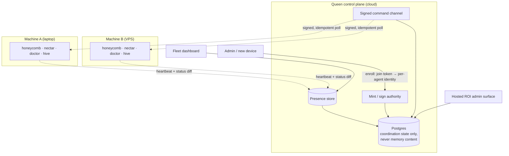

# Queen: Stories & User Guide

*The cloud fleet orchestrator for the Apiary, explained for operators and decision makers.*

> **The Apiary** by Legion Code Inc., in collaboration with Activeloop.

## Foreword

The Apiary is clean on one machine: four daemons behind one portal, everything on loopback. The problem starts when the stack spreads across machines, teammates, and orchestrators that spin up throwaway workers. Which daemons are alive, on which boxes? Who can mint identity for a new device? How does an admin see fleet-wide ROI without remoting into a laptop? When a machine is stolen, what gets cut off and how fast? Queen answers those questions and nothing else. It never touches memory content. This is the plain-language account of what it does and why.

## Queen: Overview & Quickstart

### What makes Queen different

Most fleet tools start by grabbing your credentials and end by becoming the thing you have to trust blindly. Queen's architecture is four deliberate decisions, each written down before a line ships:

- **Orchestrator-custodian model.** Per ADR-0002, your fleet's long-lived orchestrator holds custody of the Deeplake credential, not the cloud. Queen coordinates identity, presence, and encrypted blobs it cannot decrypt in the default mode. Workers stay disposable: they check in, heartbeat, get brokered or short-lived access, and vanish. You trust your orchestrator; Queen coordinates; Deeplake stores memory.
- **Trusted-device custody and headless enrollment.** Per ADR-0003, adding a second laptop never requires two machines open at once: approve in the cloud, and an existing custodian device finishes the cryptographic rewrap next time it's online. A browserless VPS enrolls with a short-lived token whose only power is "let me join." It cannot read memory and cannot decrypt anything.
- **A control plane with a hard boundary.** Per ADR-0004, coordination state lives in Postgres behind an edge API (Cloudflare Workers + Hyperdrive + DigitalOcean managed Postgres), and it is deliberately narrow: identity, devices, fleets, enrollment, presence, leases, encrypted blob metadata. No memory content, no prompts, no session text, no plaintext credentials. Presence never writes into the Deeplake memory dataset, and idle daemons never poll Deeplake for coordination work.
- **Recovery, revocation, and escrow as policy, not improv.** Per ADR-0005, the hard cases have written answers before they hit a support ticket. Revoking a device in Queen and rotating the Deeplake credential are two honest, separate steps. Lose every custodian and the answer is re-link, not a hidden backdoor. Cloud escrow can exist only as explicit, visible, reversible opt-in.

### Features

- **Presence store and heartbeat protocol.** A cheap `last_seen` heartbeat on a fixed interval plus a richer status diff written only on change, with TTL reaping so dead ephemeral agents never pile up in the fleet view. *(spec, PRD-007a)*
- **Daemon presence reporters.** Each daemon reports liveness and status fail-soft: a presence error never blocks real work. *(spec, PRD-007b)*
- **Read-only fleet dashboard.** Every agent in your org rendered with derived health, healthy vs offline distinguished purely by heartbeat age, scoped so you only ever see your own fleet. *(spec, PRD-007c)*
- **Per-agent enrollment and identity.** Every agent, including ephemeral sub-agents, gets its own attributable, revocable identity. Warm hosts vouch for their children; cold hosts exchange a short-lived join token for a per-agent credential. No shared forever-key, ever. *(spec, PRD-008a)*
- **Mint and sign authority.** One primary daemon Ed25519-signs every command and brokers credentials; workers verify against a pinned public key. The dashboard can request a command but can never forge one. *(spec, PRD-008b)*
- **Signed command channel.** Idempotent polled commands, signed and acked, built to survive a flaky transport. If the authority goes down, workers degrade to autonomous, not to dead. *(spec, PRD-008c)*
- **Hosted ROI admin surface.** An authenticated, multi-tenant admin app with per-org, per-team, and per-user leaderboards, fenced by an explicit admin entitlement and fed by an aggregation read API that never silently blends allocated cost with measured cost. *(spec, PRD-009a/b/c)*
- **Per-user claim gating.** Per-user leaderboards stay inert until a verified backend identity claim exists. No self-asserted names, no fabricated rows, org and team reporting in the meantime. *(spec, PRD-009d)*
- **Privacy and retention.** Per-user spend is treated as PII: visibility controls on who sees whom, plus a GDPR-style erasure path against the append-only ledger. *(spec, PRD-009e)*

### Install (one command)

Queen rides on the Apiary stack. One line brings up the local half: Honeycomb, Nectar, Doctor, and the Hive portal.

```bash
# macOS / Linux
curl -fsSL https://get.theapiary.sh | sh
```

```powershell
# Windows (PowerShell)
irm https://get.theapiary.sh/install.ps1 | iex
```

That gets you the local Apiary with the Hive portal at `127.0.0.1:3853`. Queen's cloud enrollment layers on top of that per the roadmap: the machines you install today are the fleet Queen observes and steers tomorrow. Source setup instructions land with the first implementation PRDs.

### Using the dashboard

Queen's surfaces are hosted, by design. The local stack's dashboard stays where it lives, at the Hive portal on `127.0.0.1:3853`; Queen adds the cloud views that no single machine can render.

The **fleet dashboard** (PRD-007c) is the observe half: your org's whole roster, every agent with a derived health state, orchestrators and their sub-agents, per-daemon state across machines. An idle-but-healthy daemon and a crashed one look identical from the outside; the heartbeat protocol is what tells them apart, and this page is where you see it. Read-only on purpose: maximum visibility, minimum new attack surface.

The **hosted ROI admin surface** (PRD-009) is a separate authenticated app where an authorized admin sees ROI across orgs: per-org, per-team, and per-user dashboards and leaderboards over the shared spend ledger, with allocated-vs-measured cost surfaced on every line and per-user views gated behind verified identity. It reads the ledger; it never writes a spend row.

### Using the CLI

Straight answer: the exact verbs get pinned when implementation starts. What the specs already pin is the flow. PRD-008 defines it end to end: a short-lived, single-use join token is created on a trusted device, redeemed on the new machine for its own per-agent credential, and is dead after use. ADR-0003 sketches the shape:

```bash
# On an already-enrolled trusted device: mint a short-lived join token.
devices enroll-token create --kind openclaw-orchestrator --name openclaw-prod-01 --ttl 10m

# On the headless box: redeem it. The token can join; it can never read memory.
enroll --token <token>
```

Behind those two commands sits the whole PRD-008 machinery: token validation with scope, expiry, and usage count; a locally generated keypair whose private half never leaves the machine; and an identity of `(org, host device-id, agent-instance-id)` that can be revoked one agent at a time. Warm hosts skip the token entirely: an enrolled daemon vouches for the sub-agents it spawns, no human in the loop.

### Second machine, zero ceremony

This is the payoff moment the specs are built around. Once Queen ships, adding a machine to your fleet looks like this:

```text
# Mint a 10-minute token on your laptop. Run the enroll command on the new box.
# Then watch the fleet dashboard:

  laptop-01    healthy    honeycomb · nectar · doctor · hive
  build-vps    enrolling…

# One heartbeat interval later:

  laptop-01    healthy    honeycomb · nectar · doctor · hive
  build-vps    healthy    honeycomb · nectar · doctor · hive
```

No browser on the VPS, no credential pasted into a config file, no shared key that haunts you at offboarding time. The token joined the machine and expired; the machine earned its own identity; its daemons started reporting presence under it.

### How it works

Two planes, never collapsed. Memory and skills ride the Deeplake data plane that already works today. Queen is the control plane beside it: presence in, signed commands out, and a hard Postgres boundary that stores coordination state and nothing your sessions ever said.



Daemons heartbeat into the presence store; liveness is derived from heartbeat age, never guessed. The mint authority is the single place identity and commands come from: it signs, workers verify against a pinned key, and a tampered or replayed row simply fails verification. Postgres holds devices, fleets, enrollments, presence, and encrypted blob metadata, with explicit tenant identity on every row, and by policy it never holds memory text, prompts, paths, or plaintext credentials. The dashboards read from the control plane; they never get to write commands directly.

### Why a fleet needs a custodian

Here's the uncomfortable truth about multi-machine agent fleets: the trust question doesn't go away because you ignored it. Somebody holds the credential that unlocks your team's shared memory. If that somebody is "every VM image," you've turned a golden image into fleet-wide secret material. If it's "the cloud vendor, readable," you've handed your memory plane to someone else's incident response. The orchestrator-custodian model picks the honest third option: custody lives with a durable machine in *your* trust domain, the cloud coordinates around ciphertext it cannot open, and the product says so out loud, because "we cannot decrypt this" is both the security promise and the support constraint.

Identity minting is guarded for the same reason. A config file with a shared API key cannot attribute anything, cannot revoke one agent without breaking all of them, and turns any single leak into a fleet-wide compromise. A mint authority flips every one of those: each agent gets its own identity, each identity can be cut individually, and every mint is signed and logged. Concentrating that power in one place concentrates risk too, which is why the specs treat the signing key as the crown jewels and why the authority is required to *issue* commands but never to *run* workers. Kill it and the fleet keeps working; it just stops taking new orders.

And the sequencing is deliberate: observation before control. PRD-007 ships the read-only fleet view first, maximum visibility with minimum new attack surface. PRD-008 adds commanding only after that view exists and the pain of not having control is real. Commanding an autonomous agent is the most sensitive surface in the system; you don't bolt that on first and audit it later.

### Other interfaces

The specced surfaces, exactly as the PRDs name them:

- **Fleet dashboard.** The read-only, org-scoped fleet roster with derived health (PRD-007c).
- **Control-plane API.** Org-scoped heartbeat and fleet-roster endpoints (PRD-007), plus the enrollment, vouch, and signed-command endpoints (PRD-008): tokens in, per-agent credentials out, commands polled and acked.
- **Hosted ROI admin surface.** The separate authenticated admin app (PRD-009a/c) over the **aggregation read API** (PRD-009b): org, team, user, project, and time rollups with cost basis carried through end to end.

All three are specified in this repo's PRDs and sequenced on the roadmap below.

 Status & Roadmap

Queen is in the **specification stage**. The program moved here from Honeycomb on 2026-07-03, when cloud fleet and team management got their own product, and it arrived with its architecture already decided: four ADRs (orchestrator custody, trusted devices and headless enrollment, the control-plane Postgres boundary, and recovery/revocation/escrow policy) and three fully specced PRDs sitting in the backlog. PRD-007 (fleet observation) ships first, deliberately read-only. PRD-008 (enrollment, identity, and the mint/sign authority) is the control half, sequenced second on purpose. PRD-009 (the hosted ROI admin surface) is the reporting layer, gated behind its data foundation and flagged as the highest-risk auth surface in the set. Implementation is next; watch the roadmap and vote on what ships first at [ideas.theapiary.sh](https://ideas.theapiary.sh).

### Development

The program lives under `library/`:

- `library/requirements/backlog/` holds the Queen PRD program with their sub-PRDs. The inherited fleet specs were renumbered into Queen's native sequence on 2026-07-03 (007 fleet observation, 008 fleet control, 009 hosted ROI), and the build-out PRDs (001 local agent, 002 cloud control-plane, 003 auth, 004 licensing, 005 usage-stream observation, 006 ingestion, 010 infrastructure, 011 observability) sit alongside them. Start with each PRD's index file; the acceptance criteria are the contract.
- `library/knowledge/private/architecture/` holds the ADR set: the inherited ADR-0002 through ADR-0005 (custody, enrollment, control-plane boundary, recovery) and the Queen-native ADR-0006 through ADR-0010 (two-app topology, stack selection, cloud-binding and license enforcement, observation scope, cloud infrastructure) that supersede their framing.
- `library/knowledge/private/auth/` and `.../collaboration/` hold the enrollment state machine and the fleet-observation design doc, the narrative sources the PRDs cite.

Read the ADRs first, then the PRD indexes, and you know the whole system. Build tooling lands with the first implementation wave.

### Credits

- **[Activeloop](https://activeloop.ai/)** brings **[Deeplake](https://deeplake.ai/)** (the versioned, multi-modal database for AI with native vector + columnar indexing and hybrid search) and **[Hivemind](https://github.com/activeloopai/hivemind)**, the open-source agent-memory project Honeycomb is built upon.
- **[Legion Code Inc](https://github.com/legioncodeinc)** brings the multi-tier memory system (Tier 1 / 2 / 3 keys, summaries, raw), code base atlas memory architecture, auto healing service, session priming, automatic skill development & propagation, the pollinating loop, the knowledge graph, cross device cross repository cross team skill sharing, and the daemon architecture that turns Deeplake into a shared brain your coding agents read and write on every turn.

### License

Queen is licensed under the **GNU Affero General Public License v3.0 or later** (AGPL-3.0-or-later).

Use it commercially or privately, free of charge. In return: keep the copyright and license notices intact, and if you modify it, your changes ship under the same AGPL license with source available. The "Affero" part is the point: run a modified version as a network service
