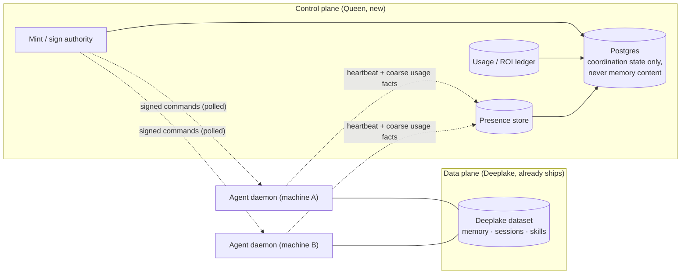
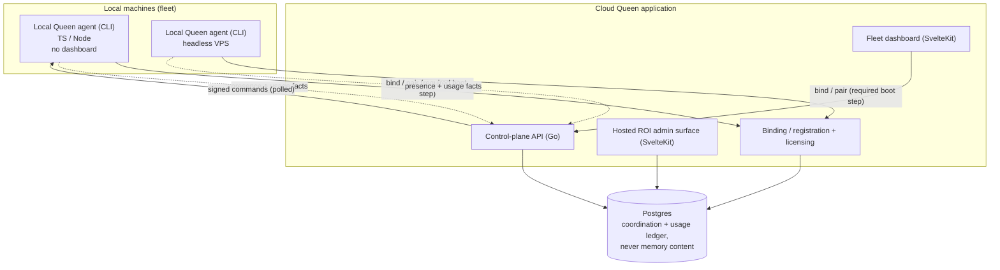
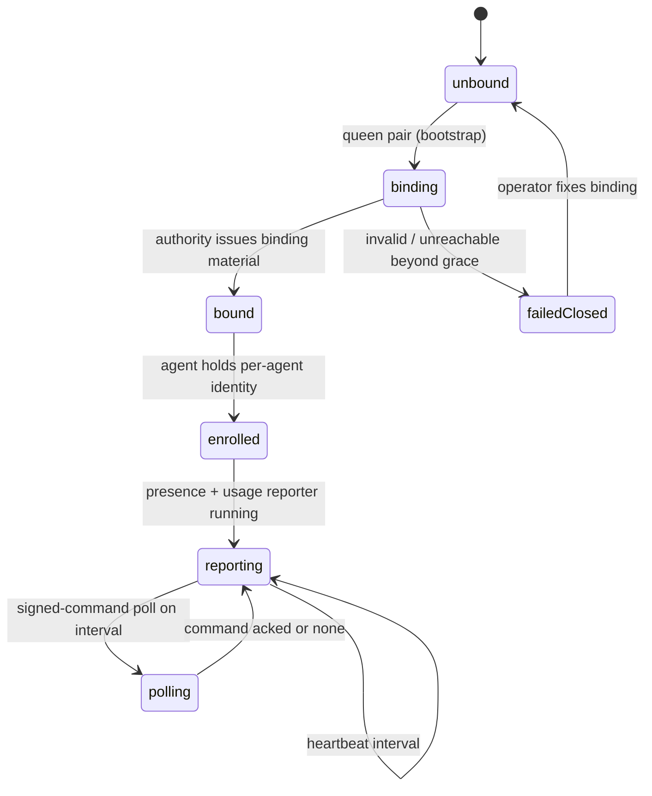
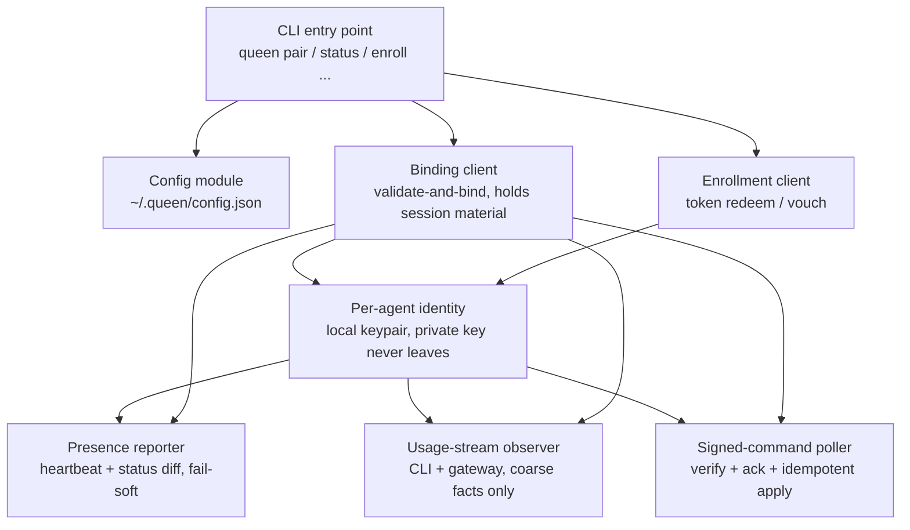
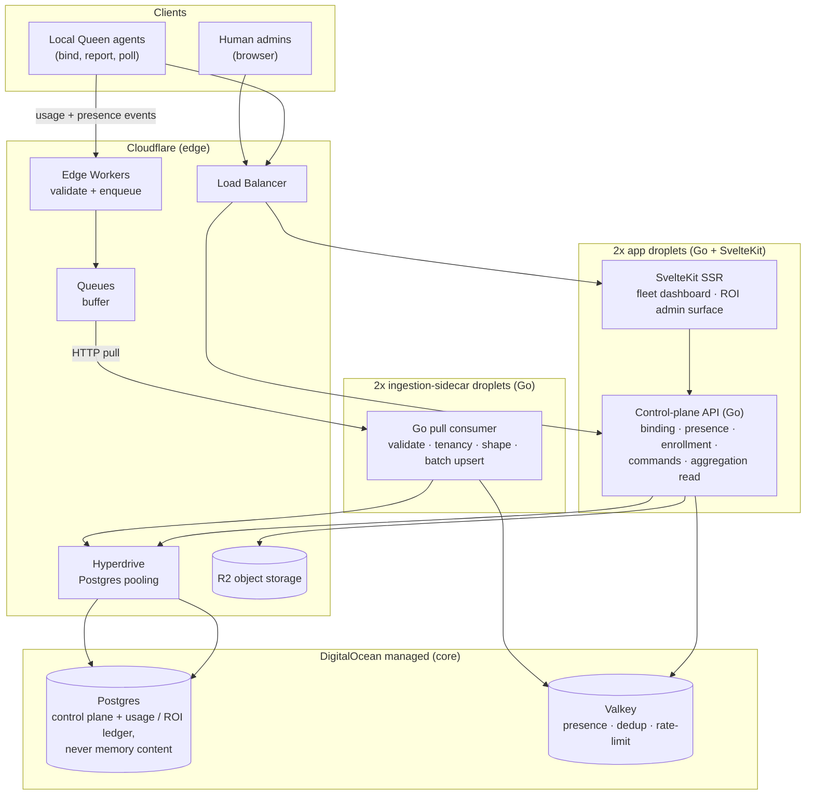
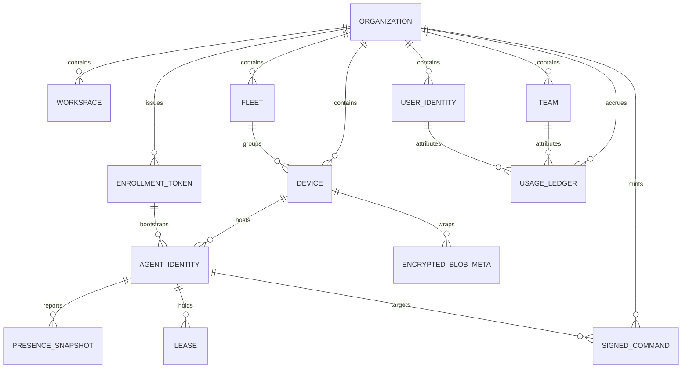
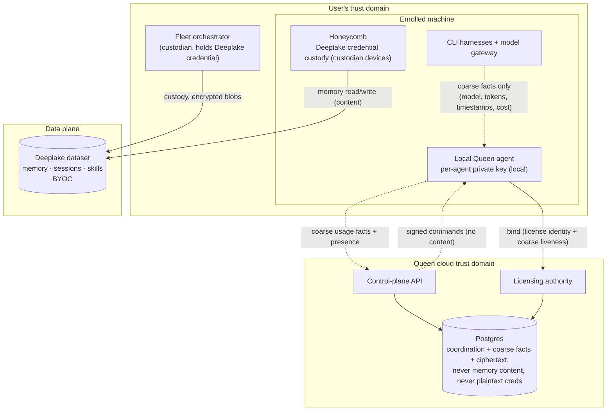
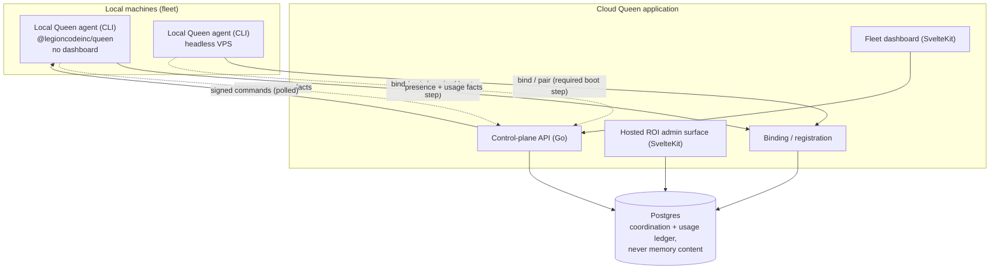
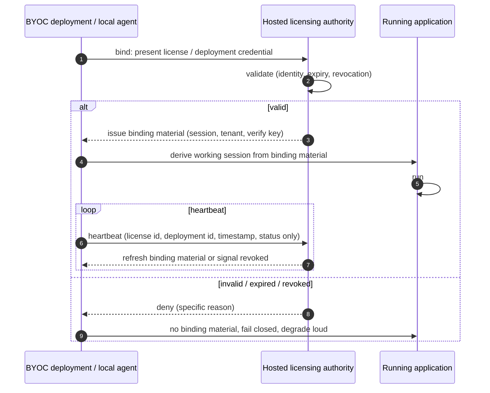
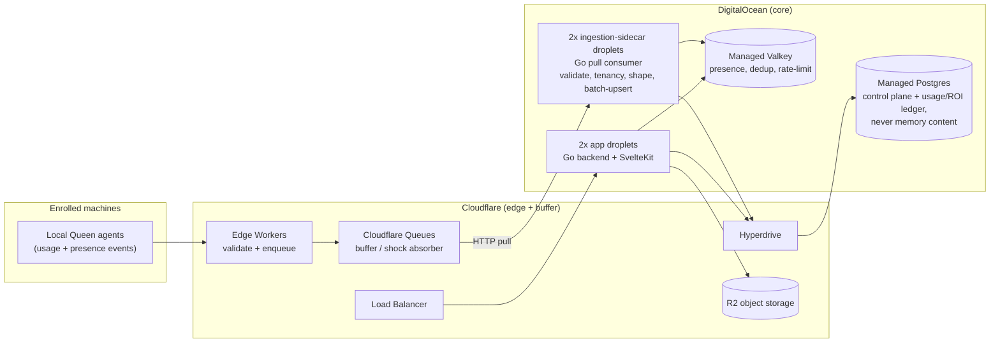

# Queen: Technical Manual & Specification

*The two-plane control model, local agent and cloud application architecture, control-plane schema, and trust boundaries.*

> **The Apiary** by Legion Code Inc., in collaboration with Activeloop.

## Foreword

Queen is the control plane that sits beside the Deep Lake memory data plane and carries what that plane was never meant to carry: liveness, identity, enrollment, signed commands, usage observation, and fleet reporting. This manual documents the two-application topology, the local agent and cloud application architectures, the control-plane schema, cloud binding and license enforcement, and the trust boundaries. It is written for engineers building or auditing the orchestrator.

## Queen System Overview

The entry point for anyone about to build or reason about Queen. Read this first. It maps the two-plane model, the two-application split, the four-role Apiary topology Queen joins, and where to go next for each domain.

### What Queen is

Queen is the Apiary's cloud fleet orchestrator. It is the control plane that sits beside the Deeplake memory data plane and carries what the data plane was never meant to carry: liveness, status, identity, enrollment, signed commands, usage-stream observation, and fleet-wide reporting. Memory and skills stay on Deeplake, where they already work. Queen owns seeing and steering the fleet that writes to it.

The Apiary is clean on one machine: four daemons behind one portal, everything on loopback. The problem starts when the stack spreads across machines, teammates, and orchestrators that spin up throwaway workers. Nobody can answer the questions that matter anymore. Which daemons are alive right now, on which boxes? Who is allowed to mint identity for a new device, and who just did? How does an admin see fleet-wide ROI without remoting into someone's laptop? When a machine is stolen or an engineer walks out, what gets cut off, how fast, and what still needs rotating? Queen answers those questions and nothing else. It does not touch memory content.

### The two-plane model

Every design decision in Queen falls out of one framing: two planes, never collapsed. The data plane is Deeplake, and it already ships. The control plane is Queen, and it is new. Do not merge them.



The two planes carry different things and live on different substrates.

| Plane | Carries | Substrate | Owner |
|---|---|---|---|
| Data | Memory, sessions, the skill library | Deeplake dataset (BYOC) | Deeplake, unchanged |
| Control | Liveness, status, identity, enrollment, signed commands, usage facts, ROI | Postgres + Valkey behind a Go API | Queen |

The reason the split is load-bearing and not stylistic: presence is mutable, high-frequency, and ephemeral, which is the exact opposite profile of the append-only, version-bumping Deeplake memory dataset. Heartbeating a fleet of daemons into Deeplake is the write-amplification pattern that has wedged the daemon before. Presence, usage facts, and coordination state get a fit-for-purpose store. The Postgres boundary is hard: it holds coordination state and coarse usage facts and never holds memory content, prompts, session text, or plaintext credentials. That boundary comes from ADR-0004 and carries forward unchanged into Queen.

### The two-application split

Queen is not one program. It is two applications with a binding relationship between them, decided in ADR-0006.

**The local Queen agent** is TypeScript/Node, CLI only, no local dashboard. It runs on every machine in the fleet. It binds ("pairs") to a Queen cloud deployment as a required boot step, reports presence and usage-stream facts, redeems enrollment tokens, holds per-agent identity, and polls the signed command channel. The package is `@legioncodeinc/queen`. It has no web UI on purpose, because any dashboard renders fleet, org, or ROI data, and that data is control-plane data that belongs behind the cloud application's auth and licensing, never on a loopback port on an enrolled machine. The local agent is useless on its own; it functions only when bound to a cloud deployment. See `local-agent-architecture.md`.

**The cloud Queen application** is Go on the backend and Svelte/SvelteKit on the frontend. It serves every Queen dashboard (the read-only fleet dashboard and the hosted ROI admin surface) and the control-plane API, from `queen.theapiary.sh` (the hosted common deployment) or a customer's licensed BYOC deployment. It owns the Postgres boundary, ingestion, authentication, and licensing. See `cloud-application-architecture.md`.



The stack choices are fixed in ADR-0007. Go on the backend for a single static binary, a tiny dependency surface, and strong concurrency for ingestion fan-in. SvelteKit on the frontend for a small bundle and good SSR on read-mostly dashboards. TypeScript/Node on the local agent for consistency with the rest of the Apiary local stack. One dependency discipline governs all three: prefer the standard library and language built-ins, and make every third-party dependency earn its place.

### The four-role Apiary topology Queen joins

Queen does not run alone on a machine. It joins the local Apiary stack, which is four daemons behind one portal. Understanding those four roles tells you what Queen observes and what it leaves alone.

| Role | What it is | Queen's relationship to it |
|---|---|---|
| Honeycomb | The agent-memory engine that reads and writes the Deeplake dataset on every turn | Queen observes its liveness and reports presence; Queen never reads its memory content |
| Nectar | The skill and asset propagation layer | Queen observes; skills stay on the data plane |
| Doctor | The local watchdog and telemetry source of truth | Queen's presence view is fed by, and complementary to, Doctor's local telemetry; Queen adds the cloud, cross-machine view Doctor cannot render alone |
| Hive | The local portal on `127.0.0.1:3853` that renders the single-machine view | Hive stays local; Queen adds the fleet views no single machine can render |

The division of labor is deliberate. The local Apiary stack renders one machine's view at the Hive portal. Queen adds the cloud views that span machines. An idle-but-healthy daemon and a crashed one look identical from the outside; the heartbeat protocol is what tells them apart, and the fleet dashboard is where you see the difference across the whole fleet.

### What Queen does, end to end

The system has three motions, and they were sequenced on purpose: observe, then steer, then report.

1. **Observe.** Local agents heartbeat into the presence store and extract coarse usage facts from the CLI harness and model-gateway streams they can already see. Liveness is derived from heartbeat age, never guessed. This is the read-only half, maximum visibility with minimum new attack surface.
2. **Steer.** A single mint-and-sign authority Ed25519-signs every command; workers verify against a pinned public key before executing. The dashboard can request a command but can never forge one. Per-agent identity means one revocation cuts off one agent, not the fleet.
3. **Report.** The usage facts feed an ingestion pipeline that writes a usage/ROI ledger in Queen's own Postgres. The hosted ROI admin surface reads that ledger, gated behind an explicit admin entitlement and verified per-user identity, and never writes a spend row.

Observation before control is not an accident. The read-only fleet view ships first (PRD-007) because commanding an autonomous agent is the most sensitive surface in the system, and you do not bolt that on first and audit it later. Control (PRD-008) lands second, once the fleet view exists and the pain of not having control is real. The hosted ROI surface (PRD-009) is the reporting layer, gated behind its data foundation and flagged as the highest-risk auth surface in the set.

### The hard invariants

These hold across every Queen component. If a design choice violates one, the design is wrong, not the invariant.

- **No memory content, ever.** The Postgres boundary holds coordination state and coarse usage facts. It never holds memory content, prompts, session text, file paths, repo names, or plaintext credentials. See `../security/trust-boundaries.md`.
- **The local agent does not function unbound.** Binding to a cloud deployment is a required boot step, fused with license enforcement. See `../licensing/cloud-binding-and-byoc.md`.
- **Observation is coarse-facts-only in v1.** CLI harness and model-gateway traffic only. No root CA, no TLS interception on enrolled machines. See `../operations/usage-stream-observation.md`.
- **Two planes, never collapsed.** Presence never writes into the Deeplake memory dataset, and idle daemons never poll Deeplake for coordination work.

### Where to read next

| You want to understand | Read |
|---|---|
| The local CLI agent's internals and lifecycle | `local-agent-architecture.md` |
| The cloud Go + SvelteKit service topology and API | `cloud-application-architecture.md` |
| The Postgres control-plane schema, as SQL DDL | `../data/control-plane-schema.md` |
| How Cloudflare, DigitalOcean, and the tooling wire together | `../integrations/infrastructure-topology.md` |
| The trust model and what the cloud can and cannot see | `../security/trust-boundaries.md` |
| How the local agent observes usage without reading content | `../operations/usage-stream-observation.md` |
| The AGPL cloud-binding enforcement and BYOC path | `../licensing/cloud-binding-and-byoc.md` |
| The device and per-agent enrollment state machine | `../auth/device-and-fleet-enrollment-state-machine.md` |
| The fleet observation and on-demand skill design | `../collaboration/fleet-observation-and-on-demand-skills.md` |

## Local Queen Agent Architecture

The internals of the local TypeScript/Node CLI agent (`@legioncodeinc/queen`): its pairing and binding lifecycle, config, command surface, presence reporter, usage-stream observer, enrollment client, and signed-command poller. Read this to build or reason about the local half of Queen. For the cloud half it talks to, see the cloud application doc.

### Why this exists and what it is not

The local agent is the reporter and command executor half of Queen. It runs on every machine in the fleet: laptops, workstations, headless build VPS boxes, and the throwaway VMs an orchestrator spins up. Its job is narrow and precise. Report presence. Extract coarse usage facts from CLI and gateway traffic. Redeem enrollment tokens for a per-agent identity. Poll a signed command channel and execute what verifies. That is the whole contract.

It is TypeScript/Node because the rest of the Apiary local stack (Honeycomb, Doctor, Hive) is TS/Node, and sharing that toolchain matters more on the local side than any backend language unification does (ADR-0007). It follows the Apiary slim-dependency mandate: Node built-ins first, and every third-party dependency justified in the PRD that pulls it in.

The single most important design fact about the local agent is what it is not. **It has no local dashboard and opens no human-facing HTTP listener.** This is a boundary, not a preference. Any dashboard renders fleet, org, or ROI data, and that is control-plane data. Serving it locally would put a licensed, auth-gated, BYOC-class surface on every enrolled machine, including throwaway VMs, and multiply both the attack surface and the license-enforcement burden. So the local agent is CLI only. If a human wants to look at the fleet, they open the cloud dashboard, not a port on a laptop. This is fixed in ADR-0006.

### Boot lifecycle: bind, then function

The local agent does nothing useful until it is bound to a Queen cloud deployment. Binding is a required boot step, and the license check is fused into it (ADR-0008, detailed in `../licensing/cloud-binding-and-byoc.md`). The agent cannot run offline or unbound; that is by design.



The sequence at boot:

1. **Bind.** The agent presents its binding credential to the cloud deployment (hosted common at `queen.theapiary.sh` or a licensed BYOC deployment). The handshake validates the license and returns the runtime material the agent needs on every request path: tenant context, the control-plane session credential, and the command-channel verification key (the pinned Ed25519 public key from the mint authority). No binding material means no running agent, and the failure is loud and specific.
2. **Enroll.** The agent obtains its per-agent identity. On a warm host, an already-enrolled daemon vouches for it. On a cold host, it redeems a short-lived join token. See the enrollment client below.
3. **Report.** Once bound and enrolled, the presence reporter and usage-stream observer start. Heartbeats begin on a fixed interval; usage facts flow as CLI and gateway traffic is seen.
4. **Poll.** The signed-command poller runs on its own interval, pulling commands, verifying signatures, and acking.

### Internal components

The agent is a set of focused units. None has side effects at import time; the CLI entry point wires them together.



#### Config

Config lives at `~/.queen/config.json` (override the home with an environment variable, following the Apiary local-stack convention). It holds the binding target (which cloud deployment to pair with), the persisted per-agent identity reference, presence and poll intervals, and nothing secret in plaintext that a machine credential store can hold instead. The private half of the per-agent keypair is generated locally and never written to a plaintext config file; it lives in the machine credential store where the platform provides one. Config is read at boot and is not a place secrets are stashed.

#### Binding client

The binding client is the spine of the agent. It runs the validate-and-bind handshake and holds the session material the handshake returns. It is deliberately not a `verifyLicense()` gate followed by a separate `bind()`. The license validation and the production of the working session are the same code path: the authority validates the license and issues the binding material, and the agent derives its working session from that material. There is no code path that produces a working session while skipping validation. This is the anti-strip design from ADR-0008; see `../licensing/cloud-binding-and-byoc.md` for the full treatment.

#### Enrollment client

The enrollment client turns "this process exists" into "this process has an attributable, revocable identity." It covers two paths, matching the enrollment state machine.

- **Cold host.** A fresh machine with nothing enrolled redeems a short-lived, single-use join token. The token's only power is "let me join." The agent generates a keypair locally, presents the token to the mint authority, and receives its own per-agent credential plus an identity of `(org, host device-id, agent-instance-id)`. The token is dead after use.
- **Warm host.** A machine that already runs an enrolled daemon does not need a token for its children. The enrolled daemon vouches for the sub-agents it spawns, minting a child identity locally and reporting it. The trust chain is authority to host daemon to sub-agent.

The anti-pattern the enrollment client exists to avoid is one shared API key pasted into every agent forever: it cannot attribute or revoke a single agent, and a leak from any one agent is fleet-wide. Every agent, including ephemeral sub-agents, gets its own identity. Full state coverage is in `../auth/device-and-fleet-enrollment-state-machine.md`.

#### Presence reporter

The presence reporter emits two distinct signals, because liveness and status content are different problems.

- **Heartbeat.** A cheap `last_seen` timestamp the agent bumps on a fixed interval regardless of whether anything changed. Liveness is derived downstream as `now - last_seen > threshold`. If a healthy idle agent wrote nothing and a crashed agent also wrote nothing, the dashboard could not tell them apart. The heartbeat is what makes them distinguishable.
- **Status diff.** The richer record (current task, agent version, embeddings health, error state) written only on change. This is the "if nothing changes, nothing writes" idea applied to content, not to liveness.

The reporter is **fail-soft**: a presence error never blocks real work. If the control plane is unreachable, the agent keeps doing its actual job and keeps trying to report. Presence is a report, not a gate.

Reporting targets the control-plane API, which enqueues events at the ingestion edge. Presence writes never land in the Deeplake memory dataset; that separation is the whole point of the two-plane model. See `../integrations/infrastructure-topology.md` for where the events go.

#### Usage-stream observer (CLI and gateway only)

The usage-stream observer is what makes fleet ROI measured rather than guessed. It observes CLI harness and model-gateway traffic that already flows through a layer the user opted into (the rflectr-derived proxy/adapter layer that sees Claude Code CLI, Codex CLI, and Cursor CLI traffic without touching the operating system trust store). From those streams it extracts only coarse, non-content usage facts: model identifier, token counts, timestamps, agent identity, harness, and cost basis.

It observes **CLI harnesses and the model gateway only**. Desktop TLS interception (Claude Desktop, ChatGPT Desktop, Cursor Desktop) is explicitly out of scope for v1, because that path requires installing a root CA and a first-party TLS interceptor on every enrolled machine, which is the highest trust cost in the system and contradicts Queen's honest-custodian promise. The full reasoning and the deferred-capability seam are in `../operations/usage-stream-observation.md` and ADR-0009. No prompts, no completions, no session text crosses the boundary.

#### Signed-command poller

The poller is the command-executor half of the agent. It pulls commands from the control plane on an interval (poll, not push), and for each one it verifies the Ed25519 signature against the pinned public key from the mint authority before executing. A command that is unsigned, tampered, replayed, or of an unknown type simply fails verification and is not run. Applied commands are idempotent and acked, so a flaky transport that duplicates a row does not cause double execution.

The poller degrades to autonomous, not to dead. If the mint authority is down, the agent cannot receive new commands, but it keeps doing local work and keeps heartbeating. The authority is required to issue commands, never to run workers. Kill it and the fleet keeps working; it just stops taking new orders.

### Command surface

The exact verbs are pinned when implementation starts (PRD-001). The shape the specs already fix:

| Command | Purpose |
|---|---|
| `queen pair` | Bind this machine to a cloud deployment. Required before anything else works. |
| `queen status` | Print this machine's binding, identity, and presence state to the terminal. This is the local view, and it is a CLI, not a web page, on purpose. |
| `queen enroll --token ` | Redeem a short-lived join token on a cold host for a per-agent credential. |
| `queen enroll-token create` | On an already-enrolled trusted device, mint a short-lived join token for another machine. |

The `queen status` output is the deliberate substitute for a local dashboard. Because there is no local web UI by design, the CLI's output has to be good: it must clearly answer whether the machine is bound, enrolled, reporting, and reachable.

### Why no dashboard, restated

It is worth stating the constraint plainly because it drives everything above. A developer who wants a quick local view of just this machine gets a CLI, not a web page. That is intentional. The fleet view is not a local view: a dashboard that shows other machines cannot be served from one machine's loopback without that machine becoming a de facto control plane and a cross-machine data sink. Put the dashboards where the auth, tenancy, and licensing boundary already is, which is the cloud application. The local agent stays disposable, headless, and cheap, which is exactly what ephemeral workers and headless VPS boxes need.

### Invariants for the local agent

- Ships no web dashboard and opens no human-facing HTTP listener.
- Performs a binding handshake as a required boot step and does not function unbound.
- Generates its per-agent keypair locally; the private key never leaves the machine.
- Presence reporting is fail-soft: a presence error never blocks real work.
- The usage-stream observer captures coarse facts only, from CLI and gateway traffic, never desktop TLS, in v1.
- The signed-command poller verifies every command against the pinned key and applies idempotently; it degrades to autonomous when the authority is down.

## Cloud Queen Application Architecture

The internals of the cloud Queen application: the Go backend and SvelteKit frontend, the service topology on the droplet pairs behind the Cloudflare Load Balancer, the control-plane API surface, how the dashboards are served, and how ingestion feeds it. Read this to build or reason about the cloud half of Queen. For the local half that binds to it, see the local agent doc.

### Why this exists and what it owns

The cloud Queen application is where everything a single machine cannot honestly render lives. It serves every Queen dashboard, runs the control-plane API, terminates authentication and licensing, and owns the Postgres boundary. It is the thing the local agent binds to, and it is the thing an admin points a browser at. It runs at `queen.theapiary.sh` as the hosted common deployment, or as a customer's licensed BYOC deployment, and the two are the same application with a different license identity (ADR-0006, `../licensing/cloud-binding-and-byoc.md`).

The backend is Go and the frontend is Svelte/SvelteKit (ADR-0007). Go earns the backend because the real workload is concurrent ingestion fan-in and a control-plane API, and Go gives a single static binary with a tiny dependency surface, strong concurrency, and a cheap, boring deployment on droplets. SvelteKit earns the frontend because the dashboards are read-mostly, and SvelteKit ships a small bundle with good SSR for read-and-render pages. Cloudflare Workers appear in Queen only at the ingestion edge; they are never the control-plane API (ADR-0010).

### Service topology

The cloud application runs across two droplet tiers on DigitalOcean, both fronted by a Cloudflare Load Balancer, with the ingestion edge on Cloudflare and the stores on DigitalOcean managed services.



The reason there are two separate droplet tiers is a workload split. The app tier serves synchronous request/response traffic: the control-plane API and the SSR dashboards. The ingestion tier does asynchronous, spiky, high-frequency work: pulling usage and presence events off the queue, validating and shaping them, and batch-upserting to Postgres. Keeping them separate means a burst of fleet usage events cannot starve the interactive API, and each tier scales on its own signal. Both tiers are the same Go codebase deployed in different modes, so validation, tenancy, and shaping logic is written once and tested locally without a Worker runtime. The full infrastructure wiring, including why the sidecar tier exists rather than Workers writing Postgres directly, is in `../integrations/infrastructure-topology.md`.

### The Go backend

The backend is a single static Go binary that runs in one of two modes.

**API mode (app tier).** Serves the control-plane API and backs the SvelteKit SSR pages. It reaches Postgres through Hyperdrive for durable reads and writes, Valkey for hot presence and rate-limit reads, and R2 for exports and large payloads. It terminates the binding handshake and licensing (the validate-and-bind path from ADR-0008), the WorkOS-backed human authentication, and the org/workspace/team tenancy checks on every request.

**Consumer mode (ingestion tier).** Runs the pull consumer that drains the Cloudflare Queue. For each batch it applies validation, tenancy enforcement, and data shaping, dedupes against Valkey idempotency keys, and batch-upserts presence snapshots and usage/ROI ledger rows into Postgres via Hyperdrive. This is where the ingestion business logic lives, in Go, not scattered into Worker JS.

The slim-dependency mandate applies to the backend: prefer the Go standard library and justify every third-party import in the PRD that introduces it.

### The SvelteKit frontend

The frontend is server-side rendered for a read-mostly experience. It serves two distinct surfaces, and they are kept separate on purpose.

**The fleet dashboard** (PRD-007c) is the observe half: the viewer's whole org roster, every agent rendered with a derived health state, orchestrators and their sub-agents, per-daemon state across machines. Health is derived from heartbeat age, not guessed: an idle-but-healthy daemon and a crashed one are distinguished purely by `last_seen`. It is read-only by design, for maximum visibility with minimum new attack surface. It reads through the control-plane API, which enforces the org boundary so a viewer sees only their own fleet.

**The hosted ROI admin surface** (PRD-009) is a separate authenticated app where an authorized admin sees ROI across orgs: per-org, per-team, and per-user dashboards and leaderboards over the usage/ROI ledger, with allocated-versus-measured cost surfaced on every line. It is fenced behind an explicit admin entitlement, and per-user views stay inert until a verified backend identity claim exists (no self-asserted names, no fabricated rows). It reads the ledger through the aggregation read API and never writes a spend row.

The two surfaces are separate because their risk profiles differ. The fleet dashboard is org-scoped, read-only, and low-risk. The ROI surface reads a cross-org ledger behind an admin entitlement and is the highest-risk auth surface in the set, which is why it is a distinct app with its own gating rather than a tab on the fleet dashboard.

### The control-plane API surface

The API is org-scoped on every route. Tenancy is enforced by the same boundary throughout: a request is authorized against its org, and it can only touch rows in its own org. The surface groups into four areas, matching the PRD program.

| Area | Representative endpoints | Owner PRD |
|---|---|---|
| Binding and licensing | present binding credential, license heartbeat | PRD-004 |
| Presence and fleet roster | `POST` heartbeat (upsert `last_seen` + optional status diff), `GET` fleet roster with derived health | PRD-007 |
| Enrollment and identity | mint join token, redeem token for per-agent credential, warm-host vouch | PRD-008 |
| Signed commands | request/mint a signed command, poll the command channel, ack | PRD-008 |
| Aggregation read (ROI) | org/team/user/project/time rollups with cost basis carried through | PRD-009 |

Two rules hold across the whole surface. The dashboard reads; it never writes commands directly. It asks the mint authority to mint a command, and the authority signs it. So a stolen dashboard session can request but never forge. And the aggregation read API never blends allocated cost with measured cost silently: every rollup carries its cost basis through so a reader always knows whether a number is measured or allocated.

### How ingestion feeds the application

The presence and usage facts the local agents report do not hit the API synchronously. They go through the ingestion path so a spike of fleet events cannot overwhelm the interactive tier.

The edge Worker validates the event shape and enqueues it to a Cloudflare Queue fast, absorbing the spike. The Go pull consumer on the ingestion droplets drains the queue at its own pace, applies validation, tenancy, and shaping, dedupes against Valkey, and batch-upserts to Postgres. Presence snapshots land in the presence tables (hot state also in Valkey with TTL-based liveness and reaping), and usage events land as rows in Queen's own usage/ROI ledger. The dashboards then read the results: the fleet dashboard reads presence, the ROI surface reads the ledger. The queue is the shock absorber between a bursty fleet and a steady core. Full topology and rationale in `../integrations/infrastructure-topology.md`; the tables it writes are in `../data/control-plane-schema.md`.

### The Postgres boundary the cloud application owns

The cloud application is the sole owner of the Postgres boundary, and that boundary is hard. Postgres is the system of record for identity, orgs/workspaces/teams, devices, fleets, enrollments, per-agent identities, presence snapshots, leases, encrypted-blob metadata, signed-command records, and the usage/ROI ledger. Every tenant-scoped table carries explicit tenant columns. Postgres never holds memory content, prompts, session text, file paths, repo names, or plaintext credentials. This is the ADR-0004 boundary, preserved by ADR-0010, and it is enforced by the application, not by hope. The complete schema is in `../data/control-plane-schema.md`.

### Invariants for the cloud application

- Serves every Queen dashboard; no dashboard is served from an enrolled machine's loopback.
- The backend is a single static Go binary run in API mode or consumer mode; the same codebase, different mode.
- Edge Workers only validate and enqueue; they are never the control-plane API.
- All ingestion validation, tenancy, and shaping lives in the Go consumer, not in Worker JS.
- Every API route is org-scoped; tenancy is enforced on every request.
- The dashboard reads and requests; it never writes a command or a spend row directly.
- Postgres holds coordination state and coarse usage facts only, never memory content.

## Control-Plane Schema Reference

The canonical SQL DDL for Queen's Postgres control plane. This is the system of record for identity, tenancy, devices, fleets, enrollment, per-agent identity, presence, leases, encrypted-blob metadata, signed commands, and the usage/ROI ledger. Read this to build the schema or to reason about what the control plane can and cannot hold. The hard boundary: no memory content, no prompts, no session text, no plaintext credentials, ever.

### The boundary, stated once and enforced everywhere

Postgres is the system of record for Queen's control plane. It holds coordination state and coarse usage facts. It does not hold memory content, prompts, completions, session text, tool-call payloads, file paths, repo names, or plaintext credentials. Where the control plane must reference an encrypted credential, it stores ciphertext and wrapped-key metadata, never plaintext. This boundary comes from ADR-0004 and is preserved unchanged by ADR-0010. It is enforced by the application and by schema shape: there is no column in this schema that could hold session text.

Every tenant-scoped table carries explicit tenant columns (`org_id`, and `workspace_id` where the row is workspace-scoped). Tenancy is never implicit. A row's org is on the row, and every query filters on it.

The DDL below is the reference shape. It is Postgres, and it is complete for the entities the control plane owns. Hot, high-frequency, ephemeral state (presence liveness counters, dedup keys, rate-limit counters) lives in Valkey, not here; this file covers the durable system of record. Presence snapshots are persisted here for the fleet roster; the live liveness counter is a Valkey concern (`../integrations/infrastructure-topology.md`).

### Entity map



### Identity, orgs, workspaces, teams

The tenancy backbone. `organization` is the top-level tenant. `workspace` and `team` partition an org. `user_identity` is a human, backed by WorkOS, and carries the verified backend identity claim the per-user ROI views gate on.

```sql
CREATE TABLE organization (
    org_id          UUID PRIMARY KEY DEFAULT gen_random_uuid(),
    slug            TEXT NOT NULL UNIQUE,
    display_name    TEXT NOT NULL,
    workos_org_id   TEXT UNIQUE,
    created_at      TIMESTAMPTZ NOT NULL DEFAULT now(),
    updated_at      TIMESTAMPTZ NOT NULL DEFAULT now()
);

CREATE TABLE workspace (
    workspace_id    UUID PRIMARY KEY DEFAULT gen_random_uuid(),
    org_id          UUID NOT NULL REFERENCES organization(org_id) ON DELETE CASCADE,
    slug            TEXT NOT NULL,
    display_name    TEXT NOT NULL,
    created_at      TIMESTAMPTZ NOT NULL DEFAULT now(),
    updated_at      TIMESTAMPTZ NOT NULL DEFAULT now(),
    UNIQUE (org_id, slug)
);

CREATE TABLE team (
    team_id         UUID PRIMARY KEY DEFAULT gen_random_uuid(),
    org_id          UUID NOT NULL REFERENCES organization(org_id) ON DELETE CASCADE,
    workspace_id    UUID REFERENCES workspace(workspace_id) ON DELETE SET NULL,
    slug            TEXT NOT NULL,
    display_name    TEXT NOT NULL,
    created_at      TIMESTAMPTZ NOT NULL DEFAULT now(),
    updated_at      TIMESTAMPTZ NOT NULL DEFAULT now(),
    UNIQUE (org_id, slug)
);

CREATE TABLE user_identity (
    user_id             UUID PRIMARY KEY DEFAULT gen_random_uuid(),
    org_id              UUID NOT NULL REFERENCES organization(org_id) ON DELETE CASCADE,
    workos_user_id      TEXT UNIQUE,
    email               TEXT NOT NULL,
    display_name        TEXT,
    -- The verified backend identity claim. Per-user ROI views stay inert until this is TRUE.
    identity_verified   BOOLEAN NOT NULL DEFAULT FALSE,
    is_org_admin        BOOLEAN NOT NULL DEFAULT FALSE,
    created_at          TIMESTAMPTZ NOT NULL DEFAULT now(),
    updated_at          TIMESTAMPTZ NOT NULL DEFAULT now(),
    UNIQUE (org_id, email)
);

CREATE TABLE team_member (
    team_id     UUID NOT NULL REFERENCES team(team_id) ON DELETE CASCADE,
    user_id     UUID NOT NULL REFERENCES user_identity(user_id) ON DELETE CASCADE,
    org_id      UUID NOT NULL REFERENCES organization(org_id) ON DELETE CASCADE,
    role        TEXT NOT NULL DEFAULT 'member',
    created_at  TIMESTAMPTZ NOT NULL DEFAULT now(),
    PRIMARY KEY (team_id, user_id)
);
```

The `is_org_admin` flag and a separate ROI admin entitlement (below) are what fence the cross-org ROI read. Admin identity is not self-asserted; it is a stored entitlement.

### Devices and fleets

A `device` is a machine known to the control plane by its locally generated public key. A `fleet` groups devices under an orchestrator. The control plane stores the device public key, never the private key.

```sql
CREATE TABLE device (
    device_id       UUID PRIMARY KEY DEFAULT gen_random_uuid(),
    org_id          UUID NOT NULL REFERENCES organization(org_id) ON DELETE CASCADE,
    workspace_id    UUID REFERENCES workspace(workspace_id) ON DELETE SET NULL,
    fleet_id        UUID,   -- FK added after fleet table; nullable, a device may be unfleeted
    device_kind     TEXT NOT NULL,  -- 'trusted_device' | 'fleet_custodian' | 'ephemeral_worker' | 'non_custodian_server'
    public_key      BYTEA NOT NULL, -- device public key; private key never leaves the machine
    trust_state     TEXT NOT NULL DEFAULT 'cloud_registered',
    custodian_state TEXT,           -- 'custodian' | 'fleet_custodian' | NULL
    last_seen_at    TIMESTAMPTZ,
    revoked_at      TIMESTAMPTZ,
    created_at      TIMESTAMPTZ NOT NULL DEFAULT now(),
    updated_at      TIMESTAMPTZ NOT NULL DEFAULT now()
);

CREATE TABLE fleet (
    fleet_id            UUID PRIMARY KEY DEFAULT gen_random_uuid(),
    org_id              UUID NOT NULL REFERENCES organization(org_id) ON DELETE CASCADE,
    workspace_id        UUID REFERENCES workspace(workspace_id) ON DELETE SET NULL,
    display_name        TEXT NOT NULL,
    custodian_device_id UUID REFERENCES device(device_id) ON DELETE SET NULL,
    created_at          TIMESTAMPTZ NOT NULL DEFAULT now(),
    updated_at          TIMESTAMPTZ NOT NULL DEFAULT now()
);

ALTER TABLE device
    ADD CONSTRAINT device_fleet_fk
    FOREIGN KEY (fleet_id) REFERENCES fleet(fleet_id) ON DELETE SET NULL;
```

`trust_state` and `custodian_state` mirror the enrollment state machine (see `../auth/device-and-fleet-enrollment-state-machine.md`). Revocation sets `revoked_at`; it is a control-plane action distinct from rotating the underlying Deeplake credential, which is a data-plane action.

### Enrollment tokens

A short-lived, scoped, usage-counted join token. Its only power is "let me join." It bootstraps a per-agent identity on a cold host and is dead after use or expiry.

```sql
CREATE TABLE enrollment_token (
    token_id        UUID PRIMARY KEY DEFAULT gen_random_uuid(),
    org_id          UUID NOT NULL REFERENCES organization(org_id) ON DELETE CASCADE,
    workspace_id    UUID REFERENCES workspace(workspace_id) ON DELETE SET NULL,
    fleet_id        UUID REFERENCES fleet(fleet_id) ON DELETE SET NULL,
    token_kind      TEXT NOT NULL,  -- e.g. 'openclaw-orchestrator', 'headless-server'
    token_hash      BYTEA NOT NULL, -- hash of the token secret; the secret itself is never stored
    scope           TEXT NOT NULL,  -- what the token may join as; deliberately minimal
    max_uses        INTEGER NOT NULL DEFAULT 1,
    consumed_count  INTEGER NOT NULL DEFAULT 0,
    issued_by       UUID REFERENCES device(device_id) ON DELETE SET NULL,
    expires_at      TIMESTAMPTZ NOT NULL,
    revoked_at      TIMESTAMPTZ,
    created_at      TIMESTAMPTZ NOT NULL DEFAULT now()
);
```

The token secret is never stored; only its hash is. The token registers a machine; it does not grant memory access and cannot decrypt anything.

### Per-agent identity

Every agent, including ephemeral sub-agents, gets its own attributable, revocable identity of `(org, host device-id, agent-instance-id)`. This is the row that lets one revocation cut off one agent instead of the whole fleet.

```sql
CREATE TABLE agent_identity (
    agent_id        UUID PRIMARY KEY DEFAULT gen_random_uuid(),
    org_id          UUID NOT NULL REFERENCES organization(org_id) ON DELETE CASCADE,
    workspace_id    UUID REFERENCES workspace(workspace_id) ON DELETE SET NULL,
    device_id       UUID NOT NULL REFERENCES device(device_id) ON DELETE CASCADE,
    parent_agent_id UUID REFERENCES agent_identity(agent_id) ON DELETE SET NULL, -- warm-host vouch chain
    agent_instance  TEXT NOT NULL,  -- the agent-instance-id
    harness         TEXT NOT NULL,  -- 'claude-code' | 'codex' | 'cursor' | 'openclaw' | 'hermes' | 'pi'
    public_key      BYTEA NOT NULL, -- per-agent public key; private key never leaves the machine
    enrolled_via    UUID REFERENCES enrollment_token(token_id) ON DELETE SET NULL, -- NULL for warm-host vouch
    revoked_at      TIMESTAMPTZ,
    created_at      TIMESTAMPTZ NOT NULL DEFAULT now(),
    updated_at      TIMESTAMPTZ NOT NULL DEFAULT now(),
    UNIQUE (org_id, device_id, agent_instance)
);
```

`parent_agent_id` records the warm-host vouch chain: an enrolled daemon that vouches for a sub-agent it spawned. `enrolled_via` is set for cold-host token enrollment and null for warm-host vouch.

### Presence snapshots

The durable presence record backing the fleet roster. Liveness is derived from `last_seen_at` age, never stored as a boolean. High-frequency liveness counters and TTL reaping run in Valkey; this table is the persisted snapshot the dashboard reads.

```sql
CREATE TABLE presence_snapshot (
    org_id          UUID NOT NULL REFERENCES organization(org_id) ON DELETE CASCADE,
    agent_id        UUID NOT NULL REFERENCES agent_identity(agent_id) ON DELETE CASCADE,
    device_id       UUID NOT NULL REFERENCES device(device_id) ON DELETE CASCADE,
    last_seen_at    TIMESTAMPTZ NOT NULL,
    ttl_seconds     INTEGER NOT NULL DEFAULT 300,
    -- status diff, written only on change; coarse operational facts, never session content
    current_task    TEXT,           -- a coarse label, not session text
    agent_version   TEXT,
    embeddings_state TEXT,          -- 'ready' | 'degraded' | 'off'
    error_state     TEXT,
    updated_at      TIMESTAMPTZ NOT NULL DEFAULT now(),
    PRIMARY KEY (org_id, agent_id)
);

CREATE INDEX presence_snapshot_org_last_seen
    ON presence_snapshot (org_id, last_seen_at DESC);
```

`current_task` is a coarse label (for example "indexing" or "idle"), not session content. If a value could reconstruct what was said or done, it does not belong here.

### Leases

A lease is a claim an agent holds on a unit of work. Stale heartbeats release leases so work can be redispatched without duplicate execution.

```sql
CREATE TABLE lease (
    lease_id        UUID PRIMARY KEY DEFAULT gen_random_uuid(),
    org_id          UUID NOT NULL REFERENCES organization(org_id) ON DELETE CASCADE,
    agent_id        UUID NOT NULL REFERENCES agent_identity(agent_id) ON DELETE CASCADE,
    resource_key    TEXT NOT NULL,  -- what is leased; opaque coordination key, not content
    acquired_at     TIMESTAMPTZ NOT NULL DEFAULT now(),
    expires_at      TIMESTAMPTZ NOT NULL,
    released_at     TIMESTAMPTZ,
    UNIQUE (org_id, resource_key)
);
```

### Encrypted-blob metadata

Where the control plane must reference a credential blob (for example a Deeplake credential wrapped for custodian devices), it stores ciphertext and wrapped-key metadata only. This is the custody model from ADR-0002/0003/0005: the cloud coordinates around ciphertext it cannot open in the default mode.

```sql
CREATE TABLE encrypted_blob_meta (
    blob_id         UUID PRIMARY KEY DEFAULT gen_random_uuid(),
    org_id          UUID NOT NULL REFERENCES organization(org_id) ON DELETE CASCADE,
    provider        TEXT NOT NULL,  -- e.g. 'deeplake'
    ciphertext      BYTEA NOT NULL, -- encrypted credential blob; the cloud cannot decrypt in default mode
    active_from     TIMESTAMPTZ NOT NULL DEFAULT now(),
    superseded_at   TIMESTAMPTZ,
    created_at      TIMESTAMPTZ NOT NULL DEFAULT now()
);

CREATE TABLE wrapped_credential_key (
    org_id          UUID NOT NULL REFERENCES organization(org_id) ON DELETE CASCADE,
    blob_id         UUID NOT NULL REFERENCES encrypted_blob_meta(blob_id) ON DELETE CASCADE,
    recipient_id    UUID NOT NULL, -- a device_id or agent_id that may unwrap
    recipient_kind  TEXT NOT NULL, -- 'device' | 'agent'
    wrapped_key     BYTEA NOT NULL, -- data key wrapped to the recipient; cloud holds ciphertext only
    created_at      TIMESTAMPTZ NOT NULL DEFAULT now(),
    revoked_at      TIMESTAMPTZ,
    PRIMARY KEY (org_id, blob_id, recipient_id)
);
```

The plaintext credential never touches this schema. Postgres stores ciphertext and wrapped-key metadata; unwrap happens on a custodian device, through recovery material, or through explicit escrow, never in the cloud by default.

### Signed-command records

The command channel is a durable, dumb pipe. A command carries an Ed25519 signature; a worker runs it only if the signature verifies against the pinned public key, the command is idempotent, and it has not been applied yet. The table records the mint (who requested, what payload) for audit and the ack.

```sql
CREATE TABLE signed_command (
    command_id      UUID PRIMARY KEY DEFAULT gen_random_uuid(),
    org_id          UUID NOT NULL REFERENCES organization(org_id) ON DELETE CASCADE,
    target_agent_id UUID NOT NULL REFERENCES agent_identity(agent_id) ON DELETE CASCADE,
    command_type    TEXT NOT NULL,  -- e.g. 'pause', 'force-skill-pull'; workers refuse unknown types
    payload         JSONB NOT NULL DEFAULT '{}', -- command parameters, never session content
    signature       BYTEA NOT NULL, -- Ed25519 signature over the canonical command bytes
    requested_by    UUID REFERENCES user_identity(user_id) ON DELETE SET NULL, -- audit: who asked
    minted_at       TIMESTAMPTZ NOT NULL DEFAULT now(),
    delivered_at    TIMESTAMPTZ,
    acked_at        TIMESTAMPTZ,
    idempotency_key TEXT NOT NULL,
    UNIQUE (org_id, idempotency_key)
);

CREATE INDEX signed_command_target_undelivered
    ON signed_command (org_id, target_agent_id)
    WHERE acked_at IS NULL;
```

The dashboard writes a mint request; the mint authority signs. A stolen dashboard session can request but never forge, because the signature is produced in exactly one place and workers verify against the pinned key. The `payload` is command parameters, never session content.

### The usage / ROI ledger (Queen owns this)

Queen owns the usage/ROI ledger going forward (ADR-0010). It is fed by the usage-stream ingestion pipeline (PRD-005 observation, PRD-006 ingestion), and the hosted ROI admin surface (PRD-009) reads it and never writes a spend row. This resolves the inherited cross-repo dependency: the ledger that honeycomb's PRD-060f used to hold lives here now, because ROI moved to Queen.

The ledger is append-only. Every row carries its cost basis so a reader always knows whether a number is measured or allocated, and the aggregation read API never silently blends the two.

```sql
CREATE TABLE usage_ledger (
    entry_id        UUID PRIMARY KEY DEFAULT gen_random_uuid(),
    org_id          UUID NOT NULL REFERENCES organization(org_id) ON DELETE CASCADE,
    workspace_id    UUID REFERENCES workspace(workspace_id) ON DELETE SET NULL,
    team_id         UUID REFERENCES team(team_id) ON DELETE SET NULL,
    -- user attribution is nullable and only set when the per-user identity claim is verified
    user_id         UUID REFERENCES user_identity(user_id) ON DELETE SET NULL,
    agent_id        UUID REFERENCES agent_identity(agent_id) ON DELETE SET NULL,
    device_id       UUID REFERENCES device(device_id) ON DELETE SET NULL,
    harness         TEXT NOT NULL,  -- which CLI or gateway produced the event
    model           TEXT NOT NULL,  -- model identifier
    input_tokens    BIGINT NOT NULL DEFAULT 0,
    output_tokens   BIGINT NOT NULL DEFAULT 0,
    cached_tokens   BIGINT NOT NULL DEFAULT 0,
    reasoning_tokens BIGINT NOT NULL DEFAULT 0,
    -- cost basis: 'measured' from real gateway pricing, or 'allocated' from a rule.
    -- The aggregation read API must never blend these silently.
    cost_basis      TEXT NOT NULL,  -- 'measured' | 'allocated'
    cost_micros     BIGINT NOT NULL DEFAULT 0, -- cost in millionths of a unit currency
    currency        TEXT NOT NULL DEFAULT 'USD',
    occurred_at     TIMESTAMPTZ NOT NULL, -- event time from the observed stream
    ingested_at     TIMESTAMPTZ NOT NULL DEFAULT now(),
    idempotency_key TEXT NOT NULL,  -- dedup: an event ingested twice is one row
    UNIQUE (org_id, idempotency_key)
);

CREATE INDEX usage_ledger_org_time
    ON usage_ledger (org_id, occurred_at DESC);

CREATE INDEX usage_ledger_org_team_time
    ON usage_ledger (org_id, team_id, occurred_at DESC);
```

The ledger holds usage facts, not usage content: model, token counts, timestamps, agent identity, harness, and cost basis. It never holds prompts, completions, or session text, matching the observation boundary in `../operations/usage-stream-observation.md`. `user_id` is null until the user's backend identity claim is verified, so per-user leaderboards stay inert rather than fabricating rows.

The append-only shape has a privacy consequence: per-user spend is PII, and PRD-009 defines a GDPR-style erasure path against this append-only ledger (visibility controls plus an erasure mechanism). That erasure path is a policy layer over these rows, not a `DELETE` free-for-all.

### The ROI admin entitlement

The cross-org ROI read is fenced by an explicit entitlement, separate from org membership. This is what stops any authenticated user from reading a cross-org ledger.

```sql
CREATE TABLE roi_admin_entitlement (
    user_id     UUID NOT NULL REFERENCES user_identity(user_id) ON DELETE CASCADE,
    granted_by  UUID REFERENCES user_identity(user_id) ON DELETE SET NULL,
    scope       TEXT NOT NULL,  -- what breadth of ROI read is granted
    granted_at  TIMESTAMPTZ NOT NULL DEFAULT now(),
    revoked_at  TIMESTAMPTZ,
    PRIMARY KEY (user_id)
);
```

The hosted ROI admin surface checks this entitlement before serving any cross-org aggregation. No entitlement, no cross-org read.

### Restating the boundary

Read every table above and confirm it: there is no column that holds a prompt, a completion, session text, a file path, a repo name, or a plaintext credential. Coarse operational facts and coordination state are in; content is out. Encrypted references are stored as ciphertext and wrapped-key metadata that the cloud cannot open in the default mode. That is the whole boundary, and the schema shape is one of the things that enforces it. See `../security/trust-boundaries.md` for the trust model this schema implements.

## Trust Boundaries

Queen's trust model: what the cloud can and cannot see, the license-enforcement boundary, the no-memory-content invariant, the observation boundary, and the custody model inherited from ADR-0002, ADR-0003, and ADR-0005. Read this to understand where the trust lines fall and why each one is drawn where it is.

### The promise the trust model has to keep

Queen's whole trust story is one sentence: the control plane sees coordination and coarse facts, never content. Everything below is what it takes to keep that promise honest. Most fleet tools start by grabbing your credentials and end by becoming the thing you have to trust blindly. Queen refuses that shape. The cloud coordinates around ciphertext it cannot open in the default mode, it observes only coarse usage facts, and the product says so out loud, because "we cannot decrypt this" is both the security promise and a support constraint.

There are two planes, and the trust line runs between them. Memory and skills live on the Deeplake data plane. Queen is the control plane beside it. Queen never crosses into content.

### The trust boundary diagram



The dashed lines crossing into the Queen cloud trust domain carry coarse facts and coordination only. The solid lines that carry memory content stay entirely inside the user's trust domain and the data plane. No content line crosses into the cloud.

### What the cloud can see

The cloud control plane can see, and holds in Postgres:

- **Identity and tenancy.** Orgs, workspaces, teams, users, devices, fleets, per-agent identities. Public keys, never private keys.
- **Presence.** Heartbeats and coarse status diffs: which agent is alive, its version, its embeddings health, a coarse task label. Liveness derived from heartbeat age.
- **Coordination.** Leases, enrollment token metadata (hashes, scope, expiry, usage counts), signed-command records (type, parameters, audit of who requested).
- **Coarse usage facts.** Model, token counts, timestamps, agent identity, harness, cost basis. These feed the usage/ROI ledger.
- **Encrypted references.** Ciphertext blobs and wrapped-key metadata it cannot decrypt in the default mode.
- **License identity and coarse liveness.** For binding and the license heartbeat.

### What the cloud cannot see

The cloud control plane never sees, and no column in the schema holds:

- Memory content, prompts, system prompts, or user messages.
- Completions, tool-call payloads, or model responses.
- Session text, file paths, repo names, or any captured content.
- Plaintext Deeplake credentials or any plaintext credential.
- Anything that would let the control plane reconstruct what was said or done. It knows that work happened and what it cost, never what the work was.

This is the no-memory-content invariant, and it is enforced structurally by schema shape (there is no column that could hold session text) as much as by application logic. The full DDL and the restatement of the boundary per table are in `../data/control-plane-schema.md`.

### The custody model (inherited from ADR-0002, 0003, 0005)

Queen inherits and preserves the orchestrator-custodian custody model. The reframe is only in naming: what those ADRs call the "Honeycomb control plane" is now the Queen cloud application; the custody decisions stand.

- **Custody lives in the user's trust domain, not the cloud** (ADR-0002). A durable machine in the user's fleet (a laptop custodian or a fleet orchestrator) holds the ability to decrypt or rewrap the Deeplake credential. Queen coordinates around ciphertext. The default architecture is not "Queen stores a decryptable credential"; that is an explicit, visible, opt-in escrow mode only, never the default.
- **Headless enrollment grants join, not memory** (ADR-0003). A browserless VPS enrolls with a short-lived token whose only power is "let me join." The token cannot read memory and cannot decrypt anything. Approval in the cloud is not the same as memory-ready; the cryptographic rewrap happens on a custodian device.
- **Recovery, revocation, and escrow are policy, not improv** (ADR-0005). Revoking a device in Queen and rotating the Deeplake credential are two honest, separate steps. Lose every custodian and the answer is re-link, not a hidden backdoor. Cloud escrow can exist only as explicit, visible, reversible opt-in.

The upshot: you trust your orchestrator, Queen coordinates, Deeplake stores memory, and workers are disposable. The trust question does not disappear because you ignore it. Queen picks the honest option and names it.

### The license-enforcement boundary

License enforcement runs on its own channel, and that channel is content-free by design. The binding handshake and the license heartbeat carry only license identity and coarse liveness (license id, deployment id, a timestamp, a status). The enforcement channel is physically separate from any fleet data path, which is both a privacy guarantee and an anti-tamper property: there is no fleet content flowing through the enforcement path to intercept or repurpose, and the enforcement path cannot be confused with a data path.

Enforcement fails closed and degrades loud. An invalid, expired, or revoked license stops the app with a clear operator-facing reason; it never fails open and never degrades silently. The trust root stays in Legion's hosted authority: the local process does not self-attest, so a forged local "valid" flag buys nothing, because the authority (not the local process) issues the binding material the app needs. Full treatment in `../licensing/cloud-binding-and-byoc.md`.

### The observation boundary

Observation is where Queen touches usage traffic, and it is drawn deliberately narrow. In v1, the local agent observes **CLI harness and model-gateway traffic only**, using the clean gateway-layer patterns that see the traffic a user already routed through a proxy they opted into. From those streams it extracts only coarse facts.

The line Queen does **not** cross in v1 is desktop TLS interception. Intercepting Claude Desktop, ChatGPT Desktop, or Cursor Desktop means installing a local root certificate authority and running a man-in-the-middle proxy that terminates the desktop app's TLS. That is the single highest-value attack surface in the system: a root CA plus a first-party TLS interceptor on every enrolled machine, which is exactly the capability the product promises it does not have. It is deferred, off by default, behind a future consent-gated PRD, with a clean seam so it can slot in without re-architecting (ADR-0009). The full observation boundary is in `../operations/usage-stream-observation.md`.

### Attack surfaces and how the model limits them

| Surface | Risk | How the trust model limits it |
|---|---|---|
| Stolen dashboard session | Attacker requests commands | Dashboard can request but never forge; the mint authority signs, workers verify against a pinned key. |
| Compromised mint authority | Attacker owns command minting | The signing key is the crown jewels: keychain/HSM where possible, encrypted at rest at minimum, never on a worker. The authority is required to issue, never to run; kill it and the fleet degrades to autonomous, not dead. |
| Leaked enrollment token | Attacker joins the fleet | Token is short-lived, single-use, low-privilege ("let me join" only); it cannot read memory or decrypt anything, and it is dead after use. |
| Leaked per-agent credential | One agent compromised | Per-agent identity means one revocation cuts off one agent, not the fleet. No shared forever-key exists. |
| Compromised cloud control plane | Attacker reads Postgres | Postgres holds no memory content and no plaintext credentials; encrypted blobs are ciphertext the cloud cannot open in the default mode. The blast radius is coordination metadata, not memory. |
| Stolen or lost machine | Local Deeplake material at risk | Revoke the device in Queen, then rotate the Deeplake credential; two honest, separate steps, both documented in the recovery policy. |
| Desktop TLS interceptor (if built) | Root CA on every machine | Deferred in v1 precisely because it is the highest-value attack surface; only ships later behind explicit per-machine consent and a security review. |

### Invariants for the trust model

- Postgres holds coordination state, coarse usage facts, and ciphertext only; never memory content, never plaintext credentials.
- Custody of the Deeplake credential lives in the user's trust domain; cloud escrow is explicit, visible, reversible opt-in only.
- Enrollment tokens grant join, never memory access, and cannot decrypt anything.
- Per-agent identity is attributable and individually revocable; no shared forever-key exists.
- The mint authority signs; the dashboard requests; workers verify against a pinned key.
- License enforcement runs on a content-free channel, fails closed, and degrades loud.
- v1 observation is CLI/gateway coarse facts only; no root CA and no TLS interception on enrolled machines.

## ADR-0006, Two-application topology: local CLI agent and cloud application

### Context

Queen is the Apiary's cloud fleet orchestrator. It sits beside the Deeplake memory data plane and
carries what that plane was never meant to carry: liveness, status, identity, enrollment, signed
commands, usage-stream observation, and fleet-wide reporting. Memory and skills stay on Deeplake.
Queen owns seeing and steering the fleet.

The inherited ADRs (ADR-0002 through ADR-0005) were written in honeycomb's voice and described a
"Honeycomb control plane" with a cloud console and local daemons. Queen now owns that control plane
as its own product. That ownership forces a first-order decision the inherited docs never made
explicit: how many applications is Queen, and where does the dashboard live?

The naive answer is one application: a local daemon that also serves its own web UI, the way the
local Apiary stack serves the Hive portal on `127.0.0.1:3853`. That answer breaks down the moment
you look at what Queen's surfaces actually are. A fleet dashboard renders machines that are not the
one you are looking at. A hosted ROI admin surface reads a cross-org ledger. Neither of those is a
single-machine view, and neither can be served honestly from a loopback port on one laptop. The
control plane is inherently a cloud thing, and the local side of Queen is inherently a reporter and
a command executor, not a place a human points a browser.

### Decision drivers

- **The fleet view is not a local view.** A dashboard that shows other machines cannot be served from
  one machine's loopback without that machine becoming a de facto control plane, which is exactly the
  cloud application's job.
- **A local web UI is a BYOC-class surface.** Any dashboard that renders fleet or org data is
  control-plane data. Serving it locally would put a licensed, auth-gated surface on every enrolled
  machine and multiply the attack surface and the license-enforcement burden.
- **The local agent must stay disposable and cheap.** Ephemeral workers and headless VPS boxes run
  the local agent. It has to install fast, run headless, and carry no browser, no bundled frontend,
  and no server that listens for humans.
- **Consistency with the rest of the Apiary local stack.** Honeycomb, Doctor, and Hive are TS/Node.
  The local agent should share that toolchain and those patterns.
- **The cloud application is where all the auth, tenancy, and licensing already have to live.** Put
  the dashboards where the boundary already is, not on the far side of it.
- **The local agent is useless on its own.** It only functions when bound to a cloud deployment. That
  binding relationship is the spine of the product, not an afterthought, and it wants a clean split
  between the thing that binds and the thing it binds to.

### Considered options

#### Option A, One application: local daemon that also serves a local dashboard

The local agent bundles a web frontend and serves it on loopback, like the Hive portal. Fleet views
render from whatever the local agent can see or fetch.

This collapses the two planes the whole product is built to keep separate. To render a fleet, the
local dashboard would have to pull other machines' presence and identity data down to one laptop,
which turns that laptop into a control plane and a cross-machine data sink. It also puts an
auth-gated, license-relevant web surface on every enrolled box, including throwaway VMs, which is the
opposite of disposable. Rejected.

#### Option B, One application: a single cloud service with a thin local shim

Everything lives in the cloud, and the local presence is a shell script or a one-file shim with no
real identity or command surface.

This underpowers the local side. The local agent has to hold per-agent identity, redeem enrollment
tokens, observe usage streams, and poll a signed command channel. Those are real responsibilities
with their own lifecycle, packaging, and tests. Treating them as a shim understates the work and
couples the local agent's release cadence to the cloud's. Rejected.

#### Option C, Two independently built applications with a binding relationship (CHOSEN)

Queen ships as two applications:

1. **Local Queen agent.** TypeScript/Node, CLI only, no local dashboard. It binds ("pairs") to a
   Queen cloud deployment, reports presence and usage streams, redeems enrollment tokens, holds
   per-agent identity, and polls the signed command channel. Package: `@legioncodeinc/queen`.
2. **Cloud Queen application.** The server-side app that serves the Queen dashboard and control-plane
   API from `queen.theapiary.sh` (the hosted common deployment) or a customer's licensed BYOC
   deployment. This is where every dashboard lives: the read-only fleet dashboard and the hosted ROI
   admin surface. It owns the Postgres boundary, ingestion, auth, and licensing.

The two are built, versioned, and released independently. The local agent has no web UI on purpose.
Any dashboard is a cloud surface, served by the cloud application, whether that application is the
hosted common or a licensed BYOC deployment.

### Decision

Adopt **Option C**. Queen is two applications: a local TS/Node CLI agent (`@legioncodeinc/queen`)
and a cloud Go + SvelteKit application served from `queen.theapiary.sh` or a licensed BYOC
deployment.

The local agent has **no local dashboard**. It is CLI only. Every dashboard Queen offers is served by
the cloud application. The reason is a boundary, not a preference: a dashboard renders fleet, org, or
ROI data, that data is control-plane data, and control-plane data belongs behind the cloud
application's auth and licensing, never on a loopback port on an enrolled machine.

The local agent is **useless on its own**. It functions only when bound to a cloud deployment
(hosted common or licensed BYOC). The binding handshake is a required boot step for the local agent.
The mechanism and enforcement of that binding are specified in ADR-0008. The stack choices for each
application are specified in ADR-0007. This ADR fixes the topology: two applications, one binding
relationship, dashboards on the cloud side only.

### Topology map



### Consequences

**Positive**

- The two planes stay uncollapsed. The local agent reports and executes; the cloud application sees
  and steers. No enrolled machine becomes an accidental control plane.
- The local agent stays disposable. It installs headless, carries no frontend, and has no
  human-facing listener, which fits ephemeral workers and headless VPS boxes.
- Dashboards live behind one auth and licensing boundary, in the cloud application, instead of being
  duplicated onto every machine.
- The binding relationship becomes the natural home for license enforcement (ADR-0008): the same
  handshake the agent cannot skip is the one that carries the license check.
- Local agent and cloud application can ship on independent cadences with independent test suites.

**Negative / accepted**

- Two applications means two build pipelines, two release processes, and a versioned contract
  between them (the binding and reporting API) that must stay compatible across releases.
- A developer who wants a quick local view of "just this machine" gets a CLI, not a web page. That is
  intentional, and it means the CLI's output has to be good.
- The local agent cannot do anything useful offline or unbound. That is by design (ADR-0008), but it
  is a real constraint operators must understand up front.

### Required invariants

- The local agent ships no web dashboard and opens no human-facing HTTP listener.
- Every Queen dashboard is served by the cloud application (hosted common or licensed BYOC).
- The local agent performs a binding handshake to a cloud deployment as a required boot step and does
  not function unbound.
- The two applications are built and released independently, with a versioned binding/reporting
  contract between them.
- No fleet, org, or ROI data is rendered on an enrolled machine's loopback surface.

### Revisit triggers

Re-open this decision if any of these become true:

1. A concrete need appears for a genuinely local, single-machine web view that carries no fleet, org,
   or ROI data and no license-relevant surface.
2. The binding/reporting contract between the two applications becomes a recurring source of breakage
   that a merged codebase would avoid.
3. A future consent-gated local surface (see ADR-0009's deferred desktop observation) requires a
   local UI, at which point its trust boundary and licensing must be designed against this ADR.

### Links

- ADR-0002: `library/knowledge/private/architecture/ADR-0002-orchestrator-custodian-for-fleet-memory-plane.md`
- ADR-0003: `library/knowledge/private/architecture/ADR-0003-trusted-device-custody-and-headless-enrollment.md`
- ADR-0004: `library/knowledge/private/architecture/ADR-0004-honeycomb-control-plane-and-postgres-boundary.md`
- ADR-0007: `library/knowledge/private/architecture/ADR-0007-stack-selection.md`
- ADR-0008: `library/knowledge/private/architecture/ADR-0008-cloud-binding-and-license-enforcement.md`
- PRD-001: `library/requirements/backlog/prd-001-local-queen-agent-foundation/prd-001-local-queen-agent-foundation-index.md`
- PRD-002: `library/requirements/backlog/prd-002-cloud-control-plane-foundation/prd-002-cloud-control-plane-foundation-index.md`
- PRD-007: `library/requirements/backlog/prd-007-fleet-observation-control-plane/prd-007-fleet-observation-control-plane-index.md`

## ADR-0007, Stack selection: Go backend, SvelteKit frontend, TypeScript local agent

### Context

ADR-0006 fixed the topology: Queen is two applications, a local CLI agent and a cloud application
that serves every dashboard. This ADR picks the languages and frameworks for each and sets the
dependency discipline that governs both.

The inherited framing (ADR-0004) assumed the cloud API was Cloudflare Workers in JS/TS. That
assumption was made for a control plane whose only job was cheap coordination and idle liveness, and
it deliberately avoided always-on compute. Queen's workload is different. It ingests high-frequency
usage and presence streams (ADR-0009, ADR-0010), runs a real control-plane API with signed commands,
and serves read-mostly dashboards. That workload has proven concurrency and fan-in needs, which
changes the calculus away from "Workers as the API."

There is also a tempting default worth naming and rejecting: TypeScript everywhere. The local Apiary
stack (Honeycomb, Doctor, Hive) is TS/Node, and using TS for the cloud backend too would give one
language across the whole product. That convenience does not outweigh what Go buys on the server for
this specific workload, and the frontend and local agent do not need to be the same language as the
backend to share a team.

### Decision drivers

- **The cloud backend's real workload is concurrent ingestion fan-in and a control-plane API.** That
  favors a language with cheap concurrency and a small, static deployment footprint.
- **Cheap to run on droplets.** ADR-0010 puts the app tier and the ingestion sidecar tier on
  DigitalOcean droplets. A single static binary with a tiny dependency surface is the cheapest,
  most boring thing to deploy and supervise there.
- **The dashboards are read-mostly.** The fleet dashboard and the ROI admin surface are largely
  read-and-render. They want a small bundle, fast first paint, and good SSR, not a heavy SPA runtime.
- **The local agent must match the rest of the Apiary local stack.** Honeycomb, Doctor, and Hive are
  TS/Node. Shared patterns, shared toolchain, and shared muscle memory matter more on the local side
  than backend language unification does.
- **Slim on dependencies, everywhere.** Prefer the standard library and language built-ins. Every
  third-party dependency must earn its place and be justified in the doc that introduces it. This is
  a house rule, not a per-service preference.
- **Do not unify the language just to unify the language.** One language across three very different
  runtimes (edge, server, CLI) is a convenience, not a requirement, and it costs the wrong things
  here.

### Considered options

#### Option A, TypeScript everywhere (local agent, cloud backend, cloud frontend)

One language across the whole product. The local agent, the cloud API, and the frontend are all TS.

This is the convenient default and it is wrong for the backend. Node's concurrency story for
high-frequency ingestion fan-in is workable but heavier to operate than Go's, the deployment
artifact is a node_modules tree instead of a static binary, and the dependency surface on the server
grows fast. The convenience of one language does not pay for the operational cost on the tier that
does the most concurrent work. Rejected for the backend.

#### Option B, Cloudflare Workers as the cloud API (inherited from ADR-0004)

Keep the API on Workers in JS/TS, as ADR-0004 chose.

ADR-0004 chose this explicitly to avoid always-on compute for a coordination-only control plane. That
premise no longer holds: Queen has a proven high-frequency ingestion and presence workload, and it
adopts droplets and a Go sidecar tier for it in ADR-0010. Workers stay in Queen, but at the ingestion
edge only, not as the API. Rejected as the API; retained at the edge (see ADR-0010).

#### Option C, Go backend, SvelteKit frontend, TypeScript local agent (CHOSEN)

- **Cloud backend: Go.** Single static binary, tiny dependency surface, strong concurrency for
  ingestion fan-in, cheap to run on droplets, easy to containerize.
- **Cloud frontend: Svelte / SvelteKit.** Small bundle, fast, minimal runtime, good SSR for a
  read-mostly dashboard.
- **Local agent: TypeScript / Node.** Node built-ins first, slim deps. Consistency with the rest of
  the Apiary local stack and shared patterns with Honeycomb and Doctor.

Three runtimes, three fit-for-purpose choices, one dependency discipline across all of them.

### Decision

Adopt **Option C**.

- **Cloud backend is Go.** It serves the control-plane API and the ingestion sidecar consumers
  (ADR-0010). Reasons: single static binary, tiny dependency surface, strong concurrency for the
  ingestion fan-in, cheap to run on droplets, easy to containerize.
- **Cloud frontend is Svelte / SvelteKit.** It serves the fleet dashboard and the hosted ROI admin
  surface. Reasons: small bundle, fast, minimal runtime, good SSR for read-mostly pages.
- **Local agent is TypeScript / Node.** Node built-ins first, slim deps. Reasons: consistency with
  the rest of the Apiary local stack and shared patterns with Honeycomb and Doctor.

This re-scopes the inherited assumption in ADR-0004 that the cloud API is Cloudflare Workers in
JS/TS. Workers still exist in Queen, but only at the ingestion edge (ADR-0010), never as the API. The
full runtime and infrastructure topology is specified in ADR-0010; this ADR is the language and
framework decision that ADR-0010 builds on.

**Slim-dependency mandate.** Across all three runtimes, prefer the standard library and language
built-ins. Every third-party dependency must earn its place and be justified in the doc that
introduces it (the PRD or ADR that pulls it in). A dependency that only saves a few lines of
first-party code does not earn its place. This mandate applies equally to the Go backend, the
SvelteKit frontend, and the TS local agent.

### Consequences

**Positive**

- The backend deploys as a static binary with a small dependency surface, which is the cheapest and
  most boring thing to run and supervise on the droplet tiers ADR-0010 defines.
- Go's concurrency model fits the ingestion fan-in directly, so the validation, tenancy, and
  data-shaping logic lives in one testable Go codebase (ADR-0010) instead of being scattered.
- The SvelteKit dashboards ship a small bundle with good SSR, which suits read-mostly fleet and ROI
  views and keeps the frontend cheap.
- The local agent shares a toolchain and patterns with the rest of the Apiary local stack, so
  developers move between Honeycomb, Doctor, and Queen's agent without a context switch.
- The slim-dependency mandate keeps the supply-chain and audit surface small across all three
  runtimes.

**Negative / accepted**

- The product spans three runtimes and two languages. A developer working end to end touches Go,
  SvelteKit, and TS/Node, which is a wider surface than a single-language product.
- Backend and local agent do not share code directly. Any shared contract (the binding and reporting
  API) is a versioned wire contract, not shared source. ADR-0006 already accepted this.
- Choosing Go for the backend means the team maintains Go tooling, testing, and CI alongside the
  TS tooling the local stack already has.

### Required invariants

- The cloud backend is Go, deployed as a static binary.
- The cloud frontend is SvelteKit, server-side rendered for the read-mostly dashboards.
- The local agent is TypeScript / Node, built on Node built-ins first.
- Cloudflare Workers appear only at the ingestion edge (ADR-0010), never as the control-plane API.
- Every third-party dependency in any of the three runtimes is justified in the doc that introduces
  it. Unjustified dependencies do not ship.

### Revisit triggers

Re-open this decision if any of these become true:

1. The Go backend's operational cost or hiring constraints outweigh its concurrency and deployment
   benefits for the measured workload.
2. SvelteKit's SSR or ecosystem proves insufficient for a dashboard requirement that a different
   frontend framework would serve materially better.
3. The local agent needs to share substantial logic with the backend such that a shared language
   would remove a recurring class of contract bugs.
4. The slim-dependency mandate blocks a genuinely necessary capability that no reasonable amount of
   first-party code can cover.

### Links

- ADR-0004: `library/knowledge/private/architecture/ADR-0004-honeycomb-control-plane-and-postgres-boundary.md`
- ADR-0006: `library/knowledge/private/architecture/ADR-0006-two-application-topology.md`
- ADR-0010: `library/knowledge/private/architecture/ADR-0010-cloud-infrastructure-and-ingestion.md`
- PRD-001: `library/requirements/backlog/prd-001-local-queen-agent-foundation/prd-001-local-queen-agent-foundation-index.md`
- PRD-002: `library/requirements/backlog/prd-002-cloud-control-plane-foundation/prd-002-cloud-control-plane-foundation-index.md`

## ADR-0008, Cloud binding and AGPL license enforcement

### Context

Queen is licensed under the GNU Affero General Public License v3.0 or later (AGPL-3.0-or-later). The
Affero clause is the point of the license: run a modified version as a network service and you owe
its source to the users who interact with it. Queen is exactly the kind of software that clause was
written for, a networked control plane, and the honest bargain only works if it is enforced.

Two things make enforcement worth designing deliberately rather than leaving to good faith. First, an
AGPL network service is trivial to run modified with the source-offer stripped out if nothing in the
running system depends on the check. Second, in the LLM era a developer can ask a coding assistant to
"remove the license check" and get a clean patch in seconds. A license check that sits in its own
tidy function, easy to find and easy to delete, is a check that will be deleted.

ADR-0006 gives us the lever. The local agent and any BYOC cloud deployment already cannot function
unbound: the binding/registration handshake is a required boot step. If the license check lives
inside that same handshake, then the check is not a bolt-on that can be excised without consequence.
It is fused into the one code path the application cannot run without. Removing the check means
removing the binding, and removing the binding means the app does not work.

This ADR records how binding and license enforcement work, and it commits to an anti-circumvention
design with concrete, implementable tactics. The enforcement lives in the cloud application's
registration and BYOC bootstrap components (ADR-0007's Go backend) and in the local agent's binding
step (ADR-0006).

### Decision drivers

- **Keep the AGPL bargain honest.** Running a modified Queen network service without offering source,
  or running an unlicensed private BYOC deployment, must fail closed by design.
- **Make license-stripping materially harder, not merely forbidden.** The goal is that a developer or
  an LLM asked to remove the check cannot do so cleanly, because the check and the thing that makes
  the app work are the same code path.
- **Fail closed, degrade loud.** An invalid, expired, or revoked license stops the app with a clear
  operator-facing reason. Never fail open. Never degrade silently.
- **Enforcement never phones home with fleet content.** The license heartbeat carries license
  identity and coarse liveness only, consistent with the Postgres boundary (ADR-0004): no memory
  content, no prompts, no session text, no fleet data.
- **Binding is not optional.** No binding, no function, for both the local agent and a BYOC cloud
  deployment.
- **The code must teach the reader.** The registration and BYOC code carries prominent, specific
  comments explaining why the check exists and that removing it violates the license, so anyone (or
  any assistant) editing the file reads the consequence in the same file.

### Considered options

#### Option A, No enforcement, rely on the license text alone

Ship AGPL, trust operators to honor it, add no runtime check.

This is the lowest-effort option and it abandons the Affero clause in practice. A modified,
source-stripped network service runs indefinitely with nothing stopping it, and the license becomes a
document nobody is compelled to honor. Rejected.

#### Option B, A standalone license check, separable from the runtime

Add a dedicated `verifyLicense()` gate at boot. If it fails, exit. Keep it in its own module.

This enforces the license but is trivially defeated. A standalone gate is the single easiest thing to
find and delete, and an LLM will produce a clean patch that removes it and leaves the rest of the app
working. Enforcement that a one-line change disables is not enforcement. Rejected.

#### Option C, Binding-fused enforcement with anti-circumvention design (CHOSEN)

Fold the license check into the same code path that establishes the cloud binding the application
cannot run without. The binding handshake produces the material (session credentials, signing keys,
tenant context) the running app depends on, and the license validation is inseparable from producing
that material. Remove the check and you remove the binding; remove the binding and the app does not
function. Add prominent code comments, a fail-closed / degrade-loud contract, and a content-free
heartbeat.

### Decision

Adopt **Option C**. License enforcement is fused into the cloud binding.

**Binding is a required boot step.** The binding/registration handshake is mandatory for the local
agent to function (ADR-0006) and is a required bootstrap step for a BYOC cloud deployment. No binding,
no function. The local agent binds to either the hosted common at `queen.theapiary.sh` or a licensed
BYOC deployment. A BYOC deployment binds itself to the hosted licensing authority.

**The license check lives inside the binding path, not beside it.** The handshake that establishes the
binding also validates the license, and the two are not separable. The binding handshake is what
yields the runtime material the application needs to operate (session/tenant context and the
credentials the control plane issues). License validation is a precondition of, and interleaved with,
producing that material. There is no code path that produces a working binding while skipping the
license validation, and there is no working application without a binding.

**BYOC authenticates with a Legion-issued deployment license credential.** A BYOC deployment presents
a deployment license credential issued by Legion. The cloud app validates it against the hosted
licensing authority on boot and on a heartbeat. On invalid, expired, or revoked, it fails closed and
degrades loudly with a clear operator-facing reason. It never fails open and never degrades silently.

**The heartbeat carries no fleet content.** The license heartbeat carries only license identity and
coarse liveness (license id, deployment id, a timestamp, a status). It never carries memory content,
prompts, session text, presence detail, usage stream data, or any fleet content, consistent with the
Postgres boundary in ADR-0004.

**The code teaches the reader.** The registration and BYOC bootstrap code carries prominent, specific
comments stating why the check exists, that removing it violates the AGPL license and the deployment
license terms, and what the legal and functional consequence of removal is. The intent is that a
developer or an LLM asked to "strip the license check" is reading, in the same file, an explicit
statement that doing so is a license violation, alongside code where the check cannot be cleanly
separated from the binding the app needs.

### Anti-circumvention design

These are concrete, implementable tactics, not aspirations. They are ordered from the structural
(hardest to defeat) to the supporting (defense in depth).

1. **Fuse the check into the binding handshake's output.** The binding handshake must return the
   runtime material the app uses on every request path: the tenant context, the control-plane session
   credential, and the command-channel verification key (the pinned Ed25519 public key from the mint
   authority the README and PRD-008 describe). Derive or unlock that material as part of the same
   function that validates the license, so that a caller who skips validation gets no usable material.
   The correct shape is "validate-and-bind returns the working session," not "validate; then, if ok,
   bind." A patch that deletes the validation must also delete the return of the material the app
   cannot run without.

2. **No boolean gate to flip.** Do not express enforcement as `if (!licenseValid) exit()`. That is a
   single predicate an assistant can invert or delete. Express it as data dependency: the license
   response is an input to deriving the session, not a branch guarding it. There should be no
   `licenseValid` boolean whose negation is the whole enforcement.

3. **Server-side validation, not client-side trust.** The hosted licensing authority validates the
   credential and issues the binding material. The local agent and BYOC deployment do not self-attest.
   A forged local "valid" flag buys nothing because the authority, not the local process, produces the
   session material. This keeps the trust root in Legion's control plane, which a local edit cannot
   move.

4. **Bind the license identity to the issued material.** The session/tenant material the authority
   issues is scoped to the validated license and deployment identity. Material issued for one license
   does not work for another deployment, so lifting a valid binding from a licensed deployment into an
   unlicensed one fails on use, not just on issue.

5. **Fail closed on every ambiguous outcome.** Network error to the authority, malformed response,
   clock skew beyond tolerance, unknown status: all resolve to "not bound," which means "not running,"
   with a loud operator-facing reason. There is a bounded, documented grace behavior for transient
   authority unreachability (see below), but the default of any ambiguity is closed.

6. **Heartbeat re-validation with revocation honored.** The BYOC deployment re-validates on a
   heartbeat, and a revoked or expired license takes effect on the next heartbeat. The heartbeat
   re-issues or refreshes the binding material, so a deployment that stops passing validation stops
   getting the material it needs to keep operating. Revocation is not merely logged; it withdraws the
   ability to keep running.

7. **Prominent, specific in-file comments (the LLM-reader tactic).** At the top of the registration
   and BYOC bootstrap files, and immediately around the validate-and-bind function, place comments
   that (a) state this code enforces the AGPL and the deployment license, (b) state that removing or
   bypassing it is a license violation with legal consequence, and (c) explain that the binding and
   the license check are deliberately inseparable so that removing the check breaks the app. The point
   is that any assistant reading the surrounding context to edit this file is reading the prohibition
   and the rationale in the same window.

8. **Content-free enforcement channel.** The license/binding channel is physically separate from any
   fleet data path and carries only license identity and coarse liveness. This is both a privacy
   guarantee (ADR-0004) and an anti-tamper property: there is no fleet content flowing through the
   enforcement path to intercept or repurpose, and the enforcement path cannot be confused with a data
   path.

9. **Degrade loud, with a real reason.** When enforcement fails closed, the operator-facing output
   states the specific cause (expired, revoked, unreachable authority beyond grace, invalid
   credential) and what to do. Silent failure and vague failure are both prohibited, because a clear
   failure is honest to the operator and removes the temptation to "just disable the check to see what
   breaks."

**Bounded grace for transient unreachability.** So that a brief outage of the hosted authority does
not black out a legitimately licensed BYOC deployment, the deployment may continue on its last valid
binding for a short, documented grace window while the authority is unreachable, then fail closed if
the window expires without a successful re-validation. The grace window is bounded and specified in
PRD-004. Grace applies only to transient unreachability, never to a response that says invalid,
expired, or revoked, which fail closed immediately.

### Enforcement flow



### Consequences

**Positive**

- The AGPL bargain is enforced structurally. A modified, source-stripped, or unlicensed network
  service fails closed instead of running quietly.
- License-stripping is materially harder. The check is not a separable gate; it is fused to the
  binding the app needs, and the file says so in prominent comments aimed at both humans and
  assistants.
- The trust root stays in Legion's hosted authority. Local edits cannot mint valid binding material.
- Enforcement is privacy-preserving. The license channel carries no fleet content, consistent with
  ADR-0004.
- Operators get honest, specific failures instead of silent degradation.

**Negative / accepted**

- Queen cannot run fully air-gapped or indefinitely offline. Both the local agent and a BYOC
  deployment depend on reaching a cloud binding, subject to the bounded grace window. This is a
  deliberate constraint operators must accept.
- The hosted licensing authority is a critical dependency and a potential single point of failure.
  The bounded grace window mitigates transient outages, but a prolonged authority outage will fail
  legitimate deployments closed. The authority's own availability is an operational obligation.
- Fusing enforcement into the binding path raises the bar for anyone doing legitimate maintenance on
  that code, since the binding and the check are intentionally inseparable.
- AGPL enforcement of this kind is a product and legal posture, not just an engineering one. The
  comments and behavior must match the actual license terms, which is why legal is an owner of this
  ADR.

### Required invariants

- Binding to a cloud deployment (hosted common or licensed BYOC) is a required boot step; the app
  does not function unbound.
- The license check is fused into the binding handshake and is not expressible as a single separable
  boolean gate.
- The hosted licensing authority, not the local process, issues the binding material, and that
  material is scoped to the validated license and deployment identity.
- Invalid, expired, or revoked licenses fail closed and degrade loud with a specific operator-facing
  reason; grace applies only to transient authority unreachability, within a bounded window.
- The license heartbeat carries only license identity and coarse liveness, never fleet content.
- The registration and BYOC bootstrap code carries prominent comments stating the enforcement's
  purpose and that removing it violates the license.

### Revisit triggers

Re-open this decision if any of these become true:

1. A licensing model change (for example a genuinely offline enterprise tier) requires a different
   enforcement shape than always-reachable binding.
2. The bounded grace window proves too short for real BYOC network conditions, or too long for the
   revocation guarantee, and needs re-tuning against evidence.
3. The hosted licensing authority's availability becomes a material reliability problem for
   legitimate deployments.
4. Legal guidance changes what the license terms permit or require, changing the comment content or
   the enforcement behavior.
5. A hardening idea from the author or a security review materially improves the anti-circumvention
   posture and is adopted; document it here.

### Escalation note

This decision records the license-enforcement architecture. Its security posture (the strength of the
credential scheme, the revocation path, the grace-window abuse surface, and the separation of the
enforcement channel from fleet data) should be reviewed by security before implementation lands. This
ADR touches deployment credentials and a licensing authority; surface it to security-worker-bee for a
review of the design's soundness.

### Links

- ADR-0004: `library/knowledge/private/architecture/ADR-0004-honeycomb-control-plane-and-postgres-boundary.md`
- ADR-0006: `library/knowledge/private/architecture/ADR-0006-two-application-topology.md`
- ADR-0007: `library/knowledge/private/architecture/ADR-0007-stack-selection.md`
- ADR-0009: `library/knowledge/private/architecture/ADR-0009-usage-stream-observation-scope.md`
- PRD-003: `library/requirements/backlog/prd-003-authentication-and-multi-tenancy/prd-003-authentication-and-multi-tenancy-index.md`
- PRD-004: `library/requirements/backlog/prd-004-licensing-registration-and-byoc-enforcement/prd-004-licensing-registration-and-byoc-enforcement-index.md`
- License: `LICENSE.md`
- Trust boundaries: `library/knowledge/private/security/trust-boundaries.md`

## ADR-0010, Cloud infrastructure and ingestion architecture

### Context

ADR-0004 chose the Honeycomb control-plane runtime topology: Cloudflare Workers as the API, DigitalOcean
managed Postgres as the system of record, Hyperdrive for Postgres access, Cloudflare Queues for async
work, and Durable Objects for live coordination. It explicitly refused two things for the MVP: a
DigitalOcean Droplet for the API, and Redis/Valkey for coordination. Both refusals were correct at the
time, and both were conditioned on a workload that did not yet exist.

ADR-0004 said, in its own words, to add a Droplet only after a documented long-running workload
requires it, and to add Valkey only when Postgres, Queues, and Durable Objects cannot handle the load,
for example when presence write/read volume makes Postgres the bottleneck, or when distributed rate
limiting and locks become central. Those were the revisit triggers.

Queen now has exactly that workload. ADR-0009 commits Queen to observing CLI and model-gateway usage
streams across the fleet and reporting coarse usage facts continuously. Combined with presence
heartbeats (PRD-007), that is high-frequency ingestion with real fan-in: many agents on many machines
reporting usage and presence events at a steady rate. This is the proven need ADR-0004 said to wait
for. It is here.

So this ADR reverses ADR-0004's runtime-topology decision. It does not reverse ADR-0004's data
boundary, which still holds: Postgres stores coordination state and coarse usage facts, never memory
content. It reverses the specific choices ADR-0004 made about where compute runs (Workers-as-API, no
Droplet) and about hot state (no Valkey). Queen adopts droplets and Valkey from day one because the
workload that justified them now exists. The stack languages themselves are fixed in ADR-0007 (Go
backend, SvelteKit frontend); this ADR places that stack on real infrastructure.

Legion already operates this shape in ospry: a Cloudflare Queue buffer feeding a droplet stream
consumer. Queen mirrors that proven topology rather than inventing a new one.

### Decision drivers

- **The high-frequency ingestion workload ADR-0004 deferred now exists.** Usage-stream and presence
  ingestion is exactly the profile ADR-0004 named as the trigger for droplets and Valkey.
- **Keep validation, tenancy, and data-shaping in one testable Go codebase.** ADR-0007 chose Go for
  its concurrency and small footprint. Ingestion business logic should live in that Go codebase, not
  be duplicated into Worker JS.
- **Absorb spikes at the edge, process in the core.** Edge Workers validate and enqueue fast; a
  droplet consumer tier does the real work at its own pace. The queue is the shock absorber.
- **Hot state needs a hot store.** Presence, idempotency/dedup keys, and rate limiting are
  high-frequency ephemeral state. That is Valkey's job, and it is the "need" ADR-0004 explicitly
  deferred.
- **Preserve the Postgres data boundary from ADR-0004.** Postgres stays the system of record for
  coordination and the usage/ROI ledger; it never holds memory content.
- **Mirror what Legion already runs.** The ospry topology (CF Queue buffer to droplet stream consumer)
  is proven in production. Reuse it.
- **Slim on dependencies and boring to operate.** Prefer managed services and a small, static Go
  binary (ADR-0007). Every tool in the stack earns its place.

### Considered options

#### Option A, Keep ADR-0004's topology unchanged (Workers-as-API, no Droplet, no Valkey)

Serve the API and process ingestion from Workers, keep all durable state in Postgres, add no Valkey.

This was right for a coordination-only control plane and is wrong for Queen's ingestion workload. It
forces the validation, tenancy, and data-shaping logic into Worker JS, splitting it from the Go
backend ADR-0007 chose, and it leans on Postgres for hot presence, dedup, and rate-limit state that is
the wrong profile for a relational source of truth. ADR-0004 itself named these as the conditions to
revisit under. Rejected; superseded by this ADR.

#### Option B, CF Queue consumer Workers writing Postgres directly via Hyperdrive

Keep Cloudflare Queues as the buffer, but have Cloudflare Queue consumer Workers pull from the queue
and write to Postgres directly through Hyperdrive. No droplet consumer tier.

This is the closest alternative and it is genuinely tempting: it stays mostly serverless and avoids a
droplet tier. It is rejected for the MVP for two concrete reasons. First, it scatters business logic
into Workers: the validation, tenancy checks, and batch-upsert shaping would live in Worker JS,
duplicating or splitting from the Go backend and violating the "one testable Go codebase" driver.
Second, it complicates local testing: exercising the full ingestion path means running the Worker
runtime and its queue bindings, which is a heavier and less faithful local loop than running a Go
consumer against a local queue and Postgres. It remains a reasonable future option if the sidecar tier
proves unnecessary; that is the revisit trigger.

#### Option C, Edge Worker to CF Queue to Go sidecar consumer to Postgres, with Valkey hot state (CHOSEN)

Edge Workers validate and enqueue usage/presence events to Cloudflare Queues fast. A Go sidecar
consumer running on dedicated ingestion droplets pulls from the queue (HTTP pull consumer), applies
all validation, tenancy, and shaping in Go, and batch-upserts to Postgres through Hyperdrive. Valkey
holds hot presence, idempotency/dedup keys, and rate-limit counters. This mirrors the ospry topology
Legion already runs.

### Decision

Adopt **Option C**. Queen's cloud infrastructure and ingestion path is:

**Cloudflare (edge and buffer):**

- **Workers + Queues:** the ingestion edge and buffer. Edge Workers validate and enqueue
  usage/presence events to Cloudflare Queues fast, absorbing spikes. Workers are the edge, not the
  API.
- **Hyperdrive:** Postgres connection pooling and caching for any Worker or service that reaches
  Postgres.
- **Load Balancer:** fronts the frontend and backend droplet pairs for reliability.
- **R2:** object storage for exports, artifacts, and large payloads.

**DigitalOcean (core):**

- **Managed Postgres:** the system of record for the control plane, identity, devices, fleets,
  enrollment, presence snapshots, leases, encrypted blob metadata, and the usage/ROI ledger rows.
  Never memory content.
- **Managed Valkey:** hot state for presence, idempotency/dedup keys, and rate limiting. This is the
  documented need ADR-0004 deferred, now realized.
- **2x app droplets:** the frontend/backend Go + SvelteKit app tier (ADR-0007), load-balanced by
  Cloudflare.
- **2x ingestion-sidecar droplets:** the Go consumer tier, load-balanced by Cloudflare.

**Ingestion path (the decision):** edge Worker validates and enqueues to a Cloudflare Queue; a Go
sidecar consumer on the ingestion droplets pulls from the queue over HTTP (pull consumer); the
consumer applies validation, tenancy, and data shaping in Go and batch-upserts to Postgres via
Hyperdrive; Valkey serves as the hot presence, dedup, and rate-limit store. Rationale: keep all
validation, tenancy, and data-shaping logic in one testable Go codebase (ADR-0007) instead of
duplicating it into Worker JS. This mirrors the ospry topology Legion already operates (CF Queue
buffer to droplet stream consumer).

**Cross-cutting tooling:**

- **Doppler:** secrets management, a new Doppler project per Queen environment.
- **WorkOS:** authentication for the cloud app, a new WorkOS project. Org/workspace/team model and the
  admin entitlement that fences the ROI cross-org read (PRD-003, PRD-009).
- **Terraform Cloud:** all infrastructure as code, a new project, modeled on the ospry `infra/`
  Terraform layout.
- **PostHog:** product analytics and logging.
- **Sentry:** error reporting.

**This ADR supersedes ADR-0004's runtime-topology decision.** ADR-0004 chose Workers-as-API with no
Droplet and no Valkey, correct for a coordination-only MVP and conditioned on a workload that did not
yet exist. Queen reverses that specific runtime choice because the high-frequency usage/presence
ingestion workload ADR-0004 said to wait for now exists (ADR-0009). ADR-0004's **data boundary**
(Postgres holds coordination state and coarse facts, never memory content) is **not** superseded and
carries forward unchanged. ADR-0004's Status is updated to `Superseded by ADR-0010`, scoped to the
runtime-topology decision.

### Ingestion topology



### The ROI/usage ledger lives in Queen

An inherited cross-repo dependency needs an explicit answer. Inherited PRD-009 (hosted ROI, formerly
honeycomb 061) depended on honeycomb's PRD-060f shared-spend ledger (`roi_metrics` and `teams` tables)
and a per-user backend identity claim, neither of which moved to Queen.

Decision: **Queen owns the ROI/usage ledger going forward**, in its own Postgres control plane, fed by
the usage-stream ingestion pipeline (PRD-005/PRD-006 through this ADR's path). PRD-009 reads Queen's
ledger, not honeycomb's. ROI moved to Queen, so the ledger moves with it. The ingestion path defined
here is what writes the ledger rows; the hosted ROI admin surface reads them and never writes a spend
row (per the README's read-only ROI contract).

### Consequences

**Positive**

- The high-frequency ingestion workload has a real home: edge to absorb spikes, a Go consumer tier to
  do the work, and Valkey for hot state.
- All ingestion business logic lives in one Go codebase (ADR-0007), so validation, tenancy, and
  shaping are testable locally without a Worker runtime.
- The topology mirrors ospry, which Legion already runs in production, so operational patterns and
  Terraform layout carry over.
- Postgres stays the system of record and the ROI ledger owner, with ADR-0004's content boundary
  intact.
- Valkey removes presence, dedup, and rate-limit pressure from Postgres, which is the exact
  bottleneck ADR-0004 predicted.

**Negative / accepted**

- Queen now runs always-on droplet tiers (app and ingestion), with the patching, supervision,
  scaling, and deployment work ADR-0004 deliberately avoided. This is the cost of the workload, and it
  is accepted.
- Valkey is a new network, auth, backup, monitoring, and failure mode, exactly the cost ADR-0004
  flagged. It is accepted now that the need is real.
- The stack has more moving parts (Workers, Queues, Hyperdrive, R2, Load Balancer, Postgres, Valkey,
  four droplets, plus Doppler, WorkOS, Terraform Cloud, PostHog, Sentry). The slim-dependency mandate
  (ADR-0007) applies to code, not to this deliberately chosen managed-service footprint, but each
  service must still earn its place, and they do.
- The ingestion path is a distributed pipeline (edge, queue, consumer, two stores), so idempotency and
  dedup are correctness requirements, not niceties. Valkey dedup keys carry that weight.

### Required invariants

- Edge Workers only validate and enqueue; they are not the control-plane API.
- All ingestion validation, tenancy, and data-shaping logic lives in the Go sidecar consumer, not in
  Worker JS.
- Postgres is the system of record and the ROI/usage ledger owner; it never holds memory content
  (ADR-0004 boundary preserved).
- Valkey holds only hot ephemeral state: presence, idempotency/dedup keys, and rate-limit counters.
- Ingestion is idempotent: duplicate events are deduped (Valkey keys) so ledger and presence rows are
  not double-counted.
- All infrastructure is defined in Terraform Cloud; secrets come from Doppler; no secret is hardcoded.
- The hosted ROI admin surface reads the Queen ledger and never writes a spend row.

### Revisit triggers

Re-open this decision if any of these become true:

1. The Go sidecar consumer tier proves unnecessary and a CF Queue consumer Worker writing Postgres
   directly (Option B) would be simpler without scattering business logic. Then reconsider Option B.
2. Ingestion volume outgrows two ingestion droplets and the tier needs autoscaling or a different
   consumer runtime.
3. Valkey proves insufficient or overkill for the hot-state workload and Postgres or a different store
   fits better.
4. A managed service in the cross-cutting set (Doppler, WorkOS, PostHog, Sentry) fails to earn its
   place operationally or on cost.
5. The ospry topology this mirrors changes in a way that Queen should follow.

### Escalation note

This ADR defines the ingestion pipeline, the Postgres boundary carry-forward, secrets handling
(Doppler), and auth (WorkOS). The tenancy enforcement on the ingestion path, the dedup/idempotency
correctness, and the separation of the ROI ledger from any content should be reviewed by security
before implementation. Surface it to security-worker-bee.

### Links

- ADR-0004 (superseded, runtime topology): `library/knowledge/private/architecture/ADR-0004-honeycomb-control-plane-and-postgres-boundary.md`
- ADR-0006: `library/knowledge/private/architecture/ADR-0006-two-application-topology.md`
- ADR-0007: `library/knowledge/private/architecture/ADR-0007-stack-selection.md`
- ADR-0008: `library/knowledge/private/architecture/ADR-0008-cloud-binding-and-license-enforcement.md`
- ADR-0009: `library/knowledge/private/architecture/ADR-0009-usage-stream-observation-scope.md`
- PRD-002: `library/requirements/backlog/prd-002-cloud-control-plane-foundation/prd-002-cloud-control-plane-foundation-index.md`
- PRD-006: `library/requirements/backlog/prd-006-cloud-ingestion-pipeline/prd-006-cloud-ingestion-pipeline-index.md`
- PRD-010: `library/requirements/backlog/prd-010-infrastructure-as-code/prd-010-infrastructure-as-code-index.md`
- PRD-011: `library/requirements/backlog/prd-011-observability-analytics-and-error-reporting/prd-011-observability-analytics-and-error-reporting-index.md`
- Cloudflare Hyperdrive: `https://developers.cloudflare.com/hyperdrive/`
- Cloudflare Queues: `https://developers.cloudflare.com/queues/`
- DigitalOcean managed databases: `https://docs.digitalocean.com/products/databases/`
